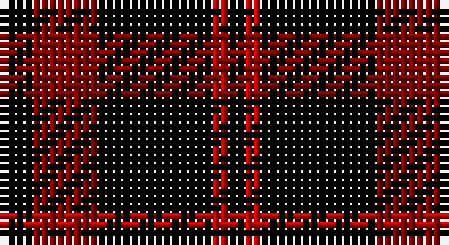

This page is one **sett** — a single exact thread-count. It belongs to the [tartan](/setts/k2ri4k7r1k1/)
(the same proportion at any scale), whose colour order is pattern [KRKRK](/stripes/krkrk/).

Part of the [Romsdal Tresfjord](/tartans/romsdal-tresfjord/) tartan — the named design grouping this sett with its other cloths.

Sourced from weddslist.  It is a [5 stripe tartan](/stripes/stripes5/).

Original link http://www.weddslist.com/cgi-bin/tartans/pg.pl?source=sts

## Also known as

This cloth is also recorded under:

- Romsdal Tresfjord District (Artefact
- Romsdal, Tresfjord

## Thread count
K/4 DR8 K14 R2 K/2

One full sett is **54 threads**.

## Palette

Palette: <strong>Ingles Buchan</strong> <small style="color:#888">(1 of 3 colours)</small>
<table><thead><tr><th>Colour</th><th>Threads</th><th>Shade</th><th>Base</th><th>OKLCh</th></tr></thead><tbody><tr><td>K/</td><td style="text-align:right;font-variant-numeric:tabular-nums">4</td><td><code style="background-color:#000000;">#000000</code> <small style="color:#888">#000000</small></td><td>K <code style="background-color:#000000;">#000000</code></td><td><small style="color:#888">oklch(0.0% 0.000 0.0)</small></td></tr><tr><td>DR</td><td style="text-align:right;font-variant-numeric:tabular-nums">8</td><td><code style="background-color:#800000;">#800000</code> <small style="color:#888">#800000</small></td><td>R <code style="background-color:#CC0000;">#CC0000</code></td><td><small style="color:#888">oklch(37.7% 0.155 29.2)</small></td></tr><tr><td>K</td><td style="text-align:right;font-variant-numeric:tabular-nums">14</td><td><code style="background-color:#000000;">#000000</code> <small style="color:#888">#000000</small></td><td>K <code style="background-color:#000000;">#000000</code></td><td><small style="color:#888">oklch(0.0% 0.000 0.0)</small></td></tr><tr><td>R</td><td style="text-align:right;font-variant-numeric:tabular-nums">2</td><td><code style="background-color:#C00000;">#C00000</code> <small style="color:#888">#C00000</small></td><td>R <code style="background-color:#CC0000;">#CC0000</code></td><td><small style="color:#888">oklch(50.7% 0.208 29.2)</small></td></tr><tr><td>K/</td><td style="text-align:right;font-variant-numeric:tabular-nums">2</td><td><code style="background-color:#000000;">#000000</code> <small style="color:#888">#000000</small></td><td>K <code style="background-color:#000000;">#000000</code></td><td><small style="color:#888">oklch(0.0% 0.000 0.0)</small></td></tr></tbody></table>

# Sample pattern

## Compared to the master

This cloth is one sett of its design; the master sett (the exemplar the design is anchored on) is below for comparison.

<figure style="margin:0"><figcaption style="color:#888;font-size:smaller">this sett</figcaption></figure>
<figure style="margin:0"><figcaption style="color:#888;font-size:smaller"><a href="/setts/k2r4k7r1k2/">master sett →</a></figcaption></figure>

## Nearest tartans

The nearest existing variants by ΔTartan distance, with this tartan at the top so the swatches line up against it.

ΔTartan

Tartan

Sett

—

<a href="/ttd/edit/#slug=k2ri4k7r1k1~x2">Romsdal, Tresfjord</a> <a class="nn-out" href="/variants/s5/k2ri4k7r1k1~x2/" title="open its dictionary page">↗</a>

1.55

<a href="/ttd/edit/#slug=k2r1k6r6k1r1k1~x4&amp;base=k2ri4k7r1k1~x2">Campbell of Lochlane</a> <a class="nn-out" href="/variants/s7/k2r1k6r6k1r1k1~x4/" title="open its dictionary page">↗</a>

1.81

<a href="/ttd/edit/#slug=k6r1k6r9k1~x4&amp;base=k2ri4k7r1k1~x2">MacLeod of Raasay</a> <a class="nn-out" href="/variants/s5/k6r1k6r9k1~x4/" title="open its dictionary page">↗</a>

1.91

<a href="/ttd/edit/#slug=k17r6k2lb6k17lo2~x2&amp;base=k2ri4k7r1k1~x2">Black (symmetrical)</a> <a class="nn-out" href="/variants/s6/k17r6k2lb6k17lo2~x2/" title="open its dictionary page">↗</a>

1.93

<a href="/ttd/edit/#slug=k1r4k1r4k13r1~x4&amp;base=k2ri4k7r1k1~x2">Cameron, Black &amp; Red (dress)</a> <a class="nn-out" href="/variants/s6/k1r4k1r4k13r1~x4/" title="open its dictionary page">↗</a>

1.97

<a href="/ttd/edit/#slug=k16b2k8r3lr3r3k8~x2&amp;base=k2ri4k7r1k1~x2">Benson (New England)</a> <a class="nn-out" href="/variants/s7/k16b2k8r3lr3r3k8~x2/" title="open its dictionary page">↗</a>

2.02

<a href="/ttd/edit/#slug=k2r6k2r6k12ly1~x2&amp;base=k2ri4k7r1k1~x2">MacQueen</a> <a class="nn-out" href="/variants/s6/k2r6k2r6k12ly1~x2/" title="open its dictionary page">↗</a>

2.05

<a href="/ttd/edit/#slug=db1k4r1k1ly1k4db1~x6&amp;base=k2ri4k7r1k1~x2">Justus Family Tartan</a> <a class="nn-out" href="/variants/s7/db1k4r1k1ly1k4db1~x6/" title="open its dictionary page">↗</a>

2.05

<a href="/ttd/edit/#slug=k17r6k2w6k17lo2~x2&amp;base=k2ri4k7r1k1~x2">Black 1990 (Name)</a> <a class="nn-out" href="/variants/s6/k17r6k2w6k17lo2~x2/" title="open its dictionary page">↗</a>

2.06

<a href="/ttd/edit/#slug=k1r8k8ly1~x2&amp;base=k2ri4k7r1k1~x2">Wallace</a> <a class="nn-out" href="/variants/s4/k1r8k8ly1~x2/" title="open its dictionary page">↗</a>

2.06

<a href="/ttd/edit/#slug=k55r18k4r18k38&amp;base=k2ri4k7r1k1~x2">Unidentified Kirtle</a> <a class="nn-out" href="/variants/s5/k55r18k4r18k38/" title="open its dictionary page">↗</a>

## Neighbour map

Every grey dot is one of 14360 variants placed by the first two principal components of the ΔTartan feature space (44% of its variance). Red is this tartan; blue dots are its nearest — click one to open its page.

<svg viewBox="0 0 640 380" role="img" style="max-width:100%;height:auto;border:1px solid #e0e0e0;border-radius:4px;display:block" xmlns="http://www.w3.org/2000/svg"><image href="/nn/cloud.v1.png" width="640" height="380"/><a href="/variants/s7/k2r1k6r6k1r1k1~x4/"><circle cx="355.3" cy="258.7" r="4" fill="#3465a4"><title>Campbell of Lochlane</title></circle></a><a href="/variants/s5/k6r1k6r9k1~x4/"><circle cx="347.6" cy="260.7" r="4" fill="#3465a4"><title>MacLeod of Raasay</title></circle></a><a href="/variants/s6/k17r6k2lb6k17lo2~x2/"><circle cx="380.7" cy="228.4" r="4" fill="#3465a4"><title>Black (symmetrical)</title></circle></a><a href="/variants/s6/k1r4k1r4k13r1~x4/"><circle cx="416.2" cy="214.1" r="4" fill="#3465a4"><title>Cameron, Black &amp; Red (dress)</title></circle></a><a href="/variants/s7/k16b2k8r3lr3r3k8~x2/"><circle cx="402.8" cy="229.1" r="4" fill="#3465a4"><title>Benson (New England)</title></circle></a><a href="/variants/s6/k2r6k2r6k12ly1~x2/"><circle cx="323.7" cy="213.9" r="4" fill="#3465a4"><title>MacQueen</title></circle></a><a href="/variants/s7/db1k4r1k1ly1k4db1~x6/"><circle cx="335.4" cy="257.0" r="4" fill="#3465a4"><title>Justus Family Tartan</title></circle></a><a href="/variants/s6/k17r6k2w6k17lo2~x2/"><circle cx="371.2" cy="223.5" r="4" fill="#3465a4"><title>Black 1990 (Name)</title></circle></a><a href="/variants/s4/k1r8k8ly1~x2/"><circle cx="295.7" cy="247.2" r="4" fill="#3465a4"><title>Wallace</title></circle></a><a href="/variants/s5/k55r18k4r18k38/"><circle cx="468.6" cy="260.9" r="4" fill="#3465a4"><title>Unidentified Kirtle</title></circle></a><circle cx="386.9" cy="267.7" r="5" fill="#c00000"/></svg>

ID: /variants/s5/k2ri4k7r1k1~x2/
