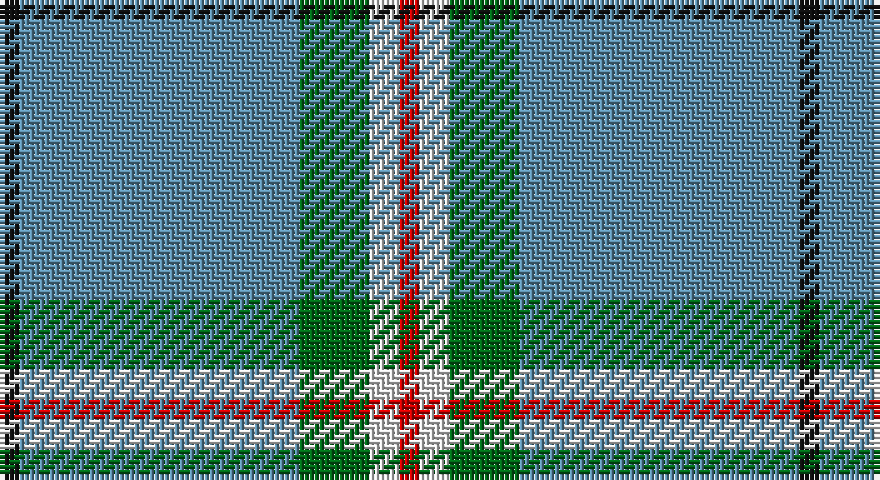

This page is one **sett** — a single exact thread-count. It belongs to the [tartan](/setts/k2t28g7w3r2/)
(the same proportion at any scale), whose colour order is pattern [KBGWR](/stripes/kbgwr/).

Part of the [Cleland](/tartans/cleland/) tartan — the named design grouping this sett with its other cloths.

Sourced from house-of-tartan.  It is a [5 stripe tartan](/stripes/stripes5/).

Original link http://www.house-of-tartan.scotland.net/house/TartanViewjs.asp?colr=Def&tnam=2181

## Provenance

Earliest known date: 1989 The Tartan is based on the Douglas as the Clelands were hereditary foresters to the Douglases. There was a deal of inter-marriage between the Douglases, the Hamiltons and the Clelands. In 1989 John Clelland Hocknull of Casuavina in Australia's Northern Territories made it known that he was the Founder of the Northern Territories Clan Clelland Association Inc. who wanted to have a Clelland tartan designed. the task fell to Harry Lindley of Kinloch Anderson. D.C. Dalgliesh of Selkirk wove the first piece. Lord Lyon may have recorded the sett in the Lyon Court Books, but this is unconfirmed.

2 attestations — the source records this cloth was collapsed from (oldest owns this page)

<ul>
<li>undated — Cleland Corporate Tartan (house-of-tartan, <a href="http://www.house-of-tartan.scotland.net/house/TartanViewjs.asp?colr=Def&tnam=2181">record</a>)</li>
<li>undated — Cleland Clan Tartan (house-of-tartan, <a href="http://www.house-of-tartan.scotland.net/house/TartanViewjs.asp?colr=Def&tnam=3210">record</a>)</li>
</ul>

## Thread count
K/4 B56 G14 LN6 R/4

One full sett is **160 threads**.

## Palette

Palette: <strong>Tartan Register</strong>
<table><thead><tr><th>Colour</th><th>Threads</th><th>Shade</th><th>Base</th><th>OKLCh</th></tr></thead><tbody><tr><td>K/</td><td style="text-align:right;font-variant-numeric:tabular-nums">4</td><td><code style="background-color:#101010;">#101010</code> <small style="color:#888">#101010</small></td><td>K <code style="background-color:#000000;">#000000</code></td><td><small style="color:#888">oklch(17.3% 0.000 89.9)</small></td></tr><tr><td>B</td><td style="text-align:right;font-variant-numeric:tabular-nums">56</td><td><code style="background-color:#5C8CA8;">#5C8CA8</code> <small style="color:#888">#5C8CA8</small></td><td>B <code style="background-color:#2A418A;">#2A418A</code></td><td><small style="color:#888">oklch(61.7% 0.067 235.0)</small></td></tr><tr><td>G</td><td style="text-align:right;font-variant-numeric:tabular-nums">14</td><td><code style="background-color:#006818;">#006818</code> <small style="color:#888">#006818</small></td><td>G <code style="background-color:#006100;">#006100</code></td><td><small style="color:#888">oklch(45.0% 0.142 145.0)</small></td></tr><tr><td>LN</td><td style="text-align:right;font-variant-numeric:tabular-nums">6</td><td><code style="background-color:#E0E0E0;">#E0E0E0</code> <small style="color:#888">#E0E0E0</small></td><td>W <code style="background-color:#F7F7F7;">#F7F7F7</code></td><td><small style="color:#888">oklch(90.7% 0.000 89.9)</small></td></tr><tr><td>R/</td><td style="text-align:right;font-variant-numeric:tabular-nums">4</td><td><code style="background-color:#C80000;">#C80000</code> <small style="color:#888">#C80000</small></td><td>R <code style="background-color:#CC0000;">#CC0000</code></td><td><small style="color:#888">oklch(52.3% 0.215 29.2)</small></td></tr></tbody></table>

# Sample pattern

## Compared to the master

This cloth is one sett of its design; the master sett (the exemplar the design is anchored on) is below for comparison.

<figure style="margin:0"><figcaption style="color:#888;font-size:smaller">this sett</figcaption></figure>
<figure style="margin:0"><figcaption style="color:#888;font-size:smaller"><a href="/setts/k2n36g12w3r2/">master sett →</a></figcaption></figure>

## Nearest tartans

The nearest existing variants by ΔTartan distance, with this tartan at the top so the swatches line up against it.

ΔTartan

Tartan

Sett

—

<a href="/ttd/edit/#slug=k2t28g7w3r2~x2">Cleland Corporate Tartan</a> <a class="nn-out" href="/variants/s5/k2t28g7w3r2~x2/" title="open its dictionary page">↗</a>

0.54

<a href="/ttd/edit/#slug=k2t36dg12w3r2~x2&amp;base=k2t28g7w3r2~x2">Cleland (Name)</a> <a class="nn-out" href="/variants/s5/k2t36dg12w3r2~x2/" title="open its dictionary page">↗</a>

0.74

<a href="/ttd/edit/#slug=k2n36g12w3r2~x2&amp;base=k2t28g7w3r2~x2">Cleland</a> <a class="nn-out" href="/variants/s5/k2n36g12w3r2~x2/" title="open its dictionary page">↗</a>

0.92

<a href="/ttd/edit/#slug=k2w1g5r1t18r2~x2&amp;base=k2t28g7w3r2~x2">Norris (1998) (Name)</a> <a class="nn-out" href="/variants/s6/k2w1g5r1t18r2~x2/" title="open its dictionary page">↗</a>

0.95

<a href="/ttd/edit/#slug=w8r6lo2g34b3~x2&amp;base=k2t28g7w3r2~x2">Milling-Kristensen (Personal)</a> <a class="nn-out" href="/variants/s5/w8r6lo2g34b3~x2/" title="open its dictionary page">↗</a>

1.17

<a href="/ttd/edit/#slug=g55ly4db15w3r3w5~x2&amp;base=k2t28g7w3r2~x2">Spencer (2013)</a> <a class="nn-out" href="/variants/s6/g55ly4db15w3r3w5~x2/" title="open its dictionary page">↗</a>

1.25

<a href="/ttd/edit/#slug=lg25r1g1n9w4~x2&amp;base=k2t28g7w3r2~x2">Tailor Ishida, Kobe</a> <a class="nn-out" href="/variants/s5/lg25r1g1n9w4~x2/" title="open its dictionary page">↗</a>

1.26

<a href="/ttd/edit/#slug=lg25r1ly1n9w4~x2&amp;base=k2t28g7w3r2~x2">Tailor Ishida, Kobe</a> <a class="nn-out" href="/variants/s5/lg25r1ly1n9w4~x2/" title="open its dictionary page">↗</a>

1.30

<a href="/ttd/edit/#slug=n62w11k4lg17~x2&amp;base=k2t28g7w3r2~x2">Thunderlord (Corporate)</a> <a class="nn-out" href="/variants/s4/n62w11k4lg17~x2/" title="open its dictionary page">↗</a>

1.34

<a href="/ttd/edit/#slug=k2w1g5ri1t18r2~x2&amp;base=k2t28g7w3r2~x2">Norris (1998)</a> <a class="nn-out" href="/variants/s6/k2w1g5ri1t18r2~x2/" title="open its dictionary page">↗</a>

1.43

<a href="/ttd/edit/#slug=r2b4lb18n2lb2n41w2~x2&amp;base=k2t28g7w3r2~x2">Haddrell (2013)</a> <a class="nn-out" href="/variants/s7/r2b4lb18n2lb2n41w2~x2/" title="open its dictionary page">↗</a>

## Neighbour map

Every grey dot is one of 14360 variants placed by the first two principal components of the ΔTartan feature space (44% of its variance). Red is this tartan; blue dots are its nearest — click one to open its page.

<svg viewBox="0 0 640 380" role="img" style="max-width:100%;height:auto;border:1px solid #e0e0e0;border-radius:4px;display:block" xmlns="http://www.w3.org/2000/svg"><image href="/nn/cloud.v1.png" width="640" height="380"/><a href="/variants/s5/k2t36dg12w3r2~x2/"><circle cx="399.3" cy="169.9" r="4" fill="#3465a4"><title>Cleland (Name)</title></circle></a><a href="/variants/s5/k2n36g12w3r2~x2/"><circle cx="406.0" cy="177.8" r="4" fill="#3465a4"><title>Cleland</title></circle></a><a href="/variants/s6/k2w1g5r1t18r2~x2/"><circle cx="367.5" cy="156.5" r="4" fill="#3465a4"><title>Norris (1998) (Name)</title></circle></a><a href="/variants/s5/w8r6lo2g34b3~x2/"><circle cx="367.9" cy="169.8" r="4" fill="#3465a4"><title>Milling-Kristensen (Personal)</title></circle></a><a href="/variants/s6/g55ly4db15w3r3w5~x2/"><circle cx="372.2" cy="144.0" r="4" fill="#3465a4"><title>Spencer (2013)</title></circle></a><a href="/variants/s5/lg25r1g1n9w4~x2/"><circle cx="391.7" cy="163.4" r="4" fill="#3465a4"><title>Tailor Ishida, Kobe</title></circle></a><a href="/variants/s5/lg25r1ly1n9w4~x2/"><circle cx="390.2" cy="161.7" r="4" fill="#3465a4"><title>Tailor Ishida, Kobe</title></circle></a><a href="/variants/s4/n62w11k4lg17~x2/"><circle cx="403.0" cy="211.4" r="4" fill="#3465a4"><title>Thunderlord (Corporate)</title></circle></a><a href="/variants/s6/k2w1g5ri1t18r2~x2/"><circle cx="339.7" cy="134.4" r="4" fill="#3465a4"><title>Norris (1998)</title></circle></a><a href="/variants/s7/r2b4lb18n2lb2n41w2~x2/"><circle cx="380.4" cy="134.1" r="4" fill="#3465a4"><title>Haddrell (2013)</title></circle></a><circle cx="395.0" cy="179.5" r="5" fill="#c00000"/></svg>

ID: /variants/s5/k2t28g7w3r2~x2/
