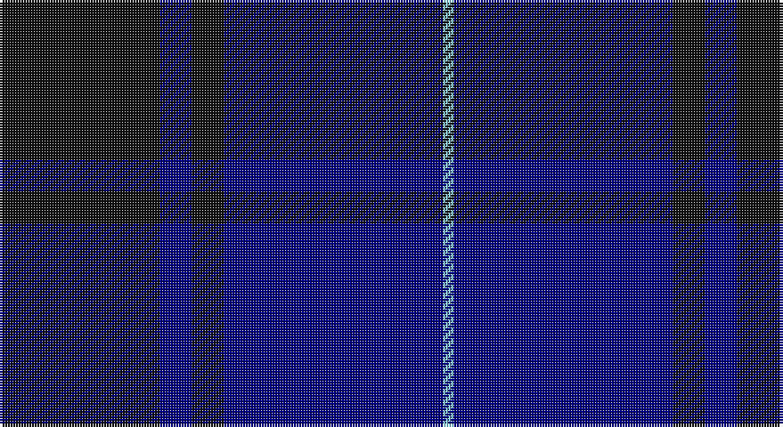

This page is one **sett** — a single exact thread-count. It belongs to the [tartan](/setts/k30db6k6db41lt2/)
(the same proportion at any scale), whose colour order is pattern [KBKBW](/stripes/kbkbw/).

Part of the [Williams](/tartans/williams-2/) tartan — the named design grouping this sett with its other cloths.

Sourced from register-of-tartans.  It is a [5 stripe tartan](/stripes/stripes5/).

Original link https://www.tartanregister.gov.uk/tartanDetails.aspx?ref=10107

## Register references

External register numbers recorded for this tartan.

- Scottish Register of Tartans: [10107](https://www.tartanregister.gov.uk/tartanDetails.aspx?ref=10107)

## Thread count
K/60 DB12 K12 DB82 LB/4

One full sett is **276 threads**.

## Palette

Palette: <strong>Logan (The Scottish Gael, 1831)</strong> <small style="color:#888">(1 of 3 colours)</small>
<table><thead><tr><th>Colour</th><th>Threads</th><th>Shade</th><th>Base</th><th>OKLCh</th></tr></thead><tbody><tr><td>K/</td><td style="text-align:right;font-variant-numeric:tabular-nums">60</td><td><code style="background-color:#101010;">#101010</code> <small style="color:#888">#101010</small></td><td>K <code style="background-color:#000000;">#000000</code></td><td><small style="color:#888">oklch(17.3% 0.000 89.9)</small></td></tr><tr><td>DB</td><td style="text-align:right;font-variant-numeric:tabular-nums">12</td><td><code style="background-color:#000080;">#000080</code> <small style="color:#888">#000080</small></td><td>B <code style="background-color:#2A418A;">#2A418A</code></td><td><small style="color:#888">oklch(27.1% 0.188 264.1)</small></td></tr><tr><td>K</td><td style="text-align:right;font-variant-numeric:tabular-nums">12</td><td><code style="background-color:#101010;">#101010</code> <small style="color:#888">#101010</small></td><td>K <code style="background-color:#000000;">#000000</code></td><td><small style="color:#888">oklch(17.3% 0.000 89.9)</small></td></tr><tr><td>DB</td><td style="text-align:right;font-variant-numeric:tabular-nums">82</td><td><code style="background-color:#000080;">#000080</code> <small style="color:#888">#000080</small></td><td>B <code style="background-color:#2A418A;">#2A418A</code></td><td><small style="color:#888">oklch(27.1% 0.188 264.1)</small></td></tr><tr><td>LB/</td><td style="text-align:right;font-variant-numeric:tabular-nums">4</td><td><code style="background-color:#87CEEB;">#87CEEB</code> <small style="color:#888">#87CEEB</small></td><td>W <code style="background-color:#F7F7F7;">#F7F7F7</code></td><td><small style="color:#888">oklch(81.5% 0.082 225.8)</small></td></tr></tbody></table>

# Sample pattern

## Nearest tartans

The nearest existing variants by ΔTartan distance, with this tartan at the top so the swatches line up against it.

ΔTartan

Tartan

Sett

—

<a href="/ttd/edit/#slug=k30db6k6db41lt2~x2">Williams (New York) (Personal)</a> <a class="nn-out" href="/variants/s5/k30db6k6db41lt2~x2/" title="open its dictionary page">↗</a>

1.18

<a href="/ttd/edit/#slug=n4db43k20n7o2~x2&amp;base=k30db6k6db41lt2~x2">Deighan (Burham Kent) (Name)</a> <a class="nn-out" href="/variants/s5/n4db43k20n7o2~x2/" title="open its dictionary page">↗</a>

1.20

<a href="/ttd/edit/#slug=db8k39db8k39db87r6&amp;base=k30db6k6db41lt2~x2">Largan (?)</a> <a class="nn-out" href="/variants/s6/db8k39db8k39db87r6/" title="open its dictionary page">↗</a>

1.43

<a href="/ttd/edit/#slug=db2k6db2k6db16r1~x2&amp;base=k30db6k6db41lt2~x2">MacKay V</a> <a class="nn-out" href="/variants/s6/db2k6db2k6db16r1~x2/" title="open its dictionary page">↗</a>

1.49

<a href="/ttd/edit/#slug=k4ly1k18db18lb1db4~x4&amp;base=k30db6k6db41lt2~x2">Lyndon Prep (School)</a> <a class="nn-out" href="/variants/s6/k4ly1k18db18lb1db4~x4/" title="open its dictionary page">↗</a>

1.56

<a href="/ttd/edit/#slug=k3db23k17r2~x2&amp;base=k30db6k6db41lt2~x2">Wellington Variation</a> <a class="nn-out" href="/variants/s4/k3db23k17r2~x2/" title="open its dictionary page">↗</a>

1.57

<a href="/ttd/edit/#slug=k15db4k15db28r2~x2&amp;base=k30db6k6db41lt2~x2">MacKay (Blue) #2</a> <a class="nn-out" href="/variants/s5/k15db4k15db28r2~x2/" title="open its dictionary page">↗</a>

1.61

<a href="/ttd/edit/#slug=db37r10dg22db11dg3r3~x2&amp;base=k30db6k6db41lt2~x2">Perthshire, New /Tourist Board</a> <a class="nn-out" href="/variants/s6/db37r10dg22db11dg3r3~x2/" title="open its dictionary page">↗</a>

1.61

<a href="/ttd/edit/#slug=k14db14k14db40k3db2~x2&amp;base=k30db6k6db41lt2~x2">Atlin (Fashion)</a> <a class="nn-out" href="/variants/s6/k14db14k14db40k3db2~x2/" title="open its dictionary page">↗</a>

1.64

<a href="/ttd/edit/#slug=db2k11db5k1db5k1~x6&amp;base=k30db6k6db41lt2~x2">Gagetown (School)</a> <a class="nn-out" href="/variants/s6/db2k11db5k1db5k1~x6/" title="open its dictionary page">↗</a>

1.65

<a href="/ttd/edit/#slug=db5w3db33k3db3k36db3~x2&amp;base=k30db6k6db41lt2~x2">Argentina</a> <a class="nn-out" href="/variants/s7/db5w3db33k3db3k36db3~x2/" title="open its dictionary page">↗</a>

## Neighbour map

Every grey dot is one of 14360 variants placed by the first two principal components of the ΔTartan feature space (44% of its variance). Red is this tartan; blue dots are its nearest — click one to open its page.

<svg viewBox="0 0 640 380" role="img" style="max-width:100%;height:auto;border:1px solid #e0e0e0;border-radius:4px;display:block" xmlns="http://www.w3.org/2000/svg"><image href="/nn/cloud.v1.png" width="640" height="380"/><a href="/variants/s5/n4db43k20n7o2~x2/"><circle cx="403.1" cy="226.2" r="4" fill="#3465a4"><title>Deighan (Burham Kent) (Name)</title></circle></a><a href="/variants/s6/db8k39db8k39db87r6/"><circle cx="429.8" cy="255.6" r="4" fill="#3465a4"><title>Largan (?)</title></circle></a><a href="/variants/s6/db2k6db2k6db16r1~x2/"><circle cx="427.6" cy="245.5" r="4" fill="#3465a4"><title>MacKay V</title></circle></a><a href="/variants/s6/k4ly1k18db18lb1db4~x4/"><circle cx="368.2" cy="220.1" r="4" fill="#3465a4"><title>Lyndon Prep (School)</title></circle></a><a href="/variants/s4/k3db23k17r2~x2/"><circle cx="394.4" cy="286.2" r="4" fill="#3465a4"><title>Wellington Variation</title></circle></a><a href="/variants/s5/k15db4k15db28r2~x2/"><circle cx="378.2" cy="271.0" r="4" fill="#3465a4"><title>MacKay (Blue) #2</title></circle></a><a href="/variants/s6/db37r10dg22db11dg3r3~x2/"><circle cx="387.9" cy="266.5" r="4" fill="#3465a4"><title>Perthshire, New /Tourist Board</title></circle></a><a href="/variants/s6/k14db14k14db40k3db2~x2/"><circle cx="501.0" cy="274.0" r="4" fill="#3465a4"><title>Atlin (Fashion)</title></circle></a><a href="/variants/s6/db2k11db5k1db5k1~x6/"><circle cx="413.4" cy="281.1" r="4" fill="#3465a4"><title>Gagetown (School)</title></circle></a><a href="/variants/s7/db5w3db33k3db3k36db3~x2/"><circle cx="379.3" cy="225.0" r="4" fill="#3465a4"><title>Argentina</title></circle></a><circle cx="436.3" cy="254.2" r="5" fill="#c00000"/></svg>

ID: /variants/s5/k30db6k6db41lt2~x2/
