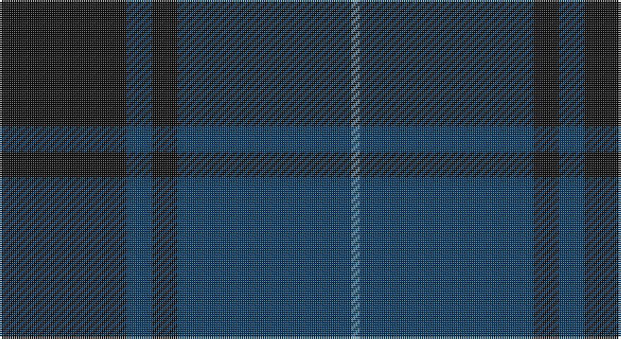

This page is one **sett** — a single exact thread-count. It belongs to the [tartan](/setts/k30dt6k6dt41t2/)
(the same proportion at any scale), whose colour order is pattern [BBKBK](/stripes/bbkbk/).

Sourced from tartans-authority.  It is a [5 stripe tartan](/stripes/stripes5/).

Original link http://www.tartansauthority.com/tartan-ferret/display/10107/

## Register references

External register numbers recorded for this tartan.

- Scottish Register of Tartans: [10107](https://www.tartanregister.gov.uk/tartanDetails?ref=10107)
- Scottish Tartans Authority (ITI): 10107

## Thread count
K/60 DB12 K12 DB82 B/4

One full sett is **276 threads**.

## Palette

Palette: <strong>Tartan Register</strong>
<table><thead><tr><th>Colour</th><th>Threads</th><th>Shade</th><th>Base</th><th>OKLCh</th></tr></thead><tbody><tr><td>K/</td><td style="text-align:right;font-variant-numeric:tabular-nums">60</td><td><code style="background-color:#101010;">#101010</code> <small style="color:#888">#101010</small></td><td>K <code style="background-color:#000000;">#000000</code></td><td><small style="color:#888">oklch(17.3% 0.000 89.9)</small></td></tr><tr><td>DB</td><td style="text-align:right;font-variant-numeric:tabular-nums">12</td><td><code style="background-color:#003C64;">#003C64</code> <small style="color:#888">#003C64</small></td><td>B <code style="background-color:#2A418A;">#2A418A</code></td><td><small style="color:#888">oklch(34.5% 0.089 246.0)</small></td></tr><tr><td>K</td><td style="text-align:right;font-variant-numeric:tabular-nums">12</td><td><code style="background-color:#101010;">#101010</code> <small style="color:#888">#101010</small></td><td>K <code style="background-color:#000000;">#000000</code></td><td><small style="color:#888">oklch(17.3% 0.000 89.9)</small></td></tr><tr><td>DB</td><td style="text-align:right;font-variant-numeric:tabular-nums">82</td><td><code style="background-color:#003C64;">#003C64</code> <small style="color:#888">#003C64</small></td><td>B <code style="background-color:#2A418A;">#2A418A</code></td><td><small style="color:#888">oklch(34.5% 0.089 246.0)</small></td></tr><tr><td>B/</td><td style="text-align:right;font-variant-numeric:tabular-nums">4</td><td><code style="background-color:#5C8CA8;">#5C8CA8</code> <small style="color:#888">#5C8CA8</small></td><td>B <code style="background-color:#2A418A;">#2A418A</code></td><td><small style="color:#888">oklch(61.7% 0.067 235.0)</small></td></tr></tbody></table>

# Sample pattern

## Nearest tartans

The nearest existing variants by ΔTartan distance, with this tartan at the top so the swatches line up against it.

ΔTartan

Tartan

Sett

—

<a href="/ttd/edit/#slug=k30dt6k6dt41t2~x2">Williams (New York) (Personal)</a> <a class="nn-out" href="/variants/s5/k30dt6k6dt41t2~x2/" title="open its dictionary page">↗</a>

1.25

<a href="/ttd/edit/#slug=k7r2k33db33k2db7~x2&amp;base=k30dt6k6dt41t2~x2">Casterton (Corporate)</a> <a class="nn-out" href="/variants/s6/k7r2k33db33k2db7~x2/" title="open its dictionary page">↗</a>

1.56

<a href="/ttd/edit/#slug=db8k39db8k39db87r6&amp;base=k30dt6k6dt41t2~x2">Largan (?)</a> <a class="nn-out" href="/variants/s6/db8k39db8k39db87r6/" title="open its dictionary page">↗</a>

1.68

<a href="/ttd/edit/#slug=dy3db3dy3db27dy40y3&amp;base=k30dt6k6dt41t2~x2">Keeper of the Quaich</a> <a class="nn-out" href="/variants/s6/dy3db3dy3db27dy40y3/" title="open its dictionary page">↗</a>

1.72

<a href="/ttd/edit/#slug=do14db14do14db40do3db2~x2&amp;base=k30dt6k6dt41t2~x2">Atlin</a> <a class="nn-out" href="/variants/s6/do14db14do14db40do3db2~x2/" title="open its dictionary page">↗</a>

1.74

<a href="/ttd/edit/#slug=db37r10dg22db11dg3r3~x2&amp;base=k30dt6k6dt41t2~x2">Perthshire, New /Tourist Board</a> <a class="nn-out" href="/variants/s6/db37r10dg22db11dg3r3~x2/" title="open its dictionary page">↗</a>

1.76

<a href="/ttd/edit/#slug=dg6db2dg29db29dg2db6~x2&amp;base=k30dt6k6dt41t2~x2">Harmony 12</a> <a class="nn-out" href="/variants/s6/dg6db2dg29db29dg2db6~x2/" title="open its dictionary page">↗</a>

1.79

<a href="/ttd/edit/#slug=db19k4dr1k4dg9dr1~x4&amp;base=k30dt6k6dt41t2~x2">Monarchs</a> <a class="nn-out" href="/variants/s6/db19k4dr1k4dg9dr1~x4/" title="open its dictionary page">↗</a>

1.82

<a href="/ttd/edit/#slug=dg1db16dg16r1~x2&amp;base=k30dt6k6dt41t2~x2">Barclay Hunting</a> <a class="nn-out" href="/variants/s4/dg1db16dg16r1~x2/" title="open its dictionary page">↗</a>

1.83

<a href="/ttd/edit/#slug=dg4db1dg12db12w1db4~x2&amp;base=k30dt6k6dt41t2~x2">Unidentified Tweed</a> <a class="nn-out" href="/variants/s6/dg4db1dg12db12w1db4~x2/" title="open its dictionary page">↗</a>

1.86

<a href="/ttd/edit/#slug=k1y3db3do28db36y1~x2&amp;base=k30dt6k6dt41t2~x2">Potts (Personal)</a> <a class="nn-out" href="/variants/s6/k1y3db3do28db36y1~x2/" title="open its dictionary page">↗</a>

## Neighbour map

Every grey dot is one of 14360 variants placed by the first two principal components of the ΔTartan feature space (44% of its variance). Red is this tartan; blue dots are its nearest — click one to open its page.

<svg viewBox="0 0 640 380" role="img" style="max-width:100%;height:auto;border:1px solid #e0e0e0;border-radius:4px;display:block" xmlns="http://www.w3.org/2000/svg"><image href="/nn/cloud.v1.png" width="640" height="380"/><a href="/variants/s6/k7r2k33db33k2db7~x2/"><circle cx="452.2" cy="267.2" r="4" fill="#3465a4"><title>Casterton (Corporate)</title></circle></a><a href="/variants/s6/db8k39db8k39db87r6/"><circle cx="429.8" cy="255.6" r="4" fill="#3465a4"><title>Largan (?)</title></circle></a><a href="/variants/s6/dy3db3dy3db27dy40y3/"><circle cx="471.9" cy="248.1" r="4" fill="#3465a4"><title>Keeper of the Quaich</title></circle></a><a href="/variants/s6/do14db14do14db40do3db2~x2/"><circle cx="552.4" cy="295.0" r="4" fill="#3465a4"><title>Atlin</title></circle></a><a href="/variants/s6/db37r10dg22db11dg3r3~x2/"><circle cx="387.9" cy="266.5" r="4" fill="#3465a4"><title>Perthshire, New /Tourist Board</title></circle></a><a href="/variants/s6/dg6db2dg29db29dg2db6~x2/"><circle cx="480.6" cy="294.8" r="4" fill="#3465a4"><title>Harmony 12</title></circle></a><a href="/variants/s6/db19k4dr1k4dg9dr1~x4/"><circle cx="381.0" cy="233.2" r="4" fill="#3465a4"><title>Monarchs</title></circle></a><a href="/variants/s4/dg1db16dg16r1~x2/"><circle cx="400.4" cy="270.1" r="4" fill="#3465a4"><title>Barclay Hunting</title></circle></a><a href="/variants/s6/dg4db1dg12db12w1db4~x2/"><circle cx="385.7" cy="270.2" r="4" fill="#3465a4"><title>Unidentified Tweed</title></circle></a><a href="/variants/s6/k1y3db3do28db36y1~x2/"><circle cx="472.5" cy="197.6" r="4" fill="#3465a4"><title>Potts (Personal)</title></circle></a><circle cx="474.1" cy="271.1" r="5" fill="#c00000"/></svg>

ID: /variants/s5/k30dt6k6dt41t2~x2/
