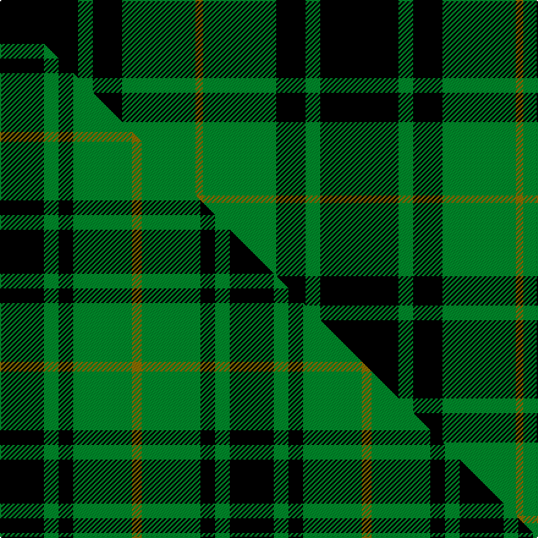

This page is one **sett** — a single exact thread-count. It belongs to the [tartan](/setts/k32g6k12g30y3/)
(the same proportion at any scale), whose colour order is pattern [GGKGK](/stripes/ggkgk/).

Part of the [MacArthur](/tartans/macarthur-2/) tartan — the named design grouping this sett with its other cloths.

Sourced from weddslist.  It is a [5 stripe tartan](/stripes/stripes5/).

Original link http://www.weddslist.com/cgi-bin/tartans/pg.pl?source=tinsel

## Thread count
K/64 G12 K24 G60 Y/6

One full sett is **262 threads**.

## Palette
<table><thead><tr><th>Colour</th><th>Shade</th><th>OKLCh</th></tr></thead><tbody><tr><td>G</td><td><code style="background-color:#008B2A;">#008B2A</code> <small style="color:#888">#008B2A</small></td><td><small style="color:#888">oklch(55.4% 0.170 145.9)</small></td></tr><tr><td>K</td><td><code style="background-color:#000000;">#000000</code> <small style="color:#888">#000000</small></td><td><small style="color:#888">oklch(0.0% 0.000 0.0)</small></td></tr><tr><td>Y</td><td><code style="background-color:#8B6E00;">#8B6E00</code> <small style="color:#888">#8B6E00</small></td><td><small style="color:#888">oklch(55.1% 0.113 90.4)</small></td></tr></tbody></table>

# Sample pattern

## Compared to the master

This cloth is one sett of its design; the master sett (the exemplar the design is anchored on) is below for comparison.

Its **ΔTartan distance** from the master is **1.09** — the same measure the nearest-tartans table ranks by (0 is identical; a re-scale of the same cloth is near 0, a recolour or a different proportion further).

<figure class="master-compare" style="margin:0">

this sett
master sett ★

<figcaption style="color:#888;font-size:smaller">One weave of this sett against the <a href="/setts/k9g3k3g12y2/">master sett ★</a>, split on the diagonal: a shared proportion runs seamlessly across it with only the shades shifting; a different proportion breaks on it.</figcaption>
</figure>

## Nearest variants

The nearest existing variants by ΔTartan distance, with this cloth at the top so the swatches line up against it.

ΔTartan

Threads

Variant

Sett

—

262

<a href="/variants/s5/k32g6k12g30y3~x2/">MacArthur</a>

<a href="/ttd/edit/#slug=k32g6k12g30y3&amp;base=k32g6k12g30y3~x2" title="compare in the TTD">0.00</a>

131

<a href="/variants/s5/k32g6k12g30y3/">MacArthur</a>

<a href="/ttd/edit/#slug=k9g3k3g12y2~x4&amp;base=k32g6k12g30y3~x2" title="compare in the TTD">0.70</a>

188

<a href="/variants/s5/k9g3k3g12y2~x4/">MacArthur</a>

<a href="/ttd/edit/#slug=k19g8k10g31r3&amp;base=k32g6k12g30y3~x2" title="compare in the TTD">0.84</a>

120

<a href="/variants/s5/k19g8k10g31r3/">MacArthur-Fox</a>

<a href="/ttd/edit/#slug=r3g30k12g6k16y2~x2&amp;base=k32g6k12g30y3~x2" title="compare in the TTD">0.87</a>

266

<a href="/variants/s6/r3g30k12g6k16y2~x2/">MacArthur (Variant)</a>

<a href="/ttd/edit/#slug=g12k4g1~x2&amp;base=k32g6k12g30y3~x2" title="compare in the TTD">1.08</a>

42

<a href="/variants/s3/g12k4g1~x2/">Graham</a>

<a href="/ttd/edit/#slug=k8g3k4g20dr4~x2&amp;base=k32g6k12g30y3~x2" title="compare in the TTD">1.24</a>

132

<a href="/variants/s5/k8g3k4g20dr4~x2/">MacArthur-Fox (Personal)</a>

<a href="/ttd/edit/#slug=dr3k9g20k16g7t3~x2&amp;base=k32g6k12g30y3~x2" title="compare in the TTD">1.31</a>

220

<a href="/variants/s6/dr3k9g20k16g7t3~x2/">Holman (Personal)</a>

<a href="/ttd/edit/#slug=g7k1g7lb1k6lb1~x4&amp;base=k32g6k12g30y3~x2" title="compare in the TTD">1.49</a>

152

<a href="/variants/s6/g7k1g7lb1k6lb1~x4/">Innes, Georgina (Portrait)</a>

<a href="/ttd/edit/#slug=g7k1g7lb1k6lb1~x2&amp;base=k32g6k12g30y3~x2" title="compare in the TTD">1.49</a>

76

<a href="/variants/s6/g7k1g7lb1k6lb1~x2/">Innes</a>

<a href="/ttd/edit/#slug=dg8k8ly1k8dg8k1~x4~dg1806142&amp;base=k32g6k12g30y3~x2" title="compare in the TTD">1.49</a>

236

<a href="/variants/s6/dg8k8ly1k8dg8k1~x4~dg1806142/">Wallace Hunting</a>

## Neighbour map

Every grey dot is one of 13620 variants placed by the first two principal components of the ΔTartan feature space (42% of its variance). Red is this tartan; blue dots are its nearest — click one to open its page.

<svg viewBox="0 0 640 380" role="img" style="max-width:100%;height:auto;border:1px solid #e0e0e0;border-radius:4px;display:block" xmlns="http://www.w3.org/2000/svg"><image href="/nn/cloud.v1.png" width="640" height="380"/><a href="/variants/s5/k32g6k12g30y3/"><circle cx="270.4" cy="218.6" r="4" fill="#3465a4"><title>MacArthur</title></circle></a><a href="/variants/s5/k9g3k3g12y2~x4/"><circle cx="235.9" cy="246.5" r="4" fill="#3465a4"><title>MacArthur</title></circle></a><a href="/variants/s5/k19g8k10g31r3/"><circle cx="268.4" cy="222.3" r="4" fill="#3465a4"><title>MacArthur-Fox</title></circle></a><a href="/variants/s6/r3g30k12g6k16y2~x2/"><circle cx="253.9" cy="177.0" r="4" fill="#3465a4"><title>MacArthur (Variant)</title></circle></a><a href="/variants/s3/g12k4g1~x2/"><circle cx="344.5" cy="233.2" r="4" fill="#3465a4"><title>Graham</title></circle></a><a href="/variants/s5/k8g3k4g20dr4~x2/"><circle cx="278.7" cy="230.7" r="4" fill="#3465a4"><title>MacArthur-Fox (Personal)</title></circle></a><a href="/variants/s6/dr3k9g20k16g7t3~x2/"><circle cx="190.1" cy="225.5" r="4" fill="#3465a4"><title>Holman (Personal)</title></circle></a><a href="/variants/s6/g7k1g7lb1k6lb1~x4/"><circle cx="276.9" cy="228.8" r="4" fill="#3465a4"><title>Innes, Georgina (Portrait)</title></circle></a><a href="/variants/s6/g7k1g7lb1k6lb1~x2/"><circle cx="276.9" cy="228.8" r="4" fill="#3465a4"><title>Innes</title></circle></a><a href="/variants/s6/dg8k8ly1k8dg8k1~x4~dg1806142/"><circle cx="249.1" cy="241.4" r="4" fill="#3465a4"><title>Wallace Hunting</title></circle></a><circle cx="270.4" cy="218.6" r="5" fill="#c00000"/><text x="320" y="376" text-anchor="middle" font-size="11" fill="#999">ground</text><text x="11" y="190" text-anchor="middle" font-size="11" fill="#999" transform="rotate(-90 11 190)">complexity</text></svg>

ID: /variants/s5/k32g6k12g30y3~x2/
