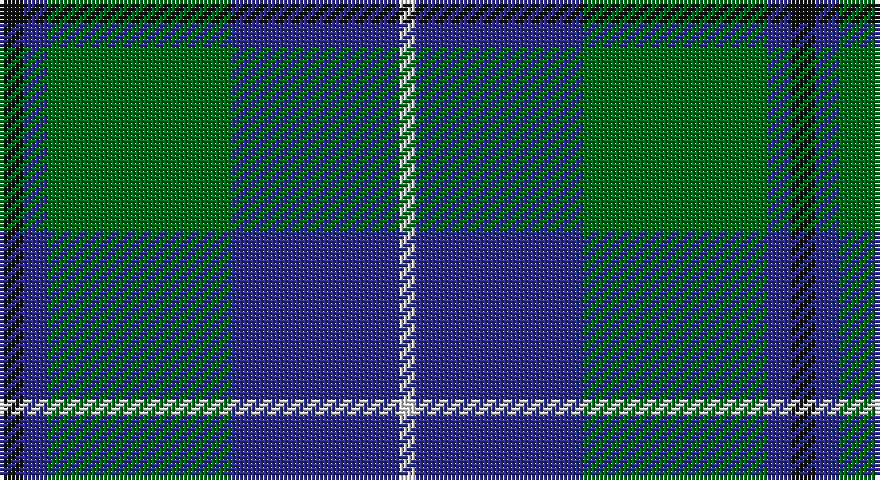

This page is one **sett** — a single exact thread-count. It belongs to the [tartan](/setts/k3db3g23db21w2/)
(the same proportion at any scale), whose colour order is pattern [KBGBW](/stripes/kbgbw/).

Part of the [Douglas](/tartans/douglas/) tartan — the named design grouping this sett with its other cloths.

Sourced from house-of-tartan.  It is a [5 stripe tartan](/stripes/stripes5/).

Original link http://www.house-of-tartan.scotland.net/house/TartanViewjs.asp?colr=Def&tnam=1032

## Provenance

Earliest known date: 1831 Wilson's sent a list of tartans to Logan about 1830 stating that 'No 148' had been sold as Douglas for a 'considerable' time. Logan included the Douglas tartan even though he said that no family tartans appeared in his book. The distinction between clans and families is obscure. There are many historic references to the 'Border Clans' which would certainly describe the Douglas'. There is also a black and grey sett for the clan which first appeared in the Vestiarium Scoticum in 1842. The present chiefship is vacant on account of the compound surnames of the eligible claimants. Lord Lyon will not recognise 'double barrel' names.

## Also known as

This cloth is also recorded under:

- Douglas Ancient Red
- Douglas Green
- Douglas,
- Douglas, Black
- Douglas, Green
- Douglas, Grey
- Douglas, brown

## Thread count
K/6 DBa6 G46 DB42 LN/4

One full sett is **198 threads**.

## Palette

Palette: <strong>Tartan Register</strong>
<table><thead><tr><th>Colour</th><th>Threads</th><th>Shade</th><th>Base</th><th>OKLCh</th></tr></thead><tbody><tr><td>K/</td><td style="text-align:right;font-variant-numeric:tabular-nums">6</td><td><code style="background-color:#101010;">#101010</code> <small style="color:#888">#101010</small></td><td>K <code style="background-color:#000000;">#000000</code></td><td><small style="color:#888">oklch(17.3% 0.000 89.9)</small></td></tr><tr><td>DBa</td><td style="text-align:right;font-variant-numeric:tabular-nums">6</td><td><code style="background-color:#2C2C80;">#2C2C80</code> <small style="color:#888">#2C2C80</small></td><td>B <code style="background-color:#2A418A;">#2A418A</code></td><td><small style="color:#888">oklch(35.0% 0.138 276.6)</small></td></tr><tr><td>G</td><td style="text-align:right;font-variant-numeric:tabular-nums">46</td><td><code style="background-color:#006818;">#006818</code> <small style="color:#888">#006818</small></td><td>G <code style="background-color:#006100;">#006100</code></td><td><small style="color:#888">oklch(45.0% 0.142 145.0)</small></td></tr><tr><td>DB</td><td style="text-align:right;font-variant-numeric:tabular-nums">42</td><td><code style="background-color:#2C2C80;">#2C2C80</code> <small style="color:#888">#2C2C80</small></td><td>B <code style="background-color:#2A418A;">#2A418A</code></td><td><small style="color:#888">oklch(35.0% 0.138 276.6)</small></td></tr><tr><td>LN/</td><td style="text-align:right;font-variant-numeric:tabular-nums">4</td><td><code style="background-color:#E0E0E0;">#E0E0E0</code> <small style="color:#888">#E0E0E0</small></td><td>W <code style="background-color:#F7F7F7;">#F7F7F7</code></td><td><small style="color:#888">oklch(90.7% 0.000 89.9)</small></td></tr></tbody></table>

# Sample pattern

## Compared to the master

This cloth is one sett of its design; the master sett (the exemplar the design is anchored on) is below for comparison.

<figure style="margin:0"><figcaption style="color:#888;font-size:smaller">this sett</figcaption></figure>
<figure style="margin:0"><figcaption style="color:#888;font-size:smaller"><a href="/setts/k6db4dg44k41w4/">master sett →</a></figcaption></figure>

## Nearest tartans

The nearest existing variants by ΔTartan distance, with this tartan at the top so the swatches line up against it.

ΔTartan

Tartan

Sett

—

<a href="/ttd/edit/#slug=k3db3g23db21w2~x2">Douglas Clan Tartan</a> <a class="nn-out" href="/variants/s5/k3db3g23db21w2~x2/" title="open its dictionary page">↗</a>

0.77

<a href="/ttd/edit/#slug=g35k3dbi26k4db4w3~x2&amp;base=k3db3g23db21w2~x2">Pride of Yorkland (Fashion)</a> <a class="nn-out" href="/variants/s6/g35k3dbi26k4db4w3~x2/" title="open its dictionary page">↗</a>

0.81

<a href="/ttd/edit/#slug=r7ly3dg28db28w3~x2&amp;base=k3db3g23db21w2~x2">Turnbull Hunting</a> <a class="nn-out" href="/variants/s5/r7ly3dg28db28w3~x2/" title="open its dictionary page">↗</a>

0.82

<a href="/ttd/edit/#slug=k7r3g30db28lb3~x2&amp;base=k3db3g23db21w2~x2">Highlander Highland Laddie</a> <a class="nn-out" href="/variants/s5/k7r3g30db28lb3~x2/" title="open its dictionary page">↗</a>

0.87

<a href="/ttd/edit/#slug=db20k6lo4db3g20w2~x2&amp;base=k3db3g23db21w2~x2">DeLoughery (Personal)</a> <a class="nn-out" href="/variants/s6/db20k6lo4db3g20w2~x2/" title="open its dictionary page">↗</a>

0.87

<a href="/ttd/edit/#slug=k1dbi1g8db8w1~x4&amp;base=k3db3g23db21w2~x2">Douglas, Green (Wilsons)</a> <a class="nn-out" href="/variants/s5/k1dbi1g8db8w1~x4/" title="open its dictionary page">↗</a>

0.91

<a href="/ttd/edit/#slug=db3m2db22k11g24lp2g3~x2&amp;base=k3db3g23db21w2~x2">MacThomas Clan Tartan</a> <a class="nn-out" href="/variants/s7/db3m2db22k11g24lp2g3~x2/" title="open its dictionary page">↗</a>

0.92

<a href="/ttd/edit/#slug=k5g32db32r3db3ly3~x2&amp;base=k3db3g23db21w2~x2">Carmichael</a> <a class="nn-out" href="/variants/s6/k5g32db32r3db3ly3~x2/" title="open its dictionary page">↗</a>

0.94

<a href="/ttd/edit/#slug=dg5lp3dg32k16b32m3b5~x2&amp;base=k3db3g23db21w2~x2">MacThomas (Clan)</a> <a class="nn-out" href="/variants/s7/dg5lp3dg32k16b32m3b5~x2/" title="open its dictionary page">↗</a>

0.95

<a href="/ttd/edit/#slug=k2ly1g10db10w1~x6&amp;base=k3db3g23db21w2~x2">Turnbull Hunting (1983) #2</a> <a class="nn-out" href="/variants/s5/k2ly1g10db10w1~x6/" title="open its dictionary page">↗</a>

0.96

<a href="/ttd/edit/#slug=b11k4g4m1g4k1r1~x4&amp;base=k3db3g23db21w2~x2">Ednie (Personal)</a> <a class="nn-out" href="/variants/s7/b11k4g4m1g4k1r1~x4/" title="open its dictionary page">↗</a>

## Neighbour map

Every grey dot is one of 14360 variants placed by the first two principal components of the ΔTartan feature space (44% of its variance). Red is this tartan; blue dots are its nearest — click one to open its page.

<svg viewBox="0 0 640 380" role="img" style="max-width:100%;height:auto;border:1px solid #e0e0e0;border-radius:4px;display:block" xmlns="http://www.w3.org/2000/svg"><image href="/nn/cloud.v1.png" width="640" height="380"/><a href="/variants/s6/g35k3dbi26k4db4w3~x2/"><circle cx="252.4" cy="188.9" r="4" fill="#3465a4"><title>Pride of Yorkland (Fashion)</title></circle></a><a href="/variants/s5/r7ly3dg28db28w3~x2/"><circle cx="224.5" cy="219.3" r="4" fill="#3465a4"><title>Turnbull Hunting</title></circle></a><a href="/variants/s5/k7r3g30db28lb3~x2/"><circle cx="222.2" cy="214.8" r="4" fill="#3465a4"><title>Highlander Highland Laddie</title></circle></a><a href="/variants/s6/db20k6lo4db3g20w2~x2/"><circle cx="206.5" cy="204.1" r="4" fill="#3465a4"><title>DeLoughery (Personal)</title></circle></a><a href="/variants/s5/k1dbi1g8db8w1~x4/"><circle cx="219.0" cy="218.1" r="4" fill="#3465a4"><title>Douglas, Green (Wilsons)</title></circle></a><a href="/variants/s7/db3m2db22k11g24lp2g3~x2/"><circle cx="233.7" cy="195.6" r="4" fill="#3465a4"><title>MacThomas Clan Tartan</title></circle></a><a href="/variants/s6/k5g32db32r3db3ly3~x2/"><circle cx="250.5" cy="189.2" r="4" fill="#3465a4"><title>Carmichael</title></circle></a><a href="/variants/s7/dg5lp3dg32k16b32m3b5~x2/"><circle cx="213.8" cy="201.7" r="4" fill="#3465a4"><title>MacThomas (Clan)</title></circle></a><a href="/variants/s5/k2ly1g10db10w1~x6/"><circle cx="215.3" cy="205.5" r="4" fill="#3465a4"><title>Turnbull Hunting (1983) #2</title></circle></a><a href="/variants/s7/b11k4g4m1g4k1r1~x4/"><circle cx="212.9" cy="195.3" r="4" fill="#3465a4"><title>Ednie (Personal)</title></circle></a><circle cx="258.5" cy="213.5" r="5" fill="#c00000"/></svg>

ID: /variants/s5/k3db3g23db21w2~x2/
