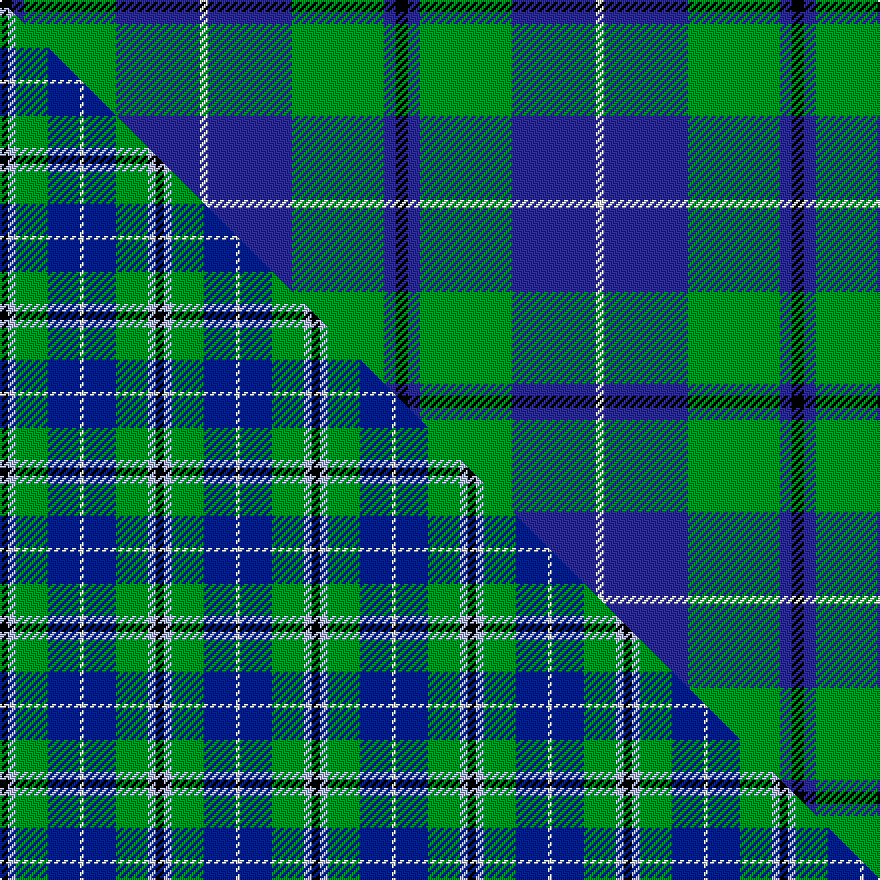

This is one **variant** — a specific cloth: this exact thread count and colourway, with its own
provenance below. It is one weaving of the [sett](/setts/k3db3g23db21w2/) (the scale-free proportion — the
same cloth at any scale or shade), whose colour order is pattern [KBGBW](/stripes/kbgbw/).

Part of the [Douglas](/tartans/d/do/douglas/) tartan — the named design grouping this sett with its other cloths.

Sourced from house-of-tartan.  It is a [5 stripe tartan](/stripes/stripes5/).

Original link [http://www.house-of-tartan.scotland.net/house/TartanViewjs.asp?colr=Def&tnam=1032](http://www.house-of-tartan.scotland.net/house/TartanViewjs.asp?colr=Def&tnam=1032)

## Provenance

Earliest known date: 1831 Wilson's sent a list of tartans to Logan about 1830 stating that 'No 148' had been sold as Douglas for a 'considerable' time. Logan included the Douglas tartan even though he said that no family tartans appeared in his book. The distinction between clans and families is obscure. There are many historic references to the 'Border Clans' which would certainly describe the Douglas'. There is also a black and grey sett for the clan which first appeared in the Vestiarium Scoticum in 1842. The present chiefship is vacant on account of the compound surnames of the eligible claimants. Lord Lyon will not recognise 'double barrel' names.

Dataset <small>— provenance for this record, inherited from the source manifest</small>

<dl class="dataset-prov">
<dt>source</dt><dd><a href="/sources/house-of-tartan/">House of Tartan</a></dd>
<dt>data captured from</dt><dd><a href="https://github.com/thetartan/tartan-database/blob/master/data/house-of-tartan/data.csv">https://github.com/thetartan/tartan-database/blob/master/data/house-of-tartan/data.csv</a></dd>
<dt>data date</dt><dd>1831 <small>(this record)</small></dd>
<dt>licence</dt><dd><a href="https://creativecommons.org/licenses/by-nc-nd/4.0/">CC BY-NC-ND 4.0</a></dd>
</dl>

Capture chain <small>— the hands this data passed through, oldest first; each capture carries its own licence</small>

<ol class="capture-chain">
<li><a href="http://www.house-of-tartan.scotland.net/">House of Tartan</a> <small>the weaver/retailer's database — the site is now offline; the URL is kept as the ultimate source's identity</small></li>
<li><a href="https://github.com/thetartan/tartan-database">thetartan/tartan-database</a> <small>2016-2017</small> · <a href="https://creativecommons.org/licenses/by-nc-nd/4.0/">CC BY-NC-ND 4.0</a> <small>Levko Kravets's frozen compilation — the capture we vendored, and where its CC licence text came from</small></li>
<li>this dictionary <small>captured 2026-06-10 · commit 5bf86c7566</small> <small>each re-capture is a git commit to data/sources</small></li>
</ol>

## Thread count
K/6 DB6 G46 DB42 W/4

One full sett is **198 threads**.

## Palette
<table><thead><tr><th>Colour</th><th>Shade</th><th>OKLCh</th></tr></thead><tbody><tr><td>LB</td><td><code style="background-color:#B5BBDE;">#B5BBDE</code> <small style="color:#888">#B5BBDE</small></td><td><small style="color:#888">oklch(79.9% 0.050 277.6)</small></td></tr><tr><td>DB</td><td><code style="background-color:#2C2C80;">#2C2C80</code> <small style="color:#888">#2C2C80</small></td><td><small style="color:#888">oklch(35.0% 0.138 276.6)</small></td></tr><tr><td>DB</td><td><code style="background-color:#2C2C80;">#2C2C80</code> <small style="color:#888">#2C2C80</small></td><td><small style="color:#888">oklch(35.0% 0.138 276.6)</small></td></tr><tr><td>G</td><td><code style="background-color:#008B2A;">#008B2A</code> <small style="color:#888">#008B2A</small></td><td><small style="color:#888">oklch(55.4% 0.170 145.9)</small></td></tr><tr><td>K</td><td><code style="background-color:#000000;">#000000</code> <small style="color:#888">#000000</small></td><td><small style="color:#888">oklch(0.0% 0.000 0.0)</small></td></tr><tr><td>W</td><td><code style="background-color:#F7F7F7;">#F7F7F7</code> <small style="color:#888">#F7F7F7</small></td><td><small style="color:#888">oklch(97.6% 0.000 89.9)</small></td></tr></tbody></table>

# Sample pattern

## Compared to the master

This cloth is one sett of its design; the master sett (the exemplar the design is anchored on) is below for comparison.

Its **ΔTartan distance** from the master is **1.34** — the same measure the nearest-tartans table ranks by (0 is identical; a re-scale of the same cloth is near 0, a recolour or a different proportion further).

<figure class="master-compare" style="margin:0">

this sett
master sett ★

<figcaption style="color:#888;font-size:smaller">One weave of this sett against the <a href="/setts/k2lb2g8db8w1/">master sett ★</a>, split on the diagonal: a shared proportion runs seamlessly across it with only the shades shifting; a different proportion breaks on it.</figcaption>
</figure>

## Nearest tartan variants

The nearest existing variants by ΔTartan distance, with this cloth at the top so the swatches line up against it.

ΔTartan

Threads

Variant

Sett

—

198

<a href="/variants/s5/k3db3g23db21w2~x2~db1406275/">Douglas Clan Tartan</a>

<a href="/ttd/edit/#slug=g12lo1db8k1db1~x4&amp;base=k3db3g23db21w2~x2~db1406275" title="compare in the TTD">0.97</a>

132

<a href="/variants/s5/g12lo1db8k1db1~x4/">Rowan (Personal)</a>

<a href="/ttd/edit/#slug=k2dy1g10db10w1~x6&amp;base=k3db3g23db21w2~x2~db1406275" title="compare in the TTD">1.16</a>

270

<a href="/variants/s5/k2dy1g10db10w1~x6/">Turnbull Hunting (1983) #2</a>

<a href="/ttd/edit/#slug=r1g9db9k1db1w1~x6&amp;base=k3db3g23db21w2~x2~db1406275" title="compare in the TTD">1.19</a>

252

<a href="/variants/s6/r1g9db9k1db1w1~x6/">Irving of Glentulchan Family Tartan</a>

<a href="/ttd/edit/#slug=db20k6ly4db3g20w2~x2&amp;base=k3db3g23db21w2~x2~db1406275" title="compare in the TTD">1.20</a>

176

<a href="/variants/s6/db20k6ly4db3g20w2~x2/">DeLoughery (Personal)</a>

<a href="/ttd/edit/#slug=k4t24k2dg13t2k3~x4~t2405244-dg1806142&amp;base=k3db3g23db21w2~x2~db1406275" title="compare in the TTD">1.21</a>

356

<a href="/variants/s6/k4t24k2dg13t2k3~x4~t2405244-dg1806142/">Vance (Family Association) Corporate Family Tartan</a>

<a href="/ttd/edit/#slug=k7dr3g29db29w3~x2&amp;base=k3db3g23db21w2~x2~db1406275" title="compare in the TTD">1.21</a>

264

<a href="/variants/s5/k7dr3g29db29w3~x2/">Highlander, Highland Laddie Kilts</a>

<a href="/ttd/edit/#slug=k7y3g28db28w3~x2&amp;base=k3db3g23db21w2~x2~db1406275" title="compare in the TTD">1.24</a>

256

<a href="/variants/s5/k7y3g28db28w3~x2/">Turnbull Hunting Clan Tartan</a>

<a href="/ttd/edit/#slug=r4db24w2g13db2k3~x4&amp;base=k3db3g23db21w2~x2~db1406275" title="compare in the TTD">1.25</a>

356

<a href="/variants/s6/r4db24w2g13db2k3~x4/">Vance (Family Association)</a>

<a href="/ttd/edit/#slug=k3t2g13w2t24dr3~x4~t2405244-g2408144&amp;base=k3db3g23db21w2~x2~db1406275" title="compare in the TTD">1.25</a>

352

<a href="/variants/s6/k3t2g13w2t24dr3~x4~t2405244-g2408144/">Vance</a>

<a href="/ttd/edit/#slug=k7lb3g18db18w2~x2&amp;base=k3db3g23db21w2~x2~db1406275" title="compare in the TTD">1.31</a>

174

<a href="/variants/s5/k7lb3g18db18w2~x2/">Bhatti (Name)</a>

## Neighbour map

Every grey dot is one of 13656 variants placed by the first two principal components of the ΔTartan feature space (42% of its variance). Red is this tartan; blue dots are its nearest — click one to open its page. The map is a flat projection of a many-dimensional space — [how to read it](/posts/neighbourhood-maps/).

<svg viewBox="0 0 640 380" role="img" style="max-width:100%;height:auto;border:1px solid #e0e0e0;border-radius:4px;display:block" xmlns="http://www.w3.org/2000/svg"><image href="/nn/cloud.v1.png" width="640" height="380"/><a href="/variants/s5/g12lo1db8k1db1~x4/"><circle cx="292.4" cy="194.7" r="4" fill="#3465a4"><title>Rowan (Personal)</title></circle></a><a href="/variants/s5/k2dy1g10db10w1~x6/"><circle cx="194.2" cy="192.0" r="4" fill="#3465a4"><title>Turnbull Hunting (1983) #2</title></circle></a><a href="/variants/s6/r1g9db9k1db1w1~x6/"><circle cx="218.5" cy="178.8" r="4" fill="#3465a4"><title>Irving of Glentulchan Family Tartan</title></circle></a><a href="/variants/s6/db20k6ly4db3g20w2~x2/"><circle cx="171.2" cy="187.7" r="4" fill="#3465a4"><title>DeLoughery (Personal)</title></circle></a><a href="/variants/s6/k4t24k2dg13t2k3~x4~t2405244-dg1806142/"><circle cx="241.7" cy="162.3" r="4" fill="#3465a4"><title>Vance (Family Association) Corporate Family Tartan</title></circle></a><a href="/variants/s5/k7dr3g29db29w3~x2/"><circle cx="186.1" cy="196.8" r="4" fill="#3465a4"><title>Highlander, Highland Laddie Kilts</title></circle></a><a href="/variants/s5/k7y3g28db28w3~x2/"><circle cx="178.0" cy="197.0" r="4" fill="#3465a4"><title>Turnbull Hunting Clan Tartan</title></circle></a><a href="/variants/s6/r4db24w2g13db2k3~x4/"><circle cx="247.0" cy="160.2" r="4" fill="#3465a4"><title>Vance (Family Association)</title></circle></a><a href="/variants/s6/k3t2g13w2t24dr3~x4~t2405244-g2408144/"><circle cx="274.8" cy="172.5" r="4" fill="#3465a4"><title>Vance</title></circle></a><a href="/variants/s5/k7lb3g18db18w2~x2/"><circle cx="148.6" cy="212.3" r="4" fill="#3465a4"><title>Bhatti (Name)</title></circle></a><circle cx="226.7" cy="190.1" r="5" fill="#c00000"/><text x="320" y="376" text-anchor="middle" font-size="11" fill="#999">ground</text><text x="11" y="190" text-anchor="middle" font-size="11" fill="#999" transform="rotate(-90 11 190)">complexity</text></svg>

ID: /variants/s5/k3db3g23db21w2~x2~db1406275/
