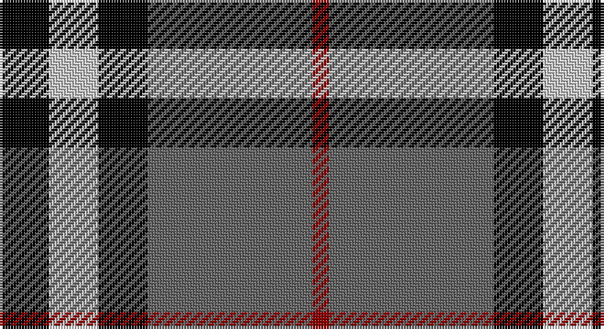

This page is one **sett** — a single exact thread-count. It belongs to the [tartan](/setts/k3lb3k3n10r1/)
(the same proportion at any scale), whose colour order is pattern [KWKBR](/stripes/kwkbr/).

Sourced from register-of-tartans.  It is a [5 stripe tartan](/stripes/stripes5/).

Original link https://www.tartanregister.gov.uk/tartanDetails.aspx?ref=1549

2 attestations — the source records this cloth was collapsed from (oldest owns this page)

<ul>
<li>01/01/2002 — Greystone (Burberry Grey) (register-of-tartans, <a href="https://www.tartanregister.gov.uk/tartanDetails.aspx?ref=1549">record</a>)</li>
<li>pre 2002 — Greystone (Fashion) (tartans-authority, <a href="http://www.tartansauthority.com/tartan-ferret/display/5123/">record</a>)</li>
</ul>

## Register references

External register numbers recorded for this tartan.

- Scottish Register of Tartans: [1549](https://www.tartanregister.gov.uk/tartanDetails.aspx?ref=1549)
- Scottish Tartans Authority (ITI): 5123

## Thread count
K/18 N18 K18 Na60 DR/6

One full sett is **216 threads**.

## Palette

Palette: <strong>Tartan Register</strong> <small style="color:#888">(3 of 4 colours)</small>
<table><thead><tr><th>Colour</th><th>Threads</th><th>Shade</th><th>Base</th><th>OKLCh</th></tr></thead><tbody><tr><td>K/</td><td style="text-align:right;font-variant-numeric:tabular-nums">18</td><td><code style="background-color:#000000;">#000000</code> <small style="color:#888">#000000</small></td><td>K <code style="background-color:#000000;">#000000</code></td><td><small style="color:#888">oklch(0.0% 0.000 0.0)</small></td></tr><tr><td>N</td><td style="text-align:right;font-variant-numeric:tabular-nums">18</td><td><code style="background-color:#C8C8C8;">#C8C8C8</code> <small style="color:#888">#C8C8C8</small></td><td>W <code style="background-color:#F7F7F7;">#F7F7F7</code></td><td><small style="color:#888">oklch(83.3% 0.000 89.9)</small></td></tr><tr><td>K</td><td style="text-align:right;font-variant-numeric:tabular-nums">18</td><td><code style="background-color:#000000;">#000000</code> <small style="color:#888">#000000</small></td><td>K <code style="background-color:#000000;">#000000</code></td><td><small style="color:#888">oklch(0.0% 0.000 0.0)</small></td></tr><tr><td>Na</td><td style="text-align:right;font-variant-numeric:tabular-nums">60</td><td><code style="background-color:#646464;">#646464</code> <small style="color:#888">#646464</small></td><td>B <code style="background-color:#2A418A;">#2A418A</code></td><td><small style="color:#888">oklch(50.3% 0.000 89.9)</small></td></tr><tr><td>DR/</td><td style="text-align:right;font-variant-numeric:tabular-nums">6</td><td><code style="background-color:#8C0000;">#8C0000</code> <small style="color:#888">#8C0000</small></td><td>R <code style="background-color:#CC0000;">#CC0000</code></td><td><small style="color:#888">oklch(40.2% 0.165 29.2)</small></td></tr></tbody></table>

# Sample pattern

## Nearest tartans

The nearest existing variants by ΔTartan distance, with this tartan at the top so the swatches line up against it.

ΔTartan

Tartan

Sett

—

<a href="/ttd/edit/#slug=k3lb3k3n10r1~x6">Greystone (Burberry Grey)</a> <a class="nn-out" href="/variants/s5/k3lb3k3n10r1~x6/" title="open its dictionary page">↗</a>

0.69

<a href="/ttd/edit/#slug=k3w3k3y10r1~x6&amp;base=k3lb3k3n10r1~x6">Burberry Hunting</a> <a class="nn-out" href="/variants/s5/k3w3k3y10r1~x6/" title="open its dictionary page">↗</a>

0.98

<a href="/ttd/edit/#slug=r12db3g5db16ly2g2~x2&amp;base=k3lb3k3n10r1~x6">Dunbog Primary (School)</a> <a class="nn-out" href="/variants/s6/r12db3g5db16ly2g2~x2/" title="open its dictionary page">↗</a>

0.99

<a href="/ttd/edit/#slug=r2k28y5w12y14r2~x2&amp;base=k3lb3k3n10r1~x6">Callaway</a> <a class="nn-out" href="/variants/s6/r2k28y5w12y14r2~x2/" title="open its dictionary page">↗</a>

1.05

<a href="/ttd/edit/#slug=k6w6k6o21r2~x4&amp;base=k3lb3k3n10r1~x6">Burberry, Check</a> <a class="nn-out" href="/variants/s5/k6w6k6o21r2~x4/" title="open its dictionary page">↗</a>

1.05

<a href="/ttd/edit/#slug=r5y32k31w5~x2&amp;base=k3lb3k3n10r1~x6">Loganair, Uniform Skirt</a> <a class="nn-out" href="/variants/s4/r5y32k31w5~x2/" title="open its dictionary page">↗</a>

1.06

<a href="/ttd/edit/#slug=lb5o34k24o4r24o4~x2&amp;base=k3lb3k3n10r1~x6">Wcwm 759-3</a> <a class="nn-out" href="/variants/s6/lb5o34k24o4r24o4~x2/" title="open its dictionary page">↗</a>

1.09

<a href="/ttd/edit/#slug=r5o32k31w5~x2&amp;base=k3lb3k3n10r1~x6">Loganair</a> <a class="nn-out" href="/variants/s4/r5o32k31w5~x2/" title="open its dictionary page">↗</a>

1.10

<a href="/ttd/edit/#slug=k4w3k4y9r1~x4&amp;base=k3lb3k3n10r1~x6">Oban Grey</a> <a class="nn-out" href="/variants/s5/k4w3k4y9r1~x4/" title="open its dictionary page">↗</a>

1.11

<a href="/ttd/edit/#slug=r4o30k6w13k13w3~x2&amp;base=k3lb3k3n10r1~x6">Thom(p)son camel</a> <a class="nn-out" href="/variants/s6/r4o30k6w13k13w3~x2/" title="open its dictionary page">↗</a>

1.11

<a href="/ttd/edit/#slug=r5o32k31w5&amp;base=k3lb3k3n10r1~x6">Loganair Uniform Skirt Corporate Tartan</a> <a class="nn-out" href="/variants/s4/r5o32k31w5/" title="open its dictionary page">↗</a>

## Neighbour map

Every grey dot is one of 14360 variants placed by the first two principal components of the ΔTartan feature space (44% of its variance). Red is this tartan; blue dots are its nearest — click one to open its page.

<svg viewBox="0 0 640 380" role="img" style="max-width:100%;height:auto;border:1px solid #e0e0e0;border-radius:4px;display:block" xmlns="http://www.w3.org/2000/svg"><image href="/nn/cloud.v1.png" width="640" height="380"/><a href="/variants/s5/k3w3k3y10r1~x6/"><circle cx="231.5" cy="211.6" r="4" fill="#3465a4"><title>Burberry Hunting</title></circle></a><a href="/variants/s6/r12db3g5db16ly2g2~x2/"><circle cx="223.3" cy="210.7" r="4" fill="#3465a4"><title>Dunbog Primary (School)</title></circle></a><a href="/variants/s6/r2k28y5w12y14r2~x2/"><circle cx="204.7" cy="176.4" r="4" fill="#3465a4"><title>Callaway</title></circle></a><a href="/variants/s5/k6w6k6o21r2~x4/"><circle cx="239.1" cy="197.8" r="4" fill="#3465a4"><title>Burberry, Check</title></circle></a><a href="/variants/s4/r5y32k31w5~x2/"><circle cx="196.8" cy="239.0" r="4" fill="#3465a4"><title>Loganair, Uniform Skirt</title></circle></a><a href="/variants/s6/lb5o34k24o4r24o4~x2/"><circle cx="190.3" cy="203.2" r="4" fill="#3465a4"><title>Wcwm 759-3</title></circle></a><a href="/variants/s4/r5o32k31w5~x2/"><circle cx="209.7" cy="242.3" r="4" fill="#3465a4"><title>Loganair</title></circle></a><a href="/variants/s5/k4w3k4y9r1~x4/"><circle cx="186.9" cy="224.9" r="4" fill="#3465a4"><title>Oban Grey</title></circle></a><a href="/variants/s6/r4o30k6w13k13w3~x2/"><circle cx="184.3" cy="188.4" r="4" fill="#3465a4"><title>Thom(p)son camel</title></circle></a><a href="/variants/s4/r5o32k31w5/"><circle cx="208.7" cy="240.7" r="4" fill="#3465a4"><title>Loganair Uniform Skirt Corporate Tartan</title></circle></a><circle cx="230.4" cy="210.3" r="5" fill="#c00000"/></svg>

ID: /variants/s5/k3lb3k3n10r1~x6/
