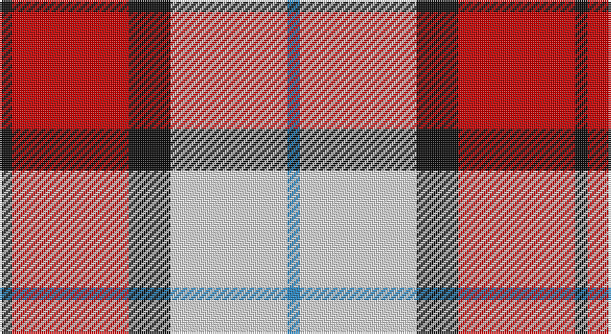

This page is one **sett** — a single exact thread-count. It belongs to the [tartan](/setts/k3r28k10w28t3/)
(the same proportion at any scale), whose colour order is pattern [BWKRK](/stripes/bwkrk/).

Part of the [Wallace Dress](/tartans/wallace-dress/) tartan — the named design grouping this sett with its other cloths.

Sourced from tartans-authority.  It is a [5 stripe tartan](/stripes/stripes5/).

Original link http://www.tartansauthority.com/tartan-ferret/display/8186/

## Also known as

This cloth is also recorded under:

- Wallace Dress, Red

## Register references

External register numbers recorded for this tartan.

- Scottish Register of Tartans: [8186](https://www.tartanregister.gov.uk/tartanDetails?ref=8186)
- Scottish Tartans Authority (ITI): 8186

## Thread count
K/6 R56 K20 LN56 B/6

One full sett is **276 threads**.

## Palette

Palette: <strong>Tartan Register</strong>
<table><thead><tr><th>Colour</th><th>Threads</th><th>Shade</th><th>Base</th><th>OKLCh</th></tr></thead><tbody><tr><td>K/</td><td style="text-align:right;font-variant-numeric:tabular-nums">6</td><td><code style="background-color:#101010;">#101010</code> <small style="color:#888">#101010</small></td><td>K <code style="background-color:#000000;">#000000</code></td><td><small style="color:#888">oklch(17.3% 0.000 89.9)</small></td></tr><tr><td>R</td><td style="text-align:right;font-variant-numeric:tabular-nums">56</td><td><code style="background-color:#C80000;">#C80000</code> <small style="color:#888">#C80000</small></td><td>R <code style="background-color:#CC0000;">#CC0000</code></td><td><small style="color:#888">oklch(52.3% 0.215 29.2)</small></td></tr><tr><td>K</td><td style="text-align:right;font-variant-numeric:tabular-nums">20</td><td><code style="background-color:#101010;">#101010</code> <small style="color:#888">#101010</small></td><td>K <code style="background-color:#000000;">#000000</code></td><td><small style="color:#888">oklch(17.3% 0.000 89.9)</small></td></tr><tr><td>LN</td><td style="text-align:right;font-variant-numeric:tabular-nums">56</td><td><code style="background-color:#E0E0E0;">#E0E0E0</code> <small style="color:#888">#E0E0E0</small></td><td>W <code style="background-color:#F7F7F7;">#F7F7F7</code></td><td><small style="color:#888">oklch(90.7% 0.000 89.9)</small></td></tr><tr><td>B/</td><td style="text-align:right;font-variant-numeric:tabular-nums">6</td><td><code style="background-color:#2888C4;">#2888C4</code> <small style="color:#888">#2888C4</small></td><td>B <code style="background-color:#2A418A;">#2A418A</code></td><td><small style="color:#888">oklch(60.1% 0.125 241.5)</small></td></tr></tbody></table>

# Sample pattern

## Compared to the master

This cloth is one sett of its design; the master sett (the exemplar the design is anchored on) is below for comparison.

<figure style="margin:0"><figcaption style="color:#888;font-size:smaller">this sett</figcaption></figure>
<figure style="margin:0"><figcaption style="color:#888;font-size:smaller"><a href="/setts/k7w6k1w6/">master sett →</a></figcaption></figure>

## Nearest tartans

The nearest existing variants by ΔTartan distance, with this tartan at the top so the swatches line up against it.

ΔTartan

Tartan

Sett

—

<a href="/ttd/edit/#slug=k3r28k10w28t3~x2">Wallace Dress, Red (Dance)</a> <a class="nn-out" href="/variants/s5/k3r28k10w28t3~x2/" title="open its dictionary page">↗</a>

1.15

<a href="/ttd/edit/#slug=r30db20w15lb3ly3&amp;base=k3r28k10w28t3~x2">Siddle, New (Corporate)</a> <a class="nn-out" href="/variants/s5/r30db20w15lb3ly3/" title="open its dictionary page">↗</a>

1.17

<a href="/ttd/edit/#slug=lb12lo75k22w12k22w16lb8&amp;base=k3r28k10w28t3~x2">Orange Fanaticos</a> <a class="nn-out" href="/variants/s7/lb12lo75k22w12k22w16lb8/" title="open its dictionary page">↗</a>

1.18

<a href="/ttd/edit/#slug=dp8ly6k2o1w1~x8&amp;base=k3r28k10w28t3~x2">Ballater Victoria Week</a> <a class="nn-out" href="/variants/s5/dp8ly6k2o1w1~x8/" title="open its dictionary page">↗</a>

1.19

<a href="/ttd/edit/#slug=lb2r12db2lb6k6lb1&amp;base=k3r28k10w28t3~x2">MacTavish</a> <a class="nn-out" href="/variants/s6/lb2r12db2lb6k6lb1/" title="open its dictionary page">↗</a>

1.27

<a href="/ttd/edit/#slug=k23b6k6r5w35r10~x2&amp;base=k3r28k10w28t3~x2">Merrilees Dress (Dance)</a> <a class="nn-out" href="/variants/s6/k23b6k6r5w35r10~x2/" title="open its dictionary page">↗</a>

1.32

<a href="/ttd/edit/#slug=w3r27w16db27ly3~x2&amp;base=k3r28k10w28t3~x2">Common Ground (Dress)</a> <a class="nn-out" href="/variants/s5/w3r27w16db27ly3~x2/" title="open its dictionary page">↗</a>

1.33

<a href="/ttd/edit/#slug=r32db6k6g6w18k3&amp;base=k3r28k10w28t3~x2">Rose, White dress</a> <a class="nn-out" href="/variants/s6/r32db6k6g6w18k3/" title="open its dictionary page">↗</a>

1.35

<a href="/ttd/edit/#slug=w23t6w6r5k35r10~x2&amp;base=k3r28k10w28t3~x2">Merrilees</a> <a class="nn-out" href="/variants/s6/w23t6w6r5k35r10~x2/" title="open its dictionary page">↗</a>

1.35

<a href="/ttd/edit/#slug=r4ly30k6w13k13w3~x2&amp;base=k3r28k10w28t3~x2">Thomson, Camel (Fashion)</a> <a class="nn-out" href="/variants/s6/r4ly30k6w13k13w3~x2/" title="open its dictionary page">↗</a>

1.36

<a href="/ttd/edit/#slug=r2ri1r10ri2w10db1w2~x4&amp;base=k3r28k10w28t3~x2">Lennox Dress #2</a> <a class="nn-out" href="/variants/s7/r2ri1r10ri2w10db1w2~x4/" title="open its dictionary page">↗</a>

## Neighbour map

Every grey dot is one of 14360 variants placed by the first two principal components of the ΔTartan feature space (44% of its variance). Red is this tartan; blue dots are its nearest — click one to open its page.

<svg viewBox="0 0 640 380" role="img" style="max-width:100%;height:auto;border:1px solid #e0e0e0;border-radius:4px;display:block" xmlns="http://www.w3.org/2000/svg"><image href="/nn/cloud.v1.png" width="640" height="380"/><a href="/variants/s5/r30db20w15lb3ly3/"><circle cx="170.7" cy="179.4" r="4" fill="#3465a4"><title>Siddle, New (Corporate)</title></circle></a><a href="/variants/s7/lb12lo75k22w12k22w16lb8/"><circle cx="187.8" cy="161.6" r="4" fill="#3465a4"><title>Orange Fanaticos</title></circle></a><a href="/variants/s5/dp8ly6k2o1w1~x8/"><circle cx="177.0" cy="181.7" r="4" fill="#3465a4"><title>Ballater Victoria Week</title></circle></a><a href="/variants/s6/lb2r12db2lb6k6lb1/"><circle cx="185.0" cy="174.4" r="4" fill="#3465a4"><title>MacTavish</title></circle></a><a href="/variants/s6/k23b6k6r5w35r10~x2/"><circle cx="153.6" cy="191.5" r="4" fill="#3465a4"><title>Merrilees Dress (Dance)</title></circle></a><a href="/variants/s5/w3r27w16db27ly3~x2/"><circle cx="148.8" cy="203.1" r="4" fill="#3465a4"><title>Common Ground (Dress)</title></circle></a><a href="/variants/s6/r32db6k6g6w18k3/"><circle cx="179.3" cy="155.8" r="4" fill="#3465a4"><title>Rose, White dress</title></circle></a><a href="/variants/s6/w23t6w6r5k35r10~x2/"><circle cx="156.5" cy="194.7" r="4" fill="#3465a4"><title>Merrilees</title></circle></a><a href="/variants/s6/r4ly30k6w13k13w3~x2/"><circle cx="185.0" cy="184.4" r="4" fill="#3465a4"><title>Thomson, Camel (Fashion)</title></circle></a><a href="/variants/s7/r2ri1r10ri2w10db1w2~x4/"><circle cx="235.9" cy="158.9" r="4" fill="#3465a4"><title>Lennox Dress #2</title></circle></a><circle cx="182.5" cy="187.0" r="5" fill="#c00000"/></svg>

ID: /variants/s5/k3r28k10w28t3~x2/
