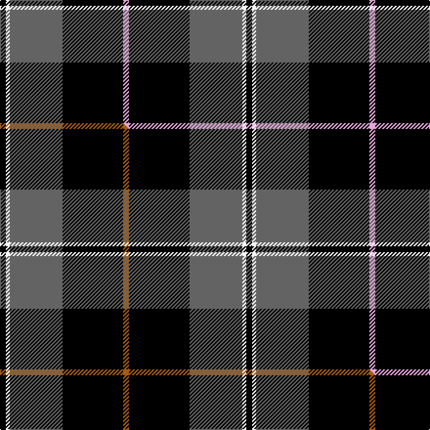

This is one **variant** — a specific cloth: this exact thread count and colourway, with its own
provenance below. It is one weaving of the [sett](/tartans/k/ke/kelley-oliphint/) (the scale-free proportion — the
same cloth at any scale or shade), whose colour order is pattern [KWBKW](/stripes/kwbkw/).

Part of the [Kelley Oliphint](/tartans/k/ke/kelley-oliphint/) tartan — the named design grouping this sett with its other cloths.

Sourced from tartans-authority.  It is a [5 stripe tartan](/stripes/stripes5/).

Original link <code>http://www.tartansauthority.com/tartan-ferret/display/10184/</code> — retired · [Internet Archive copy](https://web.archive.org/web/*/http://www.tartansauthority.com/tartan-ferret/display/10184/*)

Dataset <small>— provenance for this record, inherited from the source manifest</small>

<dl class="dataset-prov">
<dt>source</dt><dd><a href="/sources/tartans-authority/">Scottish Tartans Authority</a></dd>
<dt>data captured from</dt><dd><a href="https://github.com/thetartan/tartan-database/blob/master/data/tartans-authority/data.csv">https://github.com/thetartan/tartan-database/blob/master/data/tartans-authority/data.csv</a></dd>
<dt>data date</dt><dd>27th Jan. 2020 <small>(this record)</small></dd>
<dt>licence</dt><dd><a href="https://creativecommons.org/licenses/by-nc-nd/4.0/">CC BY-NC-ND 4.0</a></dd>
</dl>

Capture chain <small>— the hands this data passed through, oldest first; each capture carries its own licence</small>

<ol class="capture-chain">
<li><a href="https://www.tartansauthority.com/">Scottish Tartans Authority</a> <small>the heritage body’s archive — its tartan-ferret record browser is retired; dead record links are shown unlinked, with an Internet Archive copy (ITI numbers are not SRT references)</small></li>
<li><a href="https://github.com/thetartan/tartan-database">thetartan/tartan-database</a> <small>2016-2017</small> · <a href="https://creativecommons.org/licenses/by-nc-nd/4.0/">CC BY-NC-ND 4.0</a> <small>Levko Kravets's frozen compilation — the capture we vendored, and where its CC licence text came from</small></li>
<li>this dictionary <small>captured 2026-06-10 · commit 5bf86c7566</small> <small>each re-capture is a git commit to data/sources</small></li>
</ol>

## Register references

External register numbers recorded for this tartan.

- Scottish Register of Tartans: [10184](https://www.tartanregister.gov.uk/tartanDetails?ref=10184)
- Scottish Tartans Authority (ITI): 10184

## Thread count
K/6 W4 N54 K62 LP/6

One full sett is **252 threads**.

## Palette
<table><thead><tr><th>Colour</th><th>Shade</th><th>OKLCh</th></tr></thead><tbody><tr><td>K</td><td><code style="background-color:#000000;">#000000</code> <small style="color:#888">#000000</small></td><td><small style="color:#888">oklch(0.0% 0.000 0.0)</small></td></tr><tr><td>W</td><td><code style="background-color:#F7F7F7;">#F7F7F7</code> <small style="color:#888">#F7F7F7</small></td><td><small style="color:#888">oklch(97.6% 0.000 89.9)</small></td></tr><tr><td>LP</td><td><code style="background-color:#E4A6DB;">#E4A6DB</code> <small style="color:#888">#E4A6DB</small></td><td><small style="color:#888">oklch(80.0% 0.100 331.6)</small></td></tr><tr><td>N</td><td><code style="background-color:#636363;">#636363</code> <small style="color:#888">#636363</small></td><td><small style="color:#888">oklch(50.0% 0.000 89.9)</small></td></tr></tbody></table>

# Sample pattern

[Sample sheet (PDF)](swatch.pdf) — the woven sample, thread count and palette on one printable A4, rendered on demand (the same sheet the TTD print page downloads).

## Compared to the master

This cloth is one sett of its design; the master sett (the exemplar the design is anchored on) is below for comparison.

Its **ΔTartan distance** from the master is **0.30** — the same measure the nearest-tartans table ranks by (0 is identical; a re-scale of the same cloth is near 0, a recolour or a different proportion further).

<figure class="master-compare" style="margin:0">

this sett
master sett ★

<figcaption style="color:#888;font-size:smaller">One weave of this sett against the <a href="/setts/k3w2n27k31o3/">master sett ★</a>, split on the diagonal: a shared proportion runs seamlessly across it with only the shades shifting; a different proportion breaks on it.</figcaption>
</figure>

## Nearest tartan variants

The nearest existing variants by ΔTartan distance, with this cloth at the top so the swatches line up against it.

ΔTartan

Threads

Variant

Sett

—

252

<a href="/variants/s5/k3w2n27k31lp3~x2/">Kelley Oliphint (Commemorative)</a>

<a href="/ttd/edit/#slug=k3w2n27k31o3~x2&amp;base=k3w2n27k31lp3~x2" title="compare in the TTD">0.30</a>

252

<a href="/variants/s5/k3w2n27k31o3~x2/">Kelley Oliphint</a>

<a href="/ttd/edit/#slug=y3k1n24k35w3~x2&amp;base=k3w2n27k31lp3~x2" title="compare in the TTD">1.48</a>

252

<a href="/variants/s5/y3k1n24k35w3~x2/">George Heriots</a>

<a href="/ttd/edit/#slug=k4lb4k4n15dr2~x4&amp;base=k3w2n27k31lp3~x2" title="compare in the TTD">1.55</a>

208

<a href="/variants/s5/k4lb4k4n15dr2~x4/">Oban Grey (Fashion)</a>

<a href="/ttd/edit/#slug=k4dg3dp18k18w2~x2&amp;base=k3w2n27k31lp3~x2" title="compare in the TTD">1.60</a>

168

<a href="/variants/s5/k4dg3dp18k18w2~x2/">Wcwm 1106-2</a>

<a href="/ttd/edit/#slug=k5w25r6k45w4~x2&amp;base=k3w2n27k31lp3~x2" title="compare in the TTD">2.05</a>

322

<a href="/variants/s5/k5w25r6k45w4~x2/">Shembe Zulu Church</a>

<a href="/ttd/edit/#slug=k32t2k6t2k13n30w2~x2&amp;base=k3w2n27k31lp3~x2" title="compare in the TTD">2.16</a>

280

<a href="/variants/s7/k32t2k6t2k13n30w2~x2/">Mountain Rescue Association Honor Guard</a>

<a href="/ttd/edit/#slug=k37w9k3dg9w3~x2&amp;base=k3w2n27k31lp3~x2" title="compare in the TTD">2.21</a>

164

<a href="/variants/s5/k37w9k3dg9w3~x2/">Glen Coe Trade Tartan</a>

<a href="/ttd/edit/#slug=k3w3k3n10dr1~x6&amp;base=k3w2n27k31lp3~x2" title="compare in the TTD">2.21</a>

216

<a href="/variants/s5/k3w3k3n10dr1~x6/">Greystone (Burberry Grey)</a>

<a href="/ttd/edit/#slug=k11w1k1w1k4n8r1~x8&amp;base=k3w2n27k31lp3~x2" title="compare in the TTD">2.22</a>

336

<a href="/variants/s7/k11w1k1w1k4n8r1~x8/">Dunfermline Athletic (2008) (Corp)</a>

<a href="/ttd/edit/#slug=r2k28n5w12n14r2~x2&amp;base=k3w2n27k31lp3~x2" title="compare in the TTD">2.23</a>

244

<a href="/variants/s6/r2k28n5w12n14r2~x2/">Callaway</a>

## Neighbour map

Every grey dot is one of 13662 variants placed by the first two principal components of the ΔTartan feature space (42% of its variance). Red is this tartan; blue dots are its nearest — click one to open its page. The map is a flat projection of a many-dimensional space — [how to read it](/posts/neighbourhood-maps/).

<svg viewBox="0 0 640 380" role="img" style="max-width:100%;height:auto;border:1px solid #e0e0e0;border-radius:4px;display:block" xmlns="http://www.w3.org/2000/svg"><image href="/nn/cloud.v1.png" width="640" height="380"/><a href="/variants/s5/k3w2n27k31o3~x2/"><circle cx="271.6" cy="163.3" r="4" fill="#3465a4"><title>Kelley Oliphint</title></circle></a><a href="/variants/s5/y3k1n24k35w3~x2/"><circle cx="310.5" cy="131.4" r="4" fill="#3465a4"><title>George Heriots</title></circle></a><a href="/variants/s5/k4lb4k4n15dr2~x4/"><circle cx="227.4" cy="212.0" r="4" fill="#3465a4"><title>Oban Grey (Fashion)</title></circle></a><a href="/variants/s5/k4dg3dp18k18w2~x2/"><circle cx="255.7" cy="203.8" r="4" fill="#3465a4"><title>Wcwm 1106-2</title></circle></a><a href="/variants/s5/k5w25r6k45w4~x2/"><circle cx="288.0" cy="184.1" r="4" fill="#3465a4"><title>Shembe Zulu Church</title></circle></a><a href="/variants/s7/k32t2k6t2k13n30w2~x2/"><circle cx="304.1" cy="152.2" r="4" fill="#3465a4"><title>Mountain Rescue Association Honor Guard</title></circle></a><a href="/variants/s5/k37w9k3dg9w3~x2/"><circle cx="331.2" cy="176.7" r="4" fill="#3465a4"><title>Glen Coe Trade Tartan</title></circle></a><a href="/variants/s5/k3w3k3n10dr1~x6/"><circle cx="213.5" cy="200.4" r="4" fill="#3465a4"><title>Greystone (Burberry Grey)</title></circle></a><a href="/variants/s7/k11w1k1w1k4n8r1~x8/"><circle cx="272.4" cy="158.3" r="4" fill="#3465a4"><title>Dunfermline Athletic (2008) (Corp)</title></circle></a><a href="/variants/s6/r2k28n5w12n14r2~x2/"><circle cx="181.9" cy="165.6" r="4" fill="#3465a4"><title>Callaway</title></circle></a><circle cx="276.5" cy="168.1" r="5" fill="#c00000"/><text x="320" y="376" text-anchor="middle" font-size="11" fill="#999">ground</text><text x="11" y="190" text-anchor="middle" font-size="11" fill="#999" transform="rotate(-90 11 190)">complexity</text></svg>

ID: /variants/s5/k3w2n27k31lp3~x2/
