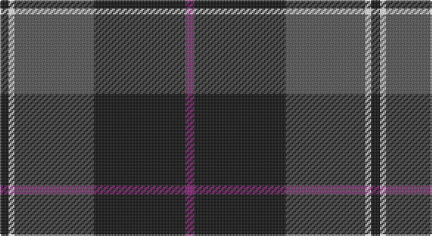

This page is one **sett** — a single exact thread-count. It belongs to the [tartan](/setts/k3w2n27k31p3/)
(the same proportion at any scale), whose colour order is pattern [BKBWK](/stripes/bkbwk/).

Sourced from register-of-tartans.  It is a [5 stripe tartan](/stripes/stripes5/).

Original link https://www.tartanregister.gov.uk/tartanDetails.aspx?ref=10184

## Register references

External register numbers recorded for this tartan.

- Scottish Register of Tartans: [10184](https://www.tartanregister.gov.uk/tartanDetails.aspx?ref=10184)

## Thread count
K/6 W4 N54 K62 P/6

One full sett is **252 threads**.

## Palette

Palette: <strong>Tartan Register</strong> <small style="color:#888">(2 of 4 colours)</small>
<table><thead><tr><th>Colour</th><th>Threads</th><th>Shade</th><th>Base</th><th>OKLCh</th></tr></thead><tbody><tr><td>K/</td><td style="text-align:right;font-variant-numeric:tabular-nums">6</td><td><code style="background-color:#101010;">#101010</code> <small style="color:#888">#101010</small></td><td>K <code style="background-color:#000000;">#000000</code></td><td><small style="color:#888">oklch(17.3% 0.000 89.9)</small></td></tr><tr><td>W</td><td style="text-align:right;font-variant-numeric:tabular-nums">4</td><td><code style="background-color:#FFFFFF;">#FFFFFF</code> <small style="color:#888">#FFFFFF</small></td><td>W <code style="background-color:#F7F7F7;">#F7F7F7</code></td><td><small style="color:#888">oklch(100.0% 0.000 89.9)</small></td></tr><tr><td>N</td><td style="text-align:right;font-variant-numeric:tabular-nums">54</td><td><code style="background-color:#555555;">#555555</code> <small style="color:#888">#555555</small></td><td>B <code style="background-color:#2A418A;">#2A418A</code></td><td><small style="color:#888">oklch(45.0% 0.000 89.9)</small></td></tr><tr><td>K</td><td style="text-align:right;font-variant-numeric:tabular-nums">62</td><td><code style="background-color:#101010;">#101010</code> <small style="color:#888">#101010</small></td><td>K <code style="background-color:#000000;">#000000</code></td><td><small style="color:#888">oklch(17.3% 0.000 89.9)</small></td></tr><tr><td>P/</td><td style="text-align:right;font-variant-numeric:tabular-nums">6</td><td><code style="background-color:#871F78;">#871F78</code> <small style="color:#888">#871F78</small></td><td>B <code style="background-color:#2A418A;">#2A418A</code></td><td><small style="color:#888">oklch(44.4% 0.169 334.7)</small></td></tr></tbody></table>

# Sample pattern

## Nearest tartans

The nearest existing variants by ΔTartan distance, with this tartan at the top so the swatches line up against it.

ΔTartan

Tartan

Sett

—

<a href="/ttd/edit/#slug=k3w2n27k31p3~x2">Kelley Oliphint</a> <a class="nn-out" href="/variants/s5/k3w2n27k31p3~x2/" title="open its dictionary page">↗</a>

0.45

<a href="/ttd/edit/#slug=k3w2n27k31lr3~x2&amp;base=k3w2n27k31p3~x2">Kelley Oliphint (Commemorative)</a> <a class="nn-out" href="/variants/s5/k3w2n27k31lr3~x2/" title="open its dictionary page">↗</a>

0.89

<a href="/ttd/edit/#slug=y4k48y16r12b3~x2&amp;base=k3w2n27k31p3~x2">Calgary Firefighters</a> <a class="nn-out" href="/variants/s5/y4k48y16r12b3~x2/" title="open its dictionary page">↗</a>

1.02

<a href="/ttd/edit/#slug=dr2dg14lb3dr13ly1dr2~x4&amp;base=k3w2n27k31p3~x2">Swedish Para Whisky Club (Corporate</a> <a class="nn-out" href="/variants/s6/dr2dg14lb3dr13ly1dr2~x4/" title="open its dictionary page">↗</a>

1.06

<a href="/ttd/edit/#slug=o4k48o16r12db3~x2&amp;base=k3w2n27k31p3~x2">Calgary Firefighters (Corporate)</a> <a class="nn-out" href="/variants/s5/o4k48o16r12db3~x2/" title="open its dictionary page">↗</a>

1.07

<a href="/ttd/edit/#slug=k42n2k2n17db8lo4~x2&amp;base=k3w2n27k31p3~x2">Connecticut State Police Pipe Band</a> <a class="nn-out" href="/variants/s6/k42n2k2n17db8lo4~x2/" title="open its dictionary page">↗</a>

1.10

<a href="/ttd/edit/#slug=o11dbi1o3db1dbi9r1~x4&amp;base=k3w2n27k31p3~x2">Dege, of Saville Row</a> <a class="nn-out" href="/variants/s6/o11dbi1o3db1dbi9r1~x4/" title="open its dictionary page">↗</a>

1.10

<a href="/ttd/edit/#slug=k10y4k1t2r1~x10&amp;base=k3w2n27k31p3~x2">Brotherhood of the Kilt</a> <a class="nn-out" href="/variants/s5/k10y4k1t2r1~x10/" title="open its dictionary page">↗</a>

1.16

<a href="/ttd/edit/#slug=k32b2k6b2k13n30w2~x2&amp;base=k3w2n27k31p3~x2">Mountain Rescue Association Honor Guard</a> <a class="nn-out" href="/variants/s7/k32b2k6b2k13n30w2~x2/" title="open its dictionary page">↗</a>

1.19

<a href="/ttd/edit/#slug=r1db12y5db2y4lb1~x2&amp;base=k3w2n27k31p3~x2">Connaught Green</a> <a class="nn-out" href="/variants/s6/r1db12y5db2y4lb1~x2/" title="open its dictionary page">↗</a>

1.21

<a href="/ttd/edit/#slug=db13dg8r5db3dg2r1ly1~x4&amp;base=k3w2n27k31p3~x2">Fibonacci7</a> <a class="nn-out" href="/variants/s7/db13dg8r5db3dg2r1ly1~x4/" title="open its dictionary page">↗</a>

## Neighbour map

Every grey dot is one of 14360 variants placed by the first two principal components of the ΔTartan feature space (44% of its variance). Red is this tartan; blue dots are its nearest — click one to open its page.

<svg viewBox="0 0 640 380" role="img" style="max-width:100%;height:auto;border:1px solid #e0e0e0;border-radius:4px;display:block" xmlns="http://www.w3.org/2000/svg"><image href="/nn/cloud.v1.png" width="640" height="380"/><a href="/variants/s5/k3w2n27k31lr3~x2/"><circle cx="328.3" cy="200.5" r="4" fill="#3465a4"><title>Kelley Oliphint (Commemorative)</title></circle></a><a href="/variants/s5/y4k48y16r12b3~x2/"><circle cx="341.8" cy="193.6" r="4" fill="#3465a4"><title>Calgary Firefighters</title></circle></a><a href="/variants/s6/dr2dg14lb3dr13ly1dr2~x4/"><circle cx="312.2" cy="199.8" r="4" fill="#3465a4"><title>Swedish Para Whisky Club (Corporate</title></circle></a><a href="/variants/s5/o4k48o16r12db3~x2/"><circle cx="335.4" cy="189.7" r="4" fill="#3465a4"><title>Calgary Firefighters (Corporate)</title></circle></a><a href="/variants/s6/k42n2k2n17db8lo4~x2/"><circle cx="387.9" cy="187.7" r="4" fill="#3465a4"><title>Connecticut State Police Pipe Band</title></circle></a><a href="/variants/s6/o11dbi1o3db1dbi9r1~x4/"><circle cx="328.7" cy="209.2" r="4" fill="#3465a4"><title>Dege, of Saville Row</title></circle></a><a href="/variants/s5/k10y4k1t2r1~x10/"><circle cx="356.6" cy="228.2" r="4" fill="#3465a4"><title>Brotherhood of the Kilt</title></circle></a><a href="/variants/s7/k32b2k6b2k13n30w2~x2/"><circle cx="376.9" cy="203.3" r="4" fill="#3465a4"><title>Mountain Rescue Association Honor Guard</title></circle></a><a href="/variants/s6/r1db12y5db2y4lb1~x2/"><circle cx="353.3" cy="220.4" r="4" fill="#3465a4"><title>Connaught Green</title></circle></a><a href="/variants/s7/db13dg8r5db3dg2r1ly1~x4/"><circle cx="283.5" cy="208.0" r="4" fill="#3465a4"><title>Fibonacci7</title></circle></a><circle cx="340.6" cy="207.6" r="5" fill="#c00000"/></svg>

ID: /variants/s5/k3w2n27k31p3~x2/
