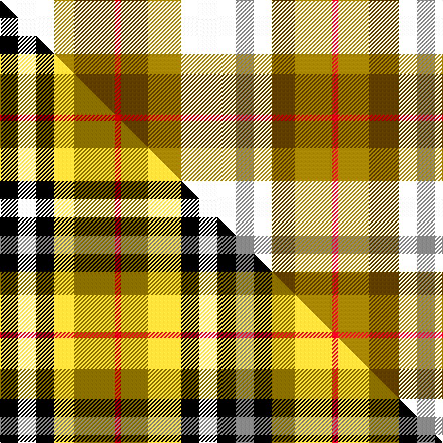

This is one **variant** — a specific cloth: this exact thread count and colourway, with its own
provenance below. It is one weaving of the [sett](/setts/k3w3k3y10r1/) (the scale-free proportion — the
same cloth at any scale or shade), whose colour order is pattern [KWKGR](/stripes/kwkgr/).

Part of the [Burberry](/tartans/b/bu/burberry/) tartan — the named design grouping this sett with its other cloths.

Sourced from weddslist.  It is a [5 stripe tartan](/stripes/stripes5/).

Original link [http://www.weddslist.com/cgi-bin/tartans/pg.pl?source=misc](http://www.weddslist.com/cgi-bin/tartans/pg.pl?source=misc)

Dataset <small>— provenance for this record, inherited from the source manifest</small>

<dl class="dataset-prov">
<dt>source</dt><dd><a href="/sources/weddslist/">Weddslist</a></dd>
<dt>data captured from</dt><dd><a href="https://github.com/thetartan/tartan-database/blob/master/data/weddslist/data.csv">https://github.com/thetartan/tartan-database/blob/master/data/weddslist/data.csv</a></dd>
<dt>data date</dt><dd>2016-11-17 <small>(dataset default)</small></dd>
<dt>licence</dt><dd><a href="https://creativecommons.org/licenses/by-nc-nd/4.0/">CC BY-NC-ND 4.0</a></dd>
</dl>

Capture chain <small>— the hands this data passed through, oldest first; each capture carries its own licence</small>

<ol class="capture-chain">
<li><a href="https://www.weddslist.com/tartans/">Weddslist</a> <small>the living privately compiled reference</small></li>
<li><a href="https://github.com/thetartan/tartan-database">thetartan/tartan-database</a> <small>2016-2017</small> · <a href="https://creativecommons.org/licenses/by-nc-nd/4.0/">CC BY-NC-ND 4.0</a> <small>Levko Kravets's frozen compilation — the capture we vendored, and where its CC licence text came from</small></li>
<li>this dictionary <small>captured 2026-06-10 · commit 5bf86c7566</small> <small>each re-capture is a git commit to data/sources</small></li>
</ol>

## Thread count
K/18 W18 K18 Y60 R/6

One full sett is **216 threads**.

## Palette
<table><thead><tr><th>Colour</th><th>Shade</th><th>OKLCh</th></tr></thead><tbody><tr><td>Y</td><td><code style="background-color:#8B6E00;">#8B6E00</code> <small style="color:#888">#8B6E00</small></td><td><small style="color:#888">oklch(55.1% 0.113 90.4)</small></td></tr><tr><td>W</td><td><code style="background-color:#F7F7F7;">#F7F7F7</code> <small style="color:#888">#F7F7F7</small></td><td><small style="color:#888">oklch(97.6% 0.000 89.9)</small></td></tr><tr><td>R</td><td><code style="background-color:#D60020;">#D60020</code> <small style="color:#888">#D60020</small></td><td><small style="color:#888">oklch(55.2% 0.224 25.5)</small></td></tr></tbody></table>

# Sample pattern

## Compared to the master

This cloth is one sett of its design; the master sett (the exemplar the design is anchored on) is below for comparison.

Its **ΔTartan distance** from the master is **0.18** — the same measure the nearest-tartans table ranks by (0 is identical; a re-scale of the same cloth is near 0, a recolour or a different proportion further).

<figure class="master-compare" style="margin:0">

this sett
master sett ★

<figcaption style="color:#888;font-size:smaller">One weave of this sett against the <a href="/setts/k3w3k3ly10r1/">master sett ★</a>, split on the diagonal: a shared proportion runs seamlessly across it with only the shades shifting; a different proportion breaks on it.</figcaption>
</figure>

## Nearest tartan variants

The nearest existing variants by ΔTartan distance, with this cloth at the top so the swatches line up against it.

ΔTartan

Threads

Variant

Sett

—

216

<a href="/variants/s5/k3w3k3y10r1~x6/">(6) Burberry</a>

<a href="/ttd/edit/#slug=k3w3k3ly10r1~x6&amp;base=k3w3k3y10r1~x6" title="compare in the TTD">0.18</a>

216

<a href="/variants/s5/k3w3k3ly10r1~x6/">Burberry (Genuine)</a>

<a href="/ttd/edit/#slug=k6w6k6ly21r2~x4&amp;base=k3w3k3y10r1~x6" title="compare in the TTD">0.23</a>

296

<a href="/variants/s5/k6w6k6ly21r2~x4/">Burberry Check Corporate Tartan</a>

<a href="/ttd/edit/#slug=r4ly30k6w13k13w3~x2&amp;base=k3w3k3y10r1~x6" title="compare in the TTD">1.26</a>

262

<a href="/variants/s6/r4ly30k6w13k13w3~x2/">Thomson, Camel (Fashion)</a>

<a href="/ttd/edit/#slug=r2ly20k5w10k10w2~x2&amp;base=k3w3k3y10r1~x6" title="compare in the TTD">1.35</a>

188

<a href="/variants/s6/r2ly20k5w10k10w2~x2/">Thompson Camel Clan Tartan</a>

<a href="/ttd/edit/#slug=w2k11y11lb3k1r1~x2&amp;base=k3w3k3y10r1~x6" title="compare in the TTD">1.36</a>

110

<a href="/variants/s6/w2k11y11lb3k1r1~x2/">Cornish National Small Set Tartan</a>

<a href="/ttd/edit/#slug=w5k26ly26lb7k3r3~x2&amp;base=k3w3k3y10r1~x6" title="compare in the TTD">1.36</a>

264

<a href="/variants/s6/w5k26ly26lb7k3r3~x2/">Cornish National (District)</a>

<a href="/ttd/edit/#slug=w5k26y26lb7k3r3~x2&amp;base=k3w3k3y10r1~x6" title="compare in the TTD">1.36</a>

264

<a href="/variants/s6/w5k26y26lb7k3r3~x2/">Cornish, National</a>

<a href="/ttd/edit/#slug=k6w6k6o21r2~x4&amp;base=k3w3k3y10r1~x6" title="compare in the TTD">1.40</a>

296

<a href="/variants/s5/k6w6k6o21r2~x4/">Burberry, Check</a>

<a href="/ttd/edit/#slug=k3w3k3dg10r1~x6&amp;base=k3w3k3y10r1~x6" title="compare in the TTD">1.40</a>

216

<a href="/variants/s5/k3w3k3dg10r1~x6/">Burberry Hunting</a>

<a href="/ttd/edit/#slug=k23y3k23w36r4~x2&amp;base=k3w3k3y10r1~x6" title="compare in the TTD">1.49</a>

302

<a href="/variants/s5/k23y3k23w36r4~x2/">Macleod, Winnifred Mary, Dress</a>

## Neighbour map

Every grey dot is one of 13621 variants placed by the first two principal components of the ΔTartan feature space (42% of its variance). Red is this tartan; blue dots are its nearest — click one to open its page. The map is a flat projection of a many-dimensional space — [how to read it](/posts/neighbourhood-maps/).

<svg viewBox="0 0 640 380" role="img" style="max-width:100%;height:auto;border:1px solid #e0e0e0;border-radius:4px;display:block" xmlns="http://www.w3.org/2000/svg"><image href="/nn/cloud.v1.png" width="640" height="380"/><a href="/variants/s5/k3w3k3ly10r1~x6/"><circle cx="196.4" cy="195.4" r="4" fill="#3465a4"><title>Burberry (Genuine)</title></circle></a><a href="/variants/s5/k6w6k6ly21r2~x4/"><circle cx="206.1" cy="190.9" r="4" fill="#3465a4"><title>Burberry Check Corporate Tartan</title></circle></a><a href="/variants/s6/r4ly30k6w13k13w3~x2/"><circle cx="168.6" cy="193.8" r="4" fill="#3465a4"><title>Thomson, Camel (Fashion)</title></circle></a><a href="/variants/s6/r2ly20k5w10k10w2~x2/"><circle cx="156.8" cy="197.5" r="4" fill="#3465a4"><title>Thompson Camel Clan Tartan</title></circle></a><a href="/variants/s6/w2k11y11lb3k1r1~x2/"><circle cx="158.6" cy="161.7" r="4" fill="#3465a4"><title>Cornish National Small Set Tartan</title></circle></a><a href="/variants/s6/w5k26ly26lb7k3r3~x2/"><circle cx="139.3" cy="172.3" r="4" fill="#3465a4"><title>Cornish National (District)</title></circle></a><a href="/variants/s6/w5k26y26lb7k3r3~x2/"><circle cx="147.3" cy="173.2" r="4" fill="#3465a4"><title>Cornish, National</title></circle></a><a href="/variants/s5/k6w6k6o21r2~x4/"><circle cx="216.3" cy="187.3" r="4" fill="#3465a4"><title>Burberry, Check</title></circle></a><a href="/variants/s5/k3w3k3dg10r1~x6/"><circle cx="204.9" cy="198.4" r="4" fill="#3465a4"><title>Burberry Hunting</title></circle></a><a href="/variants/s5/k23y3k23w36r4~x2/"><circle cx="223.6" cy="192.7" r="4" fill="#3465a4"><title>Macleod, Winnifred Mary, Dress</title></circle></a><circle cx="203.6" cy="195.2" r="5" fill="#c00000"/><text x="320" y="376" text-anchor="middle" font-size="11" fill="#999">ground</text><text x="11" y="190" text-anchor="middle" font-size="11" fill="#999" transform="rotate(-90 11 190)">complexity</text></svg>

ID: /variants/s5/k3w3k3y10r1~x6/
