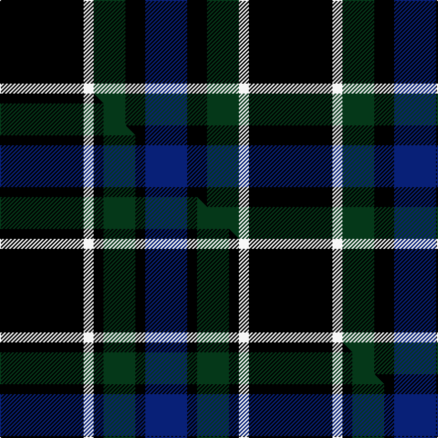

This page is one **sett** — a single exact thread-count. It belongs to the [tartan](/setts/k42w5dg16k10db21/)
(the same proportion at any scale), whose colour order is pattern [BKGWK](/stripes/bkgwk/).

Part of the [Givens](/tartans/givens/) tartan — the named design grouping this sett with its other cloths.

Sourced from tartans-authority.  It is a [5 stripe tartan](/stripes/stripes5/).

Original link http://www.tartansauthority.com/tartan-ferret/display/10918/

## Register references

External register numbers recorded for this tartan.

- Scottish Register of Tartans: [10918](https://www.tartanregister.gov.uk/tartanDetails?ref=10918)
- Scottish Tartans Authority (ITI): 10918

## Thread count
K/84 W10 DG32 K20 DB/42

One full sett is **250 threads**.

## Palette
<table><thead><tr><th>Colour</th><th>Shade</th><th>OKLCh</th></tr></thead><tbody><tr><td>DB</td><td><code style="background-color:#082077;">#082077</code> <small style="color:#888">#082077</small></td><td><small style="color:#888">oklch(30.0% 0.149 265.1)</small></td></tr><tr><td>DG</td><td><code style="background-color:#053819;">#053819</code> <small style="color:#888">#053819</small></td><td><small style="color:#888">oklch(30.0% 0.075 151.3)</small></td></tr><tr><td>K</td><td><code style="background-color:#000000;">#000000</code> <small style="color:#888">#000000</small></td><td><small style="color:#888">oklch(0.0% 0.000 0.0)</small></td></tr><tr><td>W</td><td><code style="background-color:#F7F7F7;">#F7F7F7</code> <small style="color:#888">#F7F7F7</small></td><td><small style="color:#888">oklch(97.6% 0.000 89.9)</small></td></tr></tbody></table>

# Sample pattern

## Compared to the master

This cloth is one sett of its design; the master sett (the exemplar the design is anchored on) is below for comparison.

Its **ΔTartan distance** from the master is **0.74** — the same measure the nearest-tartans table ranks by (0 is identical; a re-scale of the same cloth is near 0, a recolour or a different proportion further).

<figure class="master-compare" style="margin:0">

this sett
master sett ★

<figcaption style="color:#888;font-size:smaller">One weave of this sett against the <a href="/setts/k42w5k5dg16k5db21/">master sett ★</a>, split on the diagonal: a shared proportion runs seamlessly across it with only the shades shifting; a different proportion breaks on it.</figcaption>
</figure>

## Nearest tartan variants

The nearest existing variants by ΔTartan distance, with this cloth at the top so the swatches line up against it.

ΔTartan

Threads

Variant

Sett

—

250

<a href="/variants/s5/k42w5dg16k10db21~x2/">Givens (Arizona)</a>

<a href="/ttd/edit/#slug=k42w5k5dg16k5db21~x2&amp;base=k42w5dg16k10db21~x2" title="compare in the TTD">1.10</a>

250

<a href="/variants/s6/k42w5k5dg16k5db21~x2/">Givens (Arizona)</a>

<a href="/ttd/edit/#slug=k2db11k26g11k2~x2&amp;base=k42w5dg16k10db21~x2" title="compare in the TTD">1.63</a>

200

<a href="/variants/s5/k2db11k26g11k2~x2/">Campbell of Loch Awe</a>

<a href="/ttd/edit/#slug=k3dg11k3b11k18o3~x2&amp;base=k42w5dg16k10db21~x2" title="compare in the TTD">1.67</a>

184

<a href="/variants/s6/k3dg11k3b11k18o3~x2/">The Harbour Town, Hilton Head</a>

<a href="/ttd/edit/#slug=lb3k16g16k16db3lb3~x2&amp;base=k42w5dg16k10db21~x2" title="compare in the TTD">1.81</a>

216

<a href="/variants/s6/lb3k16g16k16db3lb3~x2/">Murray</a>

<a href="/ttd/edit/#slug=k5db1k5db7w2~x2&amp;base=k42w5dg16k10db21~x2" title="compare in the TTD">1.87</a>

66

<a href="/variants/s5/k5db1k5db7w2~x2/">Grampian, T.V.</a>

<a href="/ttd/edit/#slug=db40k4db12k21g27w4~x2&amp;base=k42w5dg16k10db21~x2" title="compare in the TTD">1.97</a>

344

<a href="/variants/s6/db40k4db12k21g27w4~x2/">Granger (Personal)</a>

<a href="/ttd/edit/#slug=k1db7k7ly1~x10&amp;base=k42w5dg16k10db21~x2" title="compare in the TTD">2.03</a>

300

<a href="/variants/s4/k1db7k7ly1~x10/">Wallace (Personal)</a>

<a href="/ttd/edit/#slug=r1k7g7k7db7k7r1w1~x4&amp;base=k42w5dg16k10db21~x2" title="compare in the TTD">2.11</a>

296

<a href="/variants/s8/r1k7g7k7db7k7r1w1~x4/">Tennent (Personal)</a>

<a href="/ttd/edit/#slug=dr1k10n2lb5k5dr1~x4&amp;base=k42w5dg16k10db21~x2" title="compare in the TTD">2.15</a>

184

<a href="/variants/s6/dr1k10n2lb5k5dr1~x4/">Callaway (Corporate)</a>

<a href="/ttd/edit/#slug=r1k8g2db4r1~x8&amp;base=k42w5dg16k10db21~x2" title="compare in the TTD">2.18</a>

240

<a href="/variants/s5/r1k8g2db4r1~x8/">Nairn (Name)</a>

## Neighbour map

Every grey dot is one of 13620 variants placed by the first two principal components of the ΔTartan feature space (42% of its variance). Red is this tartan; blue dots are its nearest — click one to open its page.

<svg viewBox="0 0 640 380" role="img" style="max-width:100%;height:auto;border:1px solid #e0e0e0;border-radius:4px;display:block" xmlns="http://www.w3.org/2000/svg"><image href="/nn/cloud.v1.png" width="640" height="380"/><a href="/variants/s6/k42w5k5dg16k5db21~x2/"><circle cx="252.0" cy="196.9" r="4" fill="#3465a4"><title>Givens (Arizona)</title></circle></a><a href="/variants/s5/k2db11k26g11k2~x2/"><circle cx="294.3" cy="197.8" r="4" fill="#3465a4"><title>Campbell of Loch Awe</title></circle></a><a href="/variants/s6/k3dg11k3b11k18o3~x2/"><circle cx="190.0" cy="222.0" r="4" fill="#3465a4"><title>The Harbour Town, Hilton Head</title></circle></a><a href="/variants/s6/lb3k16g16k16db3lb3~x2/"><circle cx="208.2" cy="223.5" r="4" fill="#3465a4"><title>Murray</title></circle></a><a href="/variants/s5/k5db1k5db7w2~x2/"><circle cx="224.0" cy="252.0" r="4" fill="#3465a4"><title>Grampian, T.V.</title></circle></a><a href="/variants/s6/db40k4db12k21g27w4~x2/"><circle cx="206.8" cy="207.8" r="4" fill="#3465a4"><title>Granger (Personal)</title></circle></a><a href="/variants/s4/k1db7k7ly1~x10/"><circle cx="278.7" cy="246.2" r="4" fill="#3465a4"><title>Wallace (Personal)</title></circle></a><a href="/variants/s8/r1k7g7k7db7k7r1w1~x4/"><circle cx="183.7" cy="196.8" r="4" fill="#3465a4"><title>Tennent (Personal)</title></circle></a><a href="/variants/s6/dr1k10n2lb5k5dr1~x4/"><circle cx="275.5" cy="186.9" r="4" fill="#3465a4"><title>Callaway (Corporate)</title></circle></a><a href="/variants/s5/r1k8g2db4r1~x8/"><circle cx="212.8" cy="203.0" r="4" fill="#3465a4"><title>Nairn (Name)</title></circle></a><circle cx="246.4" cy="221.5" r="5" fill="#c00000"/><text x="320" y="376" text-anchor="middle" font-size="11" fill="#999">ground</text><text x="11" y="190" text-anchor="middle" font-size="11" fill="#999" transform="rotate(-90 11 190)">complexity</text></svg>

ID: /variants/s5/k42w5dg16k10db21~x2/
