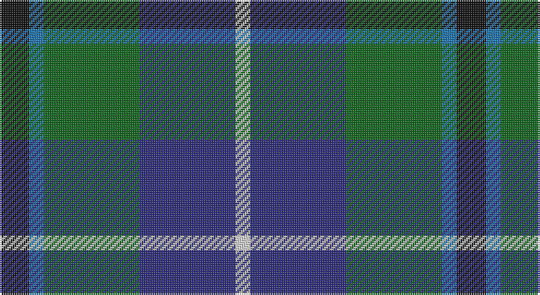

This page is one **sett** — a single exact thread-count. It belongs to the [tartan](/setts/k4b2g13db13w2/)
(the same proportion at any scale), whose colour order is pattern [KBGBW](/stripes/kbgbw/).

Sourced from register-of-tartans.  It is a [5 stripe tartan](/stripes/stripes5/).

Original link https://www.tartanregister.gov.uk/tartanDetails.aspx?ref=228

## Register references

External register numbers recorded for this tartan.

- Scottish Register of Tartans: [228](https://www.tartanregister.gov.uk/tartanDetails.aspx?ref=228)
- Scottish Tartans Authority (ITI): 6006

## Thread count
K/16 B8 G52 DB52 LN/8

One full sett is **248 threads**.

## Palette

Palette: <strong>Tartan Register</strong>
<table><thead><tr><th>Colour</th><th>Threads</th><th>Shade</th><th>Base</th><th>OKLCh</th></tr></thead><tbody><tr><td>K/</td><td style="text-align:right;font-variant-numeric:tabular-nums">16</td><td><code style="background-color:#101010;">#101010</code> <small style="color:#888">#101010</small></td><td>K <code style="background-color:#000000;">#000000</code></td><td><small style="color:#888">oklch(17.3% 0.000 89.9)</small></td></tr><tr><td>B</td><td style="text-align:right;font-variant-numeric:tabular-nums">8</td><td><code style="background-color:#1474B4;">#1474B4</code> <small style="color:#888">#1474B4</small></td><td>B <code style="background-color:#2A418A;">#2A418A</code></td><td><small style="color:#888">oklch(54.0% 0.129 245.1)</small></td></tr><tr><td>G</td><td style="text-align:right;font-variant-numeric:tabular-nums">52</td><td><code style="background-color:#006818;">#006818</code> <small style="color:#888">#006818</small></td><td>G <code style="background-color:#006100;">#006100</code></td><td><small style="color:#888">oklch(45.0% 0.142 145.0)</small></td></tr><tr><td>DB</td><td style="text-align:right;font-variant-numeric:tabular-nums">52</td><td><code style="background-color:#2C2C80;">#2C2C80</code> <small style="color:#888">#2C2C80</small></td><td>B <code style="background-color:#2A418A;">#2A418A</code></td><td><small style="color:#888">oklch(35.0% 0.138 276.6)</small></td></tr><tr><td>LN/</td><td style="text-align:right;font-variant-numeric:tabular-nums">8</td><td><code style="background-color:#E0E0E0;">#E0E0E0</code> <small style="color:#888">#E0E0E0</small></td><td>W <code style="background-color:#F7F7F7;">#F7F7F7</code></td><td><small style="color:#888">oklch(90.7% 0.000 89.9)</small></td></tr></tbody></table>

# Sample pattern

## Nearest tartans

The nearest existing variants by ΔTartan distance, with this tartan at the top so the swatches line up against it.

ΔTartan

Tartan

Sett

—

<a href="/ttd/edit/#slug=k4b2g13db13w2~x4">Bath</a> <a class="nn-out" href="/variants/s5/k4b2g13db13w2~x4/" title="open its dictionary page">↗</a>

0.59

<a href="/ttd/edit/#slug=k7lb3g18db18w2~x2&amp;base=k4b2g13db13w2~x4">Bhatti (Name)</a> <a class="nn-out" href="/variants/s5/k7lb3g18db18w2~x2/" title="open its dictionary page">↗</a>

0.77

<a href="/ttd/edit/#slug=r1db6k3dg6w1~x4&amp;base=k4b2g13db13w2~x4">Davidson of Tulloch #2</a> <a class="nn-out" href="/variants/s5/r1db6k3dg6w1~x4/" title="open its dictionary page">↗</a>

0.87

<a href="/ttd/edit/#slug=k1dbi1g8db8w1~x4&amp;base=k4b2g13db13w2~x4">Douglas, Green (Wilsons)</a> <a class="nn-out" href="/variants/s5/k1dbi1g8db8w1~x4/" title="open its dictionary page">↗</a>

0.89

<a href="/ttd/edit/#slug=k4t3dp11dg14w2~x2&amp;base=k4b2g13db13w2~x4">Wellington No 229</a> <a class="nn-out" href="/variants/s5/k4t3dp11dg14w2~x2/" title="open its dictionary page">↗</a>

0.91

<a href="/ttd/edit/#slug=db20k6lo4db3g20w2~x2&amp;base=k4b2g13db13w2~x4">DeLoughery (Personal)</a> <a class="nn-out" href="/variants/s6/db20k6lo4db3g20w2~x2/" title="open its dictionary page">↗</a>

0.96

<a href="/ttd/edit/#slug=lr4g24db10r3db12lo4~x2&amp;base=k4b2g13db13w2~x4">Inglis (Name)</a> <a class="nn-out" href="/variants/s6/lr4g24db10r3db12lo4~x2/" title="open its dictionary page">↗</a>

0.97

<a href="/ttd/edit/#slug=g16lb3g3k10db12r2db3~x2&amp;base=k4b2g13db13w2~x4">MacLean, Donald (Personal)</a> <a class="nn-out" href="/variants/s7/g16lb3g3k10db12r2db3~x2/" title="open its dictionary page">↗</a>

0.99

<a href="/ttd/edit/#slug=k7r3g30db28lb3~x2&amp;base=k4b2g13db13w2~x4">Highlander Highland Laddie</a> <a class="nn-out" href="/variants/s5/k7r3g30db28lb3~x2/" title="open its dictionary page">↗</a>

1.00

<a href="/ttd/edit/#slug=db1r1db6k6dg6w1~x2&amp;base=k4b2g13db13w2~x4">Wellington</a> <a class="nn-out" href="/variants/s6/db1r1db6k6dg6w1~x2/" title="open its dictionary page">↗</a>

1.00

<a href="/ttd/edit/#slug=k2ly1dg6k6db6w1~x4&amp;base=k4b2g13db13w2~x4">Dyce #3</a> <a class="nn-out" href="/variants/s6/k2ly1dg6k6db6w1~x4/" title="open its dictionary page">↗</a>

## Neighbour map

Every grey dot is one of 14360 variants placed by the first two principal components of the ΔTartan feature space (44% of its variance). Red is this tartan; blue dots are its nearest — click one to open its page.

<svg viewBox="0 0 640 380" role="img" style="max-width:100%;height:auto;border:1px solid #e0e0e0;border-radius:4px;display:block" xmlns="http://www.w3.org/2000/svg"><image href="/nn/cloud.v1.png" width="640" height="380"/><a href="/variants/s5/k7lb3g18db18w2~x2/"><circle cx="167.8" cy="221.7" r="4" fill="#3465a4"><title>Bhatti (Name)</title></circle></a><a href="/variants/s5/r1db6k3dg6w1~x4/"><circle cx="146.7" cy="248.4" r="4" fill="#3465a4"><title>Davidson of Tulloch #2</title></circle></a><a href="/variants/s5/k1dbi1g8db8w1~x4/"><circle cx="219.0" cy="218.1" r="4" fill="#3465a4"><title>Douglas, Green (Wilsons)</title></circle></a><a href="/variants/s5/k4t3dp11dg14w2~x2/"><circle cx="172.9" cy="232.2" r="4" fill="#3465a4"><title>Wellington No 229</title></circle></a><a href="/variants/s6/db20k6lo4db3g20w2~x2/"><circle cx="206.5" cy="204.1" r="4" fill="#3465a4"><title>DeLoughery (Personal)</title></circle></a><a href="/variants/s6/lr4g24db10r3db12lo4~x2/"><circle cx="183.1" cy="209.9" r="4" fill="#3465a4"><title>Inglis (Name)</title></circle></a><a href="/variants/s7/g16lb3g3k10db12r2db3~x2/"><circle cx="164.3" cy="216.4" r="4" fill="#3465a4"><title>MacLean, Donald (Personal)</title></circle></a><a href="/variants/s5/k7r3g30db28lb3~x2/"><circle cx="222.2" cy="214.8" r="4" fill="#3465a4"><title>Highlander Highland Laddie</title></circle></a><a href="/variants/s6/db1r1db6k6dg6w1~x2/"><circle cx="142.2" cy="237.6" r="4" fill="#3465a4"><title>Wellington</title></circle></a><a href="/variants/s6/k2ly1dg6k6db6w1~x4/"><circle cx="135.4" cy="240.4" r="4" fill="#3465a4"><title>Dyce #3</title></circle></a><circle cx="170.2" cy="236.8" r="5" fill="#c00000"/></svg>

ID: /variants/s5/k4b2g13db13w2~x4/
