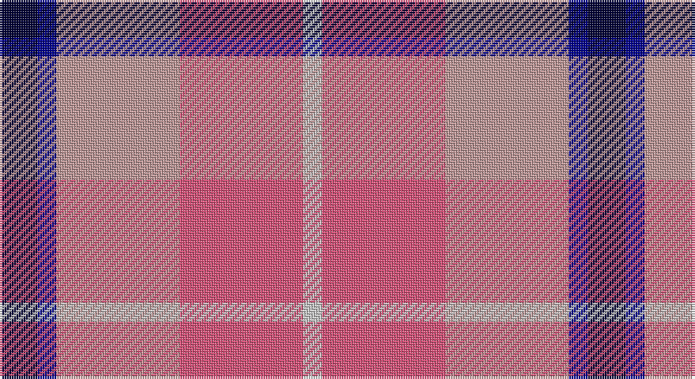

This page is one **sett** — a single exact thread-count. It belongs to the [tartan](/setts/k4db2lr13m13lb2/)
(the same proportion at any scale), whose colour order is pattern [KBYRW](/stripes/kbyrw/).

Sourced from register-of-tartans.  It is a [5 stripe tartan](/stripes/stripes5/).

Original link https://www.tartanregister.gov.uk/tartanDetails.aspx?ref=4100

2 attestations — the source records this cloth was collapsed from (oldest owns this page)

<ul>
<li>01/01/2002 — Think Pink (ICF) (register-of-tartans, <a href="https://www.tartanregister.gov.uk/tartanDetails.aspx?ref=4100">record</a>)</li>
<li>pre 2002 — Think Pink (Corporate) (tartans-authority, <a href="http://www.tartansauthority.com/tartan-ferret/display/5134/">record</a>)</li>
</ul>

## Register references

External register numbers recorded for this tartan.

- Scottish Register of Tartans: [4100](https://www.tartanregister.gov.uk/tartanDetails.aspx?ref=4100)
- Scottish Tartans Authority (ITI): 5134

## Thread count
DB/16 DBa8 Na52 LR52 N/8

One full sett is **248 threads**.

## Palette

Palette: <strong>Tartan Register</strong> <small style="color:#888">(2 of 5 colours)</small>
<table><thead><tr><th>Colour</th><th>Threads</th><th>Shade</th><th>Base</th><th>OKLCh</th></tr></thead><tbody><tr><td>DB/</td><td style="text-align:right;font-variant-numeric:tabular-nums">16</td><td><code style="background-color:#000034;">#000034</code> <small style="color:#888">#000034</small></td><td>K <code style="background-color:#000000;">#000000</code></td><td><small style="color:#888">oklch(14.7% 0.102 264.1)</small></td></tr><tr><td>DBa</td><td style="text-align:right;font-variant-numeric:tabular-nums">8</td><td><code style="background-color:#00008C;">#00008C</code> <small style="color:#888">#00008C</small></td><td>B <code style="background-color:#2A418A;">#2A418A</code></td><td><small style="color:#888">oklch(28.9% 0.200 264.1)</small></td></tr><tr><td>Na</td><td style="text-align:right;font-variant-numeric:tabular-nums">52</td><td><code style="background-color:#C09898;">#C09898</code> <small style="color:#888">#C09898</small></td><td>Y <code style="background-color:#F2BF00;">#F2BF00</code></td><td><small style="color:#888">oklch(71.7% 0.048 18.3)</small></td></tr><tr><td>LR</td><td style="text-align:right;font-variant-numeric:tabular-nums">52</td><td><code style="background-color:#DC5078;">#DC5078</code> <small style="color:#888">#DC5078</small></td><td>R <code style="background-color:#CC0000;">#CC0000</code></td><td><small style="color:#888">oklch(62.9% 0.177 6.2)</small></td></tr><tr><td>N/</td><td style="text-align:right;font-variant-numeric:tabular-nums">8</td><td><code style="background-color:#C8C8C8;">#C8C8C8</code> <small style="color:#888">#C8C8C8</small></td><td>W <code style="background-color:#F7F7F7;">#F7F7F7</code></td><td><small style="color:#888">oklch(83.3% 0.000 89.9)</small></td></tr></tbody></table>

# Sample pattern

## Nearest tartans

The nearest existing variants by ΔTartan distance, with this tartan at the top so the swatches line up against it.

ΔTartan

Tartan

Sett

—

<a href="/ttd/edit/#slug=k4db2lr13m13lb2~x4">Think Pink (ICF)</a> <a class="nn-out" href="/variants/s5/k4db2lr13m13lb2~x4/" title="open its dictionary page">↗</a>

1.26

<a href="/ttd/edit/#slug=r30db20w15lb3ly3&amp;base=k4db2lr13m13lb2~x4">Siddle, New (Corporate)</a> <a class="nn-out" href="/variants/s5/r30db20w15lb3ly3/" title="open its dictionary page">↗</a>

1.31

<a href="/ttd/edit/#slug=dp8ly6k2o1w1~x8&amp;base=k4db2lr13m13lb2~x4">Ballater Victoria Week</a> <a class="nn-out" href="/variants/s5/dp8ly6k2o1w1~x8/" title="open its dictionary page">↗</a>

1.35

<a href="/ttd/edit/#slug=m30k7o20ly4k4~x2&amp;base=k4db2lr13m13lb2~x4">Drumfintley (Fashion)</a> <a class="nn-out" href="/variants/s5/m30k7o20ly4k4~x2/" title="open its dictionary page">↗</a>

1.43

<a href="/ttd/edit/#slug=dp30lo7w6db30ly8~x2&amp;base=k4db2lr13m13lb2~x4">Pownall (2015)</a> <a class="nn-out" href="/variants/s5/dp30lo7w6db30ly8~x2/" title="open its dictionary page">↗</a>

1.47

<a href="/ttd/edit/#slug=ri22w2db11ly4db11r6db2w10~x2&amp;base=k4db2lr13m13lb2~x4">Thousand Islands Int. Council (Corp)</a> <a class="nn-out" href="/variants/s8/ri22w2db11ly4db11r6db2w10~x2/" title="open its dictionary page">↗</a>

1.47

<a href="/ttd/edit/#slug=db1o8w1db4r8w1~x6&amp;base=k4db2lr13m13lb2~x4">Little's (Corporate)</a> <a class="nn-out" href="/variants/s6/db1o8w1db4r8w1~x6/" title="open its dictionary page">↗</a>

1.49

<a href="/ttd/edit/#slug=dp8ly6k2y1w1~x8&amp;base=k4db2lr13m13lb2~x4">Ballater Victoria Week</a> <a class="nn-out" href="/variants/s5/dp8ly6k2y1w1~x8/" title="open its dictionary page">↗</a>

1.52

<a href="/ttd/edit/#slug=g16p8r45w6p45w44p6w12&amp;base=k4db2lr13m13lb2~x4">Culloden, Red (dress)</a> <a class="nn-out" href="/variants/s8/g16p8r45w6p45w44p6w12/" title="open its dictionary page">↗</a>

1.53

<a href="/ttd/edit/#slug=w3r27w16db27lo3~x2&amp;base=k4db2lr13m13lb2~x4">Common Ground Dress (Fashion)</a> <a class="nn-out" href="/variants/s5/w3r27w16db27lo3~x2/" title="open its dictionary page">↗</a>

1.55

<a href="/ttd/edit/#slug=w3r24db12dg8ly3~x2&amp;base=k4db2lr13m13lb2~x4">McGill University</a> <a class="nn-out" href="/variants/s5/w3r24db12dg8ly3~x2/" title="open its dictionary page">↗</a>

## Neighbour map

Every grey dot is one of 14360 variants placed by the first two principal components of the ΔTartan feature space (44% of its variance). Red is this tartan; blue dots are its nearest — click one to open its page.

<svg viewBox="0 0 640 380" role="img" style="max-width:100%;height:auto;border:1px solid #e0e0e0;border-radius:4px;display:block" xmlns="http://www.w3.org/2000/svg"><image href="/nn/cloud.v1.png" width="640" height="380"/><a href="/variants/s5/r30db20w15lb3ly3/"><circle cx="170.7" cy="179.4" r="4" fill="#3465a4"><title>Siddle, New (Corporate)</title></circle></a><a href="/variants/s5/dp8ly6k2o1w1~x8/"><circle cx="177.0" cy="181.7" r="4" fill="#3465a4"><title>Ballater Victoria Week</title></circle></a><a href="/variants/s5/m30k7o20ly4k4~x2/"><circle cx="233.4" cy="220.5" r="4" fill="#3465a4"><title>Drumfintley (Fashion)</title></circle></a><a href="/variants/s5/dp30lo7w6db30ly8~x2/"><circle cx="134.3" cy="223.9" r="4" fill="#3465a4"><title>Pownall (2015)</title></circle></a><a href="/variants/s8/ri22w2db11ly4db11r6db2w10~x2/"><circle cx="132.9" cy="160.1" r="4" fill="#3465a4"><title>Thousand Islands Int. Council (Corp)</title></circle></a><a href="/variants/s6/db1o8w1db4r8w1~x6/"><circle cx="183.3" cy="209.7" r="4" fill="#3465a4"><title>Little's (Corporate)</title></circle></a><a href="/variants/s5/dp8ly6k2y1w1~x8/"><circle cx="172.0" cy="184.9" r="4" fill="#3465a4"><title>Ballater Victoria Week</title></circle></a><a href="/variants/s8/g16p8r45w6p45w44p6w12/"><circle cx="141.1" cy="181.0" r="4" fill="#3465a4"><title>Culloden, Red (dress)</title></circle></a><a href="/variants/s5/w3r27w16db27lo3~x2/"><circle cx="164.6" cy="209.5" r="4" fill="#3465a4"><title>Common Ground Dress (Fashion)</title></circle></a><a href="/variants/s5/w3r24db12dg8ly3~x2/"><circle cx="196.1" cy="182.7" r="4" fill="#3465a4"><title>McGill University</title></circle></a><circle cx="166.5" cy="203.1" r="5" fill="#c00000"/></svg>

ID: /variants/s5/k4db2lr13m13lb2~x4/
