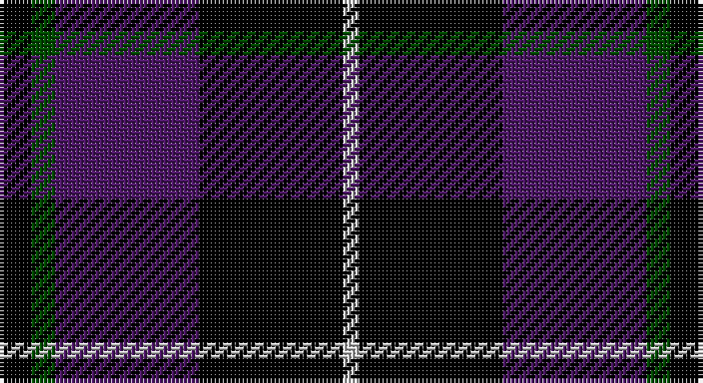

This page is one **sett** — a single exact thread-count. It belongs to the [tartan](/setts/k4dg3dp18k18lb2/)
(the same proportion at any scale), whose colour order is pattern [KGBKW](/stripes/kgbkw/).

Sourced from register-of-tartans.  It is a [5 stripe tartan](/stripes/stripes5/).

Original link https://www.tartanregister.gov.uk/tartanDetails.aspx?ref=4510

## Register references

External register numbers recorded for this tartan.

- Scottish Register of Tartans: [4510](https://www.tartanregister.gov.uk/tartanDetails.aspx?ref=4510)
- Scottish Tartans Authority (ITI): 4320

## Thread count
K/8 G6 DP36 K36 N/4

One full sett is **168 threads**.

## Palette

Palette: <strong>Tartan Register</strong> <small style="color:#888">(3 of 4 colours)</small>
<table><thead><tr><th>Colour</th><th>Threads</th><th>Shade</th><th>Base</th><th>OKLCh</th></tr></thead><tbody><tr><td>K/</td><td style="text-align:right;font-variant-numeric:tabular-nums">8</td><td><code style="background-color:#000000;">#000000</code> <small style="color:#888">#000000</small></td><td>K <code style="background-color:#000000;">#000000</code></td><td><small style="color:#888">oklch(0.0% 0.000 0.0)</small></td></tr><tr><td>G</td><td style="text-align:right;font-variant-numeric:tabular-nums">6</td><td><code style="background-color:#004C00;">#004C00</code> <small style="color:#888">#004C00</small></td><td>G <code style="background-color:#006100;">#006100</code></td><td><small style="color:#888">oklch(36.1% 0.123 142.5)</small></td></tr><tr><td>DP</td><td style="text-align:right;font-variant-numeric:tabular-nums">36</td><td><code style="background-color:#4C1864;">#4C1864</code> <small style="color:#888">#4C1864</small></td><td>B <code style="background-color:#2A418A;">#2A418A</code></td><td><small style="color:#888">oklch(33.1% 0.131 312.8)</small></td></tr><tr><td>K</td><td style="text-align:right;font-variant-numeric:tabular-nums">36</td><td><code style="background-color:#000000;">#000000</code> <small style="color:#888">#000000</small></td><td>K <code style="background-color:#000000;">#000000</code></td><td><small style="color:#888">oklch(0.0% 0.000 0.0)</small></td></tr><tr><td>N/</td><td style="text-align:right;font-variant-numeric:tabular-nums">4</td><td><code style="background-color:#C8C8C8;">#C8C8C8</code> <small style="color:#888">#C8C8C8</small></td><td>W <code style="background-color:#F7F7F7;">#F7F7F7</code></td><td><small style="color:#888">oklch(83.3% 0.000 89.9)</small></td></tr></tbody></table>

# Sample pattern

## Nearest tartans

The nearest existing variants by ΔTartan distance, with this tartan at the top so the swatches line up against it.

ΔTartan

Tartan

Sett

—

<a href="/ttd/edit/#slug=k4dg3dp18k18lb2~x2">Wcwm 1106-2</a> <a class="nn-out" href="/variants/s5/k4dg3dp18k18lb2~x2/" title="open its dictionary page">↗</a>

0.95

<a href="/variants/s6/ki6db50k29b6k29db6/">Scottish Express International</a>

1.11

<a href="/ttd/edit/#slug=k15y2k10db18w3~x2&amp;base=k4dg3dp18k18lb2~x2">College of Radiographers</a> <a class="nn-out" href="/variants/s5/k15y2k10db18w3~x2/" title="open its dictionary page">↗</a>

1.13

<a href="/ttd/edit/#slug=r1k8g2db4r1~x4&amp;base=k4dg3dp18k18lb2~x2">Nairn</a> <a class="nn-out" href="/variants/s5/r1k8g2db4r1~x4/" title="open its dictionary page">↗</a>

1.26

<a href="/ttd/edit/#slug=k1db12k12g1k12db12w1~x4&amp;base=k4dg3dp18k18lb2~x2">Marchmont</a> <a class="nn-out" href="/variants/s7/k1db12k12g1k12db12w1~x4/" title="open its dictionary page">↗</a>

1.33

<a href="/ttd/edit/#slug=k6lo2k16t6k3db18k2~x2&amp;base=k4dg3dp18k18lb2~x2">Carrick High School</a> <a class="nn-out" href="/variants/s7/k6lo2k16t6k3db18k2~x2/" title="open its dictionary page">↗</a>

1.34

<a href="/ttd/edit/#slug=k15ly2k10db18w3~x2&amp;base=k4dg3dp18k18lb2~x2">College of Radiographers Corporate Tartan</a> <a class="nn-out" href="/variants/s5/k15ly2k10db18w3~x2/" title="open its dictionary page">↗</a>

1.35

<a href="/variants/s8/k7r2k2ki6lo1ki1lo1ki4~x4/">Printing Industries of America</a>

1.45

<a href="/ttd/edit/#slug=k14r4k25db30w4~x2&amp;base=k4dg3dp18k18lb2~x2">Britannia</a> <a class="nn-out" href="/variants/s5/k14r4k25db30w4~x2/" title="open its dictionary page">↗</a>

1.50

<a href="/ttd/edit/#slug=k15lo2k10db18lb3~x2&amp;base=k4dg3dp18k18lb2~x2">College of Radiographers</a> <a class="nn-out" href="/variants/s5/k15lo2k10db18lb3~x2/" title="open its dictionary page">↗</a>

1.55

<a href="/ttd/edit/#slug=k5lb2dg18k17dp16k3&amp;base=k4dg3dp18k18lb2~x2">Melville</a> <a class="nn-out" href="/variants/s6/k5lb2dg18k17dp16k3/" title="open its dictionary page">↗</a>

## Neighbour map

Every grey dot is one of 14360 variants placed by the first two principal components of the ΔTartan feature space (44% of its variance). Red is this tartan; blue dots are its nearest — click one to open its page.

<svg viewBox="0 0 640 380" role="img" style="max-width:100%;height:auto;border:1px solid #e0e0e0;border-radius:4px;display:block" xmlns="http://www.w3.org/2000/svg"><image href="/nn/cloud.v1.png" width="640" height="380"/><a href="/variants/s6/ki6db50k29b6k29db6/"><circle cx="255.8" cy="236.0" r="4" fill="#3465a4"><title>Scottish Express International</title></circle></a><a href="/variants/s5/k15y2k10db18w3~x2/"><circle cx="250.4" cy="241.6" r="4" fill="#3465a4"><title>College of Radiographers</title></circle></a><a href="/variants/s5/r1k8g2db4r1~x4/"><circle cx="233.5" cy="228.3" r="4" fill="#3465a4"><title>Nairn</title></circle></a><a href="/variants/s7/k1db12k12g1k12db12w1~x4/"><circle cx="284.5" cy="219.2" r="4" fill="#3465a4"><title>Marchmont</title></circle></a><a href="/variants/s7/k6lo2k16t6k3db18k2~x2/"><circle cx="249.8" cy="219.1" r="4" fill="#3465a4"><title>Carrick High School</title></circle></a><a href="/variants/s5/k15ly2k10db18w3~x2/"><circle cx="267.1" cy="245.9" r="4" fill="#3465a4"><title>College of Radiographers Corporate Tartan</title></circle></a><a href="/variants/s8/k7r2k2ki6lo1ki1lo1ki4~x4/"><circle cx="231.3" cy="237.8" r="4" fill="#3465a4"><title>Printing Industries of America</title></circle></a><a href="/variants/s5/k14r4k25db30w4~x2/"><circle cx="285.4" cy="263.8" r="4" fill="#3465a4"><title>Britannia</title></circle></a><a href="/variants/s5/k15lo2k10db18lb3~x2/"><circle cx="273.6" cy="254.0" r="4" fill="#3465a4"><title>College of Radiographers</title></circle></a><a href="/variants/s6/k5lb2dg18k17dp16k3/"><circle cx="187.4" cy="232.9" r="4" fill="#3465a4"><title>Melville</title></circle></a><circle cx="271.6" cy="232.6" r="5" fill="#c00000"/></svg>

ID: /variants/s5/k4dg3dp18k18lb2~x2/
