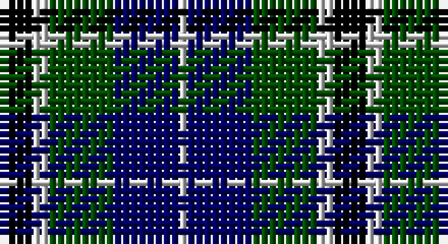

This page is one **sett** — a single exact thread-count. It belongs to the [tartan](/setts/k4lb2dg8db8lb1/)
(the same proportion at any scale), whose colour order is pattern [KWGBW](/stripes/kwgbw/).

Part of the [Douglas](/tartans/douglas/) tartan — the named design grouping this sett with its other cloths.

Sourced from weddslist.  It is a [5 stripe tartan](/stripes/stripes5/).

Original link http://www.weddslist.com/cgi-bin/tartans/pg.pl?source=rb

## Also known as

This cloth is also recorded under:

- Douglas Ancient Red
- Douglas Green
- Douglas,
- Douglas, Black
- Douglas, Green
- Douglas, Grey
- Douglas, brown

## Thread count
K/4 N2 G8 DB8 N/1

One full sett is **41 threads**.

## Palette

Palette: <strong>Tartan Register</strong> <small style="color:#888">(3 of 4 colours)</small>
<table><thead><tr><th>Colour</th><th>Threads</th><th>Shade</th><th>Base</th><th>OKLCh</th></tr></thead><tbody><tr><td>K/</td><td style="text-align:right;font-variant-numeric:tabular-nums">4</td><td><code style="background-color:#000000;">#000000</code> <small style="color:#888">#000000</small></td><td>K <code style="background-color:#000000;">#000000</code></td><td><small style="color:#888">oklch(0.0% 0.000 0.0)</small></td></tr><tr><td>N</td><td style="text-align:right;font-variant-numeric:tabular-nums">2</td><td><code style="background-color:#D0D0D0;">#D0D0D0</code> <small style="color:#888">#D0D0D0</small></td><td>W <code style="background-color:#F7F7F7;">#F7F7F7</code></td><td><small style="color:#888">oklch(85.8% 0.000 89.9)</small></td></tr><tr><td>G</td><td style="text-align:right;font-variant-numeric:tabular-nums">8</td><td><code style="background-color:#004C00;">#004C00</code> <small style="color:#888">#004C00</small></td><td>G <code style="background-color:#006100;">#006100</code></td><td><small style="color:#888">oklch(36.1% 0.123 142.5)</small></td></tr><tr><td>DB</td><td style="text-align:right;font-variant-numeric:tabular-nums">8</td><td><code style="background-color:#000064;">#000064</code> <small style="color:#888">#000064</small></td><td>B <code style="background-color:#2A418A;">#2A418A</code></td><td><small style="color:#888">oklch(22.7% 0.158 264.1)</small></td></tr><tr><td>N/</td><td style="text-align:right;font-variant-numeric:tabular-nums">1</td><td><code style="background-color:#D0D0D0;">#D0D0D0</code> <small style="color:#888">#D0D0D0</small></td><td>W <code style="background-color:#F7F7F7;">#F7F7F7</code></td><td><small style="color:#888">oklch(85.8% 0.000 89.9)</small></td></tr></tbody></table>

# Sample pattern

## Compared to the master

This cloth is one sett of its design; the master sett (the exemplar the design is anchored on) is below for comparison.

<figure style="margin:0"><figcaption style="color:#888;font-size:smaller">this sett</figcaption></figure>
<figure style="margin:0"><figcaption style="color:#888;font-size:smaller"><a href="/setts/k6db4dg44k41w4/">master sett →</a></figcaption></figure>

## Nearest tartans

The nearest existing variants by ΔTartan distance, with this tartan at the top so the swatches line up against it.

ΔTartan

Tartan

Sett

—

<a href="/ttd/edit/#slug=k4lb2dg8db8lb1">Douglas Green</a> <a class="nn-out" href="/variants/s5/k4lb2dg8db8lb1/" title="open its dictionary page">↗</a>

0.64

<a href="/ttd/edit/#slug=k2lb2dg8db8lb1&amp;base=k4lb2dg8db8lb1">Douglas</a> <a class="nn-out" href="/variants/s5/k2lb2dg8db8lb1/" title="open its dictionary page">↗</a>

0.82

<a href="/ttd/edit/#slug=db2k2db12k11g12w2~x2&amp;base=k4lb2dg8db8lb1">Campbell, The White Stripe</a> <a class="nn-out" href="/variants/s6/db2k2db12k11g12w2~x2/" title="open its dictionary page">↗</a>

0.86

<a href="/ttd/edit/#slug=w1db9k9g9k2w1~x4&amp;base=k4lb2dg8db8lb1">MacNeil 1</a> <a class="nn-out" href="/variants/s6/w1db9k9g9k2w1~x4/" title="open its dictionary page">↗</a>

0.89

<a href="/ttd/edit/#slug=w4db4g22k20db20w3&amp;base=k4lb2dg8db8lb1">Unnamed, No 26</a> <a class="nn-out" href="/variants/s6/w4db4g22k20db20w3/" title="open its dictionary page">↗</a>

0.89

<a href="/ttd/edit/#slug=k2g12k11db12w1~x2&amp;base=k4lb2dg8db8lb1">MacKirdy</a> <a class="nn-out" href="/variants/s5/k2g12k11db12w1~x2/" title="open its dictionary page">↗</a>

0.91

<a href="/ttd/edit/#slug=db3g12k13w2db13w3~x2&amp;base=k4lb2dg8db8lb1">Herd/Hurd</a> <a class="nn-out" href="/variants/s6/db3g12k13w2db13w3~x2/" title="open its dictionary page">↗</a>

0.91

<a href="/ttd/edit/#slug=db2k2db12k8g11r2~x2&amp;base=k4lb2dg8db8lb1">Murray</a> <a class="nn-out" href="/variants/s6/db2k2db12k8g11r2~x2/" title="open its dictionary page">↗</a>

0.92

<a href="/ttd/edit/#slug=b10k3b10k14r2g14k4~x2&amp;base=k4lb2dg8db8lb1">Fletcher #2</a> <a class="nn-out" href="/variants/s7/b10k3b10k14r2g14k4~x2/" title="open its dictionary page">↗</a>

0.93

<a href="/ttd/edit/#slug=db6k1db6k8r1g8k2~x2&amp;base=k4lb2dg8db8lb1">Fletcher</a> <a class="nn-out" href="/variants/s7/db6k1db6k8r1g8k2~x2/" title="open its dictionary page">↗</a>

0.94

<a href="/ttd/edit/#slug=k3g14k14g2db14r3~x2&amp;base=k4lb2dg8db8lb1">Morrison</a> <a class="nn-out" href="/variants/s6/k3g14k14g2db14r3~x2/" title="open its dictionary page">↗</a>

## Neighbour map

Every grey dot is one of 14360 variants placed by the first two principal components of the ΔTartan feature space (44% of its variance). Red is this tartan; blue dots are its nearest — click one to open its page.

<svg viewBox="0 0 640 380" role="img" style="max-width:100%;height:auto;border:1px solid #e0e0e0;border-radius:4px;display:block" xmlns="http://www.w3.org/2000/svg"><image href="/nn/cloud.v1.png" width="640" height="380"/><a href="/variants/s5/k2lb2dg8db8lb1/"><circle cx="168.0" cy="234.7" r="4" fill="#3465a4"><title>Douglas</title></circle></a><a href="/variants/s6/db2k2db12k11g12w2~x2/"><circle cx="129.6" cy="237.4" r="4" fill="#3465a4"><title>Campbell, The White Stripe</title></circle></a><a href="/variants/s6/w1db9k9g9k2w1~x4/"><circle cx="146.4" cy="218.0" r="4" fill="#3465a4"><title>MacNeil 1</title></circle></a><a href="/variants/s6/w4db4g22k20db20w3/"><circle cx="118.1" cy="225.8" r="4" fill="#3465a4"><title>Unnamed, No 26</title></circle></a><a href="/variants/s5/k2g12k11db12w1~x2/"><circle cx="161.1" cy="228.5" r="4" fill="#3465a4"><title>MacKirdy</title></circle></a><a href="/variants/s6/db3g12k13w2db13w3~x2/"><circle cx="126.2" cy="237.8" r="4" fill="#3465a4"><title>Herd/Hurd</title></circle></a><a href="/variants/s6/db2k2db12k8g11r2~x2/"><circle cx="152.3" cy="241.4" r="4" fill="#3465a4"><title>Murray</title></circle></a><a href="/variants/s7/b10k3b10k14r2g14k4~x2/"><circle cx="131.7" cy="239.8" r="4" fill="#3465a4"><title>Fletcher #2</title></circle></a><a href="/variants/s7/db6k1db6k8r1g8k2~x2/"><circle cx="158.2" cy="233.5" r="4" fill="#3465a4"><title>Fletcher</title></circle></a><a href="/variants/s6/k3g14k14g2db14r3~x2/"><circle cx="137.1" cy="236.8" r="4" fill="#3465a4"><title>Morrison</title></circle></a><circle cx="135.9" cy="244.6" r="5" fill="#c00000"/></svg>

ID: /variants/s5/k4lb2dg8db8lb1/
