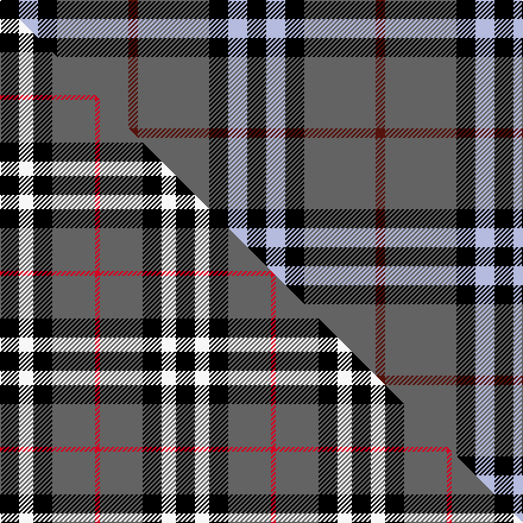

This page is one **sett** — a single exact thread-count. It belongs to the [tartan](/setts/k4lb4k4n15dr2/)
(the same proportion at any scale), whose colour order is pattern [BBKWK](/stripes/bbkwk/).

Part of the [Oban](/tartans/oban/) tartan — the named design grouping this sett with its other cloths.

Sourced from tartans-authority.  It is a [5 stripe tartan](/stripes/stripes5/).

Original link http://www.tartansauthority.com/tartan-ferret/display/1237/

## Register references

External register numbers recorded for this tartan.

- Scottish Tartans Authority (ITI): 1237

## Thread count
K/16 LB16 K16 N60 DR/8

One full sett is **208 threads**.

## Palette
<table><thead><tr><th>Colour</th><th>Shade</th><th>OKLCh</th></tr></thead><tbody><tr><td>DR</td><td><code style="background-color:#55120C;">#55120C</code> <small style="color:#888">#55120C</small></td><td><small style="color:#888">oklch(30.0% 0.099 29.3)</small></td></tr><tr><td>K</td><td><code style="background-color:#000000;">#000000</code> <small style="color:#888">#000000</small></td><td><small style="color:#888">oklch(0.0% 0.000 0.0)</small></td></tr><tr><td>LB</td><td><code style="background-color:#B5BBDE;">#B5BBDE</code> <small style="color:#888">#B5BBDE</small></td><td><small style="color:#888">oklch(79.9% 0.050 277.6)</small></td></tr><tr><td>N</td><td><code style="background-color:#636363;">#636363</code> <small style="color:#888">#636363</small></td><td><small style="color:#888">oklch(50.0% 0.000 89.9)</small></td></tr></tbody></table>

# Sample pattern

## Compared to the master

This cloth is one sett of its design; the master sett (the exemplar the design is anchored on) is below for comparison.

Its **ΔTartan distance** from the master is **0.92** — the same measure the nearest-tartans table ranks by (0 is identical; a re-scale of the same cloth is near 0, a recolour or a different proportion further).

<figure class="master-compare" style="margin:0">

this sett
master sett ★

<figcaption style="color:#888;font-size:smaller">One weave of this sett against the <a href="/setts/k4w3k4n9r1/">master sett ★</a>, split on the diagonal: a shared proportion runs seamlessly across it with only the shades shifting; a different proportion breaks on it.</figcaption>
</figure>

## Nearest tartan variants

The nearest existing variants by ΔTartan distance, with this cloth at the top so the swatches line up against it.

ΔTartan

Threads

Variant

Sett

—

208

<a href="/variants/s5/k4lb4k4n15dr2~x4/">Oban Grey (Fashion)</a>

<a href="/ttd/edit/#slug=k4w3k4n9r1~x4&amp;base=k4lb4k4n15dr2~x4" title="compare in the TTD">0.92</a>

148

<a href="/variants/s5/k4w3k4n9r1~x4/">Oban Grey</a>

<a href="/ttd/edit/#slug=k23y3k23w36r4~x2&amp;base=k4lb4k4n15dr2~x4" title="compare in the TTD">1.22</a>

302

<a href="/variants/s5/k23y3k23w36r4~x2/">Macleod, Winnifred Mary, Dress</a>

<a href="/ttd/edit/#slug=k3w3k3n10dr1~x6&amp;base=k4lb4k4n15dr2~x4" title="compare in the TTD">1.38</a>

216

<a href="/variants/s5/k3w3k3n10dr1~x6/">Greystone (Burberry Grey)</a>

<a href="/ttd/edit/#slug=g3k15r8g2n8k2~x4&amp;base=k4lb4k4n15dr2~x4" title="compare in the TTD">1.50</a>

284

<a href="/variants/s6/g3k15r8g2n8k2~x4/">Thompson Black (Fashion)</a>

<a href="/ttd/edit/#slug=g3k15dr8g2n8k2~x4&amp;base=k4lb4k4n15dr2~x4" title="compare in the TTD">1.50</a>

284

<a href="/variants/s6/g3k15dr8g2n8k2~x4/">Lindsay Htg (Clan?)</a>

<a href="/ttd/edit/#slug=lb3k3lb3k3n15dr1~x4&amp;base=k4lb4k4n15dr2~x4" title="compare in the TTD">1.62</a>

208

<a href="/variants/s6/lb3k3lb3k3n15dr1~x4/">Tiree Grey</a>

<a href="/ttd/edit/#slug=r4n41k5w14k18r4~x2&amp;base=k4lb4k4n15dr2~x4" title="compare in the TTD">1.71</a>

328

<a href="/variants/s6/r4n41k5w14k18r4~x2/">Downside (Corporate)</a>

<a href="/ttd/edit/#slug=dr1n6k1w3k3dr1~x8&amp;base=k4lb4k4n15dr2~x4" title="compare in the TTD">1.73</a>

224

<a href="/variants/s6/dr1n6k1w3k3dr1~x8/">Thompson Grey Dress</a>

<a href="/ttd/edit/#slug=dr3n16k16lb3~x4&amp;base=k4lb4k4n15dr2~x4" title="compare in the TTD">1.76</a>

280

<a href="/variants/s4/dr3n16k16lb3~x4/">Thompson, Dress (Clan)</a>

<a href="/ttd/edit/#slug=w6k29o29dp7k3r3~x2~o2500000&amp;base=k4lb4k4n15dr2~x4" title="compare in the TTD">1.76</a>

290

<a href="/variants/s6/w6k29o29dp7k3r3~x2~o2500000/">Jewell of Kernow (Personal)</a>

## Neighbour map

Every grey dot is one of 13620 variants placed by the first two principal components of the ΔTartan feature space (42% of its variance). Red is this tartan; blue dots are its nearest — click one to open its page.

<svg viewBox="0 0 640 380" role="img" style="max-width:100%;height:auto;border:1px solid #e0e0e0;border-radius:4px;display:block" xmlns="http://www.w3.org/2000/svg"><image href="/nn/cloud.v1.png" width="640" height="380"/><a href="/variants/s5/k4w3k4n9r1~x4/"><circle cx="163.6" cy="215.0" r="4" fill="#3465a4"><title>Oban Grey</title></circle></a><a href="/variants/s5/k23y3k23w36r4~x2/"><circle cx="223.6" cy="192.2" r="4" fill="#3465a4"><title>Macleod, Winnifred Mary, Dress</title></circle></a><a href="/variants/s5/k3w3k3n10dr1~x6/"><circle cx="213.6" cy="200.9" r="4" fill="#3465a4"><title>Greystone (Burberry Grey)</title></circle></a><a href="/variants/s6/g3k15r8g2n8k2~x4/"><circle cx="164.7" cy="204.3" r="4" fill="#3465a4"><title>Thompson Black (Fashion)</title></circle></a><a href="/variants/s6/g3k15dr8g2n8k2~x4/"><circle cx="183.6" cy="213.8" r="4" fill="#3465a4"><title>Lindsay Htg (Clan?)</title></circle></a><a href="/variants/s6/lb3k3lb3k3n15dr1~x4/"><circle cx="267.3" cy="165.0" r="4" fill="#3465a4"><title>Tiree Grey</title></circle></a><a href="/variants/s6/r4n41k5w14k18r4~x2/"><circle cx="194.7" cy="175.5" r="4" fill="#3465a4"><title>Downside (Corporate)</title></circle></a><a href="/variants/s6/dr1n6k1w3k3dr1~x8/"><circle cx="132.0" cy="218.9" r="4" fill="#3465a4"><title>Thompson Grey Dress</title></circle></a><a href="/variants/s4/dr3n16k16lb3~x4/"><circle cx="183.9" cy="246.3" r="4" fill="#3465a4"><title>Thompson, Dress (Clan)</title></circle></a><a href="/variants/s6/w6k29o29dp7k3r3~x2~o2500000/"><circle cx="154.9" cy="166.1" r="4" fill="#3465a4"><title>Jewell of Kernow (Personal)</title></circle></a><circle cx="227.6" cy="212.5" r="5" fill="#c00000"/><text x="320" y="376" text-anchor="middle" font-size="11" fill="#999">ground</text><text x="11" y="190" text-anchor="middle" font-size="11" fill="#999" transform="rotate(-90 11 190)">complexity</text></svg>

ID: /variants/s5/k4lb4k4n15dr2~x4/
