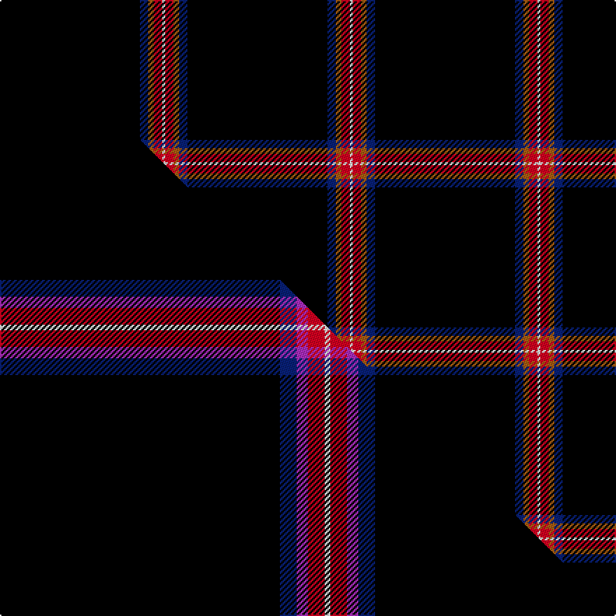

This is one **variant** — a specific cloth: this exact thread count and colourway, with its own
provenance below. It is one weaving of the [sett](/setts/k50db3o2r3w1/) (the scale-free proportion — the
same cloth at any scale or shade), whose colour order is pattern [KBRRW](/stripes/kbrrw/).

Part of the [Fettes](/tartans/fettes/) tartan — the named design grouping this sett with its other cloths.

Sourced from house-of-tartan.  It is a [5 stripe tartan](/stripes/stripes5/).

Original link [http://www.house-of-tartan.scotland.net/house/TartanViewjs.asp?colr=Def&tnam=7565](http://www.house-of-tartan.scotland.net/house/TartanViewjs.asp?colr=Def&tnam=7565)

## Provenance

Earliest known date: 2008 Designed online for four kilts by Fiona Fettes.

Dataset <small>— provenance for this record, inherited from the source manifest</small>

<dl class="dataset-prov">
<dt>source</dt><dd><a href="/sources/house-of-tartan/">House of Tartan</a></dd>
<dt>data captured from</dt><dd><a href="https://github.com/thetartan/tartan-database/blob/master/data/house-of-tartan/data.csv">https://github.com/thetartan/tartan-database/blob/master/data/house-of-tartan/data.csv</a></dd>
<dt>data date</dt><dd>2008 <small>(this record)</small></dd>
<dt>licence</dt><dd><a href="https://creativecommons.org/licenses/by-nc-nd/4.0/">CC BY-NC-ND 4.0</a></dd>
</dl>

Capture chain <small>— the hands this data passed through, oldest first; each capture carries its own licence</small>

<ol class="capture-chain">
<li><a href="http://www.house-of-tartan.scotland.net/">House of Tartan</a> <small>the weaver/retailer's database — the site is now offline; the URL is kept as the ultimate source's identity</small></li>
<li><a href="https://github.com/thetartan/tartan-database">thetartan/tartan-database</a> <small>2016-2017</small> · <a href="https://creativecommons.org/licenses/by-nc-nd/4.0/">CC BY-NC-ND 4.0</a> <small>Levko Kravets's frozen compilation — the capture we vendored, and where its CC licence text came from</small></li>
<li>this dictionary <small>captured 2026-06-10 · commit 5bf86c7566</small> <small>each re-capture is a git commit to data/sources</small></li>
</ol>

## Thread count
K/100 DB6 O4 R6 W/2

One full sett is **134 threads**.

## Palette
<table><thead><tr><th>Colour</th><th>Shade</th><th>OKLCh</th></tr></thead><tbody><tr><td>DB</td><td><code style="background-color:#082077;">#082077</code> <small style="color:#888">#082077</small></td><td><small style="color:#888">oklch(30.0% 0.149 265.1)</small></td></tr><tr><td>K</td><td><code style="background-color:#000000;">#000000</code> <small style="color:#888">#000000</small></td><td><small style="color:#888">oklch(0.0% 0.000 0.0)</small></td></tr><tr><td>W</td><td><code style="background-color:#F7F7F7;">#F7F7F7</code> <small style="color:#888">#F7F7F7</small></td><td><small style="color:#888">oklch(97.6% 0.000 89.9)</small></td></tr><tr><td>O</td><td><code style="background-color:#A65C11;">#A65C11</code> <small style="color:#888">#A65C11</small></td><td><small style="color:#888">oklch(55.0% 0.125 58.3)</small></td></tr><tr><td>B</td><td><code style="background-color:#466CC8;">#466CC8</code> <small style="color:#888">#466CC8</small></td><td><small style="color:#888">oklch(55.1% 0.149 265.0)</small></td></tr><tr><td>R</td><td><code style="background-color:#D60020;">#D60020</code> <small style="color:#888">#D60020</small></td><td><small style="color:#888">oklch(55.2% 0.224 25.5)</small></td></tr></tbody></table>

# Sample pattern

## Compared to the master

This cloth is one sett of its design; the master sett (the exemplar the design is anchored on) is below for comparison.

Its **ΔTartan distance** from the master is **0.30** — the same measure the nearest-tartans table ranks by (0 is identical; a re-scale of the same cloth is near 0, a recolour or a different proportion further).

<figure class="master-compare" style="margin:0">

this sett
master sett ★

<figcaption style="color:#888;font-size:smaller">One weave of this sett against the <a href="/setts/k50db3p2r3w1/">master sett ★</a>, split on the diagonal: a shared proportion runs seamlessly across it with only the shades shifting; a different proportion breaks on it.</figcaption>
</figure>

## Nearest tartan variants

The nearest existing variants by ΔTartan distance, with this cloth at the top so the swatches line up against it.

ΔTartan

Threads

Variant

Sett

—

134

<a href="/variants/s5/k50db3o2r3w1~x2/">Fettes Personal Tartan</a>

<a href="/ttd/edit/#slug=k50db3p2r3w1~x4&amp;base=k50db3o2r3w1~x2" title="compare in the TTD">0.30</a>

268

<a href="/variants/s5/k50db3p2r3w1~x4/">Fettes (Personal)</a>

<a href="/ttd/edit/#slug=k50db3lp2r3w1~x4&amp;base=k50db3o2r3w1~x2" title="compare in the TTD">0.30</a>

268

<a href="/variants/s5/k50db3lp2r3w1~x4/">Fettes (Personal)</a>

<a href="/ttd/edit/#slug=r2k50n2r1~x2&amp;base=k50db3o2r3w1~x2" title="compare in the TTD">0.69</a>

214

<a href="/variants/s4/r2k50n2r1~x2/">Galloway Family</a>

<a href="/ttd/edit/#slug=k45db2r4y1w1~x2&amp;base=k50db3o2r3w1~x2" title="compare in the TTD">0.75</a>

120

<a href="/variants/s5/k45db2r4y1w1~x2/">McHattie (Personal)</a>

<a href="/ttd/edit/#slug=k45t2r4y1w1~x2&amp;base=k50db3o2r3w1~x2" title="compare in the TTD">0.76</a>

120

<a href="/variants/s5/k45t2r4y1w1~x2/">McHattie (Personal)</a>

<a href="/ttd/edit/#slug=k45db2dr2r2y1w1~x2&amp;base=k50db3o2r3w1~x2" title="compare in the TTD">1.05</a>

120

<a href="/variants/s6/k45db2dr2r2y1w1~x2/">MacHattie Family Tartan</a>

<a href="/ttd/edit/#slug=k49dr1o4db5g5ly5~x2&amp;base=k50db3o2r3w1~x2" title="compare in the TTD">1.06</a>

168

<a href="/variants/s6/k49dr1o4db5g5ly5~x2/">CREATeGlasgow</a>

<a href="/ttd/edit/#slug=k20w2db1~x6&amp;base=k50db3o2r3w1~x2" title="compare in the TTD">1.14</a>

150

<a href="/variants/s3/k20w2db1~x6/">Fily (Verneuil L'tang) (Personal)</a>

<a href="/ttd/edit/#slug=r3db12k50y3~x2&amp;base=k50db3o2r3w1~x2" title="compare in the TTD">1.35</a>

260

<a href="/variants/s4/r3db12k50y3~x2/">Rogues (United States), The</a>

<a href="/ttd/edit/#slug=k100r1n10db10y2~x2&amp;base=k50db3o2r3w1~x2" title="compare in the TTD">1.41</a>

288

<a href="/variants/s5/k100r1n10db10y2~x2/">Forand (Personal)</a>

## Neighbour map

Every grey dot is one of 13621 variants placed by the first two principal components of the ΔTartan feature space (42% of its variance). Red is this tartan; blue dots are its nearest — click one to open its page.

<svg viewBox="0 0 640 380" role="img" style="max-width:100%;height:auto;border:1px solid #e0e0e0;border-radius:4px;display:block" xmlns="http://www.w3.org/2000/svg"><image href="/nn/cloud.v1.png" width="640" height="380"/><a href="/variants/s5/k50db3p2r3w1~x4/"><circle cx="552.4" cy="73.9" r="4" fill="#3465a4"><title>Fettes (Personal)</title></circle></a><a href="/variants/s5/k50db3lp2r3w1~x4/"><circle cx="543.8" cy="72.2" r="4" fill="#3465a4"><title>Fettes (Personal)</title></circle></a><a href="/variants/s4/r2k50n2r1~x2/"><circle cx="626.0" cy="116.9" r="4" fill="#3465a4"><title>Galloway Family</title></circle></a><a href="/variants/s5/k45db2r4y1w1~x2/"><circle cx="546.8" cy="75.8" r="4" fill="#3465a4"><title>McHattie (Personal)</title></circle></a><a href="/variants/s5/k45t2r4y1w1~x2/"><circle cx="539.4" cy="74.1" r="4" fill="#3465a4"><title>McHattie (Personal)</title></circle></a><a href="/variants/s6/k45db2dr2r2y1w1~x2/"><circle cx="447.1" cy="19.3" r="4" fill="#3465a4"><title>MacHattie Family Tartan</title></circle></a><a href="/variants/s6/k49dr1o4db5g5ly5~x2/"><circle cx="388.0" cy="59.3" r="4" fill="#3465a4"><title>CREATeGlasgow</title></circle></a><a href="/variants/s3/k20w2db1~x6/"><circle cx="544.7" cy="173.9" r="4" fill="#3465a4"><title>Fily (Verneuil L'tang) (Personal)</title></circle></a><a href="/variants/s4/r3db12k50y3~x2/"><circle cx="444.1" cy="166.4" r="4" fill="#3465a4"><title>Rogues (United States), The</title></circle></a><a href="/variants/s5/k100r1n10db10y2~x2/"><circle cx="539.8" cy="83.1" r="4" fill="#3465a4"><title>Forand (Personal)</title></circle></a><circle cx="552.3" cy="73.8" r="5" fill="#c00000"/><text x="320" y="376" text-anchor="middle" font-size="11" fill="#999">ground</text><text x="11" y="190" text-anchor="middle" font-size="11" fill="#999" transform="rotate(-90 11 190)">complexity</text></svg>

ID: /variants/s5/k50db3o2r3w1~x2/
