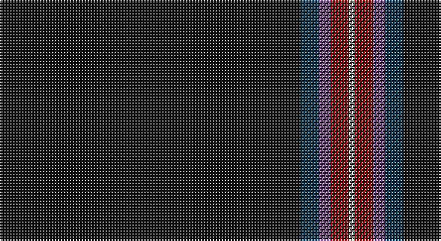

This page is one **sett** — a single exact thread-count. It belongs to the [tartan](/setts/k50db3p2r3w1/)
(the same proportion at any scale), whose colour order is pattern [KBBRW](/stripes/kbbrw/).

Sourced from tartans-authority.  It is a [5 stripe tartan](/stripes/stripes5/).

Original link http://www.tartansauthority.com/tartan-ferret/display/7565/

## Also known as

This cloth is also recorded under:

- Fettes Personal

2 attestations — the source records this cloth was collapsed from (oldest owns this page)

<ul>
<li>2008 — Fettes (Personal) (tartans-authority, <a href="http://www.tartansauthority.com/tartan-ferret/display/7565/">record</a>)</li>
<li>undated — Fettes (Personal) (register-of-tartans, <a href="https://www.tartanregister.gov.uk/tartanDetails.aspx?ref=5591">record</a>)</li>
</ul>

## Register references

External register numbers recorded for this tartan.

- Scottish Register of Tartans: [5591](https://www.tartanregister.gov.uk/tartanDetails.aspx?ref=5591)
- Scottish Tartans Authority (ITI): 7565

## Thread count
K/200 DB12 LP8 R12 LN/4

One full sett is **268 threads**.

## Palette

Palette: <strong>Tartan Register</strong> <small style="color:#888">(3 of 5 colours)</small>
<table><thead><tr><th>Colour</th><th>Threads</th><th>Shade</th><th>Base</th><th>OKLCh</th></tr></thead><tbody><tr><td>K/</td><td style="text-align:right;font-variant-numeric:tabular-nums">200</td><td><code style="background-color:#101010;">#101010</code> <small style="color:#888">#101010</small></td><td>K <code style="background-color:#000000;">#000000</code></td><td><small style="color:#888">oklch(17.3% 0.000 89.9)</small></td></tr><tr><td>DB</td><td style="text-align:right;font-variant-numeric:tabular-nums">12</td><td><code style="background-color:#004878;">#004878</code> <small style="color:#888">#004878</small></td><td>B <code style="background-color:#2A418A;">#2A418A</code></td><td><small style="color:#888">oklch(39.0% 0.102 246.7)</small></td></tr><tr><td>LP</td><td style="text-align:right;font-variant-numeric:tabular-nums">8</td><td><code style="background-color:#A060BC;">#A060BC</code> <small style="color:#888">#A060BC</small></td><td>B <code style="background-color:#2A418A;">#2A418A</code></td><td><small style="color:#888">oklch(59.7% 0.150 314.8)</small></td></tr><tr><td>R</td><td style="text-align:right;font-variant-numeric:tabular-nums">12</td><td><code style="background-color:#C80000;">#C80000</code> <small style="color:#888">#C80000</small></td><td>R <code style="background-color:#CC0000;">#CC0000</code></td><td><small style="color:#888">oklch(52.3% 0.215 29.2)</small></td></tr><tr><td>LN/</td><td style="text-align:right;font-variant-numeric:tabular-nums">4</td><td><code style="background-color:#E0E0E0;">#E0E0E0</code> <small style="color:#888">#E0E0E0</small></td><td>W <code style="background-color:#F7F7F7;">#F7F7F7</code></td><td><small style="color:#888">oklch(90.7% 0.000 89.9)</small></td></tr></tbody></table>

# Sample pattern

## Nearest tartans

The nearest existing variants by ΔTartan distance, with this tartan at the top so the swatches line up against it.

ΔTartan

Tartan

Sett

—

<a href="/ttd/edit/#slug=k50db3p2r3w1~x4">Fettes (Personal)</a> <a class="nn-out" href="/variants/s5/k50db3p2r3w1~x4/" title="open its dictionary page">↗</a>

0.27

<a href="/ttd/edit/#slug=k50dt3lp2r3w1~x2&amp;base=k50db3p2r3w1~x4">Fettes Personal Tartan</a> <a class="nn-out" href="/variants/s5/k50dt3lp2r3w1~x2/" title="open its dictionary page">↗</a>

0.44

<a href="/ttd/edit/#slug=k45db2r4ly1w1~x2&amp;base=k50db3p2r3w1~x4">McHattie (Personal)</a> <a class="nn-out" href="/variants/s5/k45db2r4ly1w1~x2/" title="open its dictionary page">↗</a>

0.63

<a href="/ttd/edit/#slug=k100r1o10db10ly2~x2&amp;base=k50db3p2r3w1~x4">Forand (Personal)</a> <a class="nn-out" href="/variants/s5/k100r1o10db10ly2~x2/" title="open its dictionary page">↗</a>

0.66

<a href="/ttd/edit/#slug=k45b2r4ly1w1~x2&amp;base=k50db3p2r3w1~x4">McHattie (Personal)</a> <a class="nn-out" href="/variants/s5/k45b2r4ly1w1~x2/" title="open its dictionary page">↗</a>

1.42

<a href="/ttd/edit/#slug=k83g4r4g10k1w3~x2&amp;base=k50db3p2r3w1~x4">Perratt (Personal)</a> <a class="nn-out" href="/variants/s6/k83g4r4g10k1w3~x2/" title="open its dictionary page">↗</a>

1.46

<a href="/variants/s8/k108ki4lr4w2lr4ki1db2w2~x2/">Modern Craft (Masonic)</a>

1.58

<a href="/ttd/edit/#slug=k80r6dg3r12k2w2~x2&amp;base=k50db3p2r3w1~x4">Dellen</a> <a class="nn-out" href="/variants/s6/k80r6dg3r12k2w2~x2/" title="open its dictionary page">↗</a>

1.59

<a href="/ttd/edit/#slug=k83ly2db4r2k8g5r4w3~x2&amp;base=k50db3p2r3w1~x4">Spirit of Lanarkshire (Corporate)</a> <a class="nn-out" href="/variants/s8/k83ly2db4r2k8g5r4w3~x2/" title="open its dictionary page">↗</a>

1.63

<a href="/ttd/edit/#slug=r3db2ly1db50w1db2t3~x2&amp;base=k50db3p2r3w1~x4">Easton (2014)</a> <a class="nn-out" href="/variants/s7/r3db2ly1db50w1db2t3~x2/" title="open its dictionary page">↗</a>

1.67

<a href="/ttd/edit/#slug=ly2k4ly1k4r5k50y1k2r1~x2&amp;base=k50db3p2r3w1~x4">Magdalene</a> <a class="nn-out" href="/variants/s9/ly2k4ly1k4r5k50y1k2r1~x2/" title="open its dictionary page">↗</a>

## Neighbour map

Every grey dot is one of 14360 variants placed by the first two principal components of the ΔTartan feature space (44% of its variance). Red is this tartan; blue dots are its nearest — click one to open its page.

<svg viewBox="0 0 640 380" role="img" style="max-width:100%;height:auto;border:1px solid #e0e0e0;border-radius:4px;display:block" xmlns="http://www.w3.org/2000/svg"><image href="/nn/cloud.v1.png" width="640" height="380"/><a href="/variants/s5/k50dt3lp2r3w1~x2/"><circle cx="622.9" cy="131.7" r="4" fill="#3465a4"><title>Fettes Personal Tartan</title></circle></a><a href="/variants/s5/k45db2r4ly1w1~x2/"><circle cx="619.8" cy="133.4" r="4" fill="#3465a4"><title>McHattie (Personal)</title></circle></a><a href="/variants/s5/k100r1o10db10ly2~x2/"><circle cx="597.7" cy="139.3" r="4" fill="#3465a4"><title>Forand (Personal)</title></circle></a><a href="/variants/s5/k45b2r4ly1w1~x2/"><circle cx="611.4" cy="129.2" r="4" fill="#3465a4"><title>McHattie (Personal)</title></circle></a><a href="/variants/s6/k83g4r4g10k1w3~x2/"><circle cx="588.2" cy="131.7" r="4" fill="#3465a4"><title>Perratt (Personal)</title></circle></a><a href="/variants/s8/k108ki4lr4w2lr4ki1db2w2~x2/"><circle cx="620.4" cy="87.7" r="4" fill="#3465a4"><title>Modern Craft (Masonic)</title></circle></a><a href="/variants/s6/k80r6dg3r12k2w2~x2/"><circle cx="581.8" cy="141.7" r="4" fill="#3465a4"><title>Dellen</title></circle></a><a href="/variants/s8/k83ly2db4r2k8g5r4w3~x2/"><circle cx="563.4" cy="87.1" r="4" fill="#3465a4"><title>Spirit of Lanarkshire (Corporate)</title></circle></a><a href="/variants/s7/r3db2ly1db50w1db2t3~x2/"><circle cx="626.0" cy="108.6" r="4" fill="#3465a4"><title>Easton (2014)</title></circle></a><a href="/variants/s9/ly2k4ly1k4r5k50y1k2r1~x2/"><circle cx="626.0" cy="106.5" r="4" fill="#3465a4"><title>Magdalene</title></circle></a><circle cx="626.0" cy="135.3" r="5" fill="#c00000"/></svg>

ID: /variants/s5/k50db3p2r3w1~x4/
