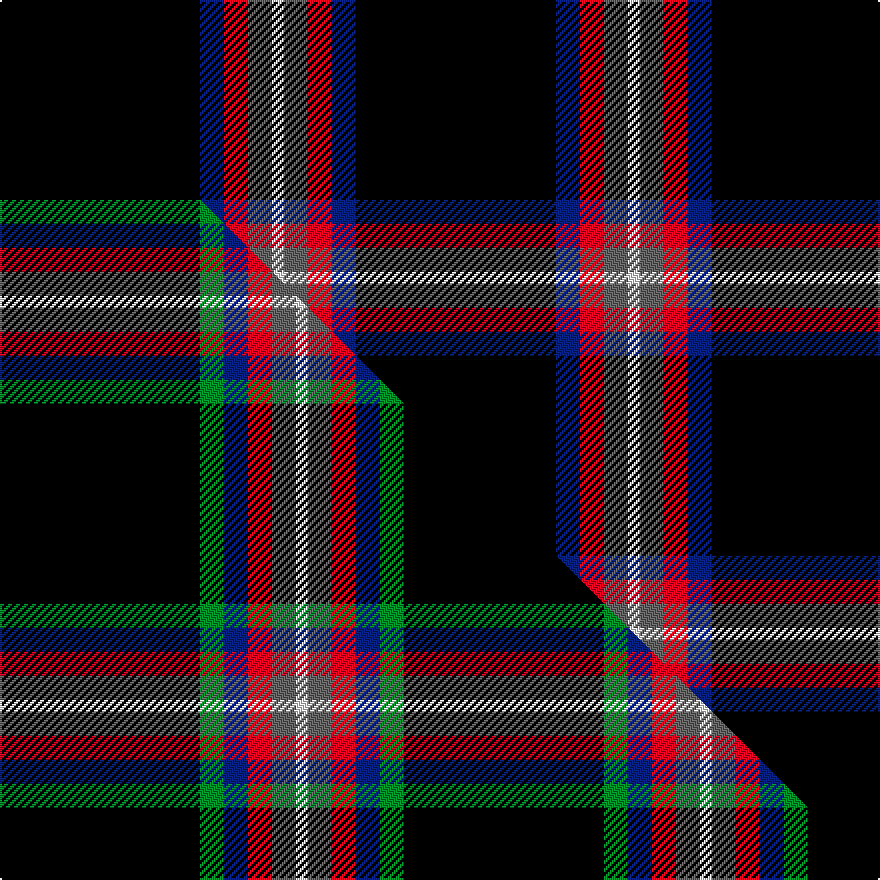

This is one **variant** — a specific cloth: this exact thread count and colourway, with its own
provenance below. It is one weaving of the [sett](/setts/k50db6r6n6w3/) (the scale-free proportion — the
same cloth at any scale or shade), whose colour order is pattern [KBRBW](/stripes/kbrbw/).

Part of the [Friends of Nordegg](/tartans/f/fr/friends-of-nordegg/) tartan — the named design grouping this sett with its other cloths.

Sourced from tartans-authority.  It is a [5 stripe tartan](/stripes/stripes5/).

Original link [https://www.tartanregister.gov.uk/tartanDetails.aspx?ref=10288](https://www.tartanregister.gov.uk/tartanDetails.aspx?ref=10288)

Dataset <small>— provenance for this record, inherited from the source manifest</small>

<dl class="dataset-prov">
<dt>source</dt><dd><a href="/sources/tartans-authority/">Scottish Tartans Authority</a></dd>
<dt>data captured from</dt><dd><a href="https://github.com/thetartan/tartan-database/blob/master/data/tartans-authority/data.csv">https://github.com/thetartan/tartan-database/blob/master/data/tartans-authority/data.csv</a></dd>
<dt>data date</dt><dd>12th June 2010 <small>(this record)</small></dd>
<dt>licence</dt><dd><a href="https://creativecommons.org/licenses/by-nc-nd/4.0/">CC BY-NC-ND 4.0</a></dd>
</dl>

Capture chain <small>— the hands this data passed through, oldest first; each capture carries its own licence</small>

<ol class="capture-chain">
<li><a href="https://www.tartansauthority.com/">Scottish Tartans Authority</a> <small>the heritage body's archive — its tartan-ferret record browser is retired (links repaired to the SRT, above)</small></li>
<li><a href="https://github.com/thetartan/tartan-database">thetartan/tartan-database</a> <small>2016-2017</small> · <a href="https://creativecommons.org/licenses/by-nc-nd/4.0/">CC BY-NC-ND 4.0</a> <small>Levko Kravets's frozen compilation — the capture we vendored, and where its CC licence text came from</small></li>
<li>this dictionary <small>captured 2026-06-10 · commit 5bf86c7566</small> <small>each re-capture is a git commit to data/sources</small></li>
</ol>

## Register references

External register numbers recorded for this tartan.

- Scottish Register of Tartans: [10288](https://www.tartanregister.gov.uk/tartanDetails?ref=10288)
- Scottish Tartans Authority (ITI): 10288

## Thread count
K/100 DB12 R12 N12 W/6

One full sett is **178 threads**.

## Palette
<table><thead><tr><th>Colour</th><th>Shade</th><th>OKLCh</th></tr></thead><tbody><tr><td>DB</td><td><code style="background-color:#082077;">#082077</code> <small style="color:#888">#082077</small></td><td><small style="color:#888">oklch(30.0% 0.149 265.1)</small></td></tr><tr><td>K</td><td><code style="background-color:#000000;">#000000</code> <small style="color:#888">#000000</small></td><td><small style="color:#888">oklch(0.0% 0.000 0.0)</small></td></tr><tr><td>W</td><td><code style="background-color:#F7F7F7;">#F7F7F7</code> <small style="color:#888">#F7F7F7</small></td><td><small style="color:#888">oklch(97.6% 0.000 89.9)</small></td></tr><tr><td>N</td><td><code style="background-color:#636363;">#636363</code> <small style="color:#888">#636363</small></td><td><small style="color:#888">oklch(50.0% 0.000 89.9)</small></td></tr><tr><td>R</td><td><code style="background-color:#D60020;">#D60020</code> <small style="color:#888">#D60020</small></td><td><small style="color:#888">oklch(55.2% 0.224 25.5)</small></td></tr></tbody></table>

# Sample pattern

## Compared to the master

This cloth is one sett of its design; the master sett (the exemplar the design is anchored on) is below for comparison.

Its **ΔTartan distance** from the master is **0.30** — the same measure the nearest-tartans table ranks by (0 is identical; a re-scale of the same cloth is near 0, a recolour or a different proportion further).

<figure class="master-compare" style="margin:0">

this sett
master sett ★

<figcaption style="color:#888;font-size:smaller">One weave of this sett against the <a href="/setts/k50g6db6r6n6w3/">master sett ★</a>, split on the diagonal: a shared proportion runs seamlessly across it with only the shades shifting; a different proportion breaks on it.</figcaption>
</figure>

## Nearest tartan variants

The nearest existing variants by ΔTartan distance, with this cloth at the top so the swatches line up against it.

ΔTartan

Threads

Variant

Sett

—

178

<a href="/variants/s5/k50db6r6n6w3~x2/">Friends of Nordegg (Corporate)</a>

<a href="/ttd/edit/#slug=k50g6db6r6n6w3~x2&amp;base=k50db6r6n6w3~x2" title="compare in the TTD">0.30</a>

202

<a href="/variants/s6/k50g6db6r6n6w3~x2/">Friends of Nordegg</a>

<a href="/ttd/edit/#slug=r3db12k50y3~x2&amp;base=k50db6r6n6w3~x2" title="compare in the TTD">0.96</a>

260

<a href="/variants/s4/r3db12k50y3~x2/">Rogues (United States), The</a>

<a href="/ttd/edit/#slug=r3lb12k50ly3~x2&amp;base=k50db6r6n6w3~x2" title="compare in the TTD">0.97</a>

260

<a href="/variants/s4/r3lb12k50ly3~x2/">Rogues, The (Corporate)</a>

<a href="/ttd/edit/#slug=k62db15w6y4~x2&amp;base=k50db6r6n6w3~x2" title="compare in the TTD">0.99</a>

216

<a href="/variants/s4/k62db15w6y4~x2/">C-Tec N.I. Ltd</a>

<a href="/ttd/edit/#slug=dr1k20lb5dr1~x4&amp;base=k50db6r6n6w3~x2" title="compare in the TTD">1.12</a>

208

<a href="/variants/s4/dr1k20lb5dr1~x4/">Dobelman (Personal)</a>

<a href="/ttd/edit/#slug=r2g2k20w1db1~x6&amp;base=k50db6r6n6w3~x2" title="compare in the TTD">1.14</a>

294

<a href="/variants/s5/r2g2k20w1db1~x6/">Fily, Sylvain Roger</a>

<a href="/ttd/edit/#slug=dr3lo2k10w1~x6&amp;base=k50db6r6n6w3~x2" title="compare in the TTD">1.23</a>

168

<a href="/variants/s4/dr3lo2k10w1~x6/">St. Eloi</a>

<a href="/ttd/edit/#slug=k35lo3w3g3~x4&amp;base=k50db6r6n6w3~x2" title="compare in the TTD">1.27</a>

200

<a href="/variants/s4/k35lo3w3g3~x4/">Dhillon (Personal)</a>

<a href="/ttd/edit/#slug=db1r1k12g1~x4&amp;base=k50db6r6n6w3~x2" title="compare in the TTD">1.27</a>

112

<a href="/variants/s4/db1r1k12g1~x4/">MacNathair Sgianach</a>

<a href="/ttd/edit/#slug=r5dg3y6w3y5k55w5~x2~dg1806142&amp;base=k50db6r6n6w3~x2" title="compare in the TTD">1.38</a>

308

<a href="/variants/s7/r5dg3y6w3y5k55w5~x2~dg1806142/">Avalon</a>

## Neighbour map

Every grey dot is one of 13656 variants placed by the first two principal components of the ΔTartan feature space (42% of its variance). Red is this tartan; blue dots are its nearest — click one to open its page. The map is a flat projection of a many-dimensional space — [how to read it](/posts/neighbourhood-maps/).

<svg viewBox="0 0 640 380" role="img" style="max-width:100%;height:auto;border:1px solid #e0e0e0;border-radius:4px;display:block" xmlns="http://www.w3.org/2000/svg"><image href="/nn/cloud.v1.png" width="640" height="380"/><a href="/variants/s6/k50g6db6r6n6w3~x2/"><circle cx="298.3" cy="104.9" r="4" fill="#3465a4"><title>Friends of Nordegg</title></circle></a><a href="/variants/s4/r3db12k50y3~x2/"><circle cx="443.7" cy="165.6" r="4" fill="#3465a4"><title>Rogues (United States), The</title></circle></a><a href="/variants/s4/r3lb12k50ly3~x2/"><circle cx="399.2" cy="154.9" r="4" fill="#3465a4"><title>Rogues, The (Corporate)</title></circle></a><a href="/variants/s4/k62db15w6y4~x2/"><circle cx="384.6" cy="163.5" r="4" fill="#3465a4"><title>C-Tec N.I. Ltd</title></circle></a><a href="/variants/s4/dr1k20lb5dr1~x4/"><circle cx="431.2" cy="160.4" r="4" fill="#3465a4"><title>Dobelman (Personal)</title></circle></a><a href="/variants/s5/r2g2k20w1db1~x6/"><circle cx="423.0" cy="109.0" r="4" fill="#3465a4"><title>Fily, Sylvain Roger</title></circle></a><a href="/variants/s4/dr3lo2k10w1~x6/"><circle cx="343.2" cy="182.9" r="4" fill="#3465a4"><title>St. Eloi</title></circle></a><a href="/variants/s4/k35lo3w3g3~x4/"><circle cx="433.4" cy="158.1" r="4" fill="#3465a4"><title>Dhillon (Personal)</title></circle></a><a href="/variants/s4/db1r1k12g1~x4/"><circle cx="471.4" cy="163.0" r="4" fill="#3465a4"><title>MacNathair Sgianach</title></circle></a><a href="/variants/s7/r5dg3y6w3y5k55w5~x2~dg1806142/"><circle cx="331.8" cy="94.9" r="4" fill="#3465a4"><title>Avalon</title></circle></a><circle cx="366.0" cy="127.4" r="5" fill="#c00000"/><text x="320" y="376" text-anchor="middle" font-size="11" fill="#999">ground</text><text x="11" y="190" text-anchor="middle" font-size="11" fill="#999" transform="rotate(-90 11 190)">complexity</text></svg>

ID: /variants/s5/k50db6r6n6w3~x2/
