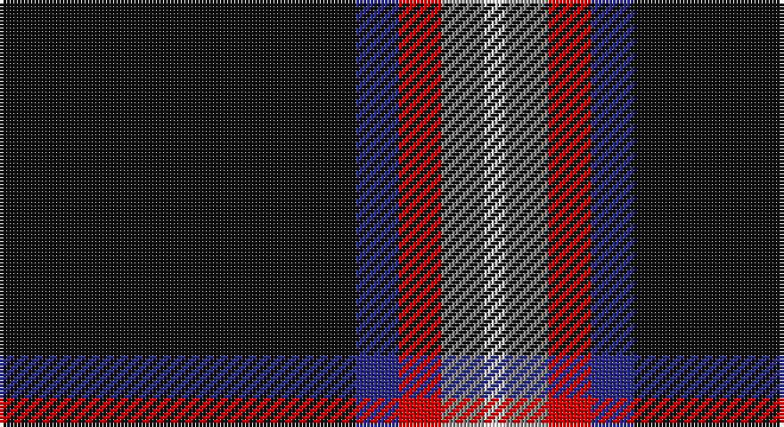

This page is one **sett** — a single exact thread-count. It belongs to the [tartan](/setts/k50db6r6o6w3/)
(the same proportion at any scale), whose colour order is pattern [KBRRW](/stripes/kbrrw/).

Part of the [Friends of Nordegg](/tartans/friends-of-nordegg/) tartan — the named design grouping this sett with its other cloths.

Sourced from tartans-authority.  It is a [5 stripe tartan](/stripes/stripes5/).

Original link http://www.tartansauthority.com/tartan-ferret/display/10288/

## Register references

External register numbers recorded for this tartan.

- Scottish Register of Tartans: [10288](https://www.tartanregister.gov.uk/tartanDetails?ref=10288)
- Scottish Tartans Authority (ITI): 10288

## Thread count
K/100 DB12 R12 N12 LN/6

One full sett is **178 threads**.

## Palette

Palette: <strong>Tartan Register</strong>
<table><thead><tr><th>Colour</th><th>Threads</th><th>Shade</th><th>Base</th><th>OKLCh</th></tr></thead><tbody><tr><td>K/</td><td style="text-align:right;font-variant-numeric:tabular-nums">100</td><td><code style="background-color:#101010;">#101010</code> <small style="color:#888">#101010</small></td><td>K <code style="background-color:#000000;">#000000</code></td><td><small style="color:#888">oklch(17.3% 0.000 89.9)</small></td></tr><tr><td>DB</td><td style="text-align:right;font-variant-numeric:tabular-nums">12</td><td><code style="background-color:#2C2C80;">#2C2C80</code> <small style="color:#888">#2C2C80</small></td><td>B <code style="background-color:#2A418A;">#2A418A</code></td><td><small style="color:#888">oklch(35.0% 0.138 276.6)</small></td></tr><tr><td>R</td><td style="text-align:right;font-variant-numeric:tabular-nums">12</td><td><code style="background-color:#C80000;">#C80000</code> <small style="color:#888">#C80000</small></td><td>R <code style="background-color:#CC0000;">#CC0000</code></td><td><small style="color:#888">oklch(52.3% 0.215 29.2)</small></td></tr><tr><td>N</td><td style="text-align:right;font-variant-numeric:tabular-nums">12</td><td><code style="background-color:#888888;">#888888</code> <small style="color:#888">#888888</small></td><td>R <code style="background-color:#CC0000;">#CC0000</code></td><td><small style="color:#888">oklch(62.7% 0.000 89.9)</small></td></tr><tr><td>LN/</td><td style="text-align:right;font-variant-numeric:tabular-nums">6</td><td><code style="background-color:#E0E0E0;">#E0E0E0</code> <small style="color:#888">#E0E0E0</small></td><td>W <code style="background-color:#F7F7F7;">#F7F7F7</code></td><td><small style="color:#888">oklch(90.7% 0.000 89.9)</small></td></tr></tbody></table>

# Sample pattern

## Compared to the master

This cloth is one sett of its design; the master sett (the exemplar the design is anchored on) is below for comparison.

<figure style="margin:0"><figcaption style="color:#888;font-size:smaller">this sett</figcaption></figure>
<figure style="margin:0"><figcaption style="color:#888;font-size:smaller"><a href="/setts/k50g6db6r6n6w3/">master sett →</a></figcaption></figure>

## Nearest tartans

The nearest existing variants by ΔTartan distance, with this tartan at the top so the swatches line up against it.

ΔTartan

Tartan

Sett

—

<a href="/ttd/edit/#slug=k50db6r6o6w3~x2">Friends of Nordegg (Corporate)</a> <a class="nn-out" href="/variants/s5/k50db6r6o6w3~x2/" title="open its dictionary page">↗</a>

1.17

<a href="/ttd/edit/#slug=r2g2k20w1db1~x6&amp;base=k50db6r6o6w3~x2">Fily, Sylvain Roger</a> <a class="nn-out" href="/variants/s5/r2g2k20w1db1~x6/" title="open its dictionary page">↗</a>

1.19

<a href="/ttd/edit/#slug=r3n12k50ly3~x2&amp;base=k50db6r6o6w3~x2">Rogues (United States), The</a> <a class="nn-out" href="/variants/s4/r3n12k50ly3~x2/" title="open its dictionary page">↗</a>

1.24

<a href="/ttd/edit/#slug=r3t12k50ly3~x2&amp;base=k50db6r6o6w3~x2">Rogues, The (Corporate)</a> <a class="nn-out" href="/variants/s4/r3t12k50ly3~x2/" title="open its dictionary page">↗</a>

1.26

<a href="/ttd/edit/#slug=k62db15w6ly4~x2&amp;base=k50db6r6o6w3~x2">C-Tec N.I. Ltd</a> <a class="nn-out" href="/variants/s4/k62db15w6ly4~x2/" title="open its dictionary page">↗</a>

1.33

<a href="/ttd/edit/#slug=r11ri5g5k40ly3~x2&amp;base=k50db6r6o6w3~x2">MacShimsi</a> <a class="nn-out" href="/variants/s5/r11ri5g5k40ly3~x2/" title="open its dictionary page">↗</a>

1.34

<a href="/ttd/edit/#slug=k50g6db6r6n6w3~x2&amp;base=k50db6r6o6w3~x2">Friends of Nordegg</a> <a class="nn-out" href="/variants/s6/k50g6db6r6n6w3~x2/" title="open its dictionary page">↗</a>

1.37

<a href="/ttd/edit/#slug=oi4n6k4o8k49oi2&amp;base=k50db6r6o6w3~x2">Harley Davidson (Corporate)</a> <a class="nn-out" href="/variants/s6/oi4n6k4o8k49oi2/" title="open its dictionary page">↗</a>

1.47

<a href="/ttd/edit/#slug=m11dr5dg5k40ly3~x2&amp;base=k50db6r6o6w3~x2">MacShimsi Personal Tartan</a> <a class="nn-out" href="/variants/s5/m11dr5dg5k40ly3~x2/" title="open its dictionary page">↗</a>

1.47

<a href="/ttd/edit/#slug=k62dt24lo5w3~x2&amp;base=k50db6r6o6w3~x2">Perry (Calgary), Alex (Personal)</a> <a class="nn-out" href="/variants/s4/k62dt24lo5w3~x2/" title="open its dictionary page">↗</a>

1.49

<a href="/ttd/edit/#slug=k44g8k4gi13k4w3~x2&amp;base=k50db6r6o6w3~x2">Childers (Personal)</a> <a class="nn-out" href="/variants/s6/k44g8k4gi13k4w3~x2/" title="open its dictionary page">↗</a>

## Neighbour map

Every grey dot is one of 14360 variants placed by the first two principal components of the ΔTartan feature space (44% of its variance). Red is this tartan; blue dots are its nearest — click one to open its page.

<svg viewBox="0 0 640 380" role="img" style="max-width:100%;height:auto;border:1px solid #e0e0e0;border-radius:4px;display:block" xmlns="http://www.w3.org/2000/svg"><image href="/nn/cloud.v1.png" width="640" height="380"/><a href="/variants/s5/r2g2k20w1db1~x6/"><circle cx="475.6" cy="150.3" r="4" fill="#3465a4"><title>Fily, Sylvain Roger</title></circle></a><a href="/variants/s4/r3n12k50ly3~x2/"><circle cx="465.1" cy="201.0" r="4" fill="#3465a4"><title>Rogues (United States), The</title></circle></a><a href="/variants/s4/r3t12k50ly3~x2/"><circle cx="455.3" cy="196.8" r="4" fill="#3465a4"><title>Rogues, The (Corporate)</title></circle></a><a href="/variants/s4/k62db15w6ly4~x2/"><circle cx="423.8" cy="200.2" r="4" fill="#3465a4"><title>C-Tec N.I. Ltd</title></circle></a><a href="/variants/s5/r11ri5g5k40ly3~x2/"><circle cx="349.0" cy="180.2" r="4" fill="#3465a4"><title>MacShimsi</title></circle></a><a href="/variants/s6/k50g6db6r6n6w3~x2/"><circle cx="339.5" cy="132.0" r="4" fill="#3465a4"><title>Friends of Nordegg</title></circle></a><a href="/variants/s6/oi4n6k4o8k49oi2/"><circle cx="488.8" cy="164.8" r="4" fill="#3465a4"><title>Harley Davidson (Corporate)</title></circle></a><a href="/variants/s5/m11dr5dg5k40ly3~x2/"><circle cx="365.8" cy="192.1" r="4" fill="#3465a4"><title>MacShimsi Personal Tartan</title></circle></a><a href="/variants/s4/k62dt24lo5w3~x2/"><circle cx="420.9" cy="204.1" r="4" fill="#3465a4"><title>Perry (Calgary), Alex (Personal)</title></circle></a><a href="/variants/s6/k44g8k4gi13k4w3~x2/"><circle cx="412.8" cy="193.5" r="4" fill="#3465a4"><title>Childers (Personal)</title></circle></a><circle cx="418.0" cy="165.3" r="5" fill="#c00000"/></svg>

ID: /variants/s5/k50db6r6o6w3~x2/
