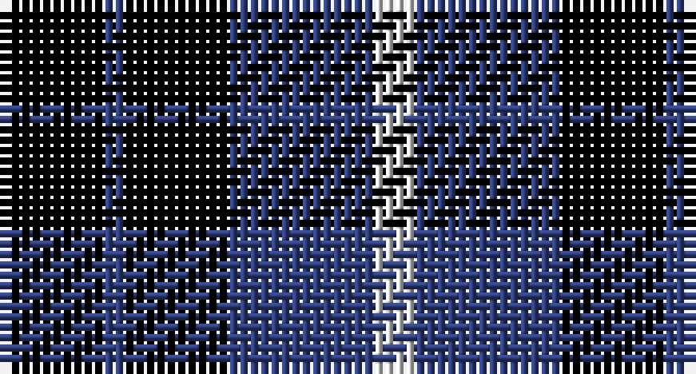

This page is one **sett** — a single exact thread-count. It belongs to the [tartan](/setts/k5db1k5db7w2/)
(the same proportion at any scale), whose colour order is pattern [KBKBW](/stripes/kbkbw/).

Sourced from weddslist.  It is a [5 stripe tartan](/stripes/stripes5/).

Original link http://www.weddslist.com/cgi-bin/tartans/pg.pl?source=sts

## Provenance

Earliest known date: pre 1992 Created by Johnstons of Elgin

## Also known as

This cloth is also recorded under:

- Grampian, T.V.

2 attestations — the source records this cloth was collapsed from (oldest owns this page)

<ul>
<li>undated — Grampian, T.V. (weddslist, <a href="http://www.weddslist.com/cgi-bin/tartans/pg.pl?source=sts">record</a>)</li>
<li>undated — Grampian T.V. Corporate Tartan (house-of-tartan, <a href="http://www.house-of-tartan.scotland.net/house/TartanViewjs.asp?colr=Def&tnam=1058">record</a>)</li>
</ul>

## Thread count
K/10 B2 K10 B14 LN/4

One full sett is **66 threads**.

## Palette

Palette: <strong>Tartan Register</strong> <small style="color:#888">(2 of 3 colours)</small>
<table><thead><tr><th>Colour</th><th>Threads</th><th>Shade</th><th>Base</th><th>OKLCh</th></tr></thead><tbody><tr><td>K/</td><td style="text-align:right;font-variant-numeric:tabular-nums">10</td><td><code style="background-color:#000000;">#000000</code> <small style="color:#888">#000000</small></td><td>K <code style="background-color:#000000;">#000000</code></td><td><small style="color:#888">oklch(0.0% 0.000 0.0)</small></td></tr><tr><td>B</td><td style="text-align:right;font-variant-numeric:tabular-nums">2</td><td><code style="background-color:#304080;">#304080</code> <small style="color:#888">#304080</small></td><td>B <code style="background-color:#2A418A;">#2A418A</code></td><td><small style="color:#888">oklch(39.4% 0.109 270.2)</small></td></tr><tr><td>K</td><td style="text-align:right;font-variant-numeric:tabular-nums">10</td><td><code style="background-color:#000000;">#000000</code> <small style="color:#888">#000000</small></td><td>K <code style="background-color:#000000;">#000000</code></td><td><small style="color:#888">oklch(0.0% 0.000 0.0)</small></td></tr><tr><td>B</td><td style="text-align:right;font-variant-numeric:tabular-nums">14</td><td><code style="background-color:#304080;">#304080</code> <small style="color:#888">#304080</small></td><td>B <code style="background-color:#2A418A;">#2A418A</code></td><td><small style="color:#888">oklch(39.4% 0.109 270.2)</small></td></tr><tr><td>LN/</td><td style="text-align:right;font-variant-numeric:tabular-nums">4</td><td><code style="background-color:#E0E0E0;">#E0E0E0</code> <small style="color:#888">#E0E0E0</small></td><td>W <code style="background-color:#F7F7F7;">#F7F7F7</code></td><td><small style="color:#888">oklch(90.7% 0.000 89.9)</small></td></tr></tbody></table>

# Sample pattern

## Nearest tartans

The nearest existing variants by ΔTartan distance, with this tartan at the top so the swatches line up against it.

ΔTartan

Tartan

Sett

—

<a href="/ttd/edit/#slug=k5db1k5db7w2~x2">Grampian, T.V.</a> <a class="nn-out" href="/variants/s5/k5db1k5db7w2~x2/" title="open its dictionary page">↗</a>

1.10

<a href="/ttd/edit/#slug=k15y2k10db18w3~x2&amp;base=k5db1k5db7w2~x2">College of Radiographers</a> <a class="nn-out" href="/variants/s5/k15y2k10db18w3~x2/" title="open its dictionary page">↗</a>

1.23

<a href="/ttd/edit/#slug=k12n3k12n18w5~x2&amp;base=k5db1k5db7w2~x2">Grampian Television (Corporate)</a> <a class="nn-out" href="/variants/s5/k12n3k12n18w5~x2/" title="open its dictionary page">↗</a>

1.24

<a href="/ttd/edit/#slug=r8k24db10k5db10k5~x2&amp;base=k5db1k5db7w2~x2">Allen, Nicholas (Personal)</a> <a class="nn-out" href="/variants/s6/r8k24db10k5db10k5~x2/" title="open its dictionary page">↗</a>

1.45

<a href="/ttd/edit/#slug=k15ly2k10db18w3~x2&amp;base=k5db1k5db7w2~x2">College of Radiographers Corporate Tartan</a> <a class="nn-out" href="/variants/s5/k15ly2k10db18w3~x2/" title="open its dictionary page">↗</a>

1.46

<a href="/ttd/edit/#slug=k5t4ly1~x2&amp;base=k5db1k5db7w2~x2">Wilson's, No 118</a> <a class="nn-out" href="/variants/s3/k5t4ly1~x2/" title="open its dictionary page">↗</a>

1.58

<a href="/ttd/edit/#slug=k3g9t2k11p9k3~x2&amp;base=k5db1k5db7w2~x2">Scott, Sir Walter</a> <a class="nn-out" href="/variants/s6/k3g9t2k11p9k3~x2/" title="open its dictionary page">↗</a>

1.62

<a href="/ttd/edit/#slug=k15lo2k10db18lb3~x2&amp;base=k5db1k5db7w2~x2">College of Radiographers</a> <a class="nn-out" href="/variants/s5/k15lo2k10db18lb3~x2/" title="open its dictionary page">↗</a>

1.63

<a href="/ttd/edit/#slug=db2w2dr8db8w1~x2&amp;base=k5db1k5db7w2~x2">Laval (Tartan de..)</a> <a class="nn-out" href="/variants/s5/db2w2dr8db8w1~x2/" title="open its dictionary page">↗</a>

1.67

<a href="/ttd/edit/#slug=k1db5k4g3k1g3k6g1~x4&amp;base=k5db1k5db7w2~x2">Keith McCormick (Personal)</a> <a class="nn-out" href="/variants/s8/k1db5k4g3k1g3k6g1~x4/" title="open its dictionary page">↗</a>

1.68

<a href="/ttd/edit/#slug=n6db3n6db20k20db8w4~x2&amp;base=k5db1k5db7w2~x2">Allianz Deutschland 2012</a> <a class="nn-out" href="/variants/s7/n6db3n6db20k20db8w4~x2/" title="open its dictionary page">↗</a>

## Neighbour map

Every grey dot is one of 14360 variants placed by the first two principal components of the ΔTartan feature space (44% of its variance). Red is this tartan; blue dots are its nearest — click one to open its page.

<svg viewBox="0 0 640 380" role="img" style="max-width:100%;height:auto;border:1px solid #e0e0e0;border-radius:4px;display:block" xmlns="http://www.w3.org/2000/svg"><image href="/nn/cloud.v1.png" width="640" height="380"/><a href="/variants/s5/k15y2k10db18w3~x2/"><circle cx="250.4" cy="241.6" r="4" fill="#3465a4"><title>College of Radiographers</title></circle></a><a href="/variants/s5/k12n3k12n18w5~x2/"><circle cx="229.7" cy="282.0" r="4" fill="#3465a4"><title>Grampian Television (Corporate)</title></circle></a><a href="/variants/s6/r8k24db10k5db10k5~x2/"><circle cx="252.4" cy="278.1" r="4" fill="#3465a4"><title>Allen, Nicholas (Personal)</title></circle></a><a href="/variants/s5/k15ly2k10db18w3~x2/"><circle cx="267.1" cy="245.9" r="4" fill="#3465a4"><title>College of Radiographers Corporate Tartan</title></circle></a><a href="/variants/s3/k5t4ly1~x2/"><circle cx="218.2" cy="305.6" r="4" fill="#3465a4"><title>Wilson's, No 118</title></circle></a><a href="/variants/s6/k3g9t2k11p9k3~x2/"><circle cx="168.2" cy="252.6" r="4" fill="#3465a4"><title>Scott, Sir Walter</title></circle></a><a href="/variants/s5/k15lo2k10db18lb3~x2/"><circle cx="273.6" cy="254.0" r="4" fill="#3465a4"><title>College of Radiographers</title></circle></a><a href="/variants/s5/db2w2dr8db8w1~x2/"><circle cx="254.2" cy="244.1" r="4" fill="#3465a4"><title>Laval (Tartan de..)</title></circle></a><a href="/variants/s8/k1db5k4g3k1g3k6g1~x4/"><circle cx="226.2" cy="265.3" r="4" fill="#3465a4"><title>Keith McCormick (Personal)</title></circle></a><a href="/variants/s7/n6db3n6db20k20db8w4~x2/"><circle cx="199.7" cy="237.6" r="4" fill="#3465a4"><title>Allianz Deutschland 2012</title></circle></a><circle cx="235.6" cy="275.3" r="5" fill="#c00000"/></svg>

ID: /variants/s5/k5db1k5db7w2~x2/
