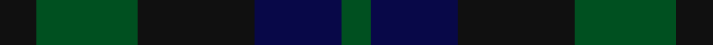
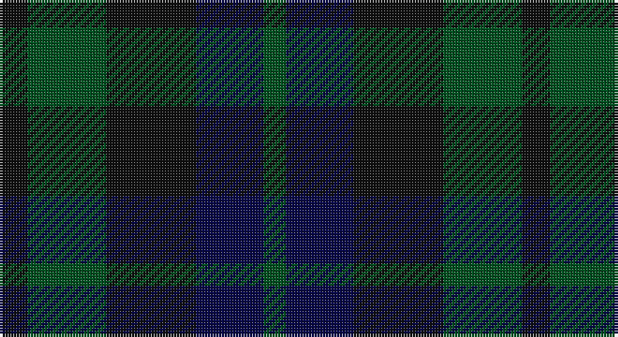

This page is one **sett** — a single exact thread-count. It belongs to the [tartan](/setts/k5dg14k16db12dg4/)
(the same proportion at any scale), whose colour order is pattern [GBKGK](/stripes/gbkgk/).

Part of the [Unidentified](/tartans/unidentified/) tartan — the named design grouping this sett with its other cloths.

Sourced from register-of-tartans.  It is a [5 stripe tartan](/stripes/stripes5/).

Original link https://www.tartanregister.gov.uk/tartanDetails.aspx?ref=4230

## Also known as

This cloth is also recorded under:

- Unidentified #10
- Unidentified #12
- Unidentified #14
- Unidentified #15
- Unidentified #16
- Unidentified #18
- Unidentified #2
- Unidentified #21
- Unidentified #22
- Unidentified #24
- Unidentified #25
- Unidentified #28
- Unidentified #29
- Unidentified #30
- Unidentified #31
- Unidentified #32
- Unidentified #36
- Unidentified #37
- Unidentified #38
- Unidentified #40
- Unidentified #43
- Unidentified #44
- Unidentified #45
- Unidentified #46
- Unidentified #47
- Unidentified #48
- Unidentified #49
- Unidentified #5
- Unidentified #50
- Unidentified #51
- Unidentified #52
- Unidentified #53
- Unidentified #54
- Unidentified #55
- Unidentified #56
- Unidentified #57
- Unidentified #58
- Unidentified #59
- Unidentified #60
- Unidentified #61
- Unidentified #62
- Unidentified #63
- Unidentified #64
- Unidentified #65
- Unidentified #66
- Unidentified #7
- Unidentified #8
- Unidentified #9
- Unidentified 16
- Unidentified Artifact
- Unidentified Plaid
- Unidentified Plaid #11
- Unidentified Plaid #13
- Unidentified Plaid #2
- Unidentified Plaid #3
- Unidentified Plaid #7
- Unidentified Plaid #8
- Unidentified Plaid #9
- Unidentified Portrait

## Register references

External register numbers recorded for this tartan.

- Scottish Register of Tartans: [4230](https://www.tartanregister.gov.uk/tartanDetails.aspx?ref=4230)
- Scottish Tartans World Register: 726

## Thread count
K/10 G28 K32 DB24 G/8

One full sett is **186 threads**.

## Palette

Palette: <strong>Tartan Register</strong> <small style="color:#888">(2 of 3 colours)</small>
<table><thead><tr><th>Colour</th><th>Threads</th><th>Shade</th><th>Base</th><th>OKLCh</th></tr></thead><tbody><tr><td>K/</td><td style="text-align:right;font-variant-numeric:tabular-nums">10</td><td><code style="background-color:#101010;">#101010</code> <small style="color:#888">#101010</small></td><td>K <code style="background-color:#000000;">#000000</code></td><td><small style="color:#888">oklch(17.3% 0.000 89.9)</small></td></tr><tr><td>G</td><td style="text-align:right;font-variant-numeric:tabular-nums">28</td><td><code style="background-color:#005020;">#005020</code> <small style="color:#888">#005020</small></td><td>G <code style="background-color:#006100;">#006100</code></td><td><small style="color:#888">oklch(37.7% 0.105 149.6)</small></td></tr><tr><td>K</td><td style="text-align:right;font-variant-numeric:tabular-nums">32</td><td><code style="background-color:#101010;">#101010</code> <small style="color:#888">#101010</small></td><td>K <code style="background-color:#000000;">#000000</code></td><td><small style="color:#888">oklch(17.3% 0.000 89.9)</small></td></tr><tr><td>DB</td><td style="text-align:right;font-variant-numeric:tabular-nums">24</td><td><code style="background-color:#080848;">#080848</code> <small style="color:#888">#080848</small></td><td>B <code style="background-color:#2A418A;">#2A418A</code></td><td><small style="color:#888">oklch(20.2% 0.112 270.4)</small></td></tr><tr><td>G/</td><td style="text-align:right;font-variant-numeric:tabular-nums">8</td><td><code style="background-color:#005020;">#005020</code> <small style="color:#888">#005020</small></td><td>G <code style="background-color:#006100;">#006100</code></td><td><small style="color:#888">oklch(37.7% 0.105 149.6)</small></td></tr></tbody></table>

# Sample pattern

## Compared to the master

This cloth is one sett of its design; the master sett (the exemplar the design is anchored on) is below for comparison.

<figure style="margin:0"><figcaption style="color:#888;font-size:smaller">this sett</figcaption></figure>
<figure style="margin:0"><figcaption style="color:#888;font-size:smaller"><a href="/setts/dp4r3dp26r26dg26r4/">master sett →</a></figcaption></figure>

## Nearest tartans

The nearest existing variants by ΔTartan distance, with this tartan at the top so the swatches line up against it.

ΔTartan

Tartan

Sett

—

<a href="/ttd/edit/#slug=k5dg14k16db12dg4~x2">Unidentified #29</a> <a class="nn-out" href="/variants/s5/k5dg14k16db12dg4~x2/" title="open its dictionary page">↗</a>

1.07

<a href="/ttd/edit/#slug=k3dg4k1dg4k3db4k1~x2&amp;base=k5dg14k16db12dg4~x2">Unidentified No 63</a> <a class="nn-out" href="/variants/s7/k3dg4k1dg4k3db4k1~x2/" title="open its dictionary page">↗</a>

1.13

<a href="/ttd/edit/#slug=k1dg3k3db3k1db1~x4&amp;base=k5dg14k16db12dg4~x2">Sutherland 42nd</a> <a class="nn-out" href="/variants/s6/k1dg3k3db3k1db1~x4/" title="open its dictionary page">↗</a>

1.44

<a href="/ttd/edit/#slug=db2dg6db6dp5db1dp2~x2&amp;base=k5dg14k16db12dg4~x2">Unidentified no. 54</a> <a class="nn-out" href="/variants/s6/db2dg6db6dp5db1dp2~x2/" title="open its dictionary page">↗</a>

1.51

<a href="/ttd/edit/#slug=dg1db3dg3r1~x4&amp;base=k5dg14k16db12dg4~x2">Barwell</a> <a class="nn-out" href="/variants/s4/dg1db3dg3r1~x4/" title="open its dictionary page">↗</a>

1.55

<a href="/ttd/edit/#slug=k3dg20k20g20k3~x2&amp;base=k5dg14k16db12dg4~x2">MacCormick Hunting (Name)</a> <a class="nn-out" href="/variants/s5/k3dg20k20g20k3~x2/" title="open its dictionary page">↗</a>

1.62

<a href="/ttd/edit/#slug=k4dg16k13db16t3db3~x2&amp;base=k5dg14k16db12dg4~x2">I Y</a> <a class="nn-out" href="/variants/s6/k4dg16k13db16t3db3~x2/" title="open its dictionary page">↗</a>

1.65

<a href="/ttd/edit/#slug=g7dy6dt7dy1dt2~x6&amp;base=k5dg14k16db12dg4~x2">Bright of Garth (Personal)</a> <a class="nn-out" href="/variants/s5/g7dy6dt7dy1dt2~x6/" title="open its dictionary page">↗</a>

1.73

<a href="/ttd/edit/#slug=k12dg12k2dg12k12db12t3~x2&amp;base=k5dg14k16db12dg4~x2">MacIntyre</a> <a class="nn-out" href="/variants/s7/k12dg12k2dg12k12db12t3~x2/" title="open its dictionary page">↗</a>

1.74

<a href="/ttd/edit/#slug=k18dg18dy21r4~x2&amp;base=k5dg14k16db12dg4~x2">Tennant</a> <a class="nn-out" href="/variants/s4/k18dg18dy21r4~x2/" title="open its dictionary page">↗</a>

1.79

<a href="/ttd/edit/#slug=k6dg6r1dg6k6db6k1~x2&amp;base=k5dg14k16db12dg4~x2">MacCallum #2</a> <a class="nn-out" href="/variants/s7/k6dg6r1dg6k6db6k1~x2/" title="open its dictionary page">↗</a>

## Neighbour map

Every grey dot is one of 14360 variants placed by the first two principal components of the ΔTartan feature space (44% of its variance). Red is this tartan; blue dots are its nearest — click one to open its page.

<svg viewBox="0 0 640 380" role="img" style="max-width:100%;height:auto;border:1px solid #e0e0e0;border-radius:4px;display:block" xmlns="http://www.w3.org/2000/svg"><image href="/nn/cloud.v1.png" width="640" height="380"/><a href="/variants/s7/k3dg4k1dg4k3db4k1~x2/"><circle cx="235.9" cy="345.5" r="4" fill="#3465a4"><title>Unidentified No 63</title></circle></a><a href="/variants/s6/k1dg3k3db3k1db1~x4/"><circle cx="234.1" cy="350.3" r="4" fill="#3465a4"><title>Sutherland 42nd</title></circle></a><a href="/variants/s6/db2dg6db6dp5db1dp2~x2/"><circle cx="290.3" cy="334.0" r="4" fill="#3465a4"><title>Unidentified no. 54</title></circle></a><a href="/variants/s4/dg1db3dg3r1~x4/"><circle cx="334.5" cy="366.0" r="4" fill="#3465a4"><title>Barwell</title></circle></a><a href="/variants/s5/k3dg20k20g20k3~x2/"><circle cx="276.8" cy="321.4" r="4" fill="#3465a4"><title>MacCormick Hunting (Name)</title></circle></a><a href="/variants/s6/k4dg16k13db16t3db3~x2/"><circle cx="239.2" cy="311.5" r="4" fill="#3465a4"><title>I Y</title></circle></a><a href="/variants/s5/g7dy6dt7dy1dt2~x6/"><circle cx="292.6" cy="333.0" r="4" fill="#3465a4"><title>Bright of Garth (Personal)</title></circle></a><a href="/variants/s7/k12dg12k2dg12k12db12t3~x2/"><circle cx="212.8" cy="303.8" r="4" fill="#3465a4"><title>MacIntyre</title></circle></a><a href="/variants/s4/k18dg18dy21r4~x2/"><circle cx="210.6" cy="345.5" r="4" fill="#3465a4"><title>Tennant</title></circle></a><a href="/variants/s7/k6dg6r1dg6k6db6k1~x2/"><circle cx="221.0" cy="297.6" r="4" fill="#3465a4"><title>MacCallum #2</title></circle></a><circle cx="265.0" cy="365.6" r="5" fill="#c00000"/></svg>

ID: /variants/s5/k5dg14k16db12dg4~x2/
