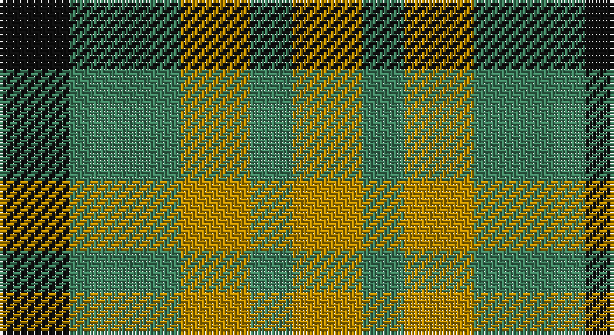

This page is one **sett** — a single exact thread-count. It belongs to the [tartan](/setts/k5g8lo5g3lo5/)
(the same proportion at any scale), whose colour order is pattern [KGYGY](/stripes/kgygy/).

Sourced from tartans-authority.  It is a [5 stripe tartan](/stripes/stripes5/).

Original link http://www.tartansauthority.com/tartan-ferret/display/3513/

2 attestations — the source records this cloth was collapsed from (oldest owns this page)

<ul>
<li>pre 2002 — Angle Dress (Fashion) (tartans-authority, <a href="http://www.tartansauthority.com/tartan-ferret/display/3513/">record</a>)</li>
<li>undated — Angle Dress (register-of-tartans, <a href="https://www.tartanregister.gov.uk/tartanDetails.aspx?ref=5266">record</a>)</li>
</ul>

## Register references

External register numbers recorded for this tartan.

- Scottish Register of Tartans: [5266](https://www.tartanregister.gov.uk/tartanDetails.aspx?ref=5266)
- Scottish Tartans Authority (ITI): 3513

## Thread count
K/20 G32 DY20 G12 DY/20

One full sett is **168 threads**.

## Palette

Palette: <strong>Tartan Register</strong>
<table><thead><tr><th>Colour</th><th>Threads</th><th>Shade</th><th>Base</th><th>OKLCh</th></tr></thead><tbody><tr><td>K/</td><td style="text-align:right;font-variant-numeric:tabular-nums">20</td><td><code style="background-color:#101010;">#101010</code> <small style="color:#888">#101010</small></td><td>K <code style="background-color:#000000;">#000000</code></td><td><small style="color:#888">oklch(17.3% 0.000 89.9)</small></td></tr><tr><td>G</td><td style="text-align:right;font-variant-numeric:tabular-nums">32</td><td><code style="background-color:#408060;">#408060</code> <small style="color:#888">#408060</small></td><td>G <code style="background-color:#006100;">#006100</code></td><td><small style="color:#888">oklch(54.8% 0.084 160.1)</small></td></tr><tr><td>DY</td><td style="text-align:right;font-variant-numeric:tabular-nums">20</td><td><code style="background-color:#BC8C00;">#BC8C00</code> <small style="color:#888">#BC8C00</small></td><td>Y <code style="background-color:#F2BF00;">#F2BF00</code></td><td><small style="color:#888">oklch(66.8% 0.137 84.1)</small></td></tr><tr><td>G</td><td style="text-align:right;font-variant-numeric:tabular-nums">12</td><td><code style="background-color:#408060;">#408060</code> <small style="color:#888">#408060</small></td><td>G <code style="background-color:#006100;">#006100</code></td><td><small style="color:#888">oklch(54.8% 0.084 160.1)</small></td></tr><tr><td>DY/</td><td style="text-align:right;font-variant-numeric:tabular-nums">20</td><td><code style="background-color:#BC8C00;">#BC8C00</code> <small style="color:#888">#BC8C00</small></td><td>Y <code style="background-color:#F2BF00;">#F2BF00</code></td><td><small style="color:#888">oklch(66.8% 0.137 84.1)</small></td></tr></tbody></table>

# Sample pattern

## Nearest tartans

The nearest existing variants by ΔTartan distance, with this tartan at the top so the swatches line up against it.

ΔTartan

Tartan

Sett

—

<a href="/ttd/edit/#slug=k5g8lo5g3lo5~x4">Angle Dress (Fashion)</a> <a class="nn-out" href="/variants/s5/k5g8lo5g3lo5~x4/" title="open its dictionary page">↗</a>

1.51

<a href="/ttd/edit/#slug=r4g7t4~x2&amp;base=k5g8lo5g3lo5~x4">Wilson's, No 61</a> <a class="nn-out" href="/variants/s3/r4g7t4~x2/" title="open its dictionary page">↗</a>

1.54

<a href="/ttd/edit/#slug=r2g2t1~x4&amp;base=k5g8lo5g3lo5~x4">Wilson's, No 207</a> <a class="nn-out" href="/variants/s3/r2g2t1~x4/" title="open its dictionary page">↗</a>

1.63

<a href="/ttd/edit/#slug=g4k5g4r2~x2&amp;base=k5g8lo5g3lo5~x4">Wilson's No.094</a> <a class="nn-out" href="/variants/s4/g4k5g4r2~x2/" title="open its dictionary page">↗</a>

1.65

<a href="/ttd/edit/#slug=dg8k8dg8ly6k3ly6~x2&amp;base=k5g8lo5g3lo5~x4">Hage-West (Personal)</a> <a class="nn-out" href="/variants/s6/dg8k8dg8ly6k3ly6~x2/" title="open its dictionary page">↗</a>

1.69

<a href="/ttd/edit/#slug=g2r2g2t1~x4&amp;base=k5g8lo5g3lo5~x4">Wilson's No.207</a> <a class="nn-out" href="/variants/s4/g2r2g2t1~x4/" title="open its dictionary page">↗</a>

1.71

<a href="/ttd/edit/#slug=g23r23w9r23g23w9~x2&amp;base=k5g8lo5g3lo5~x4">Omani Regiment 2nd Pipe Sqn.</a> <a class="nn-out" href="/variants/s6/g23r23w9r23g23w9~x2/" title="open its dictionary page">↗</a>

1.73

<a href="/variants/s4/g7t2r4~x2/">Wilson's No.208</a>

1.75

<a href="/ttd/edit/#slug=g7k4r4~x2&amp;base=k5g8lo5g3lo5~x4">Wilson's No.202</a> <a class="nn-out" href="/variants/s3/g7k4r4~x2/" title="open its dictionary page">↗</a>

1.78

<a href="/ttd/edit/#slug=r14k3r14g13db8g13~x2&amp;base=k5g8lo5g3lo5~x4">Tulsa</a> <a class="nn-out" href="/variants/s6/r14k3r14g13db8g13~x2/" title="open its dictionary page">↗</a>

1.80

<a href="/ttd/edit/#slug=db4g7k4g7ly4~x2&amp;base=k5g8lo5g3lo5~x4">Daks (House)</a> <a class="nn-out" href="/variants/s5/db4g7k4g7ly4~x2/" title="open its dictionary page">↗</a>

## Neighbour map

Every grey dot is one of 14360 variants placed by the first two principal components of the ΔTartan feature space (44% of its variance). Red is this tartan; blue dots are its nearest — click one to open its page.

<svg viewBox="0 0 640 380" role="img" style="max-width:100%;height:auto;border:1px solid #e0e0e0;border-radius:4px;display:block" xmlns="http://www.w3.org/2000/svg"><image href="/nn/cloud.v1.png" width="640" height="380"/><a href="/variants/s3/r4g7t4~x2/"><circle cx="174.8" cy="366.0" r="4" fill="#3465a4"><title>Wilson's, No 61</title></circle></a><a href="/variants/s3/r2g2t1~x4/"><circle cx="158.1" cy="366.0" r="4" fill="#3465a4"><title>Wilson's, No 207</title></circle></a><a href="/variants/s4/g4k5g4r2~x2/"><circle cx="199.9" cy="361.0" r="4" fill="#3465a4"><title>Wilson's No.094</title></circle></a><a href="/variants/s6/dg8k8dg8ly6k3ly6~x2/"><circle cx="90.4" cy="321.6" r="4" fill="#3465a4"><title>Hage-West (Personal)</title></circle></a><a href="/variants/s4/g2r2g2t1~x4/"><circle cx="226.6" cy="366.0" r="4" fill="#3465a4"><title>Wilson's No.207</title></circle></a><a href="/variants/s6/g23r23w9r23g23w9~x2/"><circle cx="136.7" cy="304.3" r="4" fill="#3465a4"><title>Omani Regiment 2nd Pipe Sqn.</title></circle></a><a href="/variants/s4/g7t2r4~x2/"><circle cx="225.5" cy="317.7" r="4" fill="#3465a4"><title>Wilson's No.208</title></circle></a><a href="/variants/s3/g7k4r4~x2/"><circle cx="159.8" cy="366.0" r="4" fill="#3465a4"><title>Wilson's No.202</title></circle></a><a href="/variants/s6/r14k3r14g13db8g13~x2/"><circle cx="164.7" cy="283.0" r="4" fill="#3465a4"><title>Tulsa</title></circle></a><a href="/variants/s5/db4g7k4g7ly4~x2/"><circle cx="132.1" cy="348.2" r="4" fill="#3465a4"><title>Daks (House)</title></circle></a><circle cx="149.2" cy="342.9" r="5" fill="#c00000"/></svg>

ID: /variants/s5/k5g8lo5g3lo5~x4/
