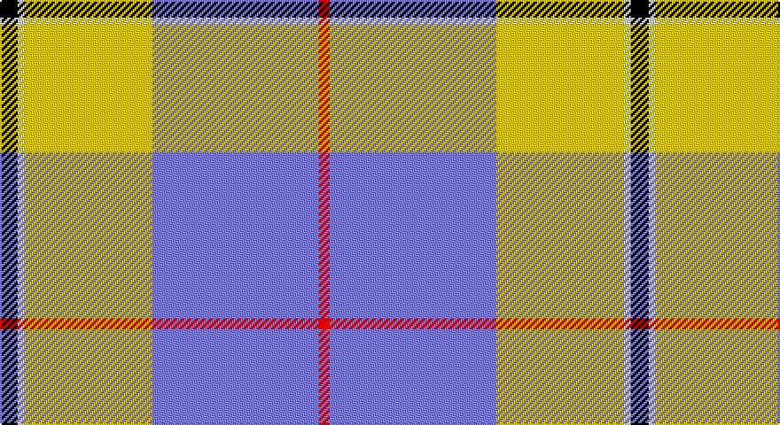

This page is one **sett** — a single exact thread-count. It belongs to the [tartan](/setts/k5w2ly36b47r3/)
(the same proportion at any scale), whose colour order is pattern [KWYBR](/stripes/kwybr/).

Part of the [Cornish National Day](/tartans/cornish-national-day/) tartan — the named design grouping this sett with its other cloths.

Sourced from weddslist.  It is a [5 stripe tartan](/stripes/stripes5/).

Original link http://www.weddslist.com/cgi-bin/tartans/pg.pl?source=sts

## Also known as

This cloth is also recorded under:

- Cornish, National Day
- Oliver Dress Pink

## Thread count
K/10 LN4 Y72 B94 R/6

One full sett is **356 threads**.

## Palette

Palette: <strong>Tartan Register</strong> <small style="color:#888">(2 of 5 colours)</small>
<table><thead><tr><th>Colour</th><th>Threads</th><th>Shade</th><th>Base</th><th>OKLCh</th></tr></thead><tbody><tr><td>K/</td><td style="text-align:right;font-variant-numeric:tabular-nums">10</td><td><code style="background-color:#000000;">#000000</code> <small style="color:#888">#000000</small></td><td>K <code style="background-color:#000000;">#000000</code></td><td><small style="color:#888">oklch(0.0% 0.000 0.0)</small></td></tr><tr><td>LN</td><td style="text-align:right;font-variant-numeric:tabular-nums">4</td><td><code style="background-color:#E0E0E0;">#E0E0E0</code> <small style="color:#888">#E0E0E0</small></td><td>W <code style="background-color:#F7F7F7;">#F7F7F7</code></td><td><small style="color:#888">oklch(90.7% 0.000 89.9)</small></td></tr><tr><td>Y</td><td style="text-align:right;font-variant-numeric:tabular-nums">72</td><td><code style="background-color:#F0C000;">#F0C000</code> <small style="color:#888">#F0C000</small></td><td>Y <code style="background-color:#F2BF00;">#F2BF00</code></td><td><small style="color:#888">oklch(82.7% 0.169 90.5)</small></td></tr><tr><td>B</td><td style="text-align:right;font-variant-numeric:tabular-nums">94</td><td><code style="background-color:#8080D0;">#8080D0</code> <small style="color:#888">#8080D0</small></td><td>B <code style="background-color:#2A418A;">#2A418A</code></td><td><small style="color:#888">oklch(63.4% 0.119 282.5)</small></td></tr><tr><td>R/</td><td style="text-align:right;font-variant-numeric:tabular-nums">6</td><td><code style="background-color:#C00000;">#C00000</code> <small style="color:#888">#C00000</small></td><td>R <code style="background-color:#CC0000;">#CC0000</code></td><td><small style="color:#888">oklch(50.7% 0.208 29.2)</small></td></tr></tbody></table>

# Sample pattern

## Compared to the master

This cloth is one sett of its design; the master sett (the exemplar the design is anchored on) is below for comparison.

<figure style="margin:0"><figcaption style="color:#888;font-size:smaller">this sett</figcaption></figure>
<figure style="margin:0"><figcaption style="color:#888;font-size:smaller"><a href="/setts/k5w2ly36t47r3/">master sett →</a></figcaption></figure>

## Nearest tartans

The nearest existing variants by ΔTartan distance, with this tartan at the top so the swatches line up against it.

ΔTartan

Tartan

Sett

—

<a href="/ttd/edit/#slug=k5w2ly36b47r3~x2">Cornish, National Day</a> <a class="nn-out" href="/variants/s5/k5w2ly36b47r3~x2/" title="open its dictionary page">↗</a>

0.91

<a href="/ttd/edit/#slug=w18o29t2dp3k1~x2&amp;base=k5w2ly36b47r3~x2">Kinloch of Loch Awe (Personal)</a> <a class="nn-out" href="/variants/s5/w18o29t2dp3k1~x2/" title="open its dictionary page">↗</a>

1.05

<a href="/ttd/edit/#slug=k5w2ly36t47r3~x2&amp;base=k5w2ly36b47r3~x2">Oliver Dress Pink</a> <a class="nn-out" href="/variants/s5/k5w2ly36t47r3~x2/" title="open its dictionary page">↗</a>

1.28

<a href="/ttd/edit/#slug=t53k2w53k2r4ly7~x2&amp;base=k5w2ly36b47r3~x2">Galicia</a> <a class="nn-out" href="/variants/s6/t53k2w53k2r4ly7~x2/" title="open its dictionary page">↗</a>

1.37

<a href="/ttd/edit/#slug=w8b5t10dp24w30b2dg2~x2&amp;base=k5w2ly36b47r3~x2">Shiel, Magenta (Dance)</a> <a class="nn-out" href="/variants/s7/w8b5t10dp24w30b2dg2~x2/" title="open its dictionary page">↗</a>

1.41

<a href="/ttd/edit/#slug=w3b23lr44b26g4ly2~x2&amp;base=k5w2ly36b47r3~x2">Tartan Lassie (Fashion)</a> <a class="nn-out" href="/variants/s6/w3b23lr44b26g4ly2~x2/" title="open its dictionary page">↗</a>

1.42

<a href="/ttd/edit/#slug=w14dp4ly1g8db2~x2&amp;base=k5w2ly36b47r3~x2">Manx Laxey Dress Green</a> <a class="nn-out" href="/variants/s5/w14dp4ly1g8db2~x2/" title="open its dictionary page">↗</a>

1.43

<a href="/ttd/edit/#slug=w8g5dp10t24w30g2lp2~x2&amp;base=k5w2ly36b47r3~x2">Shiel, Purple V2 (Dance)</a> <a class="nn-out" href="/variants/s7/w8g5dp10t24w30g2lp2~x2/" title="open its dictionary page">↗</a>

1.46

<a href="/ttd/edit/#slug=db4w1db2w18g3w1r9ly4~x4&amp;base=k5w2ly36b47r3~x2">Manitoba Dress (1958) (District)</a> <a class="nn-out" href="/variants/s8/db4w1db2w18g3w1r9ly4~x4/" title="open its dictionary page">↗</a>

1.48

<a href="/ttd/edit/#slug=w8g5t10dp24w30g2lp2~x2&amp;base=k5w2ly36b47r3~x2">Shiel, Purple (Dance)</a> <a class="nn-out" href="/variants/s7/w8g5t10dp24w30g2lp2~x2/" title="open its dictionary page">↗</a>

1.54

<a href="/ttd/edit/#slug=lb25db11r5w1k1~x4&amp;base=k5w2ly36b47r3~x2">Mount Vernon Primary School (Corp)</a> <a class="nn-out" href="/variants/s5/lb25db11r5w1k1~x4/" title="open its dictionary page">↗</a>

## Neighbour map

Every grey dot is one of 14360 variants placed by the first two principal components of the ΔTartan feature space (44% of its variance). Red is this tartan; blue dots are its nearest — click one to open its page.

<svg viewBox="0 0 640 380" role="img" style="max-width:100%;height:auto;border:1px solid #e0e0e0;border-radius:4px;display:block" xmlns="http://www.w3.org/2000/svg"><image href="/nn/cloud.v1.png" width="640" height="380"/><a href="/variants/s5/w18o29t2dp3k1~x2/"><circle cx="323.1" cy="131.8" r="4" fill="#3465a4"><title>Kinloch of Loch Awe (Personal)</title></circle></a><a href="/variants/s5/k5w2ly36t47r3~x2/"><circle cx="289.0" cy="144.4" r="4" fill="#3465a4"><title>Oliver Dress Pink</title></circle></a><a href="/variants/s6/t53k2w53k2r4ly7~x2/"><circle cx="260.0" cy="110.7" r="4" fill="#3465a4"><title>Galicia</title></circle></a><a href="/variants/s7/w8b5t10dp24w30b2dg2~x2/"><circle cx="207.5" cy="141.0" r="4" fill="#3465a4"><title>Shiel, Magenta (Dance)</title></circle></a><a href="/variants/s6/w3b23lr44b26g4ly2~x2/"><circle cx="289.6" cy="149.4" r="4" fill="#3465a4"><title>Tartan Lassie (Fashion)</title></circle></a><a href="/variants/s5/w14dp4ly1g8db2~x2/"><circle cx="203.4" cy="164.9" r="4" fill="#3465a4"><title>Manx Laxey Dress Green</title></circle></a><a href="/variants/s7/w8g5dp10t24w30g2lp2~x2/"><circle cx="207.7" cy="145.1" r="4" fill="#3465a4"><title>Shiel, Purple V2 (Dance)</title></circle></a><a href="/variants/s8/db4w1db2w18g3w1r9ly4~x4/"><circle cx="211.6" cy="115.2" r="4" fill="#3465a4"><title>Manitoba Dress (1958) (District)</title></circle></a><a href="/variants/s7/w8g5t10dp24w30g2lp2~x2/"><circle cx="197.8" cy="138.1" r="4" fill="#3465a4"><title>Shiel, Purple (Dance)</title></circle></a><a href="/variants/s5/lb25db11r5w1k1~x4/"><circle cx="314.1" cy="136.4" r="4" fill="#3465a4"><title>Mount Vernon Primary School (Corp)</title></circle></a><circle cx="287.1" cy="134.7" r="5" fill="#c00000"/></svg>

ID: /variants/s5/k5w2ly36b47r3~x2/
