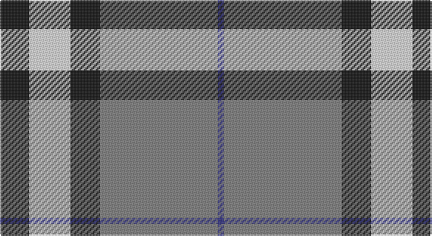

This page is one **sett** — a single exact thread-count. It belongs to the [tartan](/setts/k5w7k5y20db1/)
(the same proportion at any scale), whose colour order is pattern [BGKWK](/stripes/bgkwk/).

Part of the [Burberry](/tartans/burberry/) tartan — the named design grouping this sett with its other cloths.

Sourced from register-of-tartans.  It is a [5 stripe tartan](/stripes/stripes5/).

Original link https://www.tartanregister.gov.uk/tartanDetails.aspx?ref=442

## Also known as

This cloth is also recorded under:

- Burberry Black
- Burberry Blue
- Burberry Grey
- Burberry, Black
- Burberry, Grey

2 attestations — the source records this cloth was collapsed from (oldest owns this page)

<ul>
<li>01/01/2007 — Burberry Grey (Original) (register-of-tartans, <a href="https://www.tartanregister.gov.uk/tartanDetails.aspx?ref=442">record</a>)</li>
<li>pre 2007 — Burberry, Grey (Original) (Fashion) (tartans-authority, <a href="http://www.tartansauthority.com/tartan-ferret/display/7268/">record</a>)</li>
</ul>

## Register references

External register numbers recorded for this tartan.

- Scottish Register of Tartans: [442](https://www.tartanregister.gov.uk/tartanDetails.aspx?ref=442)
- Scottish Tartans Authority (ITI): 7268

## Thread count
K/20 LN28 K20 N80 DB/4

One full sett is **280 threads**.

## Palette

Palette: <strong>Tartan Register</strong> <small style="color:#888">(3 of 4 colours)</small>
<table><thead><tr><th>Colour</th><th>Threads</th><th>Shade</th><th>Base</th><th>OKLCh</th></tr></thead><tbody><tr><td>K/</td><td style="text-align:right;font-variant-numeric:tabular-nums">20</td><td><code style="background-color:#101010;">#101010</code> <small style="color:#888">#101010</small></td><td>K <code style="background-color:#000000;">#000000</code></td><td><small style="color:#888">oklch(17.3% 0.000 89.9)</small></td></tr><tr><td>LN</td><td style="text-align:right;font-variant-numeric:tabular-nums">28</td><td><code style="background-color:#E0E0E0;">#E0E0E0</code> <small style="color:#888">#E0E0E0</small></td><td>W <code style="background-color:#F7F7F7;">#F7F7F7</code></td><td><small style="color:#888">oklch(90.7% 0.000 89.9)</small></td></tr><tr><td>K</td><td style="text-align:right;font-variant-numeric:tabular-nums">20</td><td><code style="background-color:#101010;">#101010</code> <small style="color:#888">#101010</small></td><td>K <code style="background-color:#000000;">#000000</code></td><td><small style="color:#888">oklch(17.3% 0.000 89.9)</small></td></tr><tr><td>N</td><td style="text-align:right;font-variant-numeric:tabular-nums">80</td><td><code style="background-color:#7C7C7C;">#7C7C7C</code> <small style="color:#888">#7C7C7C</small></td><td>G <code style="background-color:#006100;">#006100</code></td><td><small style="color:#888">oklch(58.6% 0.000 89.9)</small></td></tr><tr><td>DB/</td><td style="text-align:right;font-variant-numeric:tabular-nums">4</td><td><code style="background-color:#2C2C80;">#2C2C80</code> <small style="color:#888">#2C2C80</small></td><td>B <code style="background-color:#2A418A;">#2A418A</code></td><td><small style="color:#888">oklch(35.0% 0.138 276.6)</small></td></tr></tbody></table>

# Sample pattern

## Compared to the master

This cloth is one sett of its design; the master sett (the exemplar the design is anchored on) is below for comparison.

<figure style="margin:0"><figcaption style="color:#888;font-size:smaller">this sett</figcaption></figure>
<figure style="margin:0"><figcaption style="color:#888;font-size:smaller"><a href="/setts/k10w10k10o32k2w2k2w2r5/">master sett →</a></figcaption></figure>

## Nearest tartans

The nearest existing variants by ΔTartan distance, with this tartan at the top so the swatches line up against it.

ΔTartan

Tartan

Sett

—

<a href="/ttd/edit/#slug=k5w7k5y20db1~x4">Burberry Grey (Original)</a> <a class="nn-out" href="/variants/s5/k5w7k5y20db1~x4/" title="open its dictionary page">↗</a>

0.79

<a href="/ttd/edit/#slug=dp2k1dp16g17w2~x4&amp;base=k5w7k5y20db1~x4">Kansai Highland Games</a> <a class="nn-out" href="/variants/s5/dp2k1dp16g17w2~x4/" title="open its dictionary page">↗</a>

0.80

<a href="/ttd/edit/#slug=dp2k1dp16g16w2~x4&amp;base=k5w7k5y20db1~x4">Kansai Highland Games Corporate Tartan</a> <a class="nn-out" href="/variants/s5/dp2k1dp16g16w2~x4/" title="open its dictionary page">↗</a>

0.90

<a href="/ttd/edit/#slug=lb3k3lb3k3o15r1~x4&amp;base=k5w7k5y20db1~x4">Tiree Grey</a> <a class="nn-out" href="/variants/s6/lb3k3lb3k3o15r1~x4/" title="open its dictionary page">↗</a>

1.19

<a href="/ttd/edit/#slug=r12ly3w14dt10ly2dt24r2~x2&amp;base=k5w7k5y20db1~x4">Yusra (Malay) (Personal)</a> <a class="nn-out" href="/variants/s7/r12ly3w14dt10ly2dt24r2~x2/" title="open its dictionary page">↗</a>

1.19

<a href="/ttd/edit/#slug=k3t10ly5t29k10r6k2~x2&amp;base=k5w7k5y20db1~x4">Perkins 2015</a> <a class="nn-out" href="/variants/s7/k3t10ly5t29k10r6k2~x2/" title="open its dictionary page">↗</a>

1.32

<a href="/ttd/edit/#slug=k4ly18n44k3ly10k4&amp;base=k5w7k5y20db1~x4">Stutterheim</a> <a class="nn-out" href="/variants/s6/k4ly18n44k3ly10k4/" title="open its dictionary page">↗</a>

1.32

<a href="/ttd/edit/#slug=r4o41k5w14k18r4~x2&amp;base=k5w7k5y20db1~x4">Downside (Corporate)</a> <a class="nn-out" href="/variants/s6/r4o41k5w14k18r4~x2/" title="open its dictionary page">↗</a>

1.33

<a href="/ttd/edit/#slug=k3w3k3y10r1~x6&amp;base=k5w7k5y20db1~x4">Burberry Hunting</a> <a class="nn-out" href="/variants/s5/k3w3k3y10r1~x6/" title="open its dictionary page">↗</a>

1.33

<a href="/ttd/edit/#slug=k23ly3k23w36r4~x2&amp;base=k5w7k5y20db1~x4">Macleod, Winnifred Mary, Dress</a> <a class="nn-out" href="/variants/s5/k23ly3k23w36r4~x2/" title="open its dictionary page">↗</a>

1.34

<a href="/ttd/edit/#slug=ly8k2dt20t4w1k2~x4&amp;base=k5w7k5y20db1~x4">Solberg-Bell</a> <a class="nn-out" href="/variants/s6/ly8k2dt20t4w1k2~x4/" title="open its dictionary page">↗</a>

## Neighbour map

Every grey dot is one of 14360 variants placed by the first two principal components of the ΔTartan feature space (44% of its variance). Red is this tartan; blue dots are its nearest — click one to open its page.

<svg viewBox="0 0 640 380" role="img" style="max-width:100%;height:auto;border:1px solid #e0e0e0;border-radius:4px;display:block" xmlns="http://www.w3.org/2000/svg"><image href="/nn/cloud.v1.png" width="640" height="380"/><a href="/variants/s5/dp2k1dp16g17w2~x4/"><circle cx="287.5" cy="176.9" r="4" fill="#3465a4"><title>Kansai Highland Games</title></circle></a><a href="/variants/s5/dp2k1dp16g16w2~x4/"><circle cx="292.1" cy="181.0" r="4" fill="#3465a4"><title>Kansai Highland Games Corporate Tartan</title></circle></a><a href="/variants/s6/lb3k3lb3k3o15r1~x4/"><circle cx="290.6" cy="171.5" r="4" fill="#3465a4"><title>Tiree Grey</title></circle></a><a href="/variants/s7/r12ly3w14dt10ly2dt24r2~x2/"><circle cx="229.2" cy="181.5" r="4" fill="#3465a4"><title>Yusra (Malay) (Personal)</title></circle></a><a href="/variants/s7/k3t10ly5t29k10r6k2~x2/"><circle cx="316.4" cy="176.8" r="4" fill="#3465a4"><title>Perkins 2015</title></circle></a><a href="/variants/s6/k4ly18n44k3ly10k4/"><circle cx="305.0" cy="178.3" r="4" fill="#3465a4"><title>Stutterheim</title></circle></a><a href="/variants/s6/r4o41k5w14k18r4~x2/"><circle cx="223.5" cy="182.6" r="4" fill="#3465a4"><title>Downside (Corporate)</title></circle></a><a href="/variants/s5/k3w3k3y10r1~x6/"><circle cx="231.5" cy="211.6" r="4" fill="#3465a4"><title>Burberry Hunting</title></circle></a><a href="/variants/s5/k23ly3k23w36r4~x2/"><circle cx="247.0" cy="200.0" r="4" fill="#3465a4"><title>Macleod, Winnifred Mary, Dress</title></circle></a><a href="/variants/s6/ly8k2dt20t4w1k2~x4/"><circle cx="266.2" cy="141.7" r="4" fill="#3465a4"><title>Solberg-Bell</title></circle></a><circle cx="279.8" cy="176.8" r="5" fill="#c00000"/></svg>

ID: /variants/s5/k5w7k5y20db1~x4/
