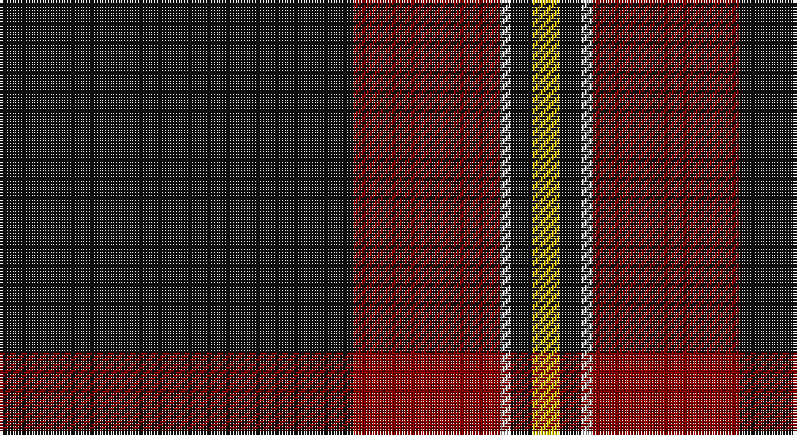

This page is one **sett** — a single exact thread-count. It belongs to the [tartan](/setts/k65r27w2k4ly5/)
(the same proportion at any scale), whose colour order is pattern [KRWKY](/stripes/krwky/).

Sourced from register-of-tartans.  It is a [5 stripe tartan](/stripes/stripes5/).

Original link https://www.tartanregister.gov.uk/tartanDetails.aspx?ref=3321

## Also known as

This cloth is also recorded under:

- Perry, Ancient
- Perry, dress

3 attestations — the source records this cloth was collapsed from (oldest owns this page)

<ul>
<li>01/01/1986 — Perry Dress (Personal) (register-of-tartans, <a href="https://www.tartanregister.gov.uk/tartanDetails.aspx?ref=3321">record</a>)</li>
<li>undated — Perry, Ancient (weddslist, <a href="http://www.weddslist.com/cgi-bin/tartans/pg.pl?source=sts">record</a>)</li>
<li>undated — Perry, dress (weddslist, <a href="http://www.weddslist.com/cgi-bin/tartans/pg.pl?source=sts">record</a>)</li>
</ul>

## Register references

External register numbers recorded for this tartan.

- Scottish Register of Tartans: [3321](https://www.tartanregister.gov.uk/tartanDetails.aspx?ref=3321)
- Scottish Tartans Authority (ITI): 1214
- Scottish Tartans World Register: 1214

## Thread count
K/130 DR54 LN4 K8 Y/10

One full sett is **272 threads**.

## Palette

Palette: <strong>Tartan Register</strong>
<table><thead><tr><th>Colour</th><th>Threads</th><th>Shade</th><th>Base</th><th>OKLCh</th></tr></thead><tbody><tr><td>K/</td><td style="text-align:right;font-variant-numeric:tabular-nums">130</td><td><code style="background-color:#101010;">#101010</code> <small style="color:#888">#101010</small></td><td>K <code style="background-color:#000000;">#000000</code></td><td><small style="color:#888">oklch(17.3% 0.000 89.9)</small></td></tr><tr><td>DR</td><td style="text-align:right;font-variant-numeric:tabular-nums">54</td><td><code style="background-color:#880000;">#880000</code> <small style="color:#888">#880000</small></td><td>R <code style="background-color:#CC0000;">#CC0000</code></td><td><small style="color:#888">oklch(39.4% 0.162 29.2)</small></td></tr><tr><td>LN</td><td style="text-align:right;font-variant-numeric:tabular-nums">4</td><td><code style="background-color:#E0E0E0;">#E0E0E0</code> <small style="color:#888">#E0E0E0</small></td><td>W <code style="background-color:#F7F7F7;">#F7F7F7</code></td><td><small style="color:#888">oklch(90.7% 0.000 89.9)</small></td></tr><tr><td>K</td><td style="text-align:right;font-variant-numeric:tabular-nums">8</td><td><code style="background-color:#101010;">#101010</code> <small style="color:#888">#101010</small></td><td>K <code style="background-color:#000000;">#000000</code></td><td><small style="color:#888">oklch(17.3% 0.000 89.9)</small></td></tr><tr><td>Y/</td><td style="text-align:right;font-variant-numeric:tabular-nums">10</td><td><code style="background-color:#E8C000;">#E8C000</code> <small style="color:#888">#E8C000</small></td><td>Y <code style="background-color:#F2BF00;">#F2BF00</code></td><td><small style="color:#888">oklch(81.9% 0.168 93.7)</small></td></tr></tbody></table>

# Sample pattern

## Nearest tartans

The nearest existing variants by ΔTartan distance, with this tartan at the top so the swatches line up against it.

ΔTartan

Tartan

Sett

—

<a href="/ttd/edit/#slug=k65r27w2k4ly5~x2">Perry Dress (Personal)</a> <a class="nn-out" href="/variants/s5/k65r27w2k4ly5~x2/" title="open its dictionary page">↗</a>

0.81

<a href="/ttd/edit/#slug=k75r26w2k4ly5~x2&amp;base=k65r27w2k4ly5~x2">Perry / Pirrie (Personal)</a> <a class="nn-out" href="/variants/s5/k75r26w2k4ly5~x2/" title="open its dictionary page">↗</a>

1.15

<a href="/ttd/edit/#slug=oi4n6k4o8k49oi2&amp;base=k65r27w2k4ly5~x2">Harley Davidson (Corporate)</a> <a class="nn-out" href="/variants/s6/oi4n6k4o8k49oi2/" title="open its dictionary page">↗</a>

1.15

<a href="/ttd/edit/#slug=k62dt24lo5w3~x2&amp;base=k65r27w2k4ly5~x2">Perry (Calgary), Alex (Personal)</a> <a class="nn-out" href="/variants/s4/k62dt24lo5w3~x2/" title="open its dictionary page">↗</a>

1.18

<a href="/ttd/edit/#slug=k30r10ly1k8w3~x4&amp;base=k65r27w2k4ly5~x2">Union Fire Club Pipes and Drums</a> <a class="nn-out" href="/variants/s5/k30r10ly1k8w3~x4/" title="open its dictionary page">↗</a>

1.36

<a href="/ttd/edit/#slug=k31r12ly2n5k2~x4&amp;base=k65r27w2k4ly5~x2">Perry (2014)</a> <a class="nn-out" href="/variants/s5/k31r12ly2n5k2~x4/" title="open its dictionary page">↗</a>

1.39

<a href="/ttd/edit/#slug=k42t2r3k5r16k8ly2k3~x2&amp;base=k65r27w2k4ly5~x2">Highland Brewing Company</a> <a class="nn-out" href="/variants/s8/k42t2r3k5r16k8ly2k3~x2/" title="open its dictionary page">↗</a>

1.41

<a href="/ttd/edit/#slug=k53ly4k7ly2k4r30w3~x2&amp;base=k65r27w2k4ly5~x2">Partick Thistle Football Club</a> <a class="nn-out" href="/variants/s7/k53ly4k7ly2k4r30w3~x2/" title="open its dictionary page">↗</a>

1.47

<a href="/ttd/edit/#slug=k75y26y3k4ly6~x2&amp;base=k65r27w2k4ly5~x2">Perry Ancient (Personal)</a> <a class="nn-out" href="/variants/s5/k75y26y3k4ly6~x2/" title="open its dictionary page">↗</a>

1.50

<a href="/ttd/edit/#slug=k75g26lr2g4lo5~x2&amp;base=k65r27w2k4ly5~x2">Perry Hunting (Green) (Personal)</a> <a class="nn-out" href="/variants/s5/k75g26lr2g4lo5~x2/" title="open its dictionary page">↗</a>

1.58

<a href="/ttd/edit/#slug=r3n12k50ly3~x2&amp;base=k65r27w2k4ly5~x2">Rogues (United States), The</a> <a class="nn-out" href="/variants/s4/r3n12k50ly3~x2/" title="open its dictionary page">↗</a>

## Neighbour map

Every grey dot is one of 14360 variants placed by the first two principal components of the ΔTartan feature space (44% of its variance). Red is this tartan; blue dots are its nearest — click one to open its page.

<svg viewBox="0 0 640 380" role="img" style="max-width:100%;height:auto;border:1px solid #e0e0e0;border-radius:4px;display:block" xmlns="http://www.w3.org/2000/svg"><image href="/nn/cloud.v1.png" width="640" height="380"/><a href="/variants/s5/k75r26w2k4ly5~x2/"><circle cx="472.5" cy="145.6" r="4" fill="#3465a4"><title>Perry / Pirrie (Personal)</title></circle></a><a href="/variants/s6/oi4n6k4o8k49oi2/"><circle cx="488.8" cy="164.8" r="4" fill="#3465a4"><title>Harley Davidson (Corporate)</title></circle></a><a href="/variants/s4/k62dt24lo5w3~x2/"><circle cx="420.9" cy="204.1" r="4" fill="#3465a4"><title>Perry (Calgary), Alex (Personal)</title></circle></a><a href="/variants/s5/k30r10ly1k8w3~x4/"><circle cx="458.5" cy="167.4" r="4" fill="#3465a4"><title>Union Fire Club Pipes and Drums</title></circle></a><a href="/variants/s5/k31r12ly2n5k2~x4/"><circle cx="400.5" cy="202.6" r="4" fill="#3465a4"><title>Perry (2014)</title></circle></a><a href="/variants/s8/k42t2r3k5r16k8ly2k3~x2/"><circle cx="480.6" cy="162.1" r="4" fill="#3465a4"><title>Highland Brewing Company</title></circle></a><a href="/variants/s7/k53ly4k7ly2k4r30w3~x2/"><circle cx="389.5" cy="134.2" r="4" fill="#3465a4"><title>Partick Thistle Football Club</title></circle></a><a href="/variants/s5/k75y26y3k4ly6~x2/"><circle cx="462.0" cy="183.0" r="4" fill="#3465a4"><title>Perry Ancient (Personal)</title></circle></a><a href="/variants/s5/k75g26lr2g4lo5~x2/"><circle cx="465.7" cy="167.0" r="4" fill="#3465a4"><title>Perry Hunting (Green) (Personal)</title></circle></a><a href="/variants/s4/r3n12k50ly3~x2/"><circle cx="465.1" cy="201.0" r="4" fill="#3465a4"><title>Rogues (United States), The</title></circle></a><circle cx="456.4" cy="164.7" r="5" fill="#c00000"/></svg>

ID: /variants/s5/k65r27w2k4ly5~x2/
