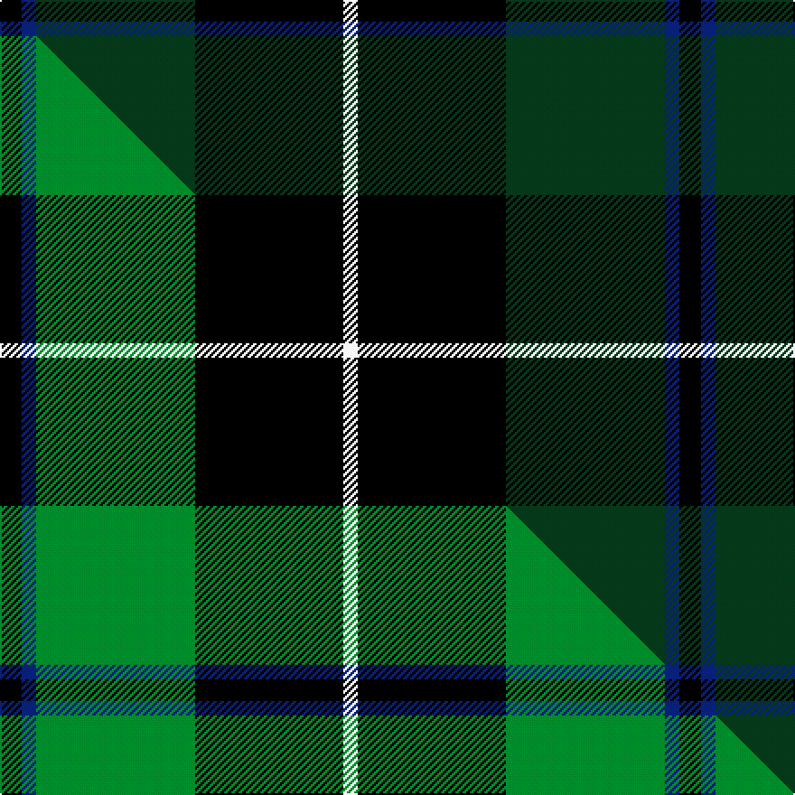

This is one **variant** — a specific cloth: this exact thread count and colourway, with its own
provenance below. It is one weaving of the [sett](/setts/k6db4dg44k41w4/) (the scale-free proportion — the
same cloth at any scale or shade), whose colour order is pattern [KBGKW](/stripes/kbgkw/).

Part of the [Douglas](/tartans/d/do/douglas-5/) tartan — the named design grouping this sett with its other cloths.

Sourced from tartans-authority.  It is a [5 stripe tartan](/stripes/stripes5/).

Original link [https://www.tartanregister.gov.uk/tartanDetails.aspx?ref=1032](https://www.tartanregister.gov.uk/tartanDetails.aspx?ref=1032)

Dataset <small>— provenance for this record, inherited from the source manifest</small>

<dl class="dataset-prov">
<dt>source</dt><dd><a href="/sources/tartans-authority/">Scottish Tartans Authority</a></dd>
<dt>data captured from</dt><dd><a href="https://github.com/thetartan/tartan-database/blob/master/data/tartans-authority/data.csv">https://github.com/thetartan/tartan-database/blob/master/data/tartans-authority/data.csv</a></dd>
<dt>data date</dt><dd>1826 <small>(this record)</small></dd>
<dt>licence</dt><dd><a href="https://creativecommons.org/licenses/by-nc-nd/4.0/">CC BY-NC-ND 4.0</a></dd>
</dl>

Capture chain <small>— the hands this data passed through, oldest first; each capture carries its own licence</small>

<ol class="capture-chain">
<li><a href="https://www.tartansauthority.com/">Scottish Tartans Authority</a> <small>the heritage body's archive — its tartan-ferret record browser is retired (links repaired to the SRT, above)</small></li>
<li><a href="https://github.com/thetartan/tartan-database">thetartan/tartan-database</a> <small>2016-2017</small> · <a href="https://creativecommons.org/licenses/by-nc-nd/4.0/">CC BY-NC-ND 4.0</a> <small>Levko Kravets's frozen compilation — the capture we vendored, and where its CC licence text came from</small></li>
<li>this dictionary <small>captured 2026-06-10 · commit 5bf86c7566</small> <small>each re-capture is a git commit to data/sources</small></li>
</ol>

## Register references

External register numbers recorded for this tartan.

- Scottish Tartans Authority (ITI): 1032

## Thread count
K/12 DB8 DG88 K82 W/8

One full sett is **376 threads**.

## Palette
<table><thead><tr><th>Colour</th><th>Shade</th><th>OKLCh</th></tr></thead><tbody><tr><td>DB</td><td><code style="background-color:#082077;">#082077</code> <small style="color:#888">#082077</small></td><td><small style="color:#888">oklch(30.0% 0.149 265.1)</small></td></tr><tr><td>DG</td><td><code style="background-color:#053819;">#053819</code> <small style="color:#888">#053819</small></td><td><small style="color:#888">oklch(30.0% 0.075 151.3)</small></td></tr><tr><td>K</td><td><code style="background-color:#000000;">#000000</code> <small style="color:#888">#000000</small></td><td><small style="color:#888">oklch(0.0% 0.000 0.0)</small></td></tr><tr><td>W</td><td><code style="background-color:#F7F7F7;">#F7F7F7</code> <small style="color:#888">#F7F7F7</small></td><td><small style="color:#888">oklch(97.6% 0.000 89.9)</small></td></tr></tbody></table>

# Sample pattern

## Compared to the master

This cloth is one sett of its design; the master sett (the exemplar the design is anchored on) is below for comparison.

Its **ΔTartan distance** from the master is **0.18** — the same measure the nearest-tartans table ranks by (0 is identical; a re-scale of the same cloth is near 0, a recolour or a different proportion further).

<figure class="master-compare" style="margin:0">

this sett
master sett ★

<figcaption style="color:#888;font-size:smaller">One weave of this sett against the <a href="/setts/k6db4g44k41w4/">master sett ★</a>, split on the diagonal: a shared proportion runs seamlessly across it with only the shades shifting; a different proportion breaks on it.</figcaption>
</figure>

## Nearest tartan variants

The nearest existing variants by ΔTartan distance, with this cloth at the top so the swatches line up against it.

ΔTartan

Threads

Variant

Sett

—

376

<a href="/variants/s5/k6db4dg44k41w4~x2/">Douglas (Clan)</a>

<a href="/ttd/edit/#slug=k6db4g44k41w4~x2&amp;base=k6db4dg44k41w4~x2" title="compare in the TTD">0.18</a>

376

<a href="/variants/s5/k6db4g44k41w4~x2/">Douglas (alternative threadcount)</a>

<a href="/ttd/edit/#slug=k6g4dg44k41w4~x2~g2408144-dg1806142&amp;base=k6db4dg44k41w4~x2" title="compare in the TTD">0.39</a>

376

<a href="/variants/s5/k6g4dg44k41w4~x2~g2408144-dg1806142/">Raeside</a>

<a href="/ttd/edit/#slug=k8t5g44k40r6&amp;base=k6db4dg44k41w4~x2" title="compare in the TTD">0.64</a>

192

<a href="/variants/s5/k8t5g44k40r6/">Douglas, Black</a>

<a href="/ttd/edit/#slug=k12db3g23k23r3~x2&amp;base=k6db4dg44k41w4~x2" title="compare in the TTD">0.88</a>

226

<a href="/variants/s5/k12db3g23k23r3~x2/">Douglas, (Black)</a>

<a href="/ttd/edit/#slug=db2k6g2k6dg12y1~x4&amp;base=k6db4dg44k41w4~x2" title="compare in the TTD">1.04</a>

220

<a href="/variants/s6/db2k6g2k6dg12y1~x4/">Leahy, Thomas Francis &amp; Mary (Australia)</a>

<a href="/ttd/edit/#slug=db2k6g2k6dg12y1~x4~g2408144-dg1806142&amp;base=k6db4dg44k41w4~x2" title="compare in the TTD">1.04</a>

220

<a href="/variants/s6/db2k6g2k6dg12y1~x4~g2408144-dg1806142/">Leahy (Australia) (Personal)</a>

<a href="/ttd/edit/#slug=k3w3k3dg10r1~x6&amp;base=k6db4dg44k41w4~x2" title="compare in the TTD">1.05</a>

216

<a href="/variants/s5/k3w3k3dg10r1~x6/">Burberry Hunting</a>

<a href="/ttd/edit/#slug=k8y1k8g13r2~x4&amp;base=k6db4dg44k41w4~x2" title="compare in the TTD">1.06</a>

216

<a href="/variants/s5/k8y1k8g13r2~x4/">Tolmie</a>

<a href="/ttd/edit/#slug=k2w1k12g5db11r1~x2&amp;base=k6db4dg44k41w4~x2" title="compare in the TTD">1.20</a>

122

<a href="/variants/s6/k2w1k12g5db11r1~x2/">New England (Fashion)</a>

<a href="/ttd/edit/#slug=y4k1dg16k16r1w3~x2&amp;base=k6db4dg44k41w4~x2" title="compare in the TTD">1.31</a>

150

<a href="/variants/s6/y4k1dg16k16r1w3~x2/">MacLamroc</a>

## Neighbour map

Every grey dot is one of 13621 variants placed by the first two principal components of the ΔTartan feature space (42% of its variance). Red is this tartan; blue dots are its nearest — click one to open its page. The map is a flat projection of a many-dimensional space — [how to read it](/posts/neighbourhood-maps/).

<svg viewBox="0 0 640 380" role="img" style="max-width:100%;height:auto;border:1px solid #e0e0e0;border-radius:4px;display:block" xmlns="http://www.w3.org/2000/svg"><image href="/nn/cloud.v1.png" width="640" height="380"/><a href="/variants/s5/k6db4g44k41w4~x2/"><circle cx="233.3" cy="187.8" r="4" fill="#3465a4"><title>Douglas (alternative threadcount)</title></circle></a><a href="/variants/s5/k6g4dg44k41w4~x2~g2408144-dg1806142/"><circle cx="241.8" cy="189.2" r="4" fill="#3465a4"><title>Raeside</title></circle></a><a href="/variants/s5/k8t5g44k40r6/"><circle cx="211.1" cy="200.1" r="4" fill="#3465a4"><title>Douglas, Black</title></circle></a><a href="/variants/s5/k12db3g23k23r3~x2/"><circle cx="232.3" cy="216.4" r="4" fill="#3465a4"><title>Douglas, (Black)</title></circle></a><a href="/variants/s6/db2k6g2k6dg12y1~x4/"><circle cx="217.6" cy="193.1" r="4" fill="#3465a4"><title>Leahy, Thomas Francis &amp; Mary (Australia)</title></circle></a><a href="/variants/s6/db2k6g2k6dg12y1~x4~g2408144-dg1806142/"><circle cx="181.7" cy="184.3" r="4" fill="#3465a4"><title>Leahy (Australia) (Personal)</title></circle></a><a href="/variants/s5/k3w3k3dg10r1~x6/"><circle cx="204.9" cy="198.4" r="4" fill="#3465a4"><title>Burberry Hunting</title></circle></a><a href="/variants/s5/k8y1k8g13r2~x4/"><circle cx="227.9" cy="199.7" r="4" fill="#3465a4"><title>Tolmie</title></circle></a><a href="/variants/s6/k2w1k12g5db11r1~x2/"><circle cx="181.6" cy="169.2" r="4" fill="#3465a4"><title>New England (Fashion)</title></circle></a><a href="/variants/s6/y4k1dg16k16r1w3~x2/"><circle cx="189.6" cy="150.9" r="4" fill="#3465a4"><title>MacLamroc</title></circle></a><circle cx="272.7" cy="195.7" r="5" fill="#c00000"/><text x="320" y="376" text-anchor="middle" font-size="11" fill="#999">ground</text><text x="11" y="190" text-anchor="middle" font-size="11" fill="#999" transform="rotate(-90 11 190)">complexity</text></svg>

ID: /variants/s5/k6db4dg44k41w4~x2/
