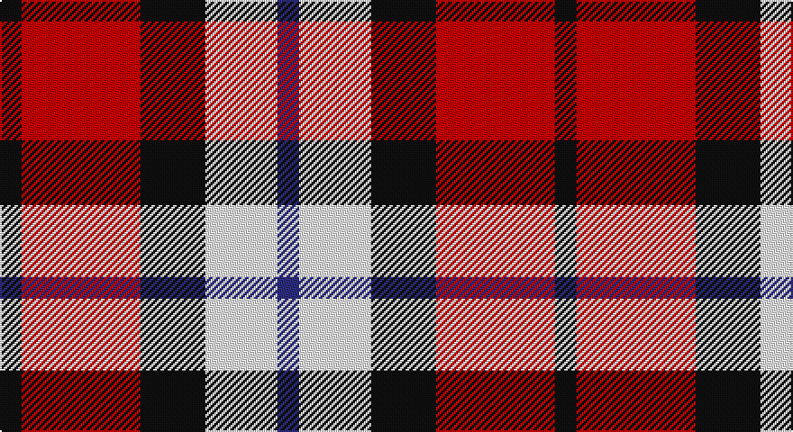

This page is one **sett** — a single exact thread-count. It belongs to the [tartan](/setts/k6r33k18w20db6/)
(the same proportion at any scale), whose colour order is pattern [BWKRK](/stripes/bwkrk/).

Part of the [Brodie Dress](/tartans/brodie-dress/) tartan — the named design grouping this sett with its other cloths.

Sourced from register-of-tartans.  It is a [5 stripe tartan](/stripes/stripes5/).

Original link https://www.tartanregister.gov.uk/tartanDetails.aspx?ref=371

## Also known as

This cloth is also recorded under:

- Brodie

## Register references

External register numbers recorded for this tartan.

- Scottish Register of Tartans: [371](https://www.tartanregister.gov.uk/tartanDetails.aspx?ref=371)
- Scottish Tartans Authority (ITI): 6283

## Thread count
K/12 R66 K36 W40 DB/12

One full sett is **308 threads**.

## Palette

Palette: <strong>Tartan Register</strong>
<table><thead><tr><th>Colour</th><th>Threads</th><th>Shade</th><th>Base</th><th>OKLCh</th></tr></thead><tbody><tr><td>K/</td><td style="text-align:right;font-variant-numeric:tabular-nums">12</td><td><code style="background-color:#101010;">#101010</code> <small style="color:#888">#101010</small></td><td>K <code style="background-color:#000000;">#000000</code></td><td><small style="color:#888">oklch(17.3% 0.000 89.9)</small></td></tr><tr><td>R</td><td style="text-align:right;font-variant-numeric:tabular-nums">66</td><td><code style="background-color:#C80000;">#C80000</code> <small style="color:#888">#C80000</small></td><td>R <code style="background-color:#CC0000;">#CC0000</code></td><td><small style="color:#888">oklch(52.3% 0.215 29.2)</small></td></tr><tr><td>K</td><td style="text-align:right;font-variant-numeric:tabular-nums">36</td><td><code style="background-color:#101010;">#101010</code> <small style="color:#888">#101010</small></td><td>K <code style="background-color:#000000;">#000000</code></td><td><small style="color:#888">oklch(17.3% 0.000 89.9)</small></td></tr><tr><td>W</td><td style="text-align:right;font-variant-numeric:tabular-nums">40</td><td><code style="background-color:#FCFCFC;">#FCFCFC</code> <small style="color:#888">#FCFCFC</small></td><td>W <code style="background-color:#F7F7F7;">#F7F7F7</code></td><td><small style="color:#888">oklch(99.1% 0.000 89.9)</small></td></tr><tr><td>DB/</td><td style="text-align:right;font-variant-numeric:tabular-nums">12</td><td><code style="background-color:#2C2C80;">#2C2C80</code> <small style="color:#888">#2C2C80</small></td><td>B <code style="background-color:#2A418A;">#2A418A</code></td><td><small style="color:#888">oklch(35.0% 0.138 276.6)</small></td></tr></tbody></table>

# Sample pattern

## Nearest tartans

The nearest existing variants by ΔTartan distance, with this tartan at the top so the swatches line up against it.

ΔTartan

Tartan

Sett

—

<a href="/ttd/edit/#slug=k6r33k18w20db6~x2">Brodie Dress</a> <a class="nn-out" href="/variants/s5/k6r33k18w20db6~x2/" title="open its dictionary page">↗</a>

0.96

<a href="/ttd/edit/#slug=r15g3w2k10w5~x2&amp;base=k6r33k18w20db6~x2">SAL Cubiska Stenen</a> <a class="nn-out" href="/variants/s5/r15g3w2k10w5~x2/" title="open its dictionary page">↗</a>

1.12

<a href="/ttd/edit/#slug=ly4r27k12db15ly4~x2&amp;base=k6r33k18w20db6~x2">Aberdeen University (1992)</a> <a class="nn-out" href="/variants/s5/ly4r27k12db15ly4~x2/" title="open its dictionary page">↗</a>

1.19

<a href="/ttd/edit/#slug=r25k13w8db5~x2&amp;base=k6r33k18w20db6~x2">Hamby Sport (Personal)</a> <a class="nn-out" href="/variants/s4/r25k13w8db5~x2/" title="open its dictionary page">↗</a>

1.21

<a href="/ttd/edit/#slug=ly2r15k7db8ly2~x4&amp;base=k6r33k18w20db6~x2">Aberdeen University</a> <a class="nn-out" href="/variants/s5/ly2r15k7db8ly2~x4/" title="open its dictionary page">↗</a>

1.25

<a href="/ttd/edit/#slug=r3k1dg1k1lb3~x4&amp;base=k6r33k18w20db6~x2">Clark</a> <a class="nn-out" href="/variants/s5/r3k1dg1k1lb3~x4/" title="open its dictionary page">↗</a>

1.33

<a href="/ttd/edit/#slug=k7r5w3db2~x4&amp;base=k6r33k18w20db6~x2">Thomas Newcomen's Combustion Engine</a> <a class="nn-out" href="/variants/s4/k7r5w3db2~x4/" title="open its dictionary page">↗</a>

1.34

<a href="/ttd/edit/#slug=r3g1k3w1~x20&amp;base=k6r33k18w20db6~x2">SAL Glindrande Stiernan</a> <a class="nn-out" href="/variants/s4/r3g1k3w1~x20/" title="open its dictionary page">↗</a>

1.36

<a href="/ttd/edit/#slug=w3r27w16db27ly3~x2&amp;base=k6r33k18w20db6~x2">Common Ground (Dress)</a> <a class="nn-out" href="/variants/s5/w3r27w16db27ly3~x2/" title="open its dictionary page">↗</a>

1.38

<a href="/ttd/edit/#slug=k3r28k10w28t3~x2&amp;base=k6r33k18w20db6~x2">Wallace Dress, Red (Dance)</a> <a class="nn-out" href="/variants/s5/k3r28k10w28t3~x2/" title="open its dictionary page">↗</a>

1.39

<a href="/ttd/edit/#slug=r39t22k11ly22g5~x2&amp;base=k6r33k18w20db6~x2">Abbink, Ingmar (Personal)</a> <a class="nn-out" href="/variants/s5/r39t22k11ly22g5~x2/" title="open its dictionary page">↗</a>

## Neighbour map

Every grey dot is one of 14360 variants placed by the first two principal components of the ΔTartan feature space (44% of its variance). Red is this tartan; blue dots are its nearest — click one to open its page.

<svg viewBox="0 0 640 380" role="img" style="max-width:100%;height:auto;border:1px solid #e0e0e0;border-radius:4px;display:block" xmlns="http://www.w3.org/2000/svg"><image href="/nn/cloud.v1.png" width="640" height="380"/><a href="/variants/s5/r15g3w2k10w5~x2/"><circle cx="165.2" cy="207.1" r="4" fill="#3465a4"><title>SAL Cubiska Stenen</title></circle></a><a href="/variants/s5/ly4r27k12db15ly4~x2/"><circle cx="187.3" cy="223.5" r="4" fill="#3465a4"><title>Aberdeen University (1992)</title></circle></a><a href="/variants/s4/r25k13w8db5~x2/"><circle cx="194.7" cy="246.4" r="4" fill="#3465a4"><title>Hamby Sport (Personal)</title></circle></a><a href="/variants/s5/ly2r15k7db8ly2~x4/"><circle cx="185.1" cy="214.9" r="4" fill="#3465a4"><title>Aberdeen University</title></circle></a><a href="/variants/s5/r3k1dg1k1lb3~x4/"><circle cx="73.7" cy="256.0" r="4" fill="#3465a4"><title>Clark</title></circle></a><a href="/variants/s4/k7r5w3db2~x4/"><circle cx="104.2" cy="273.1" r="4" fill="#3465a4"><title>Thomas Newcomen's Combustion Engine</title></circle></a><a href="/variants/s4/r3g1k3w1~x20/"><circle cx="102.5" cy="271.1" r="4" fill="#3465a4"><title>SAL Glindrande Stiernan</title></circle></a><a href="/variants/s5/w3r27w16db27ly3~x2/"><circle cx="148.8" cy="203.1" r="4" fill="#3465a4"><title>Common Ground (Dress)</title></circle></a><a href="/variants/s5/k3r28k10w28t3~x2/"><circle cx="182.5" cy="187.0" r="4" fill="#3465a4"><title>Wallace Dress, Red (Dance)</title></circle></a><a href="/variants/s5/r39t22k11ly22g5~x2/"><circle cx="129.9" cy="204.6" r="4" fill="#3465a4"><title>Abbink, Ingmar (Personal)</title></circle></a><circle cx="135.1" cy="225.3" r="5" fill="#c00000"/></svg>

ID: /variants/s5/k6r33k18w20db6~x2/
