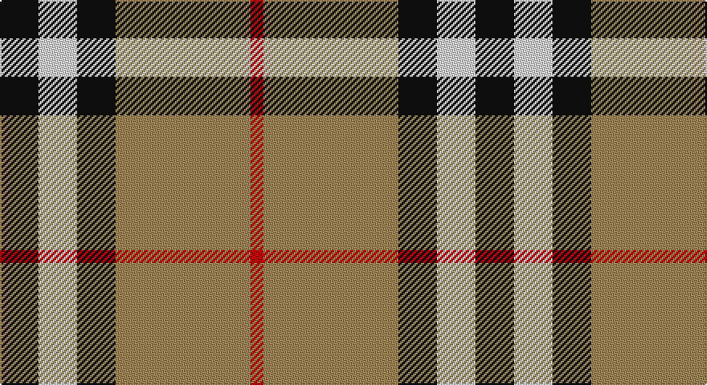

This page is one **sett** — a single exact thread-count. It belongs to the [tartan](/setts/k6w6k6lo21r2/)
(the same proportion at any scale), whose colour order is pattern [KWKYR](/stripes/kwkyr/).

Part of the [Burberry Check](/tartans/burberry-check/) tartan — the named design grouping this sett with its other cloths.

Sourced from house-of-tartan.  It is a [5 stripe tartan](/stripes/stripes5/).

Original link http://www.house-of-tartan.scotland.net/house/TartanViewjs.asp?colr=Def&tnam=1239

## Provenance

Earliest known date: 1984 Nothing

## Also known as

This cloth is also recorded under:

- Burberry, Check

## Thread count
K/24 LN24 K24 LT84 R/8

One full sett is **296 threads**.

## Palette

Palette: <strong>Tartan Register</strong>
<table><thead><tr><th>Colour</th><th>Threads</th><th>Shade</th><th>Base</th><th>OKLCh</th></tr></thead><tbody><tr><td>K/</td><td style="text-align:right;font-variant-numeric:tabular-nums">24</td><td><code style="background-color:#101010;">#101010</code> <small style="color:#888">#101010</small></td><td>K <code style="background-color:#000000;">#000000</code></td><td><small style="color:#888">oklch(17.3% 0.000 89.9)</small></td></tr><tr><td>LN</td><td style="text-align:right;font-variant-numeric:tabular-nums">24</td><td><code style="background-color:#E0E0E0;">#E0E0E0</code> <small style="color:#888">#E0E0E0</small></td><td>W <code style="background-color:#F7F7F7;">#F7F7F7</code></td><td><small style="color:#888">oklch(90.7% 0.000 89.9)</small></td></tr><tr><td>K</td><td style="text-align:right;font-variant-numeric:tabular-nums">24</td><td><code style="background-color:#101010;">#101010</code> <small style="color:#888">#101010</small></td><td>K <code style="background-color:#000000;">#000000</code></td><td><small style="color:#888">oklch(17.3% 0.000 89.9)</small></td></tr><tr><td>LT</td><td style="text-align:right;font-variant-numeric:tabular-nums">84</td><td><code style="background-color:#A08858;">#A08858</code> <small style="color:#888">#A08858</small></td><td>Y <code style="background-color:#F2BF00;">#F2BF00</code></td><td><small style="color:#888">oklch(63.7% 0.071 84.0)</small></td></tr><tr><td>R/</td><td style="text-align:right;font-variant-numeric:tabular-nums">8</td><td><code style="background-color:#C80000;">#C80000</code> <small style="color:#888">#C80000</small></td><td>R <code style="background-color:#CC0000;">#CC0000</code></td><td><small style="color:#888">oklch(52.3% 0.215 29.2)</small></td></tr></tbody></table>

# Sample pattern

## Nearest tartans

The nearest existing variants by ΔTartan distance, with this tartan at the top so the swatches line up against it.

ΔTartan

Tartan

Sett

—

<a href="/ttd/edit/#slug=k6w6k6lo21r2~x4">Burberry Check Corporate Tartan</a> <a class="nn-out" href="/variants/s5/k6w6k6lo21r2~x4/" title="open its dictionary page">↗</a>

0.53

<a href="/ttd/edit/#slug=k3w3k3ly10r1~x6&amp;base=k6w6k6lo21r2~x4">Burberry (Genuine)</a> <a class="nn-out" href="/variants/s5/k3w3k3ly10r1~x6/" title="open its dictionary page">↗</a>

0.90

<a href="/ttd/edit/#slug=r4lo30k6w13k13w3~x2&amp;base=k6w6k6lo21r2~x4">Thomson Camel</a> <a class="nn-out" href="/variants/s6/r4lo30k6w13k13w3~x2/" title="open its dictionary page">↗</a>

0.92

<a href="/ttd/edit/#slug=y26k10r10ly10y3~x2&amp;base=k6w6k6lo21r2~x4">Ikelman No 2</a> <a class="nn-out" href="/variants/s5/y26k10r10ly10y3~x2/" title="open its dictionary page">↗</a>

0.96

<a href="/ttd/edit/#slug=r4o41k5w14k18r4~x2&amp;base=k6w6k6lo21r2~x4">Downside (Corporate)</a> <a class="nn-out" href="/variants/s6/r4o41k5w14k18r4~x2/" title="open its dictionary page">↗</a>

0.96

<a href="/ttd/edit/#slug=r4k2lb10k10y28k3~x2&amp;base=k6w6k6lo21r2~x4">Thomson Camel (Jedburgh Mill)</a> <a class="nn-out" href="/variants/s6/r4k2lb10k10y28k3~x2/" title="open its dictionary page">↗</a>

0.99

<a href="/ttd/edit/#slug=k4lb4k4o15r2~x4&amp;base=k6w6k6lo21r2~x4">Oban Grey (Fashion)</a> <a class="nn-out" href="/variants/s5/k4lb4k4o15r2~x4/" title="open its dictionary page">↗</a>

1.05

<a href="/ttd/edit/#slug=k6w6k6o21r2~x4&amp;base=k6w6k6lo21r2~x4">Burberry, Check</a> <a class="nn-out" href="/variants/s5/k6w6k6o21r2~x4/" title="open its dictionary page">↗</a>

1.07

<a href="/ttd/edit/#slug=r2lo20k5w10k10w2~x2&amp;base=k6w6k6lo21r2~x4">Thompson Camel Clan Tartan</a> <a class="nn-out" href="/variants/s6/r2lo20k5w10k10w2~x2/" title="open its dictionary page">↗</a>

1.07

<a href="/ttd/edit/#slug=r4ly30k6w13k13w3~x2&amp;base=k6w6k6lo21r2~x4">Thomson, Camel (Fashion)</a> <a class="nn-out" href="/variants/s6/r4ly30k6w13k13w3~x2/" title="open its dictionary page">↗</a>

1.09

<a href="/ttd/edit/#slug=k3w3k3y10r1~x6&amp;base=k6w6k6lo21r2~x4">Burberry Hunting</a> <a class="nn-out" href="/variants/s5/k3w3k3y10r1~x6/" title="open its dictionary page">↗</a>

## Neighbour map

Every grey dot is one of 14360 variants placed by the first two principal components of the ΔTartan feature space (44% of its variance). Red is this tartan; blue dots are its nearest — click one to open its page.

<svg viewBox="0 0 640 380" role="img" style="max-width:100%;height:auto;border:1px solid #e0e0e0;border-radius:4px;display:block" xmlns="http://www.w3.org/2000/svg"><image href="/nn/cloud.v1.png" width="640" height="380"/><a href="/variants/s5/k3w3k3ly10r1~x6/"><circle cx="222.6" cy="195.8" r="4" fill="#3465a4"><title>Burberry (Genuine)</title></circle></a><a href="/variants/s6/r4lo30k6w13k13w3~x2/"><circle cx="189.7" cy="187.9" r="4" fill="#3465a4"><title>Thomson Camel</title></circle></a><a href="/variants/s5/y26k10r10ly10y3~x2/"><circle cx="199.2" cy="216.5" r="4" fill="#3465a4"><title>Ikelman No 2</title></circle></a><a href="/variants/s6/r4o41k5w14k18r4~x2/"><circle cx="223.5" cy="182.6" r="4" fill="#3465a4"><title>Downside (Corporate)</title></circle></a><a href="/variants/s6/r4k2lb10k10y28k3~x2/"><circle cx="260.4" cy="177.6" r="4" fill="#3465a4"><title>Thomson Camel (Jedburgh Mill)</title></circle></a><a href="/variants/s5/k4lb4k4o15r2~x4/"><circle cx="241.8" cy="218.9" r="4" fill="#3465a4"><title>Oban Grey (Fashion)</title></circle></a><a href="/variants/s5/k6w6k6o21r2~x4/"><circle cx="239.1" cy="197.8" r="4" fill="#3465a4"><title>Burberry, Check</title></circle></a><a href="/variants/s6/r2lo20k5w10k10w2~x2/"><circle cx="175.6" cy="191.0" r="4" fill="#3465a4"><title>Thompson Camel Clan Tartan</title></circle></a><a href="/variants/s6/r4ly30k6w13k13w3~x2/"><circle cx="185.0" cy="184.4" r="4" fill="#3465a4"><title>Thomson, Camel (Fashion)</title></circle></a><a href="/variants/s5/k3w3k3y10r1~x6/"><circle cx="231.5" cy="211.6" r="4" fill="#3465a4"><title>Burberry Hunting</title></circle></a><circle cx="243.9" cy="198.7" r="5" fill="#c00000"/></svg>

ID: /variants/s5/k6w6k6lo21r2~x4/
