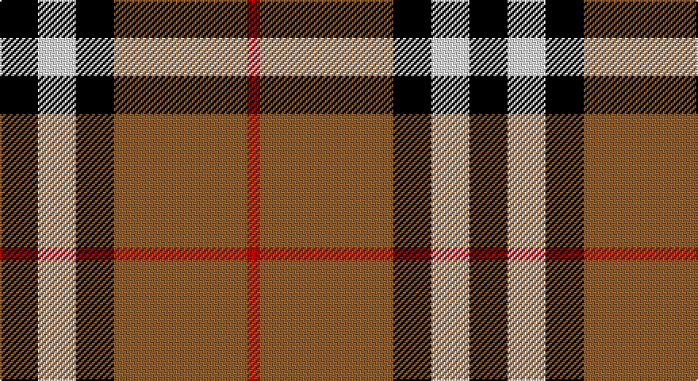

This page is one **sett** — a single exact thread-count. It belongs to the [tartan](/setts/k6w6k6o21r2/)
(the same proportion at any scale), whose colour order is pattern [KWKRR](/stripes/kwkrr/).

Part of the [Burberry Check](/tartans/burberry-check/) tartan — the named design grouping this sett with its other cloths.

Sourced from weddslist.  It is a [5 stripe tartan](/stripes/stripes5/).

Original link http://www.weddslist.com/cgi-bin/tartans/pg.pl?source=sts

## Also known as

This cloth is also recorded under:

- Burberry, Check

## Thread count
K/24 LN24 K24 LT84 R/8

One full sett is **296 threads**.

## Palette

Palette: <strong>Tartan Register</strong> <small style="color:#888">(2 of 4 colours)</small>
<table><thead><tr><th>Colour</th><th>Threads</th><th>Shade</th><th>Base</th><th>OKLCh</th></tr></thead><tbody><tr><td>K/</td><td style="text-align:right;font-variant-numeric:tabular-nums">24</td><td><code style="background-color:#000000;">#000000</code> <small style="color:#888">#000000</small></td><td>K <code style="background-color:#000000;">#000000</code></td><td><small style="color:#888">oklch(0.0% 0.000 0.0)</small></td></tr><tr><td>LN</td><td style="text-align:right;font-variant-numeric:tabular-nums">24</td><td><code style="background-color:#E0E0E0;">#E0E0E0</code> <small style="color:#888">#E0E0E0</small></td><td>W <code style="background-color:#F7F7F7;">#F7F7F7</code></td><td><small style="color:#888">oklch(90.7% 0.000 89.9)</small></td></tr><tr><td>K</td><td style="text-align:right;font-variant-numeric:tabular-nums">24</td><td><code style="background-color:#000000;">#000000</code> <small style="color:#888">#000000</small></td><td>K <code style="background-color:#000000;">#000000</code></td><td><small style="color:#888">oklch(0.0% 0.000 0.0)</small></td></tr><tr><td>LT</td><td style="text-align:right;font-variant-numeric:tabular-nums">84</td><td><code style="background-color:#906030;">#906030</code> <small style="color:#888">#906030</small></td><td>R <code style="background-color:#CC0000;">#CC0000</code></td><td><small style="color:#888">oklch(53.1% 0.089 63.7)</small></td></tr><tr><td>R/</td><td style="text-align:right;font-variant-numeric:tabular-nums">8</td><td><code style="background-color:#C00000;">#C00000</code> <small style="color:#888">#C00000</small></td><td>R <code style="background-color:#CC0000;">#CC0000</code></td><td><small style="color:#888">oklch(50.7% 0.208 29.2)</small></td></tr></tbody></table>

# Sample pattern

## Compared to the master

This cloth is one sett of its design; the master sett (the exemplar the design is anchored on) is below for comparison.

<figure style="margin:0"><figcaption style="color:#888;font-size:smaller">this sett</figcaption></figure>
<figure style="margin:0"><figcaption style="color:#888;font-size:smaller"><a href="/setts/k6w6k6lo21r2/">master sett →</a></figcaption></figure>

## Nearest tartans

The nearest existing variants by ΔTartan distance, with this tartan at the top so the swatches line up against it.

ΔTartan

Tartan

Sett

—

<a href="/ttd/edit/#slug=k6w6k6o21r2~x4">Burberry, Check</a> <a class="nn-out" href="/variants/s5/k6w6k6o21r2~x4/" title="open its dictionary page">↗</a>

0.91

<a href="/ttd/edit/#slug=o80k52w7oi12&amp;base=k6w6k6o21r2~x4">Oklahoma State University</a> <a class="nn-out" href="/variants/s4/o80k52w7oi12/" title="open its dictionary page">↗</a>

1.04

<a href="/ttd/edit/#slug=r4o30k6w13k13w3~x2&amp;base=k6w6k6o21r2~x4">Thom(p)son camel</a> <a class="nn-out" href="/variants/s6/r4o30k6w13k13w3~x2/" title="open its dictionary page">↗</a>

1.04

<a href="/ttd/edit/#slug=lb5o34k24o4r24o4~x2&amp;base=k6w6k6o21r2~x4">Wcwm 759-3</a> <a class="nn-out" href="/variants/s6/lb5o34k24o4r24o4~x2/" title="open its dictionary page">↗</a>

1.05

<a href="/ttd/edit/#slug=k6w6k6lo21r2~x4&amp;base=k6w6k6o21r2~x4">Burberry Check Corporate Tartan</a> <a class="nn-out" href="/variants/s5/k6w6k6lo21r2~x4/" title="open its dictionary page">↗</a>

1.05

<a href="/ttd/edit/#slug=k3lb3k3n10r1~x6&amp;base=k6w6k6o21r2~x4">Greystone (Burberry Grey)</a> <a class="nn-out" href="/variants/s5/k3lb3k3n10r1~x6/" title="open its dictionary page">↗</a>

1.08

<a href="/ttd/edit/#slug=k3ly18dg6r17k31dg3~x2&amp;base=k6w6k6o21r2~x4">MacMillan Varient (Unidentified)</a> <a class="nn-out" href="/variants/s6/k3ly18dg6r17k31dg3~x2/" title="open its dictionary page">↗</a>

1.14

<a href="/ttd/edit/#slug=r2dg17r8db8ly2~x4&amp;base=k6w6k6o21r2~x4">British Hills</a> <a class="nn-out" href="/variants/s5/r2dg17r8db8ly2~x4/" title="open its dictionary page">↗</a>

1.17

<a href="/ttd/edit/#slug=r10w2k10w10o35k5~x2&amp;base=k6w6k6o21r2~x4">Loch Ness</a> <a class="nn-out" href="/variants/s6/r10w2k10w10o35k5~x2/" title="open its dictionary page">↗</a>

1.17

<a href="/ttd/edit/#slug=y26k10r10ly10y3~x2&amp;base=k6w6k6o21r2~x4">Ikelman No 2</a> <a class="nn-out" href="/variants/s5/y26k10r10ly10y3~x2/" title="open its dictionary page">↗</a>

1.18

<a href="/ttd/edit/#slug=r10w2k10w10dy35k5~x2&amp;base=k6w6k6o21r2~x4">Loch Ness</a> <a class="nn-out" href="/variants/s6/r10w2k10w10dy35k5~x2/" title="open its dictionary page">↗</a>

## Neighbour map

Every grey dot is one of 14360 variants placed by the first two principal components of the ΔTartan feature space (44% of its variance). Red is this tartan; blue dots are its nearest — click one to open its page.

<svg viewBox="0 0 640 380" role="img" style="max-width:100%;height:auto;border:1px solid #e0e0e0;border-radius:4px;display:block" xmlns="http://www.w3.org/2000/svg"><image href="/nn/cloud.v1.png" width="640" height="380"/><a href="/variants/s4/o80k52w7oi12/"><circle cx="263.5" cy="200.0" r="4" fill="#3465a4"><title>Oklahoma State University</title></circle></a><a href="/variants/s6/r4o30k6w13k13w3~x2/"><circle cx="184.3" cy="188.4" r="4" fill="#3465a4"><title>Thom(p)son camel</title></circle></a><a href="/variants/s6/lb5o34k24o4r24o4~x2/"><circle cx="190.3" cy="203.2" r="4" fill="#3465a4"><title>Wcwm 759-3</title></circle></a><a href="/variants/s5/k6w6k6lo21r2~x4/"><circle cx="243.9" cy="198.7" r="4" fill="#3465a4"><title>Burberry Check Corporate Tartan</title></circle></a><a href="/variants/s5/k3lb3k3n10r1~x6/"><circle cx="230.4" cy="210.3" r="4" fill="#3465a4"><title>Greystone (Burberry Grey)</title></circle></a><a href="/variants/s6/k3ly18dg6r17k31dg3~x2/"><circle cx="188.9" cy="191.9" r="4" fill="#3465a4"><title>MacMillan Varient (Unidentified)</title></circle></a><a href="/variants/s5/r2dg17r8db8ly2~x4/"><circle cx="220.0" cy="222.2" r="4" fill="#3465a4"><title>British Hills</title></circle></a><a href="/variants/s6/r10w2k10w10o35k5~x2/"><circle cx="240.1" cy="161.7" r="4" fill="#3465a4"><title>Loch Ness</title></circle></a><a href="/variants/s5/y26k10r10ly10y3~x2/"><circle cx="199.2" cy="216.5" r="4" fill="#3465a4"><title>Ikelman No 2</title></circle></a><a href="/variants/s6/r10w2k10w10dy35k5~x2/"><circle cx="252.3" cy="170.0" r="4" fill="#3465a4"><title>Loch Ness</title></circle></a><circle cx="239.1" cy="197.8" r="5" fill="#c00000"/></svg>

ID: /variants/s5/k6w6k6o21r2~x4/
