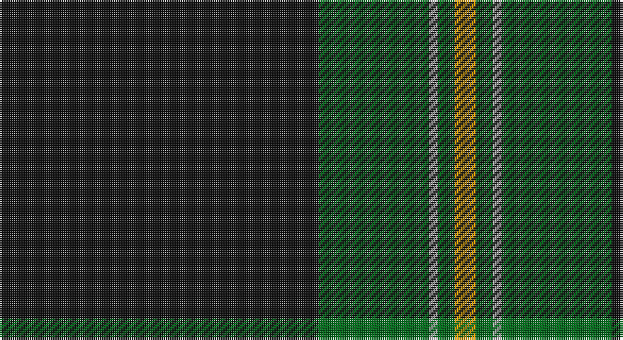

This page is one **sett** — a single exact thread-count. It belongs to the [tartan](/setts/k75g26lr2g4lo5/)
(the same proportion at any scale), whose colour order is pattern [KGYGY](/stripes/kgygy/).

Part of the [Perry Hunting](/tartans/perry-hunting/) tartan — the named design grouping this sett with its other cloths.

Sourced from register-of-tartans.  It is a [5 stripe tartan](/stripes/stripes5/).

Original link https://www.tartanregister.gov.uk/tartanDetails.aspx?ref=3323

## Also known as

This cloth is also recorded under:

- Perry Htg
- Perry, hunting

2 attestations — the source records this cloth was collapsed from (oldest owns this page)

<ul>
<li>01/01/1986 — Perry Hunting (Green) (Personal) (register-of-tartans, <a href="https://www.tartanregister.gov.uk/tartanDetails.aspx?ref=3323">record</a>)</li>
<li>1986 — Perry Htg (Personal) (tartans-authority, <a href="http://www.tartansauthority.com/tartan-ferret/display/1119/">record</a>)</li>
</ul>

## Register references

External register numbers recorded for this tartan.

- Scottish Register of Tartans: [3323](https://www.tartanregister.gov.uk/tartanDetails.aspx?ref=3323)
- Scottish Tartans Authority (ITI): 1119
- Scottish Tartans World Register: 1119

## Thread count
K/150 G52 N4 G8 DY/10

One full sett is **288 threads**.

## Palette

Palette: <strong>Tartan Register</strong> <small style="color:#888">(2 of 4 colours)</small>
<table><thead><tr><th>Colour</th><th>Threads</th><th>Shade</th><th>Base</th><th>OKLCh</th></tr></thead><tbody><tr><td>K/</td><td style="text-align:right;font-variant-numeric:tabular-nums">150</td><td><code style="background-color:#101010;">#101010</code> <small style="color:#888">#101010</small></td><td>K <code style="background-color:#000000;">#000000</code></td><td><small style="color:#888">oklch(17.3% 0.000 89.9)</small></td></tr><tr><td>G</td><td style="text-align:right;font-variant-numeric:tabular-nums">52</td><td><code style="background-color:#006818;">#006818</code> <small style="color:#888">#006818</small></td><td>G <code style="background-color:#006100;">#006100</code></td><td><small style="color:#888">oklch(45.0% 0.142 145.0)</small></td></tr><tr><td>N</td><td style="text-align:right;font-variant-numeric:tabular-nums">4</td><td><code style="background-color:#B8B8B8;">#B8B8B8</code> <small style="color:#888">#B8B8B8</small></td><td>Y <code style="background-color:#F2BF00;">#F2BF00</code></td><td><small style="color:#888">oklch(78.3% 0.000 89.9)</small></td></tr><tr><td>G</td><td style="text-align:right;font-variant-numeric:tabular-nums">8</td><td><code style="background-color:#006818;">#006818</code> <small style="color:#888">#006818</small></td><td>G <code style="background-color:#006100;">#006100</code></td><td><small style="color:#888">oklch(45.0% 0.142 145.0)</small></td></tr><tr><td>DY/</td><td style="text-align:right;font-variant-numeric:tabular-nums">10</td><td><code style="background-color:#D09800;">#D09800</code> <small style="color:#888">#D09800</small></td><td>Y <code style="background-color:#F2BF00;">#F2BF00</code></td><td><small style="color:#888">oklch(71.4% 0.147 82.1)</small></td></tr></tbody></table>

# Sample pattern

## Nearest tartans

The nearest existing variants by ΔTartan distance, with this tartan at the top so the swatches line up against it.

ΔTartan

Tartan

Sett

—

<a href="/ttd/edit/#slug=k75g26lr2g4lo5~x2">Perry Hunting (Green) (Personal)</a> <a class="nn-out" href="/variants/s5/k75g26lr2g4lo5~x2/" title="open its dictionary page">↗</a>

0.71

<a href="/ttd/edit/#slug=k72g23k7g8r1w3~x2&amp;base=k75g26lr2g4lo5~x2">MacGregor, Black (Personal)</a> <a class="nn-out" href="/variants/s6/k72g23k7g8r1w3~x2/" title="open its dictionary page">↗</a>

1.22

<a href="/ttd/edit/#slug=y5ly1k5dg46k5r3~x2&amp;base=k75g26lr2g4lo5~x2">Touch</a> <a class="nn-out" href="/variants/s6/y5ly1k5dg46k5r3~x2/" title="open its dictionary page">↗</a>

1.24

<a href="/ttd/edit/#slug=g12k1r1k12m9k45g9~x2&amp;base=k75g26lr2g4lo5~x2">O'Boyle (Name)</a> <a class="nn-out" href="/variants/s7/g12k1r1k12m9k45g9~x2/" title="open its dictionary page">↗</a>

1.36

<a href="/ttd/edit/#slug=oi4n6k4o8k49oi2&amp;base=k75g26lr2g4lo5~x2">Harley Davidson (Corporate)</a> <a class="nn-out" href="/variants/s6/oi4n6k4o8k49oi2/" title="open its dictionary page">↗</a>

1.41

<a href="/ttd/edit/#slug=n4ly1k4dg32k4r2~x2&amp;base=k75g26lr2g4lo5~x2">Tough (Personal)</a> <a class="nn-out" href="/variants/s6/n4ly1k4dg32k4r2~x2/" title="open its dictionary page">↗</a>

1.45

<a href="/ttd/edit/#slug=k62dt24lo5w3~x2&amp;base=k75g26lr2g4lo5~x2">Perry (Calgary), Alex (Personal)</a> <a class="nn-out" href="/variants/s4/k62dt24lo5w3~x2/" title="open its dictionary page">↗</a>

1.50

<a href="/ttd/edit/#slug=k65r27w2k4ly5~x2&amp;base=k75g26lr2g4lo5~x2">Perry Dress (Personal)</a> <a class="nn-out" href="/variants/s5/k65r27w2k4ly5~x2/" title="open its dictionary page">↗</a>

1.51

<a href="/ttd/edit/#slug=k88g17k8gi28k8r6~x2&amp;base=k75g26lr2g4lo5~x2">Childers Regimental Tartan</a> <a class="nn-out" href="/variants/s6/k88g17k8gi28k8r6~x2/" title="open its dictionary page">↗</a>

1.53

<a href="/ttd/edit/#slug=dg24o2dg3k6o1ly2o1k4~x4&amp;base=k75g26lr2g4lo5~x2">Green Ridge</a> <a class="nn-out" href="/variants/s8/dg24o2dg3k6o1ly2o1k4~x4/" title="open its dictionary page">↗</a>

1.54

<a href="/ttd/edit/#slug=k44g8k4gi13k4w3~x2&amp;base=k75g26lr2g4lo5~x2">Childers (Personal)</a> <a class="nn-out" href="/variants/s6/k44g8k4gi13k4w3~x2/" title="open its dictionary page">↗</a>

## Neighbour map

Every grey dot is one of 14360 variants placed by the first two principal components of the ΔTartan feature space (44% of its variance). Red is this tartan; blue dots are its nearest — click one to open its page.

<svg viewBox="0 0 640 380" role="img" style="max-width:100%;height:auto;border:1px solid #e0e0e0;border-radius:4px;display:block" xmlns="http://www.w3.org/2000/svg"><image href="/nn/cloud.v1.png" width="640" height="380"/><a href="/variants/s6/k72g23k7g8r1w3~x2/"><circle cx="499.6" cy="149.5" r="4" fill="#3465a4"><title>MacGregor, Black (Personal)</title></circle></a><a href="/variants/s6/y5ly1k5dg46k5r3~x2/"><circle cx="482.0" cy="129.0" r="4" fill="#3465a4"><title>Touch</title></circle></a><a href="/variants/s7/g12k1r1k12m9k45g9~x2/"><circle cx="414.7" cy="139.8" r="4" fill="#3465a4"><title>O'Boyle (Name)</title></circle></a><a href="/variants/s6/oi4n6k4o8k49oi2/"><circle cx="488.8" cy="164.8" r="4" fill="#3465a4"><title>Harley Davidson (Corporate)</title></circle></a><a href="/variants/s6/n4ly1k4dg32k4r2~x2/"><circle cx="441.6" cy="143.1" r="4" fill="#3465a4"><title>Tough (Personal)</title></circle></a><a href="/variants/s4/k62dt24lo5w3~x2/"><circle cx="420.9" cy="204.1" r="4" fill="#3465a4"><title>Perry (Calgary), Alex (Personal)</title></circle></a><a href="/variants/s5/k65r27w2k4ly5~x2/"><circle cx="456.4" cy="164.7" r="4" fill="#3465a4"><title>Perry Dress (Personal)</title></circle></a><a href="/variants/s6/k88g17k8gi28k8r6~x2/"><circle cx="408.9" cy="197.5" r="4" fill="#3465a4"><title>Childers Regimental Tartan</title></circle></a><a href="/variants/s8/dg24o2dg3k6o1ly2o1k4~x4/"><circle cx="423.9" cy="165.4" r="4" fill="#3465a4"><title>Green Ridge</title></circle></a><a href="/variants/s6/k44g8k4gi13k4w3~x2/"><circle cx="412.8" cy="193.5" r="4" fill="#3465a4"><title>Childers (Personal)</title></circle></a><circle cx="465.7" cy="167.0" r="5" fill="#c00000"/></svg>

ID: /variants/s5/k75g26lr2g4lo5~x2/
