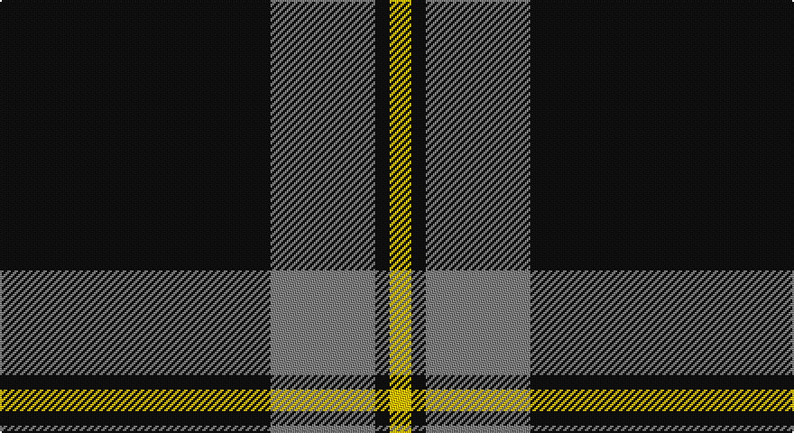

This page is one **sett** — a single exact thread-count. It belongs to the [tartan](/setts/k75y26y3k4ly6/)
(the same proportion at any scale), whose colour order is pattern [KGGKY](/stripes/kggky/).

Part of the [Perry](/tartans/perry/) tartan — the named design grouping this sett with its other cloths.

Sourced from register-of-tartans.  It is a [5 stripe tartan](/stripes/stripes5/).

Original link https://www.tartanregister.gov.uk/tartanDetails.aspx?ref=4806

## Also known as

This cloth is also recorded under:

- Perry / Pirrie
- Perry Ancient
- Perry Pirrie
- Perry, Pirrie

## Register references

External register numbers recorded for this tartan.

- Scottish Register of Tartans: [4806](https://www.tartanregister.gov.uk/tartanDetails.aspx?ref=4806)
- Scottish Tartans Authority (ITI): 1213
- Scottish Tartans World Register: 1213

## Thread count
K/150 N52 N6 K8 Y/12

One full sett is **294 threads**.

## Palette

Palette: <strong>Tartan Register</strong>
<table><thead><tr><th>Colour</th><th>Threads</th><th>Shade</th><th>Base</th><th>OKLCh</th></tr></thead><tbody><tr><td>K/</td><td style="text-align:right;font-variant-numeric:tabular-nums">150</td><td><code style="background-color:#101010;">#101010</code> <small style="color:#888">#101010</small></td><td>K <code style="background-color:#000000;">#000000</code></td><td><small style="color:#888">oklch(17.3% 0.000 89.9)</small></td></tr><tr><td>N</td><td style="text-align:right;font-variant-numeric:tabular-nums">52</td><td><code style="background-color:#808080;">#808080</code> <small style="color:#888">#808080</small></td><td>G <code style="background-color:#006100;">#006100</code></td><td><small style="color:#888">oklch(60.0% 0.000 89.9)</small></td></tr><tr><td>N</td><td style="text-align:right;font-variant-numeric:tabular-nums">6</td><td><code style="background-color:#808080;">#808080</code> <small style="color:#888">#808080</small></td><td>G <code style="background-color:#006100;">#006100</code></td><td><small style="color:#888">oklch(60.0% 0.000 89.9)</small></td></tr><tr><td>K</td><td style="text-align:right;font-variant-numeric:tabular-nums">8</td><td><code style="background-color:#101010;">#101010</code> <small style="color:#888">#101010</small></td><td>K <code style="background-color:#000000;">#000000</code></td><td><small style="color:#888">oklch(17.3% 0.000 89.9)</small></td></tr><tr><td>Y/</td><td style="text-align:right;font-variant-numeric:tabular-nums">12</td><td><code style="background-color:#E8C000;">#E8C000</code> <small style="color:#888">#E8C000</small></td><td>Y <code style="background-color:#F2BF00;">#F2BF00</code></td><td><small style="color:#888">oklch(81.9% 0.168 93.7)</small></td></tr></tbody></table>

# Sample pattern

## Compared to the master

This cloth is one sett of its design; the master sett (the exemplar the design is anchored on) is below for comparison.

<figure style="margin:0"><figcaption style="color:#888;font-size:smaller">this sett</figcaption></figure>
<figure style="margin:0"><figcaption style="color:#888;font-size:smaller"><a href="/setts/k31r12ly2n5k2/">master sett →</a></figcaption></figure>

## Nearest tartans

The nearest existing variants by ΔTartan distance, with this tartan at the top so the swatches line up against it.

ΔTartan

Tartan

Sett

—

<a href="/ttd/edit/#slug=k75y26y3k4ly6~x2">Perry Ancient (Personal)</a> <a class="nn-out" href="/variants/s5/k75y26y3k4ly6~x2/" title="open its dictionary page">↗</a>

0.89

<a href="/ttd/edit/#slug=r1k20lb5r1~x4&amp;base=k75y26y3k4ly6~x2">Dobelman (Personal)</a> <a class="nn-out" href="/variants/s4/r1k20lb5r1~x4/" title="open its dictionary page">↗</a>

1.12

<a href="/ttd/edit/#slug=k53o22k10o10k2o4~x2&amp;base=k75y26y3k4ly6~x2">Black Isle</a> <a class="nn-out" href="/variants/s6/k53o22k10o10k2o4~x2/" title="open its dictionary page">↗</a>

1.14

<a href="/ttd/edit/#slug=r1k9o5k3o5k21o1~x4&amp;base=k75y26y3k4ly6~x2">Sunderland of Scotland (Fashion)</a> <a class="nn-out" href="/variants/s7/r1k9o5k3o5k21o1~x4/" title="open its dictionary page">↗</a>

1.16

<a href="/ttd/edit/#slug=k1o2k7o11k18ly2k1~x2&amp;base=k75y26y3k4ly6~x2">DDB Canada (Fashion)</a> <a class="nn-out" href="/variants/s7/k1o2k7o11k18ly2k1~x2/" title="open its dictionary page">↗</a>

1.24

<a href="/ttd/edit/#slug=r3t12k50ly3~x2&amp;base=k75y26y3k4ly6~x2">Rogues, The (Corporate)</a> <a class="nn-out" href="/variants/s4/r3t12k50ly3~x2/" title="open its dictionary page">↗</a>

1.25

<a href="/ttd/edit/#slug=n124k60w1k2~x2&amp;base=k75y26y3k4ly6~x2">Pride of New Zealand, The</a> <a class="nn-out" href="/variants/s4/n124k60w1k2~x2/" title="open its dictionary page">↗</a>

1.26

<a href="/ttd/edit/#slug=y14k80y14ly5~x2&amp;base=k75y26y3k4ly6~x2">Westgate Fashion Tartan</a> <a class="nn-out" href="/variants/s4/y14k80y14ly5~x2/" title="open its dictionary page">↗</a>

1.29

<a href="/ttd/edit/#slug=r3n12k50ly3~x2&amp;base=k75y26y3k4ly6~x2">Rogues (United States), The</a> <a class="nn-out" href="/variants/s4/r3n12k50ly3~x2/" title="open its dictionary page">↗</a>

1.37

<a href="/ttd/edit/#slug=oi4n6k4o8k49oi2&amp;base=k75y26y3k4ly6~x2">Harley Davidson (Corporate)</a> <a class="nn-out" href="/variants/s6/oi4n6k4o8k49oi2/" title="open its dictionary page">↗</a>

1.39

<a href="/ttd/edit/#slug=k62db15w6ly4~x2&amp;base=k75y26y3k4ly6~x2">C-Tec N.I. Ltd</a> <a class="nn-out" href="/variants/s4/k62db15w6ly4~x2/" title="open its dictionary page">↗</a>

## Neighbour map

Every grey dot is one of 14360 variants placed by the first two principal components of the ΔTartan feature space (44% of its variance). Red is this tartan; blue dots are its nearest — click one to open its page.

<svg viewBox="0 0 640 380" role="img" style="max-width:100%;height:auto;border:1px solid #e0e0e0;border-radius:4px;display:block" xmlns="http://www.w3.org/2000/svg"><image href="/nn/cloud.v1.png" width="640" height="380"/><a href="/variants/s4/r1k20lb5r1~x4/"><circle cx="478.4" cy="199.1" r="4" fill="#3465a4"><title>Dobelman (Personal)</title></circle></a><a href="/variants/s6/k53o22k10o10k2o4~x2/"><circle cx="449.6" cy="199.0" r="4" fill="#3465a4"><title>Black Isle</title></circle></a><a href="/variants/s7/r1k9o5k3o5k21o1~x4/"><circle cx="479.2" cy="194.8" r="4" fill="#3465a4"><title>Sunderland of Scotland (Fashion)</title></circle></a><a href="/variants/s7/k1o2k7o11k18ly2k1~x2/"><circle cx="394.7" cy="188.2" r="4" fill="#3465a4"><title>DDB Canada (Fashion)</title></circle></a><a href="/variants/s4/r3t12k50ly3~x2/"><circle cx="455.3" cy="196.8" r="4" fill="#3465a4"><title>Rogues, The (Corporate)</title></circle></a><a href="/variants/s4/n124k60w1k2~x2/"><circle cx="483.1" cy="180.3" r="4" fill="#3465a4"><title>Pride of New Zealand, The</title></circle></a><a href="/variants/s4/y14k80y14ly5~x2/"><circle cx="475.0" cy="230.3" r="4" fill="#3465a4"><title>Westgate Fashion Tartan</title></circle></a><a href="/variants/s4/r3n12k50ly3~x2/"><circle cx="465.1" cy="201.0" r="4" fill="#3465a4"><title>Rogues (United States), The</title></circle></a><a href="/variants/s6/oi4n6k4o8k49oi2/"><circle cx="488.8" cy="164.8" r="4" fill="#3465a4"><title>Harley Davidson (Corporate)</title></circle></a><a href="/variants/s4/k62db15w6ly4~x2/"><circle cx="423.8" cy="200.2" r="4" fill="#3465a4"><title>C-Tec N.I. Ltd</title></circle></a><circle cx="462.0" cy="183.0" r="5" fill="#c00000"/></svg>

ID: /variants/s5/k75y26y3k4ly6~x2/
