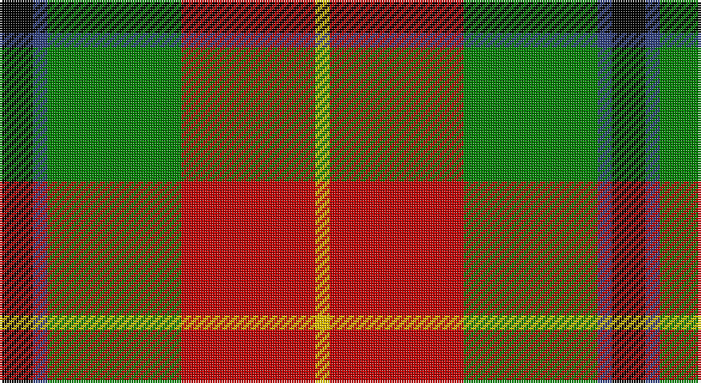

This page is one **sett** — a single exact thread-count. It belongs to the [tartan](/setts/k7db3g28r28ly3/)
(the same proportion at any scale), whose colour order is pattern [KBGRY](/stripes/kbgry/).

Part of the [Turnbull Dress](/tartans/turnbull-dress/) tartan — the named design grouping this sett with its other cloths.

Sourced from weddslist.  It is a [5 stripe tartan](/stripes/stripes5/).

Original link http://www.weddslist.com/cgi-bin/tartans/pg.pl?source=sts

## Provenance

Earliest known date: 1979 An unusual dress tartan having no white.

## Also known as

This cloth is also recorded under:

- Turnbull, dress

2 attestations — the source records this cloth was collapsed from (oldest owns this page)

<ul>
<li>undated — Turnbull, dress (weddslist, <a href="http://www.weddslist.com/cgi-bin/tartans/pg.pl?source=sts">record</a>)</li>
<li>undated — Turnbull Dress Clan Tartan (house-of-tartan, <a href="http://www.house-of-tartan.scotland.net/house/TartanViewjs.asp?colr=Def&tnam=1035">record</a>)</li>
</ul>

## Thread count
K/14 B6 G56 R56 Y/6

One full sett is **256 threads**.

## Palette

Palette: <strong>Ingles Buchan</strong> <small style="color:#888">(1 of 5 colours)</small>
<table><thead><tr><th>Colour</th><th>Threads</th><th>Shade</th><th>Base</th><th>OKLCh</th></tr></thead><tbody><tr><td>K/</td><td style="text-align:right;font-variant-numeric:tabular-nums">14</td><td><code style="background-color:#000000;">#000000</code> <small style="color:#888">#000000</small></td><td>K <code style="background-color:#000000;">#000000</code></td><td><small style="color:#888">oklch(0.0% 0.000 0.0)</small></td></tr><tr><td>B</td><td style="text-align:right;font-variant-numeric:tabular-nums">6</td><td><code style="background-color:#304080;">#304080</code> <small style="color:#888">#304080</small></td><td>B <code style="background-color:#2A418A;">#2A418A</code></td><td><small style="color:#888">oklch(39.4% 0.109 270.2)</small></td></tr><tr><td>G</td><td style="text-align:right;font-variant-numeric:tabular-nums">56</td><td><code style="background-color:#008000;">#008000</code> <small style="color:#888">#008000</small></td><td>G <code style="background-color:#006100;">#006100</code></td><td><small style="color:#888">oklch(52.0% 0.177 142.5)</small></td></tr><tr><td>R</td><td style="text-align:right;font-variant-numeric:tabular-nums">56</td><td><code style="background-color:#C00000;">#C00000</code> <small style="color:#888">#C00000</small></td><td>R <code style="background-color:#CC0000;">#CC0000</code></td><td><small style="color:#888">oklch(50.7% 0.208 29.2)</small></td></tr><tr><td>Y/</td><td style="text-align:right;font-variant-numeric:tabular-nums">6</td><td><code style="background-color:#F0C000;">#F0C000</code> <small style="color:#888">#F0C000</small></td><td>Y <code style="background-color:#F2BF00;">#F2BF00</code></td><td><small style="color:#888">oklch(82.7% 0.169 90.5)</small></td></tr></tbody></table>

# Sample pattern

## Compared to the master

This cloth is one sett of its design; the master sett (the exemplar the design is anchored on) is below for comparison.

<figure style="margin:0"><figcaption style="color:#888;font-size:smaller">this sett</figcaption></figure>
<figure style="margin:0"><figcaption style="color:#888;font-size:smaller"><a href="/setts/k2db1g10r10ly1/">master sett →</a></figcaption></figure>

## Nearest tartans

The nearest existing variants by ΔTartan distance, with this tartan at the top so the swatches line up against it.

ΔTartan

Tartan

Sett

—

<a href="/ttd/edit/#slug=k7db3g28r28ly3~x2">Turnbull, dress</a> <a class="nn-out" href="/variants/s5/k7db3g28r28ly3~x2/" title="open its dictionary page">↗</a>

0.67

<a href="/ttd/edit/#slug=k5db4g24r21w3~x2&amp;base=k7db3g28r28ly3~x2">Sachie Hara Scottish Check (Personal)</a> <a class="nn-out" href="/variants/s5/k5db4g24r21w3~x2/" title="open its dictionary page">↗</a>

0.88

<a href="/ttd/edit/#slug=k2db1g10r10ly1~x6&amp;base=k7db3g28r28ly3~x2">Turnbull Dress</a> <a class="nn-out" href="/variants/s5/k2db1g10r10ly1~x6/" title="open its dictionary page">↗</a>

1.05

<a href="/ttd/edit/#slug=w4dg20g10r25b2r2g2~x2&amp;base=k7db3g28r28ly3~x2">Caledonian Brewery</a> <a class="nn-out" href="/variants/s7/w4dg20g10r25b2r2g2~x2/" title="open its dictionary page">↗</a>

1.17

<a href="/ttd/edit/#slug=k2o20k8dg18o3w2~x2&amp;base=k7db3g28r28ly3~x2">Celtic Combat</a> <a class="nn-out" href="/variants/s6/k2o20k8dg18o3w2~x2/" title="open its dictionary page">↗</a>

1.19

<a href="/ttd/edit/#slug=r15w1db4ly1g15~x4&amp;base=k7db3g28r28ly3~x2">Eglinton, Duke of (Artefact)</a> <a class="nn-out" href="/variants/s5/r15w1db4ly1g15~x4/" title="open its dictionary page">↗</a>

1.20

<a href="/ttd/edit/#slug=db4r11db1g8r2g4k1ly2~x4&amp;base=k7db3g28r28ly3~x2">Craik, of Assington</a> <a class="nn-out" href="/variants/s8/db4r11db1g8r2g4k1ly2~x4/" title="open its dictionary page">↗</a>

1.22

<a href="/ttd/edit/#slug=k6db3dg20r20ly3~x2&amp;base=k7db3g28r28ly3~x2">Douglas of Roxburgh</a> <a class="nn-out" href="/variants/s5/k6db3dg20r20ly3~x2/" title="open its dictionary page">↗</a>

1.24

<a href="/ttd/edit/#slug=w2k11ly11db3k1r1~x2&amp;base=k7db3g28r28ly3~x2">Cornish National #2</a> <a class="nn-out" href="/variants/s6/w2k11ly11db3k1r1~x2/" title="open its dictionary page">↗</a>

1.25

<a href="/ttd/edit/#slug=w2k11ly11t3k1r1~x2&amp;base=k7db3g28r28ly3~x2">Cornish National Small Set Tartan</a> <a class="nn-out" href="/variants/s6/w2k11ly11t3k1r1~x2/" title="open its dictionary page">↗</a>

1.30

<a href="/ttd/edit/#slug=r24w2ly3g16k16w2ly3~x2&amp;base=k7db3g28r28ly3~x2">MacLachlan Old Clan Tartan</a> <a class="nn-out" href="/variants/s7/r24w2ly3g16k16w2ly3~x2/" title="open its dictionary page">↗</a>

## Neighbour map

Every grey dot is one of 14360 variants placed by the first two principal components of the ΔTartan feature space (44% of its variance). Red is this tartan; blue dots are its nearest — click one to open its page.

<svg viewBox="0 0 640 380" role="img" style="max-width:100%;height:auto;border:1px solid #e0e0e0;border-radius:4px;display:block" xmlns="http://www.w3.org/2000/svg"><image href="/nn/cloud.v1.png" width="640" height="380"/><a href="/variants/s5/k5db4g24r21w3~x2/"><circle cx="193.5" cy="202.6" r="4" fill="#3465a4"><title>Sachie Hara Scottish Check (Personal)</title></circle></a><a href="/variants/s5/k2db1g10r10ly1~x6/"><circle cx="235.2" cy="194.8" r="4" fill="#3465a4"><title>Turnbull Dress</title></circle></a><a href="/variants/s7/w4dg20g10r25b2r2g2~x2/"><circle cx="206.6" cy="159.2" r="4" fill="#3465a4"><title>Caledonian Brewery</title></circle></a><a href="/variants/s6/k2o20k8dg18o3w2~x2/"><circle cx="236.7" cy="205.1" r="4" fill="#3465a4"><title>Celtic Combat</title></circle></a><a href="/variants/s5/r15w1db4ly1g15~x4/"><circle cx="249.6" cy="177.9" r="4" fill="#3465a4"><title>Eglinton, Duke of (Artefact)</title></circle></a><a href="/variants/s8/db4r11db1g8r2g4k1ly2~x4/"><circle cx="187.9" cy="170.9" r="4" fill="#3465a4"><title>Craik, of Assington</title></circle></a><a href="/variants/s5/k6db3dg20r20ly3~x2/"><circle cx="164.1" cy="210.7" r="4" fill="#3465a4"><title>Douglas of Roxburgh</title></circle></a><a href="/variants/s6/w2k11ly11db3k1r1~x2/"><circle cx="173.7" cy="159.8" r="4" fill="#3465a4"><title>Cornish National #2</title></circle></a><a href="/variants/s6/w2k11ly11t3k1r1~x2/"><circle cx="172.9" cy="158.9" r="4" fill="#3465a4"><title>Cornish National Small Set Tartan</title></circle></a><a href="/variants/s7/r24w2ly3g16k16w2ly3~x2/"><circle cx="154.4" cy="155.6" r="4" fill="#3465a4"><title>MacLachlan Old Clan Tartan</title></circle></a><circle cx="196.2" cy="189.8" r="5" fill="#c00000"/></svg>

ID: /variants/s5/k7db3g28r28ly3~x2/
