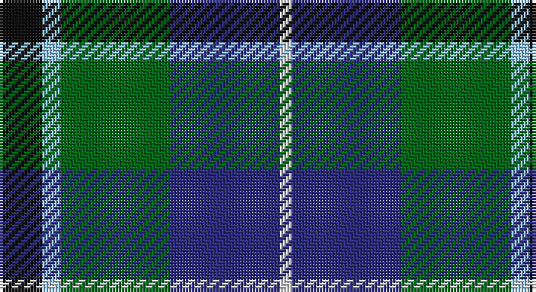

This page is one **sett** — a single exact thread-count. It belongs to the [tartan](/setts/k7lb3g18db18w2/)
(the same proportion at any scale), whose colour order is pattern [KWGBW](/stripes/kwgbw/).

Part of the [Bhatti](/tartans/bhatti/) tartan — the named design grouping this sett with its other cloths.

Sourced from tartans-authority.  It is a [5 stripe tartan](/stripes/stripes5/).

Original link http://www.tartansauthority.com/tartan-ferret/display/7134/

## Register references

External register numbers recorded for this tartan.

- Scottish Tartans Authority (ITI): 7134

## Thread count
K/14 LB6 G36 DB36 LN/4

One full sett is **174 threads**.

## Palette

Palette: <strong>Tartan Register</strong>
<table><thead><tr><th>Colour</th><th>Threads</th><th>Shade</th><th>Base</th><th>OKLCh</th></tr></thead><tbody><tr><td>K/</td><td style="text-align:right;font-variant-numeric:tabular-nums">14</td><td><code style="background-color:#101010;">#101010</code> <small style="color:#888">#101010</small></td><td>K <code style="background-color:#000000;">#000000</code></td><td><small style="color:#888">oklch(17.3% 0.000 89.9)</small></td></tr><tr><td>LB</td><td style="text-align:right;font-variant-numeric:tabular-nums">6</td><td><code style="background-color:#98C8E8;">#98C8E8</code> <small style="color:#888">#98C8E8</small></td><td>W <code style="background-color:#F7F7F7;">#F7F7F7</code></td><td><small style="color:#888">oklch(81.0% 0.068 237.9)</small></td></tr><tr><td>G</td><td style="text-align:right;font-variant-numeric:tabular-nums">36</td><td><code style="background-color:#006818;">#006818</code> <small style="color:#888">#006818</small></td><td>G <code style="background-color:#006100;">#006100</code></td><td><small style="color:#888">oklch(45.0% 0.142 145.0)</small></td></tr><tr><td>DB</td><td style="text-align:right;font-variant-numeric:tabular-nums">36</td><td><code style="background-color:#2C2C80;">#2C2C80</code> <small style="color:#888">#2C2C80</small></td><td>B <code style="background-color:#2A418A;">#2A418A</code></td><td><small style="color:#888">oklch(35.0% 0.138 276.6)</small></td></tr><tr><td>LN/</td><td style="text-align:right;font-variant-numeric:tabular-nums">4</td><td><code style="background-color:#E0E0E0;">#E0E0E0</code> <small style="color:#888">#E0E0E0</small></td><td>W <code style="background-color:#F7F7F7;">#F7F7F7</code></td><td><small style="color:#888">oklch(90.7% 0.000 89.9)</small></td></tr></tbody></table>

# Sample pattern

## Compared to the master

This cloth is one sett of its design; the master sett (the exemplar the design is anchored on) is below for comparison.

<figure style="margin:0"><figcaption style="color:#888;font-size:smaller">this sett</figcaption></figure>
<figure style="margin:0"><figcaption style="color:#888;font-size:smaller"><a href="/setts/k7lt3dg18db18w2/">master sett →</a></figcaption></figure>

## Nearest tartans

The nearest existing variants by ΔTartan distance, with this tartan at the top so the swatches line up against it.

ΔTartan

Tartan

Sett

—

<a href="/ttd/edit/#slug=k7lb3g18db18w2~x2">Bhatti (Name)</a> <a class="nn-out" href="/variants/s5/k7lb3g18db18w2~x2/" title="open its dictionary page">↗</a>

0.59

<a href="/ttd/edit/#slug=k4b2g13db13w2~x4&amp;base=k7lb3g18db18w2~x2">Bath</a> <a class="nn-out" href="/variants/s5/k4b2g13db13w2~x4/" title="open its dictionary page">↗</a>

0.77

<a href="/ttd/edit/#slug=lr4g24db10r3db12lo4~x2&amp;base=k7lb3g18db18w2~x2">Inglis (Name)</a> <a class="nn-out" href="/variants/s6/lr4g24db10r3db12lo4~x2/" title="open its dictionary page">↗</a>

0.79

<a href="/ttd/edit/#slug=db20k6lo4db3g20w2~x2&amp;base=k7lb3g18db18w2~x2">DeLoughery (Personal)</a> <a class="nn-out" href="/variants/s6/db20k6lo4db3g20w2~x2/" title="open its dictionary page">↗</a>

0.82

<a href="/ttd/edit/#slug=k2ly1g10db10w1~x6&amp;base=k7lb3g18db18w2~x2">Turnbull Hunting (1983) #2</a> <a class="nn-out" href="/variants/s5/k2ly1g10db10w1~x6/" title="open its dictionary page">↗</a>

0.86

<a href="/ttd/edit/#slug=r3k2g20k10b20ly2~x2&amp;base=k7lb3g18db18w2~x2">MacLeod of Assynt</a> <a class="nn-out" href="/variants/s6/r3k2g20k10b20ly2~x2/" title="open its dictionary page">↗</a>

0.87

<a href="/ttd/edit/#slug=k7r3g30db28lb3~x2&amp;base=k7lb3g18db18w2~x2">Highlander Highland Laddie</a> <a class="nn-out" href="/variants/s5/k7r3g30db28lb3~x2/" title="open its dictionary page">↗</a>

0.89

<a href="/ttd/edit/#slug=k7m3g29db29w3~x2&amp;base=k7lb3g18db18w2~x2">Highlander, Highland Laddie Kilts</a> <a class="nn-out" href="/variants/s5/k7m3g29db29w3~x2/" title="open its dictionary page">↗</a>

0.91

<a href="/ttd/edit/#slug=g2b22r2k21g23ly2~x2&amp;base=k7lb3g18db18w2~x2">Royal Ashburn Golf Club</a> <a class="nn-out" href="/variants/s6/g2b22r2k21g23ly2~x2/" title="open its dictionary page">↗</a>

0.92

<a href="/ttd/edit/#slug=k7lt3dg18db18w2~x2&amp;base=k7lb3g18db18w2~x2">Bhatti</a> <a class="nn-out" href="/variants/s5/k7lt3dg18db18w2~x2/" title="open its dictionary page">↗</a>

0.92

<a href="/ttd/edit/#slug=k2g17k16r2db17w2~x2&amp;base=k7lb3g18db18w2~x2">Galbraith</a> <a class="nn-out" href="/variants/s6/k2g17k16r2db17w2~x2/" title="open its dictionary page">↗</a>

## Neighbour map

Every grey dot is one of 14360 variants placed by the first two principal components of the ΔTartan feature space (44% of its variance). Red is this tartan; blue dots are its nearest — click one to open its page.

<svg viewBox="0 0 640 380" role="img" style="max-width:100%;height:auto;border:1px solid #e0e0e0;border-radius:4px;display:block" xmlns="http://www.w3.org/2000/svg"><image href="/nn/cloud.v1.png" width="640" height="380"/><a href="/variants/s5/k4b2g13db13w2~x4/"><circle cx="170.2" cy="236.8" r="4" fill="#3465a4"><title>Bath</title></circle></a><a href="/variants/s6/lr4g24db10r3db12lo4~x2/"><circle cx="183.1" cy="209.9" r="4" fill="#3465a4"><title>Inglis (Name)</title></circle></a><a href="/variants/s6/db20k6lo4db3g20w2~x2/"><circle cx="206.5" cy="204.1" r="4" fill="#3465a4"><title>DeLoughery (Personal)</title></circle></a><a href="/variants/s5/k2ly1g10db10w1~x6/"><circle cx="215.3" cy="205.5" r="4" fill="#3465a4"><title>Turnbull Hunting (1983) #2</title></circle></a><a href="/variants/s6/r3k2g20k10b20ly2~x2/"><circle cx="169.4" cy="203.8" r="4" fill="#3465a4"><title>MacLeod of Assynt</title></circle></a><a href="/variants/s5/k7r3g30db28lb3~x2/"><circle cx="222.2" cy="214.8" r="4" fill="#3465a4"><title>Highlander Highland Laddie</title></circle></a><a href="/variants/s5/k7m3g29db29w3~x2/"><circle cx="198.1" cy="205.9" r="4" fill="#3465a4"><title>Highlander, Highland Laddie Kilts</title></circle></a><a href="/variants/s6/g2b22r2k21g23ly2~x2/"><circle cx="175.5" cy="200.3" r="4" fill="#3465a4"><title>Royal Ashburn Golf Club</title></circle></a><a href="/variants/s5/k7lt3dg18db18w2~x2/"><circle cx="165.2" cy="226.3" r="4" fill="#3465a4"><title>Bhatti</title></circle></a><a href="/variants/s6/k2g17k16r2db17w2~x2/"><circle cx="151.3" cy="214.4" r="4" fill="#3465a4"><title>Galbraith</title></circle></a><circle cx="167.8" cy="221.7" r="5" fill="#c00000"/></svg>

ID: /variants/s5/k7lb3g18db18w2~x2/
