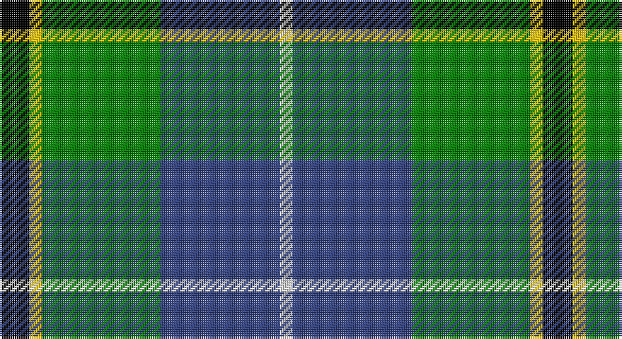

This page is one **sett** — a single exact thread-count. It belongs to the [tartan](/setts/k7ly3g28db28w3/)
(the same proportion at any scale), whose colour order is pattern [KYGBW](/stripes/kygbw/).

Part of the [Turnbull Hunting](/tartans/turnbull-hunting/) tartan — the named design grouping this sett with its other cloths.

Sourced from weddslist.  It is a [5 stripe tartan](/stripes/stripes5/).

Original link http://www.weddslist.com/cgi-bin/tartans/pg.pl?source=sts

## Provenance

Earliest known date: pre 2003 An unusual dress tartan having no white.

## Also known as

This cloth is also recorded under:

- Turnbull Hunting #2
- Turnbull, hunting

2 attestations — the source records this cloth was collapsed from (oldest owns this page)

<ul>
<li>undated — Turnbull, hunting (weddslist, <a href="http://www.weddslist.com/cgi-bin/tartans/pg.pl?source=sts">record</a>)</li>
<li>undated — Turnbull Hunting Clan Tartan (house-of-tartan, <a href="http://www.house-of-tartan.scotland.net/house/TartanViewjs.asp?colr=Def&tnam=1265">record</a>)</li>
</ul>

## Thread count
K/14 Y6 G56 B56 LN/6

One full sett is **256 threads**.

## Palette

Palette: <strong>Tartan Register</strong> <small style="color:#888">(2 of 5 colours)</small>
<table><thead><tr><th>Colour</th><th>Threads</th><th>Shade</th><th>Base</th><th>OKLCh</th></tr></thead><tbody><tr><td>K/</td><td style="text-align:right;font-variant-numeric:tabular-nums">14</td><td><code style="background-color:#000000;">#000000</code> <small style="color:#888">#000000</small></td><td>K <code style="background-color:#000000;">#000000</code></td><td><small style="color:#888">oklch(0.0% 0.000 0.0)</small></td></tr><tr><td>Y</td><td style="text-align:right;font-variant-numeric:tabular-nums">6</td><td><code style="background-color:#F0C000;">#F0C000</code> <small style="color:#888">#F0C000</small></td><td>Y <code style="background-color:#F2BF00;">#F2BF00</code></td><td><small style="color:#888">oklch(82.7% 0.169 90.5)</small></td></tr><tr><td>G</td><td style="text-align:right;font-variant-numeric:tabular-nums">56</td><td><code style="background-color:#008000;">#008000</code> <small style="color:#888">#008000</small></td><td>G <code style="background-color:#006100;">#006100</code></td><td><small style="color:#888">oklch(52.0% 0.177 142.5)</small></td></tr><tr><td>B</td><td style="text-align:right;font-variant-numeric:tabular-nums">56</td><td><code style="background-color:#304080;">#304080</code> <small style="color:#888">#304080</small></td><td>B <code style="background-color:#2A418A;">#2A418A</code></td><td><small style="color:#888">oklch(39.4% 0.109 270.2)</small></td></tr><tr><td>LN/</td><td style="text-align:right;font-variant-numeric:tabular-nums">6</td><td><code style="background-color:#E0E0E0;">#E0E0E0</code> <small style="color:#888">#E0E0E0</small></td><td>W <code style="background-color:#F7F7F7;">#F7F7F7</code></td><td><small style="color:#888">oklch(90.7% 0.000 89.9)</small></td></tr></tbody></table>

# Sample pattern

## Compared to the master

This cloth is one sett of its design; the master sett (the exemplar the design is anchored on) is below for comparison.

<figure style="margin:0"><figcaption style="color:#888;font-size:smaller">this sett</figcaption></figure>
<figure style="margin:0"><figcaption style="color:#888;font-size:smaller"><a href="/setts/r7ly3dg28db28w3/">master sett →</a></figcaption></figure>

## Nearest tartans

The nearest existing variants by ΔTartan distance, with this tartan at the top so the swatches line up against it.

ΔTartan

Tartan

Sett

—

<a href="/ttd/edit/#slug=k7ly3g28db28w3~x2">Turnbull, hunting</a> <a class="nn-out" href="/variants/s5/k7ly3g28db28w3~x2/" title="open its dictionary page">↗</a>

0.35

<a href="/ttd/edit/#slug=k7m3g29db29w3~x2&amp;base=k7ly3g28db28w3~x2">Highlander, Highland Laddie Kilts</a> <a class="nn-out" href="/variants/s5/k7m3g29db29w3~x2/" title="open its dictionary page">↗</a>

0.70

<a href="/ttd/edit/#slug=k1t1g8db8w1~x4&amp;base=k7ly3g28db28w3~x2">Douglas</a> <a class="nn-out" href="/variants/s5/k1t1g8db8w1~x4/" title="open its dictionary page">↗</a>

0.78

<a href="/ttd/edit/#slug=k2ly1g10db10w1~x6&amp;base=k7ly3g28db28w3~x2">Turnbull Hunting (1983) #2</a> <a class="nn-out" href="/variants/s5/k2ly1g10db10w1~x6/" title="open its dictionary page">↗</a>

0.86

<a href="/ttd/edit/#slug=r7ly3g28db28w3~x2&amp;base=k7ly3g28db28w3~x2">Turnbull, hunting</a> <a class="nn-out" href="/variants/s5/r7ly3g28db28w3~x2/" title="open its dictionary page">↗</a>

0.92

<a href="/ttd/edit/#slug=k5g30ly3b15k15b7w3~x2&amp;base=k7ly3g28db28w3~x2">Dick (Personal)</a> <a class="nn-out" href="/variants/s7/k5g30ly3b15k15b7w3~x2/" title="open its dictionary page">↗</a>

0.93

<a href="/ttd/edit/#slug=lr4g24db10r3db12lo4~x2&amp;base=k7ly3g28db28w3~x2">Inglis (Name)</a> <a class="nn-out" href="/variants/s6/lr4g24db10r3db12lo4~x2/" title="open its dictionary page">↗</a>

0.95

<a href="/ttd/edit/#slug=r2ly1g10db10w1~x6&amp;base=k7ly3g28db28w3~x2">Turnbull Hunting (Name)</a> <a class="nn-out" href="/variants/s5/r2ly1g10db10w1~x6/" title="open its dictionary page">↗</a>

0.98

<a href="/ttd/edit/#slug=r2db16k11g19ly2~x2&amp;base=k7ly3g28db28w3~x2">Sanix Modern</a> <a class="nn-out" href="/variants/s5/r2db16k11g19ly2~x2/" title="open its dictionary page">↗</a>

0.98

<a href="/ttd/edit/#slug=db3r2db22k11g24lp2g3~x2&amp;base=k7ly3g28db28w3~x2">MacThomas</a> <a class="nn-out" href="/variants/s7/db3r2db22k11g24lp2g3~x2/" title="open its dictionary page">↗</a>

1.00

<a href="/ttd/edit/#slug=r1g1k1g9db9w1~x6&amp;base=k7ly3g28db28w3~x2">Irving of Bonshaw Tower</a> <a class="nn-out" href="/variants/s6/r1g1k1g9db9w1~x6/" title="open its dictionary page">↗</a>

## Neighbour map

Every grey dot is one of 14360 variants placed by the first two principal components of the ΔTartan feature space (44% of its variance). Red is this tartan; blue dots are its nearest — click one to open its page.

<svg viewBox="0 0 640 380" role="img" style="max-width:100%;height:auto;border:1px solid #e0e0e0;border-radius:4px;display:block" xmlns="http://www.w3.org/2000/svg"><image href="/nn/cloud.v1.png" width="640" height="380"/><a href="/variants/s5/k7m3g29db29w3~x2/"><circle cx="198.1" cy="205.9" r="4" fill="#3465a4"><title>Highlander, Highland Laddie Kilts</title></circle></a><a href="/variants/s5/k1t1g8db8w1~x4/"><circle cx="210.1" cy="212.6" r="4" fill="#3465a4"><title>Douglas</title></circle></a><a href="/variants/s5/k2ly1g10db10w1~x6/"><circle cx="215.3" cy="205.5" r="4" fill="#3465a4"><title>Turnbull Hunting (1983) #2</title></circle></a><a href="/variants/s5/r7ly3g28db28w3~x2/"><circle cx="206.8" cy="209.7" r="4" fill="#3465a4"><title>Turnbull, hunting</title></circle></a><a href="/variants/s7/k5g30ly3b15k15b7w3~x2/"><circle cx="159.9" cy="191.6" r="4" fill="#3465a4"><title>Dick (Personal)</title></circle></a><a href="/variants/s6/lr4g24db10r3db12lo4~x2/"><circle cx="183.1" cy="209.9" r="4" fill="#3465a4"><title>Inglis (Name)</title></circle></a><a href="/variants/s5/r2ly1g10db10w1~x6/"><circle cx="220.5" cy="203.4" r="4" fill="#3465a4"><title>Turnbull Hunting (Name)</title></circle></a><a href="/variants/s5/r2db16k11g19ly2~x2/"><circle cx="135.7" cy="207.5" r="4" fill="#3465a4"><title>Sanix Modern</title></circle></a><a href="/variants/s7/db3r2db22k11g24lp2g3~x2/"><circle cx="195.0" cy="177.1" r="4" fill="#3465a4"><title>MacThomas</title></circle></a><a href="/variants/s6/r1g1k1g9db9w1~x6/"><circle cx="238.0" cy="191.0" r="4" fill="#3465a4"><title>Irving of Bonshaw Tower</title></circle></a><circle cx="185.3" cy="203.5" r="5" fill="#c00000"/></svg>

ID: /variants/s5/k7ly3g28db28w3~x2/
