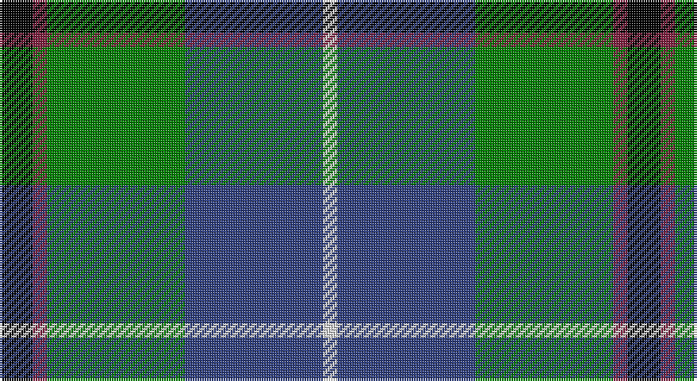

This page is one **sett** — a single exact thread-count. It belongs to the [tartan](/setts/k7m3g29db29w3/)
(the same proportion at any scale), whose colour order is pattern [KRGBW](/stripes/krgbw/).

Sourced from weddslist.  It is a [5 stripe tartan](/stripes/stripes5/).

Original link http://www.weddslist.com/cgi-bin/tartans/pg.pl?source=sts

## Thread count
K/14 DR6 G58 B58 LN/6

One full sett is **264 threads**.

## Palette

Palette: <strong>Tartan Register</strong> <small style="color:#888">(2 of 5 colours)</small>
<table><thead><tr><th>Colour</th><th>Threads</th><th>Shade</th><th>Base</th><th>OKLCh</th></tr></thead><tbody><tr><td>K/</td><td style="text-align:right;font-variant-numeric:tabular-nums">14</td><td><code style="background-color:#000000;">#000000</code> <small style="color:#888">#000000</small></td><td>K <code style="background-color:#000000;">#000000</code></td><td><small style="color:#888">oklch(0.0% 0.000 0.0)</small></td></tr><tr><td>DR</td><td style="text-align:right;font-variant-numeric:tabular-nums">6</td><td><code style="background-color:#802040;">#802040</code> <small style="color:#888">#802040</small></td><td>R <code style="background-color:#CC0000;">#CC0000</code></td><td><small style="color:#888">oklch(40.8% 0.132 5.2)</small></td></tr><tr><td>G</td><td style="text-align:right;font-variant-numeric:tabular-nums">58</td><td><code style="background-color:#008000;">#008000</code> <small style="color:#888">#008000</small></td><td>G <code style="background-color:#006100;">#006100</code></td><td><small style="color:#888">oklch(52.0% 0.177 142.5)</small></td></tr><tr><td>B</td><td style="text-align:right;font-variant-numeric:tabular-nums">58</td><td><code style="background-color:#304080;">#304080</code> <small style="color:#888">#304080</small></td><td>B <code style="background-color:#2A418A;">#2A418A</code></td><td><small style="color:#888">oklch(39.4% 0.109 270.2)</small></td></tr><tr><td>LN/</td><td style="text-align:right;font-variant-numeric:tabular-nums">6</td><td><code style="background-color:#E0E0E0;">#E0E0E0</code> <small style="color:#888">#E0E0E0</small></td><td>W <code style="background-color:#F7F7F7;">#F7F7F7</code></td><td><small style="color:#888">oklch(90.7% 0.000 89.9)</small></td></tr></tbody></table>

# Sample pattern

## Nearest tartans

The nearest existing variants by ΔTartan distance, with this tartan at the top so the swatches line up against it.

ΔTartan

Tartan

Sett

—

<a href="/ttd/edit/#slug=k7m3g29db29w3~x2">Highlander, Highland Laddie Kilts</a> <a class="nn-out" href="/variants/s5/k7m3g29db29w3~x2/" title="open its dictionary page">↗</a>

0.35

<a href="/ttd/edit/#slug=k7ly3g28db28w3~x2&amp;base=k7m3g29db29w3~x2">Turnbull, hunting</a> <a class="nn-out" href="/variants/s5/k7ly3g28db28w3~x2/" title="open its dictionary page">↗</a>

0.47

<a href="/ttd/edit/#slug=k2ly1g10db10w1~x6&amp;base=k7m3g29db29w3~x2">Turnbull Hunting (1983) #2</a> <a class="nn-out" href="/variants/s5/k2ly1g10db10w1~x6/" title="open its dictionary page">↗</a>

0.59

<a href="/ttd/edit/#slug=k1t1g8db8w1~x4&amp;base=k7m3g29db29w3~x2">Douglas</a> <a class="nn-out" href="/variants/s5/k1t1g8db8w1~x4/" title="open its dictionary page">↗</a>

0.70

<a href="/ttd/edit/#slug=r2ly1g10db10w1~x6&amp;base=k7m3g29db29w3~x2">Turnbull Hunting (Name)</a> <a class="nn-out" href="/variants/s5/r2ly1g10db10w1~x6/" title="open its dictionary page">↗</a>

0.76

<a href="/ttd/edit/#slug=r7ly3g28db28w3~x2&amp;base=k7m3g29db29w3~x2">Turnbull, hunting</a> <a class="nn-out" href="/variants/s5/r7ly3g28db28w3~x2/" title="open its dictionary page">↗</a>

0.79

<a href="/ttd/edit/#slug=lr4g24db10r3db12lo4~x2&amp;base=k7m3g29db29w3~x2">Inglis (Name)</a> <a class="nn-out" href="/variants/s6/lr4g24db10r3db12lo4~x2/" title="open its dictionary page">↗</a>

0.79

<a href="/ttd/edit/#slug=k1dbi1g8db8w1~x4&amp;base=k7m3g29db29w3~x2">Douglas, Green (Wilsons)</a> <a class="nn-out" href="/variants/s5/k1dbi1g8db8w1~x4/" title="open its dictionary page">↗</a>

0.89

<a href="/ttd/edit/#slug=r1g9db9k1db1w1~x6&amp;base=k7m3g29db29w3~x2">Irving of Glentulchan</a> <a class="nn-out" href="/variants/s6/r1g9db9k1db1w1~x6/" title="open its dictionary page">↗</a>

0.89

<a href="/ttd/edit/#slug=db3r2db22k11g24lp2g3~x2&amp;base=k7m3g29db29w3~x2">MacThomas</a> <a class="nn-out" href="/variants/s7/db3r2db22k11g24lp2g3~x2/" title="open its dictionary page">↗</a>

0.89

<a href="/ttd/edit/#slug=k7lb3g18db18w2~x2&amp;base=k7m3g29db29w3~x2">Bhatti (Name)</a> <a class="nn-out" href="/variants/s5/k7lb3g18db18w2~x2/" title="open its dictionary page">↗</a>

## Neighbour map

Every grey dot is one of 14360 variants placed by the first two principal components of the ΔTartan feature space (44% of its variance). Red is this tartan; blue dots are its nearest — click one to open its page.

<svg viewBox="0 0 640 380" role="img" style="max-width:100%;height:auto;border:1px solid #e0e0e0;border-radius:4px;display:block" xmlns="http://www.w3.org/2000/svg"><image href="/nn/cloud.v1.png" width="640" height="380"/><a href="/variants/s5/k7ly3g28db28w3~x2/"><circle cx="185.3" cy="203.5" r="4" fill="#3465a4"><title>Turnbull, hunting</title></circle></a><a href="/variants/s5/k2ly1g10db10w1~x6/"><circle cx="215.3" cy="205.5" r="4" fill="#3465a4"><title>Turnbull Hunting (1983) #2</title></circle></a><a href="/variants/s5/k1t1g8db8w1~x4/"><circle cx="210.1" cy="212.6" r="4" fill="#3465a4"><title>Douglas</title></circle></a><a href="/variants/s5/r2ly1g10db10w1~x6/"><circle cx="220.5" cy="203.4" r="4" fill="#3465a4"><title>Turnbull Hunting (Name)</title></circle></a><a href="/variants/s5/r7ly3g28db28w3~x2/"><circle cx="206.8" cy="209.7" r="4" fill="#3465a4"><title>Turnbull, hunting</title></circle></a><a href="/variants/s6/lr4g24db10r3db12lo4~x2/"><circle cx="183.1" cy="209.9" r="4" fill="#3465a4"><title>Inglis (Name)</title></circle></a><a href="/variants/s5/k1dbi1g8db8w1~x4/"><circle cx="219.0" cy="218.1" r="4" fill="#3465a4"><title>Douglas, Green (Wilsons)</title></circle></a><a href="/variants/s6/r1g9db9k1db1w1~x6/"><circle cx="239.0" cy="191.0" r="4" fill="#3465a4"><title>Irving of Glentulchan</title></circle></a><a href="/variants/s7/db3r2db22k11g24lp2g3~x2/"><circle cx="195.0" cy="177.1" r="4" fill="#3465a4"><title>MacThomas</title></circle></a><a href="/variants/s5/k7lb3g18db18w2~x2/"><circle cx="167.8" cy="221.7" r="4" fill="#3465a4"><title>Bhatti (Name)</title></circle></a><circle cx="198.1" cy="205.9" r="5" fill="#c00000"/></svg>

ID: /variants/s5/k7m3g29db29w3~x2/
