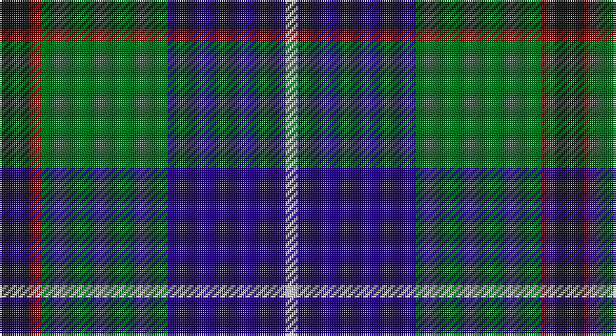

This page is one **sett** — a single exact thread-count. It belongs to the [tartan](/setts/k7r3g30db28lb3/)
(the same proportion at any scale), whose colour order is pattern [KRGBW](/stripes/krgbw/).

Sourced from register-of-tartans.  It is a [5 stripe tartan](/stripes/stripes5/).

Original link https://www.tartanregister.gov.uk/tartanDetails.aspx?ref=1727

## Provenance

Earliest known date: 1997 Sep Can be worn by customers of the Highland Laddie - an Edinburgh Highland outfitters and kilt maker.

## Also known as

This cloth is also recorded under:

- Highlander

3 attestations — the source records this cloth was collapsed from (oldest owns this page)

<ul>
<li>01/09/1997 — Highlander Highland Laddie (register-of-tartans, <a href="https://www.tartanregister.gov.uk/tartanDetails.aspx?ref=1727">record</a>)</li>
<li>1997 Sep — Highlander Highland Laddie (Fashion) (tartans-authority, <a href="http://www.tartansauthority.com/tartan-ferret/display/2396/">record</a>)</li>
<li>undated — Highlander Universal Tartan (house-of-tartan, <a href="http://www.house-of-tartan.scotland.net/house/TartanViewjs.asp?colr=Def&tnam=2396">record</a>)</li>
</ul>

## Register references

External register numbers recorded for this tartan.

- Scottish Register of Tartans: [1727](https://www.tartanregister.gov.uk/tartanDetails.aspx?ref=1727)
- Scottish Tartans Authority (ITI): 2396
- Scottish Tartans World Register: 2396

## Thread count
K/14 DR6 G60 DB56 N/6

One full sett is **264 threads**.

## Palette

Palette: <strong>Tartan Register</strong>
<table><thead><tr><th>Colour</th><th>Threads</th><th>Shade</th><th>Base</th><th>OKLCh</th></tr></thead><tbody><tr><td>K/</td><td style="text-align:right;font-variant-numeric:tabular-nums">14</td><td><code style="background-color:#101010;">#101010</code> <small style="color:#888">#101010</small></td><td>K <code style="background-color:#000000;">#000000</code></td><td><small style="color:#888">oklch(17.3% 0.000 89.9)</small></td></tr><tr><td>DR</td><td style="text-align:right;font-variant-numeric:tabular-nums">6</td><td><code style="background-color:#880000;">#880000</code> <small style="color:#888">#880000</small></td><td>R <code style="background-color:#CC0000;">#CC0000</code></td><td><small style="color:#888">oklch(39.4% 0.162 29.2)</small></td></tr><tr><td>G</td><td style="text-align:right;font-variant-numeric:tabular-nums">60</td><td><code style="background-color:#006818;">#006818</code> <small style="color:#888">#006818</small></td><td>G <code style="background-color:#006100;">#006100</code></td><td><small style="color:#888">oklch(45.0% 0.142 145.0)</small></td></tr><tr><td>DB</td><td style="text-align:right;font-variant-numeric:tabular-nums">56</td><td><code style="background-color:#1C0070;">#1C0070</code> <small style="color:#888">#1C0070</small></td><td>B <code style="background-color:#2A418A;">#2A418A</code></td><td><small style="color:#888">oklch(26.3% 0.162 277.1)</small></td></tr><tr><td>N/</td><td style="text-align:right;font-variant-numeric:tabular-nums">6</td><td><code style="background-color:#C0C0C0;">#C0C0C0</code> <small style="color:#888">#C0C0C0</small></td><td>W <code style="background-color:#F7F7F7;">#F7F7F7</code></td><td><small style="color:#888">oklch(80.8% 0.000 89.9)</small></td></tr></tbody></table>

# Sample pattern

## Nearest tartans

The nearest existing variants by ΔTartan distance, with this tartan at the top so the swatches line up against it.

ΔTartan

Tartan

Sett

—

<a href="/ttd/edit/#slug=k7r3g30db28lb3~x2">Highlander Highland Laddie</a> <a class="nn-out" href="/variants/s5/k7r3g30db28lb3~x2/" title="open its dictionary page">↗</a>

0.53

<a href="/ttd/edit/#slug=k1dbi1g8db8w1~x4&amp;base=k7r3g30db28lb3~x2">Douglas, Green (Wilsons)</a> <a class="nn-out" href="/variants/s5/k1dbi1g8db8w1~x4/" title="open its dictionary page">↗</a>

0.63

<a href="/ttd/edit/#slug=k6g15w2db22r2k4~x2&amp;base=k7r3g30db28lb3~x2">Leslie, Hebridean</a> <a class="nn-out" href="/variants/s6/k6g15w2db22r2k4~x2/" title="open its dictionary page">↗</a>

0.65

<a href="/ttd/edit/#slug=k2ly1g10db10w1~x6&amp;base=k7r3g30db28lb3~x2">Turnbull Hunting (1983) #2</a> <a class="nn-out" href="/variants/s5/k2ly1g10db10w1~x6/" title="open its dictionary page">↗</a>

0.76

<a href="/ttd/edit/#slug=db22w2k10g11r3g4~x2&amp;base=k7r3g30db28lb3~x2">Paterson Blue (Personal)</a> <a class="nn-out" href="/variants/s6/db22w2k10g11r3g4~x2/" title="open its dictionary page">↗</a>

0.81

<a href="/ttd/edit/#slug=db20k6lo4db3g20w2~x2&amp;base=k7r3g30db28lb3~x2">DeLoughery (Personal)</a> <a class="nn-out" href="/variants/s6/db20k6lo4db3g20w2~x2/" title="open its dictionary page">↗</a>

0.81

<a href="/ttd/edit/#slug=k5g32db32r3db3ly3~x2&amp;base=k7r3g30db28lb3~x2">Carmichael</a> <a class="nn-out" href="/variants/s6/k5g32db32r3db3ly3~x2/" title="open its dictionary page">↗</a>

0.82

<a href="/ttd/edit/#slug=k3db3g23db21w2~x2&amp;base=k7r3g30db28lb3~x2">Douglas Clan Tartan</a> <a class="nn-out" href="/variants/s5/k3db3g23db21w2~x2/" title="open its dictionary page">↗</a>

0.87

<a href="/ttd/edit/#slug=k7lb3g18db18w2~x2&amp;base=k7r3g30db28lb3~x2">Bhatti (Name)</a> <a class="nn-out" href="/variants/s5/k7lb3g18db18w2~x2/" title="open its dictionary page">↗</a>

0.87

<a href="/ttd/edit/#slug=r2ly1g10db10w1~x6&amp;base=k7r3g30db28lb3~x2">Turnbull Hunting (Name)</a> <a class="nn-out" href="/variants/s5/r2ly1g10db10w1~x6/" title="open its dictionary page">↗</a>

0.92

<a href="/ttd/edit/#slug=g35k3dbi26k4db4w3~x2&amp;base=k7r3g30db28lb3~x2">Pride of Yorkland (Fashion)</a> <a class="nn-out" href="/variants/s6/g35k3dbi26k4db4w3~x2/" title="open its dictionary page">↗</a>

## Neighbour map

Every grey dot is one of 14360 variants placed by the first two principal components of the ΔTartan feature space (44% of its variance). Red is this tartan; blue dots are its nearest — click one to open its page.

<svg viewBox="0 0 640 380" role="img" style="max-width:100%;height:auto;border:1px solid #e0e0e0;border-radius:4px;display:block" xmlns="http://www.w3.org/2000/svg"><image href="/nn/cloud.v1.png" width="640" height="380"/><a href="/variants/s5/k1dbi1g8db8w1~x4/"><circle cx="219.0" cy="218.1" r="4" fill="#3465a4"><title>Douglas, Green (Wilsons)</title></circle></a><a href="/variants/s6/k6g15w2db22r2k4~x2/"><circle cx="214.4" cy="198.6" r="4" fill="#3465a4"><title>Leslie, Hebridean</title></circle></a><a href="/variants/s5/k2ly1g10db10w1~x6/"><circle cx="215.3" cy="205.5" r="4" fill="#3465a4"><title>Turnbull Hunting (1983) #2</title></circle></a><a href="/variants/s6/db22w2k10g11r3g4~x2/"><circle cx="203.8" cy="205.8" r="4" fill="#3465a4"><title>Paterson Blue (Personal)</title></circle></a><a href="/variants/s6/db20k6lo4db3g20w2~x2/"><circle cx="206.5" cy="204.1" r="4" fill="#3465a4"><title>DeLoughery (Personal)</title></circle></a><a href="/variants/s6/k5g32db32r3db3ly3~x2/"><circle cx="250.5" cy="189.2" r="4" fill="#3465a4"><title>Carmichael</title></circle></a><a href="/variants/s5/k3db3g23db21w2~x2/"><circle cx="258.5" cy="213.5" r="4" fill="#3465a4"><title>Douglas Clan Tartan</title></circle></a><a href="/variants/s5/k7lb3g18db18w2~x2/"><circle cx="167.8" cy="221.7" r="4" fill="#3465a4"><title>Bhatti (Name)</title></circle></a><a href="/variants/s5/r2ly1g10db10w1~x6/"><circle cx="220.5" cy="203.4" r="4" fill="#3465a4"><title>Turnbull Hunting (Name)</title></circle></a><a href="/variants/s6/g35k3dbi26k4db4w3~x2/"><circle cx="252.4" cy="188.9" r="4" fill="#3465a4"><title>Pride of Yorkland (Fashion)</title></circle></a><circle cx="222.2" cy="214.8" r="5" fill="#c00000"/></svg>

ID: /variants/s5/k7r3g30db28lb3~x2/
