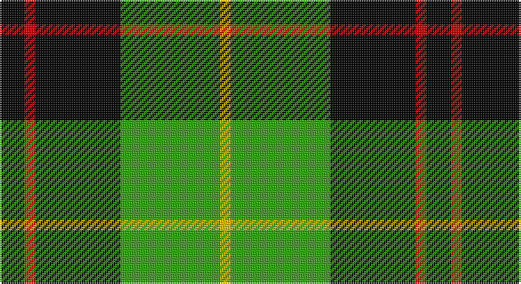

This page is one **sett** — a single exact thread-count. It belongs to the [tartan](/setts/k7r3k24g28ly3/)
(the same proportion at any scale), whose colour order is pattern [KRKGY](/stripes/krkgy/).

Part of the [Robert Gordon University](/tartans/robert-gordon-university/) tartan — the named design grouping this sett with its other cloths.

Sourced from weddslist.  It is a [5 stripe tartan](/stripes/stripes5/).

Original link http://www.weddslist.com/cgi-bin/tartans/pg.pl?source=sts

## Also known as

This cloth is also recorded under:

- Robert Gordon University University

## Thread count
K/14 R6 K48 G56 Y/6

One full sett is **240 threads**.

## Palette

Palette: <strong>Ingles Buchan</strong> <small style="color:#888">(1 of 4 colours)</small>
<table><thead><tr><th>Colour</th><th>Threads</th><th>Shade</th><th>Base</th><th>OKLCh</th></tr></thead><tbody><tr><td>K/</td><td style="text-align:right;font-variant-numeric:tabular-nums">14</td><td><code style="background-color:#000000;">#000000</code> <small style="color:#888">#000000</small></td><td>K <code style="background-color:#000000;">#000000</code></td><td><small style="color:#888">oklch(0.0% 0.000 0.0)</small></td></tr><tr><td>R</td><td style="text-align:right;font-variant-numeric:tabular-nums">6</td><td><code style="background-color:#C00000;">#C00000</code> <small style="color:#888">#C00000</small></td><td>R <code style="background-color:#CC0000;">#CC0000</code></td><td><small style="color:#888">oklch(50.7% 0.208 29.2)</small></td></tr><tr><td>K</td><td style="text-align:right;font-variant-numeric:tabular-nums">48</td><td><code style="background-color:#000000;">#000000</code> <small style="color:#888">#000000</small></td><td>K <code style="background-color:#000000;">#000000</code></td><td><small style="color:#888">oklch(0.0% 0.000 0.0)</small></td></tr><tr><td>G</td><td style="text-align:right;font-variant-numeric:tabular-nums">56</td><td><code style="background-color:#30A010;">#30A010</code> <small style="color:#888">#30A010</small></td><td>G <code style="background-color:#006100;">#006100</code></td><td><small style="color:#888">oklch(61.9% 0.195 140.5)</small></td></tr><tr><td>Y/</td><td style="text-align:right;font-variant-numeric:tabular-nums">6</td><td><code style="background-color:#F0C000;">#F0C000</code> <small style="color:#888">#F0C000</small></td><td>Y <code style="background-color:#F2BF00;">#F2BF00</code></td><td><small style="color:#888">oklch(82.7% 0.169 90.5)</small></td></tr></tbody></table>

# Sample pattern

## Compared to the master

This cloth is one sett of its design; the master sett (the exemplar the design is anchored on) is below for comparison.

<figure style="margin:0"><figcaption style="color:#888;font-size:smaller">this sett</figcaption></figure>
<figure style="margin:0"><figcaption style="color:#888;font-size:smaller"><a href="/setts/k4r2k12db12k1lo2/">master sett →</a></figcaption></figure>

## Nearest tartans

The nearest existing variants by ΔTartan distance, with this tartan at the top so the swatches line up against it.

ΔTartan

Tartan

Sett

—

<a href="/ttd/edit/#slug=k7r3k24g28ly3~x2">Robert Gordon University</a> <a class="nn-out" href="/variants/s5/k7r3k24g28ly3~x2/" title="open its dictionary page">↗</a>

0.85

<a href="/ttd/edit/#slug=k8b5g44k40r6&amp;base=k7r3k24g28ly3~x2">Douglas, Black</a> <a class="nn-out" href="/variants/s5/k8b5g44k40r6/" title="open its dictionary page">↗</a>

0.88

<a href="/ttd/edit/#slug=k7ly1g7t1~x2&amp;base=k7r3k24g28ly3~x2">Wilson's, No 140</a> <a class="nn-out" href="/variants/s4/k7ly1g7t1~x2/" title="open its dictionary page">↗</a>

1.04

<a href="/ttd/edit/#slug=g8r3g30k8w3k36w8~x2&amp;base=k7r3k24g28ly3~x2">Cleghorn (Personal)</a> <a class="nn-out" href="/variants/s7/g8r3g30k8w3k36w8~x2/" title="open its dictionary page">↗</a>

1.08

<a href="/ttd/edit/#slug=r3g24k28g19ly3g3ly3~x2&amp;base=k7r3k24g28ly3~x2">Paton</a> <a class="nn-out" href="/variants/s7/r3g24k28g19ly3g3ly3~x2/" title="open its dictionary page">↗</a>

1.11

<a href="/ttd/edit/#slug=g6r2g13k6w2k16r3~x2&amp;base=k7r3k24g28ly3~x2">Sinclair, hunting</a> <a class="nn-out" href="/variants/s7/g6r2g13k6w2k16r3~x2/" title="open its dictionary page">↗</a>

1.18

<a href="/ttd/edit/#slug=k4g33k33ly4~x2&amp;base=k7r3k24g28ly3~x2">Wallace, hunting</a> <a class="nn-out" href="/variants/s4/k4g33k33ly4~x2/" title="open its dictionary page">↗</a>

1.30

<a href="/ttd/edit/#slug=k2g9t1k6b4g2~x2&amp;base=k7r3k24g28ly3~x2">Unnamed 3</a> <a class="nn-out" href="/variants/s6/k2g9t1k6b4g2~x2/" title="open its dictionary page">↗</a>

1.34

<a href="/ttd/edit/#slug=k19g8k10g31r3&amp;base=k7r3k24g28ly3~x2">MacArthur-Fox</a> <a class="nn-out" href="/variants/s5/k19g8k10g31r3/" title="open its dictionary page">↗</a>

1.35

<a href="/ttd/edit/#slug=k32g6k12g30ly3&amp;base=k7r3k24g28ly3~x2">MacArthur</a> <a class="nn-out" href="/variants/s5/k32g6k12g30ly3/" title="open its dictionary page">↗</a>

1.38

<a href="/ttd/edit/#slug=k12db3g23k23r3~x2&amp;base=k7r3k24g28ly3~x2">Douglas, (Black)</a> <a class="nn-out" href="/variants/s5/k12db3g23k23r3~x2/" title="open its dictionary page">↗</a>

## Neighbour map

Every grey dot is one of 14360 variants placed by the first two principal components of the ΔTartan feature space (44% of its variance). Red is this tartan; blue dots are its nearest — click one to open its page.

<svg viewBox="0 0 640 380" role="img" style="max-width:100%;height:auto;border:1px solid #e0e0e0;border-radius:4px;display:block" xmlns="http://www.w3.org/2000/svg"><image href="/nn/cloud.v1.png" width="640" height="380"/><a href="/variants/s5/k8b5g44k40r6/"><circle cx="237.4" cy="223.9" r="4" fill="#3465a4"><title>Douglas, Black</title></circle></a><a href="/variants/s4/k7ly1g7t1~x2/"><circle cx="201.7" cy="245.8" r="4" fill="#3465a4"><title>Wilson's, No 140</title></circle></a><a href="/variants/s7/g8r3g30k8w3k36w8~x2/"><circle cx="222.7" cy="185.7" r="4" fill="#3465a4"><title>Cleghorn (Personal)</title></circle></a><a href="/variants/s7/r3g24k28g19ly3g3ly3~x2/"><circle cx="262.5" cy="199.6" r="4" fill="#3465a4"><title>Paton</title></circle></a><a href="/variants/s7/g6r2g13k6w2k16r3~x2/"><circle cx="202.9" cy="217.0" r="4" fill="#3465a4"><title>Sinclair, hunting</title></circle></a><a href="/variants/s4/k4g33k33ly4~x2/"><circle cx="273.0" cy="256.9" r="4" fill="#3465a4"><title>Wallace, hunting</title></circle></a><a href="/variants/s6/k2g9t1k6b4g2~x2/"><circle cx="189.6" cy="223.1" r="4" fill="#3465a4"><title>Unnamed 3</title></circle></a><a href="/variants/s5/k19g8k10g31r3/"><circle cx="294.1" cy="249.5" r="4" fill="#3465a4"><title>MacArthur-Fox</title></circle></a><a href="/variants/s5/k32g6k12g30ly3/"><circle cx="292.2" cy="246.1" r="4" fill="#3465a4"><title>MacArthur</title></circle></a><a href="/variants/s5/k12db3g23k23r3~x2/"><circle cx="258.6" cy="245.8" r="4" fill="#3465a4"><title>Douglas, (Black)</title></circle></a><circle cx="232.8" cy="215.8" r="5" fill="#c00000"/></svg>

ID: /variants/s5/k7r3k24g28ly3~x2/
