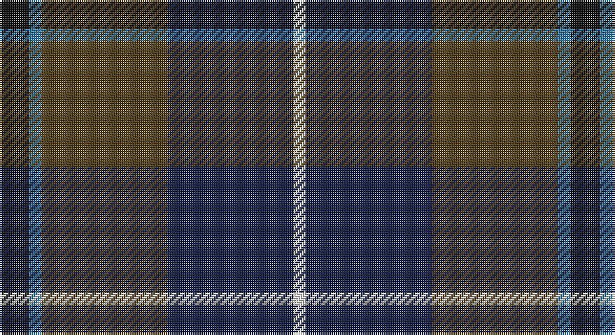

This page is one **sett** — a single exact thread-count. It belongs to the [tartan](/setts/k7t3dy30db30w3/)
(the same proportion at any scale), whose colour order is pattern [KBGBW](/stripes/kbgbw/).

Part of the [Douglas](/tartans/douglas/) tartan — the named design grouping this sett with its other cloths.

Sourced from register-of-tartans.  It is a [5 stripe tartan](/stripes/stripes5/).

Original link https://www.tartanregister.gov.uk/tartanDetails.aspx?ref=963

## Also known as

This cloth is also recorded under:

- Douglas Ancient Red
- Douglas Green
- Douglas,
- Douglas, Black
- Douglas, Green
- Douglas, Grey
- Douglas, brown

## Register references

External register numbers recorded for this tartan.

- Scottish Register of Tartans: [963](https://www.tartanregister.gov.uk/tartanDetails.aspx?ref=963)
- Scottish Tartans World Register: 2523

## Thread count
K/14 B6 T60 DB60 LN/6

One full sett is **272 threads**.

## Palette

Palette: <strong>Tartan Register</strong>
<table><thead><tr><th>Colour</th><th>Threads</th><th>Shade</th><th>Base</th><th>OKLCh</th></tr></thead><tbody><tr><td>K/</td><td style="text-align:right;font-variant-numeric:tabular-nums">14</td><td><code style="background-color:#101010;">#101010</code> <small style="color:#888">#101010</small></td><td>K <code style="background-color:#000000;">#000000</code></td><td><small style="color:#888">oklch(17.3% 0.000 89.9)</small></td></tr><tr><td>B</td><td style="text-align:right;font-variant-numeric:tabular-nums">6</td><td><code style="background-color:#3C82AF;">#3C82AF</code> <small style="color:#888">#3C82AF</small></td><td>B <code style="background-color:#2A418A;">#2A418A</code></td><td><small style="color:#888">oklch(58.1% 0.099 239.8)</small></td></tr><tr><td>T</td><td style="text-align:right;font-variant-numeric:tabular-nums">60</td><td><code style="background-color:#503C14;">#503C14</code> <small style="color:#888">#503C14</small></td><td>G <code style="background-color:#006100;">#006100</code></td><td><small style="color:#888">oklch(37.0% 0.062 81.8)</small></td></tr><tr><td>DB</td><td style="text-align:right;font-variant-numeric:tabular-nums">60</td><td><code style="background-color:#141E46;">#141E46</code> <small style="color:#888">#141E46</small></td><td>B <code style="background-color:#2A418A;">#2A418A</code></td><td><small style="color:#888">oklch(25.2% 0.076 269.7)</small></td></tr><tr><td>LN/</td><td style="text-align:right;font-variant-numeric:tabular-nums">6</td><td><code style="background-color:#E0E0E0;">#E0E0E0</code> <small style="color:#888">#E0E0E0</small></td><td>W <code style="background-color:#F7F7F7;">#F7F7F7</code></td><td><small style="color:#888">oklch(90.7% 0.000 89.9)</small></td></tr></tbody></table>

# Sample pattern

## Compared to the master

This cloth is one sett of its design; the master sett (the exemplar the design is anchored on) is below for comparison.

<figure style="margin:0"><figcaption style="color:#888;font-size:smaller">this sett</figcaption></figure>
<figure style="margin:0"><figcaption style="color:#888;font-size:smaller"><a href="/setts/k6db4dg44k41w4/">master sett →</a></figcaption></figure>

## Nearest tartans

The nearest existing variants by ΔTartan distance, with this tartan at the top so the swatches line up against it.

ΔTartan

Tartan

Sett

—

<a href="/ttd/edit/#slug=k7t3dy30db30w3~x2">Douglas, (Brown)</a> <a class="nn-out" href="/variants/s5/k7t3dy30db30w3~x2/" title="open its dictionary page">↗</a>

0.81

<a href="/ttd/edit/#slug=lo4k28r2do22t8do3~x2&amp;base=k7t3dy30db30w3~x2">Loch Long One Design</a> <a class="nn-out" href="/variants/s6/lo4k28r2do22t8do3~x2/" title="open its dictionary page">↗</a>

0.83

<a href="/ttd/edit/#slug=dg5b2dg9dt19r9ly2~x2&amp;base=k7t3dy30db30w3~x2">Lyle and Scott</a> <a class="nn-out" href="/variants/s6/dg5b2dg9dt19r9ly2~x2/" title="open its dictionary page">↗</a>

0.84

<a href="/ttd/edit/#slug=r3db22k11dg32ly3~x2&amp;base=k7t3dy30db30w3~x2">Cultoquhey Hotel Corporate Tartan</a> <a class="nn-out" href="/variants/s5/r3db22k11dg32ly3~x2/" title="open its dictionary page">↗</a>

0.89

<a href="/ttd/edit/#slug=k6dg11w2db22r2k4~x2&amp;base=k7t3dy30db30w3~x2">Leslie Hebridean Artifact Tartan</a> <a class="nn-out" href="/variants/s6/k6dg11w2db22r2k4~x2/" title="open its dictionary page">↗</a>

0.99

<a href="/ttd/edit/#slug=r2do22g22do3db12y2~x2&amp;base=k7t3dy30db30w3~x2">Lisbon</a> <a class="nn-out" href="/variants/s6/r2do22g22do3db12y2~x2/" title="open its dictionary page">↗</a>

1.06

<a href="/ttd/edit/#slug=dr4dg27o2db25lo5dg3o3~x2&amp;base=k7t3dy30db30w3~x2">Kilkenny, County (District)</a> <a class="nn-out" href="/variants/s7/dr4dg27o2db25lo5dg3o3~x2/" title="open its dictionary page">↗</a>

1.06

<a href="/ttd/edit/#slug=r2db23k14dg16k2w2~x2&amp;base=k7t3dy30db30w3~x2">MacPhail Hunting</a> <a class="nn-out" href="/variants/s6/r2db23k14dg16k2w2~x2/" title="open its dictionary page">↗</a>

1.17

<a href="/ttd/edit/#slug=y27dr2y4o15db26k2db6~x2&amp;base=k7t3dy30db30w3~x2">Bailies of Bennachie Corporate Tartan</a> <a class="nn-out" href="/variants/s7/y27dr2y4o15db26k2db6~x2/" title="open its dictionary page">↗</a>

1.18

<a href="/ttd/edit/#slug=g27ri2g4r15db26k2db6~x2&amp;base=k7t3dy30db30w3~x2">Bailies of Bennachie (Corporate)</a> <a class="nn-out" href="/variants/s7/g27ri2g4r15db26k2db6~x2/" title="open its dictionary page">↗</a>

1.18

<a href="/ttd/edit/#slug=r1n12k6ly1do10r1~x4&amp;base=k7t3dy30db30w3~x2">Andover (Fashion)</a> <a class="nn-out" href="/variants/s6/r1n12k6ly1do10r1~x4/" title="open its dictionary page">↗</a>

## Neighbour map

Every grey dot is one of 14360 variants placed by the first two principal components of the ΔTartan feature space (44% of its variance). Red is this tartan; blue dots are its nearest — click one to open its page.

<svg viewBox="0 0 640 380" role="img" style="max-width:100%;height:auto;border:1px solid #e0e0e0;border-radius:4px;display:block" xmlns="http://www.w3.org/2000/svg"><image href="/nn/cloud.v1.png" width="640" height="380"/><a href="/variants/s6/lo4k28r2do22t8do3~x2/"><circle cx="265.3" cy="202.2" r="4" fill="#3465a4"><title>Loch Long One Design</title></circle></a><a href="/variants/s6/dg5b2dg9dt19r9ly2~x2/"><circle cx="220.3" cy="226.4" r="4" fill="#3465a4"><title>Lyle and Scott</title></circle></a><a href="/variants/s5/r3db22k11dg32ly3~x2/"><circle cx="271.5" cy="244.1" r="4" fill="#3465a4"><title>Cultoquhey Hotel Corporate Tartan</title></circle></a><a href="/variants/s6/k6dg11w2db22r2k4~x2/"><circle cx="261.4" cy="208.8" r="4" fill="#3465a4"><title>Leslie Hebridean Artifact Tartan</title></circle></a><a href="/variants/s6/r2do22g22do3db12y2~x2/"><circle cx="240.9" cy="218.7" r="4" fill="#3465a4"><title>Lisbon</title></circle></a><a href="/variants/s7/dr4dg27o2db25lo5dg3o3~x2/"><circle cx="282.7" cy="195.6" r="4" fill="#3465a4"><title>Kilkenny, County (District)</title></circle></a><a href="/variants/s6/r2db23k14dg16k2w2~x2/"><circle cx="214.9" cy="210.7" r="4" fill="#3465a4"><title>MacPhail Hunting</title></circle></a><a href="/variants/s7/y27dr2y4o15db26k2db6~x2/"><circle cx="261.2" cy="207.7" r="4" fill="#3465a4"><title>Bailies of Bennachie Corporate Tartan</title></circle></a><a href="/variants/s7/g27ri2g4r15db26k2db6~x2/"><circle cx="240.6" cy="195.7" r="4" fill="#3465a4"><title>Bailies of Bennachie (Corporate)</title></circle></a><a href="/variants/s6/r1n12k6ly1do10r1~x4/"><circle cx="241.5" cy="208.7" r="4" fill="#3465a4"><title>Andover (Fashion)</title></circle></a><circle cx="259.5" cy="229.8" r="5" fill="#c00000"/></svg>

ID: /variants/s5/k7t3dy30db30w3~x2/
