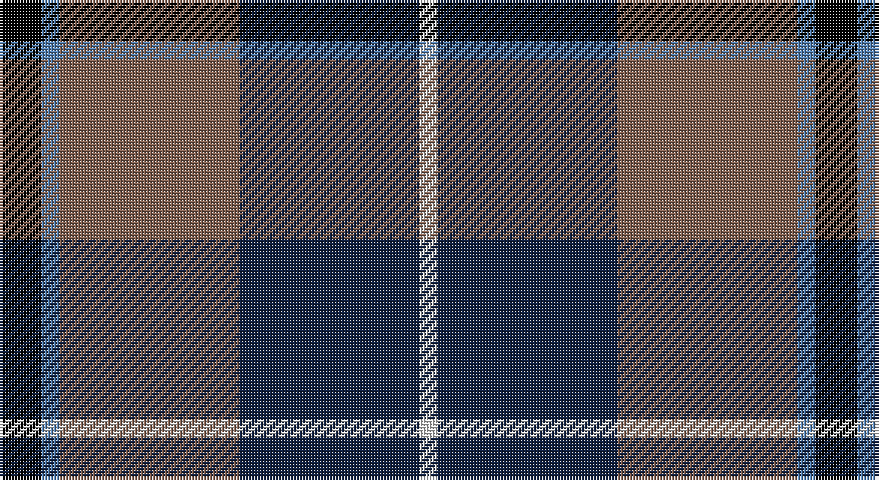

This page is one **sett** — a single exact thread-count. It belongs to the [tartan](/setts/k7t3o30dt30w3/)
(the same proportion at any scale), whose colour order is pattern [KBRBW](/stripes/kbrbw/).

Part of the [Douglas](/tartans/douglas/) tartan — the named design grouping this sett with its other cloths.

Sourced from weddslist.  It is a [5 stripe tartan](/stripes/stripes5/).

Original link http://www.weddslist.com/cgi-bin/tartans/pg.pl?source=sts

## Also known as

This cloth is also recorded under:

- Douglas Ancient Red
- Douglas Green
- Douglas,
- Douglas, Black
- Douglas, Green
- Douglas, Grey
- Douglas, brown

## Thread count
K/14 B6 LT60 DB60 LN/6

One full sett is **272 threads**.

## Palette

Palette: <strong>Tartan Register</strong> <small style="color:#888">(2 of 5 colours)</small>
<table><thead><tr><th>Colour</th><th>Threads</th><th>Shade</th><th>Base</th><th>OKLCh</th></tr></thead><tbody><tr><td>K/</td><td style="text-align:right;font-variant-numeric:tabular-nums">14</td><td><code style="background-color:#000000;">#000000</code> <small style="color:#888">#000000</small></td><td>K <code style="background-color:#000000;">#000000</code></td><td><small style="color:#888">oklch(0.0% 0.000 0.0)</small></td></tr><tr><td>B</td><td style="text-align:right;font-variant-numeric:tabular-nums">6</td><td><code style="background-color:#5480B0;">#5480B0</code> <small style="color:#888">#5480B0</small></td><td>B <code style="background-color:#2A418A;">#2A418A</code></td><td><small style="color:#888">oklch(58.8% 0.089 251.5)</small></td></tr><tr><td>LT</td><td style="text-align:right;font-variant-numeric:tabular-nums">60</td><td><code style="background-color:#806050;">#806050</code> <small style="color:#888">#806050</small></td><td>R <code style="background-color:#CC0000;">#CC0000</code></td><td><small style="color:#888">oklch(51.7% 0.049 47.8)</small></td></tr><tr><td>DB</td><td style="text-align:right;font-variant-numeric:tabular-nums">60</td><td><code style="background-color:#102040;">#102040</code> <small style="color:#888">#102040</small></td><td>B <code style="background-color:#2A418A;">#2A418A</code></td><td><small style="color:#888">oklch(24.9% 0.065 262.6)</small></td></tr><tr><td>LN/</td><td style="text-align:right;font-variant-numeric:tabular-nums">6</td><td><code style="background-color:#E0E0E0;">#E0E0E0</code> <small style="color:#888">#E0E0E0</small></td><td>W <code style="background-color:#F7F7F7;">#F7F7F7</code></td><td><small style="color:#888">oklch(90.7% 0.000 89.9)</small></td></tr></tbody></table>

# Sample pattern

## Compared to the master

This cloth is one sett of its design; the master sett (the exemplar the design is anchored on) is below for comparison.

<figure style="margin:0"><figcaption style="color:#888;font-size:smaller">this sett</figcaption></figure>
<figure style="margin:0"><figcaption style="color:#888;font-size:smaller"><a href="/setts/k6db4dg44k41w4/">master sett →</a></figcaption></figure>

## Nearest tartans

The nearest existing variants by ΔTartan distance, with this tartan at the top so the swatches line up against it.

ΔTartan

Tartan

Sett

—

<a href="/ttd/edit/#slug=k7t3o30dt30w3~x2">Douglas, brown</a> <a class="nn-out" href="/variants/s5/k7t3o30dt30w3~x2/" title="open its dictionary page">↗</a>

0.84

<a href="/ttd/edit/#slug=ly3dt17n9k25lb3~x2&amp;base=k7t3o30dt30w3~x2">Teylu Coleman (Name)</a> <a class="nn-out" href="/variants/s5/ly3dt17n9k25lb3~x2/" title="open its dictionary page">↗</a>

0.91

<a href="/ttd/edit/#slug=w15y98db72r25db8ly15&amp;base=k7t3o30dt30w3~x2">Afternoon Tea / Darjeeling</a> <a class="nn-out" href="/variants/s6/w15y98db72r25db8ly15/" title="open its dictionary page">↗</a>

0.94

<a href="/ttd/edit/#slug=w3k25do9dp17ly3~x2&amp;base=k7t3o30dt30w3~x2">Teylu Coleman (Cornwall)</a> <a class="nn-out" href="/variants/s5/w3k25do9dp17ly3~x2/" title="open its dictionary page">↗</a>

0.95

<a href="/ttd/edit/#slug=db15r6dg8k2w2k2~x6&amp;base=k7t3o30dt30w3~x2">Stovell (2015)</a> <a class="nn-out" href="/variants/s6/db15r6dg8k2w2k2~x6/" title="open its dictionary page">↗</a>

0.95

<a href="/ttd/edit/#slug=w6k29o29dp7k3r3~x2&amp;base=k7t3o30dt30w3~x2">Jewell of Kernow (Personal)</a> <a class="nn-out" href="/variants/s6/w6k29o29dp7k3r3~x2/" title="open its dictionary page">↗</a>

0.96

<a href="/ttd/edit/#slug=m15dt8y25dt72n98w15&amp;base=k7t3o30dt30w3~x2">Afternoon Tea / Black Tea</a> <a class="nn-out" href="/variants/s6/m15dt8y25dt72n98w15/" title="open its dictionary page">↗</a>

0.98

<a href="/ttd/edit/#slug=db22w2k10g11r3g4~x2&amp;base=k7t3o30dt30w3~x2">Paterson Blue (Personal)</a> <a class="nn-out" href="/variants/s6/db22w2k10g11r3g4~x2/" title="open its dictionary page">↗</a>

1.01

<a href="/ttd/edit/#slug=k6g15w2db22r2k4~x2&amp;base=k7t3o30dt30w3~x2">Leslie, Hebridean</a> <a class="nn-out" href="/variants/s6/k6g15w2db22r2k4~x2/" title="open its dictionary page">↗</a>

1.02

<a href="/ttd/edit/#slug=r2ly1g10db10w1~x6&amp;base=k7t3o30dt30w3~x2">Turnbull Hunting (Name)</a> <a class="nn-out" href="/variants/s5/r2ly1g10db10w1~x6/" title="open its dictionary page">↗</a>

1.03

<a href="/ttd/edit/#slug=r12db3g5dbi16ly2g2~x2&amp;base=k7t3o30dt30w3~x2">Dunbog, Primary School</a> <a class="nn-out" href="/variants/s6/r12db3g5dbi16ly2g2~x2/" title="open its dictionary page">↗</a>

## Neighbour map

Every grey dot is one of 14360 variants placed by the first two principal components of the ΔTartan feature space (44% of its variance). Red is this tartan; blue dots are its nearest — click one to open its page.

<svg viewBox="0 0 640 380" role="img" style="max-width:100%;height:auto;border:1px solid #e0e0e0;border-radius:4px;display:block" xmlns="http://www.w3.org/2000/svg"><image href="/nn/cloud.v1.png" width="640" height="380"/><a href="/variants/s5/ly3dt17n9k25lb3~x2/"><circle cx="192.0" cy="222.9" r="4" fill="#3465a4"><title>Teylu Coleman (Name)</title></circle></a><a href="/variants/s6/w15y98db72r25db8ly15/"><circle cx="202.7" cy="181.2" r="4" fill="#3465a4"><title>Afternoon Tea / Darjeeling</title></circle></a><a href="/variants/s5/w3k25do9dp17ly3~x2/"><circle cx="198.2" cy="222.9" r="4" fill="#3465a4"><title>Teylu Coleman (Cornwall)</title></circle></a><a href="/variants/s6/db15r6dg8k2w2k2~x6/"><circle cx="182.0" cy="211.7" r="4" fill="#3465a4"><title>Stovell (2015)</title></circle></a><a href="/variants/s6/w6k29o29dp7k3r3~x2/"><circle cx="188.2" cy="178.3" r="4" fill="#3465a4"><title>Jewell of Kernow (Personal)</title></circle></a><a href="/variants/s6/m15dt8y25dt72n98w15/"><circle cx="211.2" cy="183.6" r="4" fill="#3465a4"><title>Afternoon Tea / Black Tea</title></circle></a><a href="/variants/s6/db22w2k10g11r3g4~x2/"><circle cx="203.8" cy="205.8" r="4" fill="#3465a4"><title>Paterson Blue (Personal)</title></circle></a><a href="/variants/s6/k6g15w2db22r2k4~x2/"><circle cx="214.4" cy="198.6" r="4" fill="#3465a4"><title>Leslie, Hebridean</title></circle></a><a href="/variants/s5/r2ly1g10db10w1~x6/"><circle cx="220.5" cy="203.4" r="4" fill="#3465a4"><title>Turnbull Hunting (Name)</title></circle></a><a href="/variants/s6/r12db3g5dbi16ly2g2~x2/"><circle cx="159.6" cy="194.4" r="4" fill="#3465a4"><title>Dunbog, Primary School</title></circle></a><circle cx="216.1" cy="202.7" r="5" fill="#c00000"/></svg>

ID: /variants/s5/k7t3o30dt30w3~x2/
