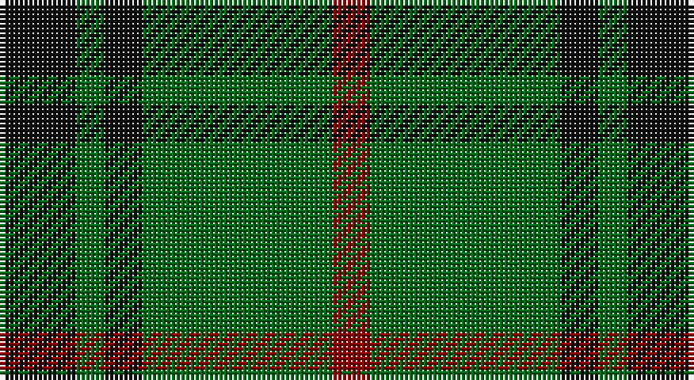

This page is one **sett** — a single exact thread-count. It belongs to the [tartan](/setts/k8g3k4g20r4/)
(the same proportion at any scale), whose colour order is pattern [KGKGR](/stripes/kgkgr/).

Part of the [MacArthur-Fox](/tartans/macarthur-fox/) tartan — the named design grouping this sett with its other cloths.

Sourced from register-of-tartans.  It is a [5 stripe tartan](/stripes/stripes5/).

Original link https://www.tartanregister.gov.uk/tartanDetails.aspx?ref=2282

## Also known as

This cloth is also recorded under:

- MacArthur-Fox Blue
- MacArthur-Fox Dress Personal
- MacArthur-Fox Green
- MacArthur-Fox, dress

## Register references

External register numbers recorded for this tartan.

- Scottish Register of Tartans: [2282](https://www.tartanregister.gov.uk/tartanDetails.aspx?ref=2282)
- Scottish Tartans Authority (ITI): 1088
- Scottish Tartans World Register: 1088

## Thread count
K/16 G6 K8 G40 DR/8

One full sett is **132 threads**.

## Palette

Palette: <strong>Tartan Register</strong>
<table><thead><tr><th>Colour</th><th>Threads</th><th>Shade</th><th>Base</th><th>OKLCh</th></tr></thead><tbody><tr><td>K/</td><td style="text-align:right;font-variant-numeric:tabular-nums">16</td><td><code style="background-color:#101010;">#101010</code> <small style="color:#888">#101010</small></td><td>K <code style="background-color:#000000;">#000000</code></td><td><small style="color:#888">oklch(17.3% 0.000 89.9)</small></td></tr><tr><td>G</td><td style="text-align:right;font-variant-numeric:tabular-nums">6</td><td><code style="background-color:#006818;">#006818</code> <small style="color:#888">#006818</small></td><td>G <code style="background-color:#006100;">#006100</code></td><td><small style="color:#888">oklch(45.0% 0.142 145.0)</small></td></tr><tr><td>K</td><td style="text-align:right;font-variant-numeric:tabular-nums">8</td><td><code style="background-color:#101010;">#101010</code> <small style="color:#888">#101010</small></td><td>K <code style="background-color:#000000;">#000000</code></td><td><small style="color:#888">oklch(17.3% 0.000 89.9)</small></td></tr><tr><td>G</td><td style="text-align:right;font-variant-numeric:tabular-nums">40</td><td><code style="background-color:#006818;">#006818</code> <small style="color:#888">#006818</small></td><td>G <code style="background-color:#006100;">#006100</code></td><td><small style="color:#888">oklch(45.0% 0.142 145.0)</small></td></tr><tr><td>DR/</td><td style="text-align:right;font-variant-numeric:tabular-nums">8</td><td><code style="background-color:#880000;">#880000</code> <small style="color:#888">#880000</small></td><td>R <code style="background-color:#CC0000;">#CC0000</code></td><td><small style="color:#888">oklch(39.4% 0.162 29.2)</small></td></tr></tbody></table>

# Sample pattern

## Compared to the master

This cloth is one sett of its design; the master sett (the exemplar the design is anchored on) is below for comparison.

<figure style="margin:0"><figcaption style="color:#888;font-size:smaller">this sett</figcaption></figure>
<figure style="margin:0"><figcaption style="color:#888;font-size:smaller"><a href="/setts/r2b13dr3b3dr16lb2/">master sett →</a></figcaption></figure>

## Nearest tartans

The nearest existing variants by ΔTartan distance, with this tartan at the top so the swatches line up against it.

ΔTartan

Tartan

Sett

—

<a href="/ttd/edit/#slug=k8g3k4g20r4~x2">MacArthur-Fox (Personal)</a> <a class="nn-out" href="/variants/s5/k8g3k4g20r4~x2/" title="open its dictionary page">↗</a>

0.86

<a href="/ttd/edit/#slug=g22dt5r4dt5r3~x2&amp;base=k8g3k4g20r4~x2">Romsdal</a> <a class="nn-out" href="/variants/s5/g22dt5r4dt5r3~x2/" title="open its dictionary page">↗</a>

1.06

<a href="/ttd/edit/#slug=dg2y14dg8y3dg12lo2~x2&amp;base=k8g3k4g20r4~x2">Confederate Cavalry (Military)</a> <a class="nn-out" href="/variants/s6/dg2y14dg8y3dg12lo2~x2/" title="open its dictionary page">↗</a>

1.14

<a href="/ttd/edit/#slug=g3db8g3k4g15r2~x2&amp;base=k8g3k4g20r4~x2">Lauder (Family)</a> <a class="nn-out" href="/variants/s6/g3db8g3k4g15r2~x2/" title="open its dictionary page">↗</a>

1.16

<a href="/ttd/edit/#slug=g18ly2g18k4g2k15~x2&amp;base=k8g3k4g20r4~x2">MacArthur (Highland Society)</a> <a class="nn-out" href="/variants/s6/g18ly2g18k4g2k15~x2/" title="open its dictionary page">↗</a>

1.24

<a href="/ttd/edit/#slug=dg2o14dg8o3dg12db2~x2&amp;base=k8g3k4g20r4~x2">Confederate Infantry</a> <a class="nn-out" href="/variants/s6/dg2o14dg8o3dg12db2~x2/" title="open its dictionary page">↗</a>

1.25

<a href="/ttd/edit/#slug=dg2o14dg8o3dg12r2~x2&amp;base=k8g3k4g20r4~x2">Confederate Artillery</a> <a class="nn-out" href="/variants/s6/dg2o14dg8o3dg12r2~x2/" title="open its dictionary page">↗</a>

1.30

<a href="/ttd/edit/#slug=dg2n8dg2k3dg12r2~x2&amp;base=k8g3k4g20r4~x2">Wcwm 1045</a> <a class="nn-out" href="/variants/s6/dg2n8dg2k3dg12r2~x2/" title="open its dictionary page">↗</a>

1.30

<a href="/ttd/edit/#slug=k9g3k3g12ly2~x4&amp;base=k8g3k4g20r4~x2">MacArthur</a> <a class="nn-out" href="/variants/s5/k9g3k3g12ly2~x4/" title="open its dictionary page">↗</a>

1.32

<a href="/ttd/edit/#slug=lo1dg11k6dg3lo1dg1lo1~x4&amp;base=k8g3k4g20r4~x2">Angle, Green (Fashion)</a> <a class="nn-out" href="/variants/s7/lo1dg11k6dg3lo1dg1lo1~x4/" title="open its dictionary page">↗</a>

1.35

<a href="/ttd/edit/#slug=g14k3r3lr2~x2&amp;base=k8g3k4g20r4~x2">Bacon, Green (Fashion)</a> <a class="nn-out" href="/variants/s4/g14k3r3lr2~x2/" title="open its dictionary page">↗</a>

## Neighbour map

Every grey dot is one of 14360 variants placed by the first two principal components of the ΔTartan feature space (44% of its variance). Red is this tartan; blue dots are its nearest — click one to open its page.

<svg viewBox="0 0 640 380" role="img" style="max-width:100%;height:auto;border:1px solid #e0e0e0;border-radius:4px;display:block" xmlns="http://www.w3.org/2000/svg"><image href="/nn/cloud.v1.png" width="640" height="380"/><a href="/variants/s5/g22dt5r4dt5r3~x2/"><circle cx="341.5" cy="257.4" r="4" fill="#3465a4"><title>Romsdal</title></circle></a><a href="/variants/s6/dg2y14dg8y3dg12lo2~x2/"><circle cx="336.6" cy="274.7" r="4" fill="#3465a4"><title>Confederate Cavalry (Military)</title></circle></a><a href="/variants/s6/g3db8g3k4g15r2~x2/"><circle cx="328.7" cy="254.2" r="4" fill="#3465a4"><title>Lauder (Family)</title></circle></a><a href="/variants/s6/g18ly2g18k4g2k15~x2/"><circle cx="386.0" cy="265.9" r="4" fill="#3465a4"><title>MacArthur (Highland Society)</title></circle></a><a href="/variants/s6/dg2o14dg8o3dg12db2~x2/"><circle cx="313.3" cy="263.0" r="4" fill="#3465a4"><title>Confederate Infantry</title></circle></a><a href="/variants/s6/dg2o14dg8o3dg12r2~x2/"><circle cx="319.8" cy="263.9" r="4" fill="#3465a4"><title>Confederate Artillery</title></circle></a><a href="/variants/s6/dg2n8dg2k3dg12r2~x2/"><circle cx="294.2" cy="260.3" r="4" fill="#3465a4"><title>Wcwm 1045</title></circle></a><a href="/variants/s5/k9g3k3g12ly2~x4/"><circle cx="282.1" cy="279.6" r="4" fill="#3465a4"><title>MacArthur</title></circle></a><a href="/variants/s7/lo1dg11k6dg3lo1dg1lo1~x4/"><circle cx="396.3" cy="226.6" r="4" fill="#3465a4"><title>Angle, Green (Fashion)</title></circle></a><a href="/variants/s4/g14k3r3lr2~x2/"><circle cx="346.9" cy="251.3" r="4" fill="#3465a4"><title>Bacon, Green (Fashion)</title></circle></a><circle cx="355.6" cy="278.7" r="5" fill="#c00000"/></svg>

ID: /variants/s5/k8g3k4g20r4~x2/
