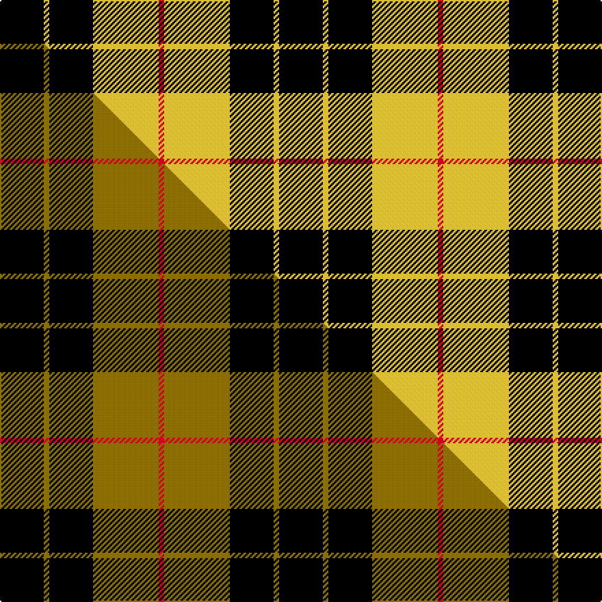

This is one **variant** — a specific cloth: this exact thread count and colourway, with its own
provenance below. It is one weaving of the [sett](/setts/k8ly1k8ly12r1/) (the scale-free proportion — the
same cloth at any scale or shade), whose colour order is pattern [KYKYR](/stripes/kykyr/).

Part of the [MacLeod of Lewis](/tartans/m/ma/macleod-of-lewis/) tartan — the named design grouping this sett with its other cloths.

Sourced from tartans-authority.  It is a [5 stripe tartan](/stripes/stripes5/).

Original link [https://www.tartanregister.gov.uk/tartanDetails.aspx?ref=1272](https://www.tartanregister.gov.uk/tartanDetails.aspx?ref=1272)

Dataset <small>— provenance for this record, inherited from the source manifest</small>

<dl class="dataset-prov">
<dt>source</dt><dd><a href="/sources/tartans-authority/">Scottish Tartans Authority</a></dd>
<dt>data captured from</dt><dd><a href="https://github.com/thetartan/tartan-database/blob/master/data/tartans-authority/data.csv">https://github.com/thetartan/tartan-database/blob/master/data/tartans-authority/data.csv</a></dd>
<dt>data date</dt><dd>1842 <small>(this record)</small></dd>
<dt>licence</dt><dd><a href="https://creativecommons.org/licenses/by-nc-nd/4.0/">CC BY-NC-ND 4.0</a></dd>
</dl>

Capture chain <small>— the hands this data passed through, oldest first; each capture carries its own licence</small>

<ol class="capture-chain">
<li><a href="https://www.tartansauthority.com/">Scottish Tartans Authority</a> <small>the heritage body's archive — its tartan-ferret record browser is retired (links repaired to the SRT, above)</small></li>
<li><a href="https://github.com/thetartan/tartan-database">thetartan/tartan-database</a> <small>2016-2017</small> · <a href="https://creativecommons.org/licenses/by-nc-nd/4.0/">CC BY-NC-ND 4.0</a> <small>Levko Kravets's frozen compilation — the capture we vendored, and where its CC licence text came from</small></li>
<li>this dictionary <small>captured 2026-06-10 · commit 5bf86c7566</small> <small>each re-capture is a git commit to data/sources</small></li>
</ol>

## Register references

External register numbers recorded for this tartan.

- Scottish Tartans Authority (ITI): 1272

## Thread count
K/32 LY4 K32 LY48 R/4

One full sett is **204 threads**.

## Palette
<table><thead><tr><th>Colour</th><th>Shade</th><th>OKLCh</th></tr></thead><tbody><tr><td>K</td><td><code style="background-color:#000000;">#000000</code> <small style="color:#888">#000000</small></td><td><small style="color:#888">oklch(0.0% 0.000 0.0)</small></td></tr><tr><td>R</td><td><code style="background-color:#D60020;">#D60020</code> <small style="color:#888">#D60020</small></td><td><small style="color:#888">oklch(55.2% 0.224 25.5)</small></td></tr><tr><td>LY</td><td><code style="background-color:#DCBC32;">#DCBC32</code> <small style="color:#888">#DCBC32</small></td><td><small style="color:#888">oklch(80.0% 0.150 95.2)</small></td></tr></tbody></table>

# Sample pattern

## Compared to the master

This cloth is one sett of its design; the master sett (the exemplar the design is anchored on) is below for comparison.

Its **ΔTartan distance** from the master is **0.17** — the same measure the nearest-tartans table ranks by (0 is identical; a re-scale of the same cloth is near 0, a recolour or a different proportion further).

<figure class="master-compare" style="margin:0">

this sett
master sett ★

<figcaption style="color:#888;font-size:smaller">One weave of this sett against the <a href="/setts/k8y1k8y12r1/">master sett ★</a>, split on the diagonal: a shared proportion runs seamlessly across it with only the shades shifting; a different proportion breaks on it.</figcaption>
</figure>

## Nearest tartan variants

The nearest existing variants by ΔTartan distance, with this cloth at the top so the swatches line up against it.

ΔTartan

Threads

Variant

Sett

—

204

<a href="/variants/s5/k8ly1k8ly12r1~x4/">MacLeod of Lewis (Clan)</a>

<a href="/ttd/edit/#slug=k8y1k8y12r1~x4&amp;base=k8ly1k8ly12r1~x4" title="compare in the TTD">0.17</a>

204

<a href="/variants/s5/k8y1k8y12r1~x4/">MacLeod of Lewis (Vestiarium Scoticum)</a>

<a href="/ttd/edit/#slug=k8y1k8y12r1~x2&amp;base=k8ly1k8ly12r1~x4" title="compare in the TTD">0.17</a>

102

<a href="/variants/s5/k8y1k8y12r1~x2/">MacLeod of Lewis</a>

<a href="/ttd/edit/#slug=k4y1k4y6r1~x4&amp;base=k8ly1k8ly12r1~x4" title="compare in the TTD">0.59</a>

108

<a href="/variants/s5/k4y1k4y6r1~x4/">MacLeod Dress Clan Tartan</a>

<a href="/ttd/edit/#slug=k6y1k6y9r1y2~x2&amp;base=k8ly1k8ly12r1~x4" title="compare in the TTD">1.39</a>

84

<a href="/variants/s6/k6y1k6y9r1y2~x2/">MacLeod #3</a>

<a href="/ttd/edit/#slug=k8y1k8g13r2~x4&amp;base=k8ly1k8ly12r1~x4" title="compare in the TTD">1.48</a>

216

<a href="/variants/s5/k8y1k8g13r2~x4/">Tolmie</a>

<a href="/ttd/edit/#slug=k23y3k23w36r4~x2&amp;base=k8ly1k8ly12r1~x4" title="compare in the TTD">1.48</a>

302

<a href="/variants/s5/k23y3k23w36r4~x2/">Macleod, Winnifred Mary, Dress</a>

<a href="/ttd/edit/#slug=k4ly32k16r3k16ly4~x2&amp;base=k8ly1k8ly12r1~x4" title="compare in the TTD">1.51</a>

284

<a href="/variants/s6/k4ly32k16r3k16ly4~x2/">Unnamed C21st - Fashion</a>

<a href="/ttd/edit/#slug=k2y6k2y11k9r1~x2&amp;base=k8ly1k8ly12r1~x4" title="compare in the TTD">1.76</a>

118

<a href="/variants/s6/k2y6k2y11k9r1~x2/">Porter Drinkers', The</a>

<a href="/ttd/edit/#slug=k2ly6k2ly11k9r1~x2&amp;base=k8ly1k8ly12r1~x4" title="compare in the TTD">1.76</a>

118

<a href="/variants/s6/k2ly6k2ly11k9r1~x2/">Porter Drinkers (Commemorative)</a>

<a href="/ttd/edit/#slug=k3w3k3y10r1~x6&amp;base=k8ly1k8ly12r1~x4" title="compare in the TTD">1.80</a>

216

<a href="/variants/s5/k3w3k3y10r1~x6/">(6) Burberry</a>

## Neighbour map

Every grey dot is one of 13621 variants placed by the first two principal components of the ΔTartan feature space (42% of its variance). Red is this tartan; blue dots are its nearest — click one to open its page. The map is a flat projection of a many-dimensional space — [how to read it](/posts/neighbourhood-maps/).

<svg viewBox="0 0 640 380" role="img" style="max-width:100%;height:auto;border:1px solid #e0e0e0;border-radius:4px;display:block" xmlns="http://www.w3.org/2000/svg"><image href="/nn/cloud.v1.png" width="640" height="380"/><a href="/variants/s5/k8y1k8y12r1~x4/"><circle cx="280.8" cy="208.2" r="4" fill="#3465a4"><title>MacLeod of Lewis (Vestiarium Scoticum)</title></circle></a><a href="/variants/s5/k8y1k8y12r1~x2/"><circle cx="280.8" cy="208.2" r="4" fill="#3465a4"><title>MacLeod of Lewis</title></circle></a><a href="/variants/s5/k4y1k4y6r1~x4/"><circle cx="230.3" cy="246.2" r="4" fill="#3465a4"><title>MacLeod Dress Clan Tartan</title></circle></a><a href="/variants/s6/k6y1k6y9r1y2~x2/"><circle cx="250.7" cy="214.5" r="4" fill="#3465a4"><title>MacLeod #3</title></circle></a><a href="/variants/s5/k8y1k8g13r2~x4/"><circle cx="227.9" cy="199.7" r="4" fill="#3465a4"><title>Tolmie</title></circle></a><a href="/variants/s5/k23y3k23w36r4~x2/"><circle cx="223.6" cy="192.7" r="4" fill="#3465a4"><title>Macleod, Winnifred Mary, Dress</title></circle></a><a href="/variants/s6/k4ly32k16r3k16ly4~x2/"><circle cx="240.3" cy="192.9" r="4" fill="#3465a4"><title>Unnamed C21st - Fashion</title></circle></a><a href="/variants/s6/k2y6k2y11k9r1~x2/"><circle cx="280.3" cy="202.8" r="4" fill="#3465a4"><title>Porter Drinkers', The</title></circle></a><a href="/variants/s6/k2ly6k2ly11k9r1~x2/"><circle cx="260.0" cy="199.0" r="4" fill="#3465a4"><title>Porter Drinkers (Commemorative)</title></circle></a><a href="/variants/s5/k3w3k3y10r1~x6/"><circle cx="203.6" cy="195.2" r="4" fill="#3465a4"><title>(6) Burberry</title></circle></a><circle cx="262.3" cy="204.9" r="5" fill="#c00000"/><text x="320" y="376" text-anchor="middle" font-size="11" fill="#999">ground</text><text x="11" y="190" text-anchor="middle" font-size="11" fill="#999" transform="rotate(-90 11 190)">complexity</text></svg>

ID: /variants/s5/k8ly1k8ly12r1~x4/
