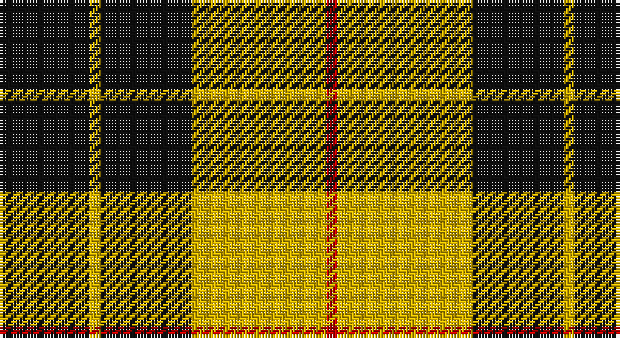

This page is one **sett** — a single exact thread-count. It belongs to the [tartan](/setts/k8ly1k8ly12r1/)
(the same proportion at any scale), whose colour order is pattern [KYKYR](/stripes/kykyr/).

Sourced from register-of-tartans.  It is a [5 stripe tartan](/stripes/stripes5/).

Original link https://www.tartanregister.gov.uk/tartanDetails.aspx?ref=2640

3 attestations — the source records this cloth was collapsed from (oldest owns this page)

<ul>
<li>01/01/1842 — MacLeod of Lewis (Vestiarium Scoticum) (register-of-tartans, <a href="https://www.tartanregister.gov.uk/tartanDetails.aspx?ref=2640">record</a>)</li>
<li>1842 — MacLeod of Lewis (Clan) (tartans-authority, <a href="http://www.tartansauthority.com/tartan-ferret/display/1272/">record</a>)</li>
<li>undated — MacLeod of Lewis (weddslist, <a href="http://www.weddslist.com/cgi-bin/tartans/pg.pl?source=sts">record</a>)</li>
</ul>

## Register references

External register numbers recorded for this tartan.

- Scottish Register of Tartans: [2640](https://www.tartanregister.gov.uk/tartanDetails.aspx?ref=2640)
- Scottish Tartans Authority (ITI): 1272
- Scottish Tartans World Register: 1272

## Thread count
K/32 Y4 K32 Y48 R/4

One full sett is **204 threads**.

## Palette

Palette: <strong>Tartan Register</strong>
<table><thead><tr><th>Colour</th><th>Threads</th><th>Shade</th><th>Base</th><th>OKLCh</th></tr></thead><tbody><tr><td>K/</td><td style="text-align:right;font-variant-numeric:tabular-nums">32</td><td><code style="background-color:#101010;">#101010</code> <small style="color:#888">#101010</small></td><td>K <code style="background-color:#000000;">#000000</code></td><td><small style="color:#888">oklch(17.3% 0.000 89.9)</small></td></tr><tr><td>Y</td><td style="text-align:right;font-variant-numeric:tabular-nums">4</td><td><code style="background-color:#D8B000;">#D8B000</code> <small style="color:#888">#D8B000</small></td><td>Y <code style="background-color:#F2BF00;">#F2BF00</code></td><td><small style="color:#888">oklch(77.1% 0.158 92.3)</small></td></tr><tr><td>K</td><td style="text-align:right;font-variant-numeric:tabular-nums">32</td><td><code style="background-color:#101010;">#101010</code> <small style="color:#888">#101010</small></td><td>K <code style="background-color:#000000;">#000000</code></td><td><small style="color:#888">oklch(17.3% 0.000 89.9)</small></td></tr><tr><td>Y</td><td style="text-align:right;font-variant-numeric:tabular-nums">48</td><td><code style="background-color:#D8B000;">#D8B000</code> <small style="color:#888">#D8B000</small></td><td>Y <code style="background-color:#F2BF00;">#F2BF00</code></td><td><small style="color:#888">oklch(77.1% 0.158 92.3)</small></td></tr><tr><td>R/</td><td style="text-align:right;font-variant-numeric:tabular-nums">4</td><td><code style="background-color:#C80000;">#C80000</code> <small style="color:#888">#C80000</small></td><td>R <code style="background-color:#CC0000;">#CC0000</code></td><td><small style="color:#888">oklch(52.3% 0.215 29.2)</small></td></tr></tbody></table>

# Sample pattern

## Nearest tartans

The nearest existing variants by ΔTartan distance, with this tartan at the top so the swatches line up against it.

ΔTartan

Tartan

Sett

—

<a href="/ttd/edit/#slug=k8ly1k8ly12r1~x4">MacLeod of Lewis (Vestiarium Scoticum)</a> <a class="nn-out" href="/variants/s5/k8ly1k8ly12r1~x4/" title="open its dictionary page">↗</a>

0.87

<a href="/ttd/edit/#slug=k6ly1k6ly9r1ly2~x2&amp;base=k8ly1k8ly12r1~x4">MacLeod #3</a> <a class="nn-out" href="/variants/s6/k6ly1k6ly9r1ly2~x2/" title="open its dictionary page">↗</a>

0.90

<a href="/ttd/edit/#slug=k8ly1k8ly12r1~x2&amp;base=k8ly1k8ly12r1~x4">MacLeod of Lewis</a> <a class="nn-out" href="/variants/s5/k8ly1k8ly12r1~x2/" title="open its dictionary page">↗</a>

1.05

<a href="/ttd/edit/#slug=k4ly32k16r3k16ly4~x2&amp;base=k8ly1k8ly12r1~x4">Unnamed C21st - Fashion</a> <a class="nn-out" href="/variants/s6/k4ly32k16r3k16ly4~x2/" title="open its dictionary page">↗</a>

1.21

<a href="/ttd/edit/#slug=k4lo15k4w2~x2&amp;base=k8ly1k8ly12r1~x4">Takla Makan #2 (Artefact)</a> <a class="nn-out" href="/variants/s4/k4lo15k4w2~x2/" title="open its dictionary page">↗</a>

1.25

<a href="/ttd/edit/#slug=k2ly6k2ly11k9r1~x2&amp;base=k8ly1k8ly12r1~x4">Porter Drinkers', The</a> <a class="nn-out" href="/variants/s6/k2ly6k2ly11k9r1~x2/" title="open its dictionary page">↗</a>

1.26

<a href="/ttd/edit/#slug=k4ly1k4ly6r1~x4&amp;base=k8ly1k8ly12r1~x4">MacLeod Dress Clan Tartan</a> <a class="nn-out" href="/variants/s5/k4ly1k4ly6r1~x4/" title="open its dictionary page">↗</a>

1.38

<a href="/ttd/edit/#slug=k10ly2k10w2k2ly13w3~x2&amp;base=k8ly1k8ly12r1~x4">Nooten-Boom (Personal)</a> <a class="nn-out" href="/variants/s7/k10ly2k10w2k2ly13w3~x2/" title="open its dictionary page">↗</a>

1.42

<a href="/ttd/edit/#slug=lr1ly6k6ly1~x2&amp;base=k8ly1k8ly12r1~x4">Barclay Dress</a> <a class="nn-out" href="/variants/s4/lr1ly6k6ly1~x2/" title="open its dictionary page">↗</a>

1.42

<a href="/ttd/edit/#slug=lr1ly6k6ly1&amp;base=k8ly1k8ly12r1~x4">Barclay Dress</a> <a class="nn-out" href="/variants/s4/lr1ly6k6ly1/" title="open its dictionary page">↗</a>

1.48

<a href="/ttd/edit/#slug=dg24r3dg16r33w4&amp;base=k8ly1k8ly12r1~x4">Unidentified Plaid #3</a> <a class="nn-out" href="/variants/s5/dg24r3dg16r33w4/" title="open its dictionary page">↗</a>

## Neighbour map

Every grey dot is one of 14360 variants placed by the first two principal components of the ΔTartan feature space (44% of its variance). Red is this tartan; blue dots are its nearest — click one to open its page.

<svg viewBox="0 0 640 380" role="img" style="max-width:100%;height:auto;border:1px solid #e0e0e0;border-radius:4px;display:block" xmlns="http://www.w3.org/2000/svg"><image href="/nn/cloud.v1.png" width="640" height="380"/><a href="/variants/s6/k6ly1k6ly9r1ly2~x2/"><circle cx="255.3" cy="217.7" r="4" fill="#3465a4"><title>MacLeod #3</title></circle></a><a href="/variants/s5/k8ly1k8ly12r1~x2/"><circle cx="286.1" cy="223.9" r="4" fill="#3465a4"><title>MacLeod of Lewis</title></circle></a><a href="/variants/s6/k4ly32k16r3k16ly4~x2/"><circle cx="266.6" cy="199.1" r="4" fill="#3465a4"><title>Unnamed C21st - Fashion</title></circle></a><a href="/variants/s4/k4lo15k4w2~x2/"><circle cx="307.3" cy="236.7" r="4" fill="#3465a4"><title>Takla Makan #2 (Artefact)</title></circle></a><a href="/variants/s6/k2ly6k2ly11k9r1~x2/"><circle cx="286.5" cy="202.7" r="4" fill="#3465a4"><title>Porter Drinkers', The</title></circle></a><a href="/variants/s5/k4ly1k4ly6r1~x4/"><circle cx="233.8" cy="251.7" r="4" fill="#3465a4"><title>MacLeod Dress Clan Tartan</title></circle></a><a href="/variants/s7/k10ly2k10w2k2ly13w3~x2/"><circle cx="234.8" cy="220.3" r="4" fill="#3465a4"><title>Nooten-Boom (Personal)</title></circle></a><a href="/variants/s4/lr1ly6k6ly1~x2/"><circle cx="240.9" cy="256.5" r="4" fill="#3465a4"><title>Barclay Dress</title></circle></a><a href="/variants/s4/lr1ly6k6ly1/"><circle cx="240.9" cy="256.5" r="4" fill="#3465a4"><title>Barclay Dress</title></circle></a><a href="/variants/s5/dg24r3dg16r33w4/"><circle cx="307.5" cy="232.1" r="4" fill="#3465a4"><title>Unidentified Plaid #3</title></circle></a><circle cx="296.0" cy="220.8" r="5" fill="#c00000"/></svg>

ID: /variants/s5/k8ly1k8ly12r1~x4/
