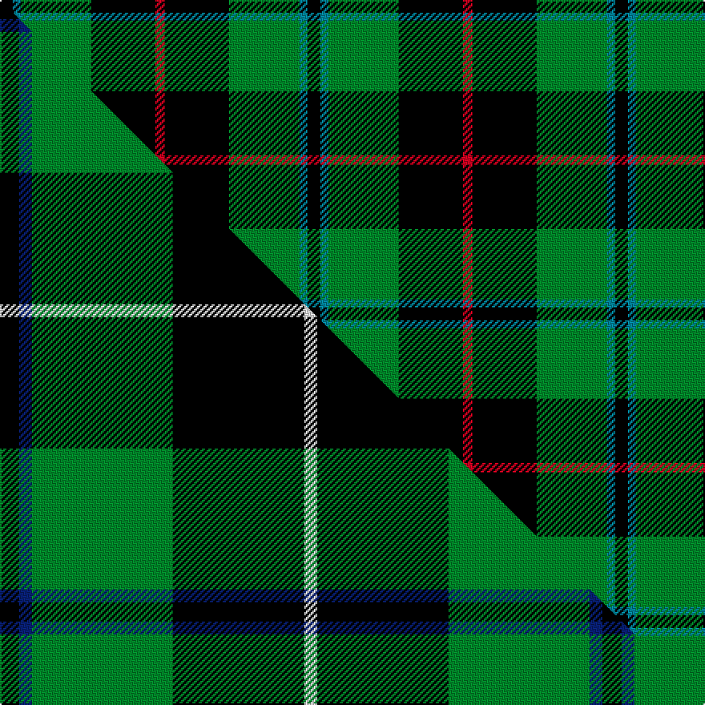

This is one **variant** — a specific cloth: this exact thread count and colourway, with its own
provenance below. It is one weaving of the [sett](/setts/k8t5g44k40r6/) (the scale-free proportion — the
same cloth at any scale or shade), whose colour order is pattern [KBGKR](/stripes/kbgkr/).

Part of the [Douglas](/tartans/douglas/) tartan — the named design grouping this sett with its other cloths.

Sourced from register-of-tartans.  It is a [5 stripe tartan](/stripes/stripes5/).

Original link [https://www.tartanregister.gov.uk/tartanDetails.aspx?ref=964](https://www.tartanregister.gov.uk/tartanDetails.aspx?ref=964)

2 attestations — the source records this cloth was collapsed from (oldest owns this page)

<ul>
<li>01/01/1920 — Douglas, Black (register-of-tartans, <a href="https://www.tartanregister.gov.uk/tartanDetails.aspx?ref=964">record</a>)  <em>From the Inverness Museum (via Ross-Craven research). Note similarity to Alvis of Lee, #2117 (original Scottish Tartans Authority reference). Scottish Tartan Society entry gives source as John Wright of Edinburgh. Black Douglas was in fact an historical character unconnected with this tartan. Often called the 'Black Douglas' - Scottish Tartans Society archive.</em></li>
<li>pre 2002 — Douglas, Black (Clan?) (tartans-authority, <a href="https://www.tartanregister.gov.uk/tartanDetails.aspx?ref=1029">record</a>)  <em>From the Inverness Museum (via Ross-Craven research). note similarity to Alvis of Lee, # 2117. STS entry gives source as John Wright of Edinburgh. Black Douglas was in fact an historical character unconnected with this tartan.</em></li>
</ul>

Dataset <small>— provenance for this record, inherited from the source manifest</small>

<dl class="dataset-prov">
<dt>source</dt><dd><a href="/sources/register-of-tartans/">Scottish Register of Tartans</a></dd>
<dt>data captured from</dt><dd><a href="https://github.com/thetartan/tartan-database/blob/master/data/register-of-tartans/data.csv">https://github.com/thetartan/tartan-database/blob/master/data/register-of-tartans/data.csv</a></dd>
<dt>data date</dt><dd>1920 <small>(this record)</small></dd>
<dt>licence</dt><dd><a href="https://www.tartanregister.gov.uk/copyright">Crown copyright</a></dd>
</dl>

Capture chain <small>— the hands this data passed through, oldest first; each capture carries its own licence</small>

<ol class="capture-chain">
<li><a href="https://www.tartanregister.gov.uk/">Scottish Register of Tartans</a> · <a href="https://www.tartanregister.gov.uk/copyright">Crown copyright</a> <small>the living register — still published by National Records of Scotland</small></li>
<li><a href="https://github.com/thetartan/tartan-database">thetartan/tartan-database</a> <small>2016-2017</small> · <a href="https://creativecommons.org/licenses/by-nc-nd/4.0/">CC BY-NC-ND 4.0</a> <small>Levko Kravets's frozen compilation — the capture we vendored, and where its CC licence text came from</small></li>
<li>this dictionary <small>captured 2026-06-10 · commit 5bf86c7566</small> <small>each re-capture is a git commit to data/sources</small></li>
</ol>

## Register references

External register numbers recorded for this tartan.

- Scottish Register of Tartans: [964](https://www.tartanregister.gov.uk/tartanDetails.aspx?ref=964)
- Scottish Tartans Authority (ITI): 1029
- Scottish Tartans World Register: 1029

## Thread count
K/8 T5 G44 K40 R/6

One full sett is **192 threads**.

## Palette
<table><thead><tr><th>Colour</th><th>Shade</th><th>OKLCh</th></tr></thead><tbody><tr><td>T</td><td><code style="background-color:#00879F;">#00879F</code> <small style="color:#888">#00879F</small></td><td><small style="color:#888">oklch(57.4% 0.102 216.1)</small></td></tr><tr><td>G</td><td><code style="background-color:#008B2A;">#008B2A</code> <small style="color:#888">#008B2A</small></td><td><small style="color:#888">oklch(55.4% 0.170 145.9)</small></td></tr><tr><td>K</td><td><code style="background-color:#000000;">#000000</code> <small style="color:#888">#000000</small></td><td><small style="color:#888">oklch(0.0% 0.000 0.0)</small></td></tr><tr><td>R</td><td><code style="background-color:#D60020;">#D60020</code> <small style="color:#888">#D60020</small></td><td><small style="color:#888">oklch(55.2% 0.224 25.5)</small></td></tr></tbody></table>

# Sample pattern

## Compared to the master

This cloth is one sett of its design; the master sett (the exemplar the design is anchored on) is below for comparison.

Its **ΔTartan distance** from the master is **0.57** — the same measure the nearest-tartans table ranks by (0 is identical; a re-scale of the same cloth is near 0, a recolour or a different proportion further).

<figure class="master-compare" style="margin:0">

this sett
master sett ★

<figcaption style="color:#888;font-size:smaller">One weave of this sett against the <a href="/setts/k6db4g44k41w4/">master sett ★</a>, split on the diagonal: a shared proportion runs seamlessly across it with only the shades shifting; a different proportion breaks on it.</figcaption>
</figure>

## Nearest tartan variants

The nearest existing variants by ΔTartan distance, with this cloth at the top so the swatches line up against it.

ΔTartan

Threads

Variant

Sett

—

192

<a href="/variants/s5/k8t5g44k40r6/">Douglas, Black</a>

<a href="/ttd/edit/#slug=k12db3g23k23r3~x2&amp;base=k8t5g44k40r6" title="compare in the TTD">0.42</a>

226

<a href="/variants/s5/k12db3g23k23r3~x2/">Douglas, (Black)</a>

<a href="/ttd/edit/#slug=k6db4g44k41w4~x2&amp;base=k8t5g44k40r6" title="compare in the TTD">0.57</a>

376

<a href="/variants/s5/k6db4g44k41w4~x2/">Douglas (alternative threadcount)</a>

<a href="/ttd/edit/#slug=k6db4dg44k41w4~x2&amp;base=k8t5g44k40r6" title="compare in the TTD">0.64</a>

376

<a href="/variants/s5/k6db4dg44k41w4~x2/">Douglas (Clan)</a>

<a href="/ttd/edit/#slug=k4g33k33y4~x2&amp;base=k8t5g44k40r6" title="compare in the TTD">0.72</a>

280

<a href="/variants/s4/k4g33k33y4~x2/">Wallace Hunting Clan Tartan</a>

<a href="/ttd/edit/#slug=k1g8k8y1&amp;base=k8t5g44k40r6" title="compare in the TTD">0.72</a>

34

<a href="/variants/s4/k1g8k8y1/">Wallace Hunting</a>

<a href="/ttd/edit/#slug=k1g8k8ly1~x4&amp;base=k8t5g44k40r6" title="compare in the TTD">0.72</a>

136

<a href="/variants/s4/k1g8k8ly1~x4/">Wallace Htg (Clan)</a>

<a href="/ttd/edit/#slug=k6g4dg44k41w4~x2~g2408144-dg1806142&amp;base=k8t5g44k40r6" title="compare in the TTD">0.88</a>

376

<a href="/variants/s5/k6g4dg44k41w4~x2~g2408144-dg1806142/">Raeside</a>

<a href="/ttd/edit/#slug=k6lb1g7k1~x2&amp;base=k8t5g44k40r6" title="compare in the TTD">0.88</a>

46

<a href="/variants/s4/k6lb1g7k1~x2/">Innes (Miniature)</a>

<a href="/ttd/edit/#slug=k30lb7g36k5~x2&amp;base=k8t5g44k40r6" title="compare in the TTD">0.90</a>

242

<a href="/variants/s4/k30lb7g36k5~x2/">Innes Hunting</a>

<a href="/ttd/edit/#slug=k30db7g36k5~x2&amp;base=k8t5g44k40r6" title="compare in the TTD">0.90</a>

242

<a href="/variants/s4/k30db7g36k5~x2/">Innes, hunting</a>

## Neighbour map

Every grey dot is one of 13621 variants placed by the first two principal components of the ΔTartan feature space (42% of its variance). Red is this tartan; blue dots are its nearest — click one to open its page.

<svg viewBox="0 0 640 380" role="img" style="max-width:100%;height:auto;border:1px solid #e0e0e0;border-radius:4px;display:block" xmlns="http://www.w3.org/2000/svg"><image href="/nn/cloud.v1.png" width="640" height="380"/><a href="/variants/s5/k12db3g23k23r3~x2/"><circle cx="232.3" cy="216.4" r="4" fill="#3465a4"><title>Douglas, (Black)</title></circle></a><a href="/variants/s5/k6db4g44k41w4~x2/"><circle cx="233.3" cy="187.8" r="4" fill="#3465a4"><title>Douglas (alternative threadcount)</title></circle></a><a href="/variants/s5/k6db4dg44k41w4~x2/"><circle cx="272.7" cy="195.7" r="4" fill="#3465a4"><title>Douglas (Clan)</title></circle></a><a href="/variants/s4/k4g33k33y4~x2/"><circle cx="256.3" cy="233.3" r="4" fill="#3465a4"><title>Wallace Hunting Clan Tartan</title></circle></a><a href="/variants/s4/k1g8k8y1/"><circle cx="254.6" cy="234.9" r="4" fill="#3465a4"><title>Wallace Hunting</title></circle></a><a href="/variants/s4/k1g8k8ly1~x4/"><circle cx="250.1" cy="233.9" r="4" fill="#3465a4"><title>Wallace Htg (Clan)</title></circle></a><a href="/variants/s5/k6g4dg44k41w4~x2~g2408144-dg1806142/"><circle cx="241.8" cy="189.2" r="4" fill="#3465a4"><title>Raeside</title></circle></a><a href="/variants/s4/k6lb1g7k1~x2/"><circle cx="223.5" cy="239.9" r="4" fill="#3465a4"><title>Innes (Miniature)</title></circle></a><a href="/variants/s4/k30lb7g36k5~x2/"><circle cx="212.8" cy="242.4" r="4" fill="#3465a4"><title>Innes Hunting</title></circle></a><a href="/variants/s4/k30db7g36k5~x2/"><circle cx="220.7" cy="244.5" r="4" fill="#3465a4"><title>Innes, hunting</title></circle></a><circle cx="211.1" cy="200.1" r="5" fill="#c00000"/><text x="320" y="376" text-anchor="middle" font-size="11" fill="#999">ground</text><text x="11" y="190" text-anchor="middle" font-size="11" fill="#999" transform="rotate(-90 11 190)">complexity</text></svg>

ID: /variants/s5/k8t5g44k40r6/
