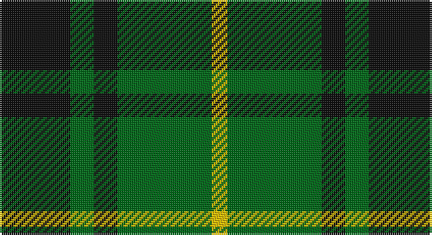

This page is one **sett** — a single exact thread-count. It belongs to the [tartan](/setts/k9g3k3g12ly2/)
(the same proportion at any scale), whose colour order is pattern [KGKGY](/stripes/kgkgy/).

Part of the [MacArthur](/tartans/macarthur/) tartan — the named design grouping this sett with its other cloths.

Sourced from register-of-tartans.  It is a [5 stripe tartan](/stripes/stripes5/).

Original link https://www.tartanregister.gov.uk/tartanDetails.aspx?ref=2278

## Also known as

This cloth is also recorded under:

- MacArthur Variant
- MacArthur, ?

2 attestations — the source records this cloth was collapsed from (oldest owns this page)

<ul>
<li>01/01/1842 — MacArthur (register-of-tartans, <a href="https://www.tartanregister.gov.uk/tartanDetails.aspx?ref=2278">record</a>)</li>
<li>1842 — MacArthur (Clan) (tartans-authority, <a href="http://www.tartansauthority.com/tartan-ferret/display/1100/">record</a>)</li>
</ul>

## Register references

External register numbers recorded for this tartan.

- Scottish Register of Tartans: [2278](https://www.tartanregister.gov.uk/tartanDetails.aspx?ref=2278)
- Scottish Tartans Authority (ITI): 1100
- Scottish Tartans World Register: 1100

## Thread count
K/36 G12 K12 G48 Y/8

One full sett is **188 threads**.

## Palette

Palette: <strong>Tartan Register</strong>
<table><thead><tr><th>Colour</th><th>Threads</th><th>Shade</th><th>Base</th><th>OKLCh</th></tr></thead><tbody><tr><td>K/</td><td style="text-align:right;font-variant-numeric:tabular-nums">36</td><td><code style="background-color:#101010;">#101010</code> <small style="color:#888">#101010</small></td><td>K <code style="background-color:#000000;">#000000</code></td><td><small style="color:#888">oklch(17.3% 0.000 89.9)</small></td></tr><tr><td>G</td><td style="text-align:right;font-variant-numeric:tabular-nums">12</td><td><code style="background-color:#006818;">#006818</code> <small style="color:#888">#006818</small></td><td>G <code style="background-color:#006100;">#006100</code></td><td><small style="color:#888">oklch(45.0% 0.142 145.0)</small></td></tr><tr><td>K</td><td style="text-align:right;font-variant-numeric:tabular-nums">12</td><td><code style="background-color:#101010;">#101010</code> <small style="color:#888">#101010</small></td><td>K <code style="background-color:#000000;">#000000</code></td><td><small style="color:#888">oklch(17.3% 0.000 89.9)</small></td></tr><tr><td>G</td><td style="text-align:right;font-variant-numeric:tabular-nums">48</td><td><code style="background-color:#006818;">#006818</code> <small style="color:#888">#006818</small></td><td>G <code style="background-color:#006100;">#006100</code></td><td><small style="color:#888">oklch(45.0% 0.142 145.0)</small></td></tr><tr><td>Y/</td><td style="text-align:right;font-variant-numeric:tabular-nums">8</td><td><code style="background-color:#E8C000;">#E8C000</code> <small style="color:#888">#E8C000</small></td><td>Y <code style="background-color:#F2BF00;">#F2BF00</code></td><td><small style="color:#888">oklch(81.9% 0.168 93.7)</small></td></tr></tbody></table>

# Sample pattern

## Compared to the master

This cloth is one sett of its design; the master sett (the exemplar the design is anchored on) is below for comparison.

<figure style="margin:0"><figcaption style="color:#888;font-size:smaller">this sett</figcaption></figure>
<figure style="margin:0"><figcaption style="color:#888;font-size:smaller"><a href="/setts/g18ly2g18k4g2k15/">master sett →</a></figcaption></figure>

## Nearest tartans

The nearest existing variants by ΔTartan distance, with this tartan at the top so the swatches line up against it.

ΔTartan

Tartan

Sett

—

<a href="/ttd/edit/#slug=k9g3k3g12ly2~x4">MacArthur</a> <a class="nn-out" href="/variants/s5/k9g3k3g12ly2~x4/" title="open its dictionary page">↗</a>

0.85

<a href="/ttd/edit/#slug=k3g15k20ly3~x2&amp;base=k9g3k3g12ly2~x4">Scotch Tape 2 (Corporate)</a> <a class="nn-out" href="/variants/s4/k3g15k20ly3~x2/" title="open its dictionary page">↗</a>

0.86

<a href="/ttd/edit/#slug=k30lb7g36k5~x2&amp;base=k9g3k3g12ly2~x4">Innes Hunting</a> <a class="nn-out" href="/variants/s4/k30lb7g36k5~x2/" title="open its dictionary page">↗</a>

1.09

<a href="/ttd/edit/#slug=dg2o14dg8o3dg12db2~x2&amp;base=k9g3k3g12ly2~x4">Confederate Infantry</a> <a class="nn-out" href="/variants/s6/dg2o14dg8o3dg12db2~x2/" title="open its dictionary page">↗</a>

1.17

<a href="/variants/s4/k6ly1g6~x4/">Wilson's No.197</a>

1.18

<a href="/ttd/edit/#slug=g7k1g7t1k6t1~x4&amp;base=k9g3k3g12ly2~x4">Innes, Georgina (Portrait)</a> <a class="nn-out" href="/variants/s6/g7k1g7t1k6t1~x4/" title="open its dictionary page">↗</a>

1.21

<a href="/ttd/edit/#slug=r1k6g6ly1g6ly1~x6&amp;base=k9g3k3g12ly2~x4">Moore Caledonian (Personal)</a> <a class="nn-out" href="/variants/s6/r1k6g6ly1g6ly1~x6/" title="open its dictionary page">↗</a>

1.29

<a href="/ttd/edit/#slug=dg2o14dg8o3dg12r2~x2&amp;base=k9g3k3g12ly2~x4">Confederate Artillery</a> <a class="nn-out" href="/variants/s6/dg2o14dg8o3dg12r2~x2/" title="open its dictionary page">↗</a>

1.30

<a href="/ttd/edit/#slug=k8g3k4g20r4~x2&amp;base=k9g3k3g12ly2~x4">MacArthur-Fox (Personal)</a> <a class="nn-out" href="/variants/s5/k8g3k4g20r4~x2/" title="open its dictionary page">↗</a>

1.34

<a href="/ttd/edit/#slug=r3k9g20k16g7b3~x2&amp;base=k9g3k3g12ly2~x4">Holman (Personal)</a> <a class="nn-out" href="/variants/s6/r3k9g20k16g7b3~x2/" title="open its dictionary page">↗</a>

1.38

<a href="/ttd/edit/#slug=g40k10r7k10r7&amp;base=k9g3k3g12ly2~x4">Romsdal</a> <a class="nn-out" href="/variants/s5/g40k10r7k10r7/" title="open its dictionary page">↗</a>

## Neighbour map

Every grey dot is one of 14360 variants placed by the first two principal components of the ΔTartan feature space (44% of its variance). Red is this tartan; blue dots are its nearest — click one to open its page.

<svg viewBox="0 0 640 380" role="img" style="max-width:100%;height:auto;border:1px solid #e0e0e0;border-radius:4px;display:block" xmlns="http://www.w3.org/2000/svg"><image href="/nn/cloud.v1.png" width="640" height="380"/><a href="/variants/s4/k3g15k20ly3~x2/"><circle cx="311.5" cy="279.8" r="4" fill="#3465a4"><title>Scotch Tape 2 (Corporate)</title></circle></a><a href="/variants/s4/k30lb7g36k5~x2/"><circle cx="264.4" cy="278.1" r="4" fill="#3465a4"><title>Innes Hunting</title></circle></a><a href="/variants/s6/dg2o14dg8o3dg12db2~x2/"><circle cx="313.3" cy="263.0" r="4" fill="#3465a4"><title>Confederate Infantry</title></circle></a><a href="/variants/s4/k6ly1g6~x4/"><circle cx="224.2" cy="273.2" r="4" fill="#3465a4"><title>Wilson's No.197</title></circle></a><a href="/variants/s6/g7k1g7t1k6t1~x4/"><circle cx="310.5" cy="256.8" r="4" fill="#3465a4"><title>Innes, Georgina (Portrait)</title></circle></a><a href="/variants/s6/r1k6g6ly1g6ly1~x6/"><circle cx="262.1" cy="244.2" r="4" fill="#3465a4"><title>Moore Caledonian (Personal)</title></circle></a><a href="/variants/s6/dg2o14dg8o3dg12r2~x2/"><circle cx="319.8" cy="263.9" r="4" fill="#3465a4"><title>Confederate Artillery</title></circle></a><a href="/variants/s5/k8g3k4g20r4~x2/"><circle cx="355.6" cy="278.7" r="4" fill="#3465a4"><title>MacArthur-Fox (Personal)</title></circle></a><a href="/variants/s6/r3k9g20k16g7b3~x2/"><circle cx="252.1" cy="264.1" r="4" fill="#3465a4"><title>Holman (Personal)</title></circle></a><a href="/variants/s5/g40k10r7k10r7/"><circle cx="261.3" cy="246.1" r="4" fill="#3465a4"><title>Romsdal</title></circle></a><circle cx="282.1" cy="279.6" r="5" fill="#c00000"/></svg>

ID: /variants/s5/k9g3k3g12ly2~x4/
