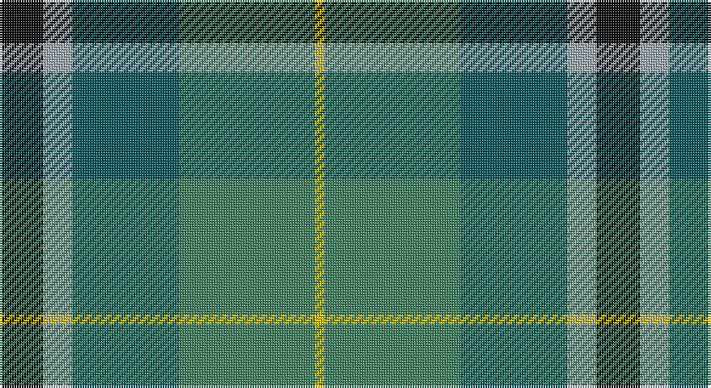

This page is one **sett** — a single exact thread-count. It belongs to the [tartan](/setts/k9lr6n22g28ly2/)
(the same proportion at any scale), whose colour order is pattern [KYBGY](/stripes/kybgy/).

Part of the [Wellington](/tartans/wellington/) tartan — the named design grouping this sett with its other cloths.

Sourced from register-of-tartans.  It is a [5 stripe tartan](/stripes/stripes5/).

Original link https://www.tartanregister.gov.uk/tartanDetails.aspx?ref=4827

## Also known as

This cloth is also recorded under:

- Wellington #2

## Register references

External register numbers recorded for this tartan.

- Scottish Register of Tartans: [4827](https://www.tartanregister.gov.uk/tartanDetails.aspx?ref=4827)
- Scottish Tartans Authority (ITI): 3892

## Thread count
K/18 N12 G44 Ga56 Y/4

One full sett is **246 threads**.

## Palette

Palette: <strong>Tartan Register</strong> <small style="color:#888">(3 of 5 colours)</small>
<table><thead><tr><th>Colour</th><th>Threads</th><th>Shade</th><th>Base</th><th>OKLCh</th></tr></thead><tbody><tr><td>K/</td><td style="text-align:right;font-variant-numeric:tabular-nums">18</td><td><code style="background-color:#101010;">#101010</code> <small style="color:#888">#101010</small></td><td>K <code style="background-color:#000000;">#000000</code></td><td><small style="color:#888">oklch(17.3% 0.000 89.9)</small></td></tr><tr><td>N</td><td style="text-align:right;font-variant-numeric:tabular-nums">12</td><td><code style="background-color:#9CA8B0;">#9CA8B0</code> <small style="color:#888">#9CA8B0</small></td><td>Y <code style="background-color:#F2BF00;">#F2BF00</code></td><td><small style="color:#888">oklch(72.5% 0.018 236.8)</small></td></tr><tr><td>G</td><td style="text-align:right;font-variant-numeric:tabular-nums">44</td><td><code style="background-color:#0C585C;">#0C585C</code> <small style="color:#888">#0C585C</small></td><td>B <code style="background-color:#2A418A;">#2A418A</code></td><td><small style="color:#888">oklch(42.0% 0.068 200.5)</small></td></tr><tr><td>Ga</td><td style="text-align:right;font-variant-numeric:tabular-nums">56</td><td><code style="background-color:#408060;">#408060</code> <small style="color:#888">#408060</small></td><td>G <code style="background-color:#006100;">#006100</code></td><td><small style="color:#888">oklch(54.8% 0.084 160.1)</small></td></tr><tr><td>Y/</td><td style="text-align:right;font-variant-numeric:tabular-nums">4</td><td><code style="background-color:#E8C000;">#E8C000</code> <small style="color:#888">#E8C000</small></td><td>Y <code style="background-color:#F2BF00;">#F2BF00</code></td><td><small style="color:#888">oklch(81.9% 0.168 93.7)</small></td></tr></tbody></table>

# Sample pattern

## Compared to the master

This cloth is one sett of its design; the master sett (the exemplar the design is anchored on) is below for comparison.

<figure style="margin:0"><figcaption style="color:#888;font-size:smaller">this sett</figcaption></figure>
<figure style="margin:0"><figcaption style="color:#888;font-size:smaller"><a href="/setts/db1r1db6k6dg6w1/">master sett →</a></figcaption></figure>

## Nearest tartans

The nearest existing variants by ΔTartan distance, with this tartan at the top so the swatches line up against it.

ΔTartan

Tartan

Sett

—

<a href="/ttd/edit/#slug=k9lr6n22g28ly2~x2">Wellington (Lochcarron)</a> <a class="nn-out" href="/variants/s5/k9lr6n22g28ly2~x2/" title="open its dictionary page">↗</a>

0.86

<a href="/ttd/edit/#slug=b32dy16g3lo4dg28~x2&amp;base=k9lr6n22g28ly2~x2">Corey (Name)</a> <a class="nn-out" href="/variants/s5/b32dy16g3lo4dg28~x2/" title="open its dictionary page">↗</a>

0.88

<a href="/ttd/edit/#slug=b30ly3dy11ly3g33r6~x2&amp;base=k9lr6n22g28ly2~x2">Balfour Hunting</a> <a class="nn-out" href="/variants/s6/b30ly3dy11ly3g33r6~x2/" title="open its dictionary page">↗</a>

1.05

<a href="/ttd/edit/#slug=r3g28db9dg18w3~x2&amp;base=k9lr6n22g28ly2~x2">Simple Technology (Corporate)</a> <a class="nn-out" href="/variants/s5/r3g28db9dg18w3~x2/" title="open its dictionary page">↗</a>

1.16

<a href="/ttd/edit/#slug=db9w4g36t36r4~x2&amp;base=k9lr6n22g28ly2~x2">Alvis of Lee (Personal)</a> <a class="nn-out" href="/variants/s5/db9w4g36t36r4~x2/" title="open its dictionary page">↗</a>

1.25

<a href="/ttd/edit/#slug=db9w4g36t36r4&amp;base=k9lr6n22g28ly2~x2">Alvis of Lee (Personal)</a> <a class="nn-out" href="/variants/s5/db9w4g36t36r4/" title="open its dictionary page">↗</a>

1.25

<a href="/ttd/edit/#slug=dg6ly3dg26k10n30lb3~x2&amp;base=k9lr6n22g28ly2~x2">Montrose (1983)</a> <a class="nn-out" href="/variants/s6/dg6ly3dg26k10n30lb3~x2/" title="open its dictionary page">↗</a>

1.29

<a href="/ttd/edit/#slug=r4db15w2n15g30r2g4~x2&amp;base=k9lr6n22g28ly2~x2">Sinclair Green (Personal)</a> <a class="nn-out" href="/variants/s7/r4db15w2n15g30r2g4~x2/" title="open its dictionary page">↗</a>

1.30

<a href="/ttd/edit/#slug=dy2g12k10r1b16r2~x4&amp;base=k9lr6n22g28ly2~x2">MacWilliam (Clan)</a> <a class="nn-out" href="/variants/s6/dy2g12k10r1b16r2~x4/" title="open its dictionary page">↗</a>

1.32

<a href="/ttd/edit/#slug=g11lo10dt11b33w3~x2&amp;base=k9lr6n22g28ly2~x2">Sterling (Name)</a> <a class="nn-out" href="/variants/s5/g11lo10dt11b33w3~x2/" title="open its dictionary page">↗</a>

1.33

<a href="/ttd/edit/#slug=r7ly3dg28db28w3~x2&amp;base=k9lr6n22g28ly2~x2">Turnbull Hunting</a> <a class="nn-out" href="/variants/s5/r7ly3dg28db28w3~x2/" title="open its dictionary page">↗</a>

## Neighbour map

Every grey dot is one of 14360 variants placed by the first two principal components of the ΔTartan feature space (44% of its variance). Red is this tartan; blue dots are its nearest — click one to open its page.

<svg viewBox="0 0 640 380" role="img" style="max-width:100%;height:auto;border:1px solid #e0e0e0;border-radius:4px;display:block" xmlns="http://www.w3.org/2000/svg"><image href="/nn/cloud.v1.png" width="640" height="380"/><a href="/variants/s5/b32dy16g3lo4dg28~x2/"><circle cx="218.0" cy="238.8" r="4" fill="#3465a4"><title>Corey (Name)</title></circle></a><a href="/variants/s6/b30ly3dy11ly3g33r6~x2/"><circle cx="216.7" cy="209.7" r="4" fill="#3465a4"><title>Balfour Hunting</title></circle></a><a href="/variants/s5/r3g28db9dg18w3~x2/"><circle cx="234.7" cy="232.4" r="4" fill="#3465a4"><title>Simple Technology (Corporate)</title></circle></a><a href="/variants/s5/db9w4g36t36r4~x2/"><circle cx="221.1" cy="221.0" r="4" fill="#3465a4"><title>Alvis of Lee (Personal)</title></circle></a><a href="/variants/s5/db9w4g36t36r4/"><circle cx="213.3" cy="216.7" r="4" fill="#3465a4"><title>Alvis of Lee (Personal)</title></circle></a><a href="/variants/s6/dg6ly3dg26k10n30lb3~x2/"><circle cx="254.3" cy="228.9" r="4" fill="#3465a4"><title>Montrose (1983)</title></circle></a><a href="/variants/s7/r4db15w2n15g30r2g4~x2/"><circle cx="254.8" cy="183.5" r="4" fill="#3465a4"><title>Sinclair Green (Personal)</title></circle></a><a href="/variants/s6/dy2g12k10r1b16r2~x4/"><circle cx="193.3" cy="192.3" r="4" fill="#3465a4"><title>MacWilliam (Clan)</title></circle></a><a href="/variants/s5/g11lo10dt11b33w3~x2/"><circle cx="228.7" cy="219.6" r="4" fill="#3465a4"><title>Sterling (Name)</title></circle></a><a href="/variants/s5/r7ly3dg28db28w3~x2/"><circle cx="224.5" cy="219.3" r="4" fill="#3465a4"><title>Turnbull Hunting</title></circle></a><circle cx="230.4" cy="221.8" r="5" fill="#c00000"/></svg>

ID: /variants/s5/k9lr6n22g28ly2~x2/
