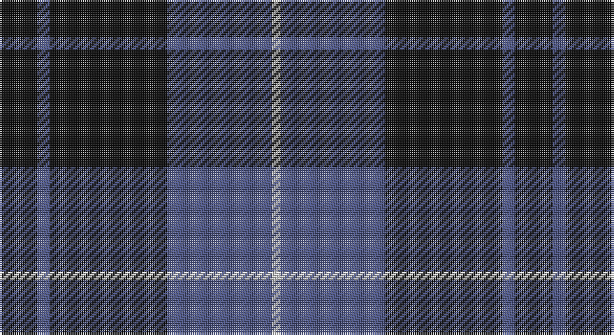

This page is one **sett** — a single exact thread-count. It belongs to the [tartan](/setts/k9n3k28n25w2/)
(the same proportion at any scale), whose colour order is pattern [KBKBW](/stripes/kbkbw/).

Sourced from register-of-tartans.  It is a [5 stripe tartan](/stripes/stripes5/).

Original link https://www.tartanregister.gov.uk/tartanDetails.aspx?ref=3368

2 attestations — the source records this cloth was collapsed from (oldest owns this page)

<ul>
<li>01/02/2007 — Press & Journal (register-of-tartans, <a href="https://www.tartanregister.gov.uk/tartanDetails.aspx?ref=3368">record</a>)</li>
<li>February 2007 — Press & Journal (Corporate) (tartans-authority, <a href="http://www.tartansauthority.com/tartan-ferret/display/7099/">record</a>)</li>
</ul>

## Register references

External register numbers recorded for this tartan.

- Scottish Register of Tartans: [3368](https://www.tartanregister.gov.uk/tartanDetails.aspx?ref=3368)
- Scottish Tartans Authority (ITI): 7099

## Thread count
K/18 B6 K56 B50 LN/4

One full sett is **246 threads**.

## Palette

Palette: <strong>Tartan Register</strong> <small style="color:#888">(2 of 3 colours)</small>
<table><thead><tr><th>Colour</th><th>Threads</th><th>Shade</th><th>Base</th><th>OKLCh</th></tr></thead><tbody><tr><td>K/</td><td style="text-align:right;font-variant-numeric:tabular-nums">18</td><td><code style="background-color:#101010;">#101010</code> <small style="color:#888">#101010</small></td><td>K <code style="background-color:#000000;">#000000</code></td><td><small style="color:#888">oklch(17.3% 0.000 89.9)</small></td></tr><tr><td>B</td><td style="text-align:right;font-variant-numeric:tabular-nums">6</td><td><code style="background-color:#4C5484;">#4C5484</code> <small style="color:#888">#4C5484</small></td><td>B <code style="background-color:#2A418A;">#2A418A</code></td><td><small style="color:#888">oklch(46.1% 0.079 275.7)</small></td></tr><tr><td>K</td><td style="text-align:right;font-variant-numeric:tabular-nums">56</td><td><code style="background-color:#101010;">#101010</code> <small style="color:#888">#101010</small></td><td>K <code style="background-color:#000000;">#000000</code></td><td><small style="color:#888">oklch(17.3% 0.000 89.9)</small></td></tr><tr><td>B</td><td style="text-align:right;font-variant-numeric:tabular-nums">50</td><td><code style="background-color:#4C5484;">#4C5484</code> <small style="color:#888">#4C5484</small></td><td>B <code style="background-color:#2A418A;">#2A418A</code></td><td><small style="color:#888">oklch(46.1% 0.079 275.7)</small></td></tr><tr><td>LN/</td><td style="text-align:right;font-variant-numeric:tabular-nums">4</td><td><code style="background-color:#E0E0E0;">#E0E0E0</code> <small style="color:#888">#E0E0E0</small></td><td>W <code style="background-color:#F7F7F7;">#F7F7F7</code></td><td><small style="color:#888">oklch(90.7% 0.000 89.9)</small></td></tr></tbody></table>

# Sample pattern

## Nearest tartans

The nearest existing variants by ΔTartan distance, with this tartan at the top so the swatches line up against it.

ΔTartan

Tartan

Sett

—

<a href="/ttd/edit/#slug=k9n3k28n25w2~x2">Press &amp; Journal</a> <a class="nn-out" href="/variants/s5/k9n3k28n25w2~x2/" title="open its dictionary page">↗</a>

0.92

<a href="/ttd/edit/#slug=db26r6g16db8g3r2~x2&amp;base=k9n3k28n25w2~x2">Perthshire (New) District Tartan</a> <a class="nn-out" href="/variants/s6/db26r6g16db8g3r2~x2/" title="open its dictionary page">↗</a>

1.16

<a href="/ttd/edit/#slug=k2g11k26b11k2~x2&amp;base=k9n3k28n25w2~x2">Campbell of Loch Awe</a> <a class="nn-out" href="/variants/s5/k2g11k26b11k2~x2/" title="open its dictionary page">↗</a>

1.25

<a href="/ttd/edit/#slug=n1k3n1k3n8r1~x8&amp;base=k9n3k28n25w2~x2">Mackay (Blue)</a> <a class="nn-out" href="/variants/s6/n1k3n1k3n8r1~x8/" title="open its dictionary page">↗</a>

1.27

<a href="/ttd/edit/#slug=n34k7n12k39n3k4lg3~x2&amp;base=k9n3k28n25w2~x2">Tartan Army Children's Charity (Corp</a> <a class="nn-out" href="/variants/s7/n34k7n12k39n3k4lg3~x2/" title="open its dictionary page">↗</a>

1.29

<a href="/ttd/edit/#slug=k3w2n27k31p3~x2&amp;base=k9n3k28n25w2~x2">Kelley Oliphint</a> <a class="nn-out" href="/variants/s5/k3w2n27k31p3~x2/" title="open its dictionary page">↗</a>

1.31

<a href="/ttd/edit/#slug=n34k7n12k40n3k4t3~x2&amp;base=k9n3k28n25w2~x2">TACC (Corporate)</a> <a class="nn-out" href="/variants/s7/n34k7n12k40n3k4t3~x2/" title="open its dictionary page">↗</a>

1.31

<a href="/ttd/edit/#slug=m4k28b3k3b25k3~x2&amp;base=k9n3k28n25w2~x2">Slanj (Corporate)</a> <a class="nn-out" href="/variants/s6/m4k28b3k3b25k3~x2/" title="open its dictionary page">↗</a>

1.31

<a href="/ttd/edit/#slug=db51dg5r15dg37db17r6dg5~x2&amp;base=k9n3k28n25w2~x2">Cadence</a> <a class="nn-out" href="/variants/s7/db51dg5r15dg37db17r6dg5~x2/" title="open its dictionary page">↗</a>

1.33

<a href="/ttd/edit/#slug=r1db12y5db2y4lb1~x2&amp;base=k9n3k28n25w2~x2">Connaught Green</a> <a class="nn-out" href="/variants/s6/r1db12y5db2y4lb1~x2/" title="open its dictionary page">↗</a>

1.34

<a href="/ttd/edit/#slug=db24n13db4n4w2~x2&amp;base=k9n3k28n25w2~x2">Gallaecia - Galicia National</a> <a class="nn-out" href="/variants/s5/db24n13db4n4w2~x2/" title="open its dictionary page">↗</a>

## Neighbour map

Every grey dot is one of 14360 variants placed by the first two principal components of the ΔTartan feature space (44% of its variance). Red is this tartan; blue dots are its nearest — click one to open its page.

<svg viewBox="0 0 640 380" role="img" style="max-width:100%;height:auto;border:1px solid #e0e0e0;border-radius:4px;display:block" xmlns="http://www.w3.org/2000/svg"><image href="/nn/cloud.v1.png" width="640" height="380"/><a href="/variants/s6/db26r6g16db8g3r2~x2/"><circle cx="352.7" cy="237.5" r="4" fill="#3465a4"><title>Perthshire (New) District Tartan</title></circle></a><a href="/variants/s5/k2g11k26b11k2~x2/"><circle cx="350.1" cy="245.0" r="4" fill="#3465a4"><title>Campbell of Loch Awe</title></circle></a><a href="/variants/s6/n1k3n1k3n8r1~x8/"><circle cx="361.7" cy="247.5" r="4" fill="#3465a4"><title>Mackay (Blue)</title></circle></a><a href="/variants/s7/n34k7n12k39n3k4lg3~x2/"><circle cx="362.7" cy="223.8" r="4" fill="#3465a4"><title>Tartan Army Children's Charity (Corp</title></circle></a><a href="/variants/s5/k3w2n27k31p3~x2/"><circle cx="340.6" cy="207.6" r="4" fill="#3465a4"><title>Kelley Oliphint</title></circle></a><a href="/variants/s7/n34k7n12k40n3k4t3~x2/"><circle cx="369.6" cy="224.2" r="4" fill="#3465a4"><title>TACC (Corporate)</title></circle></a><a href="/variants/s6/m4k28b3k3b25k3~x2/"><circle cx="323.2" cy="228.3" r="4" fill="#3465a4"><title>Slanj (Corporate)</title></circle></a><a href="/variants/s7/db51dg5r15dg37db17r6dg5~x2/"><circle cx="311.0" cy="240.5" r="4" fill="#3465a4"><title>Cadence</title></circle></a><a href="/variants/s6/r1db12y5db2y4lb1~x2/"><circle cx="353.3" cy="220.4" r="4" fill="#3465a4"><title>Connaught Green</title></circle></a><a href="/variants/s5/db24n13db4n4w2~x2/"><circle cx="397.1" cy="254.9" r="4" fill="#3465a4"><title>Gallaecia - Galicia National</title></circle></a><circle cx="370.4" cy="242.7" r="5" fill="#c00000"/></svg>

ID: /variants/s5/k9n3k28n25w2~x2/
