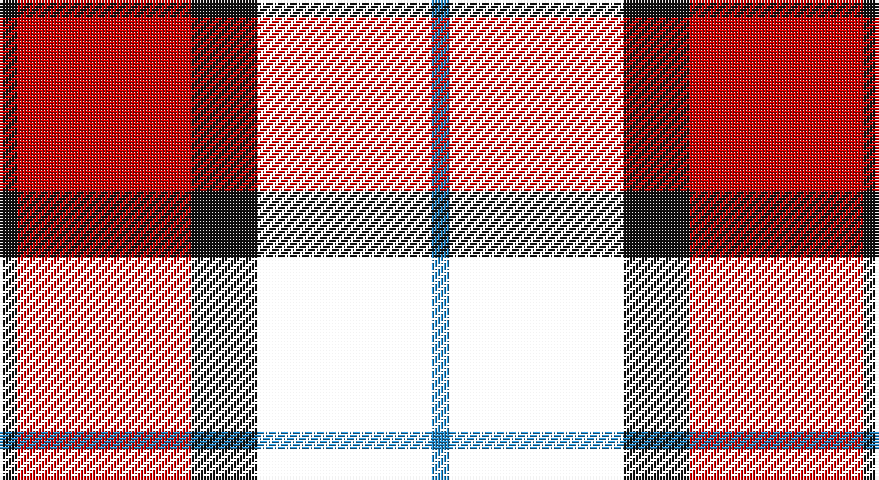

This page is one **sett** — a single exact thread-count. It belongs to the [tartan](/setts/ki3r29ki11k29t3/)
(the same proportion at any scale), whose colour order is pattern [BKKRK](/stripes/bkkrk/).

Sourced from house-of-tartan.  It is a [5 stripe tartan](/stripes/stripes5/).

Original link http://www.house-of-tartan.scotland.net/house/TartanViewjs.asp?colr=Def&tnam=8186

## Provenance

Earliest known date:

## Thread count
K/6 R58 K22 W58 B/6

One full sett is **288 threads**.

## Palette

Palette: <strong>Tartan Register</strong>
<table><thead><tr><th>Colour</th><th>Threads</th><th>Shade</th><th>Base</th><th>OKLCh</th></tr></thead><tbody><tr><td>K/</td><td style="text-align:right;font-variant-numeric:tabular-nums">6</td><td><code style="background-color:#101010;">#101010</code> <small style="color:#888">#101010</small></td><td>K <code style="background-color:#000000;">#000000</code></td><td><small style="color:#888">oklch(17.3% 0.000 89.9)</small></td></tr><tr><td>R</td><td style="text-align:right;font-variant-numeric:tabular-nums">58</td><td><code style="background-color:#C80000;">#C80000</code> <small style="color:#888">#C80000</small></td><td>R <code style="background-color:#CC0000;">#CC0000</code></td><td><small style="color:#888">oklch(52.3% 0.215 29.2)</small></td></tr><tr><td>K</td><td style="text-align:right;font-variant-numeric:tabular-nums">22</td><td><code style="background-color:#101010;">#101010</code> <small style="color:#888">#101010</small></td><td>K <code style="background-color:#000000;">#000000</code></td><td><small style="color:#888">oklch(17.3% 0.000 89.9)</small></td></tr><tr><td></td><td style="text-align:right;font-variant-numeric:tabular-nums">58</td><td><code style="background-color:;"></code> <small style="color:#888"></small></td><td> <code style="background-color:;"></code></td><td><small style="color:#888"></small></td></tr><tr><td>B/</td><td style="text-align:right;font-variant-numeric:tabular-nums">6</td><td><code style="background-color:#2888C4;">#2888C4</code> <small style="color:#888">#2888C4</small></td><td>B <code style="background-color:#2A418A;">#2A418A</code></td><td><small style="color:#888">oklch(60.1% 0.125 241.5)</small></td></tr></tbody></table>

# Sample pattern

## Nearest tartans

The nearest existing variants by ΔTartan distance, with this tartan at the top so the swatches line up against it.

ΔTartan

Tartan

Sett

—

<a href="/ttd/edit/#slug=ki3r29ki11k29t3~x2">Wallace Red Dress Tartan</a> <a class="nn-out" href="/variants/s5/ki3r29ki11k29t3~x2/" title="open its dictionary page">↗</a>

1.00

<a href="/ttd/edit/#slug=r26t3r4k16db16k4~x2&amp;base=ki3r29ki11k29t3~x2">Graham of Menteith, (Red)</a> <a class="nn-out" href="/variants/s6/r26t3r4k16db16k4~x2/" title="open its dictionary page">↗</a>

1.13

<a href="/ttd/edit/#slug=k4o19k19o2dp22w4~x2&amp;base=ki3r29ki11k29t3~x2">Dutch</a> <a class="nn-out" href="/variants/s6/k4o19k19o2dp22w4~x2/" title="open its dictionary page">↗</a>

1.16

<a href="/variants/s6/dg3k20ki20r20k3r3~x2/">Unidentified #65</a>

1.24

<a href="/ttd/edit/#slug=w1r8k8ly1~x2&amp;base=ki3r29ki11k29t3~x2">Connel</a> <a class="nn-out" href="/variants/s4/w1r8k8ly1~x2/" title="open its dictionary page">↗</a>

1.31

<a href="/ttd/edit/#slug=lb5r34k22r4o24r4~x2&amp;base=ki3r29ki11k29t3~x2">Wcwm 759-2</a> <a class="nn-out" href="/variants/s6/lb5r34k22r4o24r4~x2/" title="open its dictionary page">↗</a>

1.34

<a href="/ttd/edit/#slug=ly3k9b1k1r6k2ly3~x4&amp;base=ki3r29ki11k29t3~x2">LP Cover (Dance)</a> <a class="nn-out" href="/variants/s7/ly3k9b1k1r6k2ly3~x4/" title="open its dictionary page">↗</a>

1.37

<a href="/ttd/edit/#slug=lo5db2k2db12k16r20k2r4~x2&amp;base=ki3r29ki11k29t3~x2">Aitken</a> <a class="nn-out" href="/variants/s8/lo5db2k2db12k16r20k2r4~x2/" title="open its dictionary page">↗</a>

1.45

<a href="/ttd/edit/#slug=b2r12db2b6k6b1~x2&amp;base=ki3r29ki11k29t3~x2">MacTavish</a> <a class="nn-out" href="/variants/s6/b2r12db2b6k6b1~x2/" title="open its dictionary page">↗</a>

1.45

<a href="/ttd/edit/#slug=b2r12db2b6k6b1&amp;base=ki3r29ki11k29t3~x2">MacTavish</a> <a class="nn-out" href="/variants/s6/b2r12db2b6k6b1/" title="open its dictionary page">↗</a>

1.47

<a href="/ttd/edit/#slug=db1r12k6ly1k6db1~x4&amp;base=ki3r29ki11k29t3~x2">Cetoloni (Personal)</a> <a class="nn-out" href="/variants/s6/db1r12k6ly1k6db1~x4/" title="open its dictionary page">↗</a>

## Neighbour map

Every grey dot is one of 14360 variants placed by the first two principal components of the ΔTartan feature space (44% of its variance). Red is this tartan; blue dots are its nearest — click one to open its page.

<svg viewBox="0 0 640 380" role="img" style="max-width:100%;height:auto;border:1px solid #e0e0e0;border-radius:4px;display:block" xmlns="http://www.w3.org/2000/svg"><image href="/nn/cloud.v1.png" width="640" height="380"/><a href="/variants/s6/r26t3r4k16db16k4~x2/"><circle cx="205.3" cy="208.7" r="4" fill="#3465a4"><title>Graham of Menteith, (Red)</title></circle></a><a href="/variants/s6/k4o19k19o2dp22w4~x2/"><circle cx="152.2" cy="198.5" r="4" fill="#3465a4"><title>Dutch</title></circle></a><a href="/variants/s6/dg3k20ki20r20k3r3~x2/"><circle cx="164.7" cy="227.9" r="4" fill="#3465a4"><title>Unidentified #65</title></circle></a><a href="/variants/s4/w1r8k8ly1~x2/"><circle cx="230.5" cy="219.3" r="4" fill="#3465a4"><title>Connel</title></circle></a><a href="/variants/s6/lb5r34k22r4o24r4~x2/"><circle cx="205.7" cy="203.8" r="4" fill="#3465a4"><title>Wcwm 759-2</title></circle></a><a href="/variants/s7/ly3k9b1k1r6k2ly3~x4/"><circle cx="209.9" cy="200.0" r="4" fill="#3465a4"><title>LP Cover (Dance)</title></circle></a><a href="/variants/s8/lo5db2k2db12k16r20k2r4~x2/"><circle cx="188.0" cy="190.5" r="4" fill="#3465a4"><title>Aitken</title></circle></a><a href="/variants/s6/b2r12db2b6k6b1~x2/"><circle cx="209.9" cy="196.7" r="4" fill="#3465a4"><title>MacTavish</title></circle></a><a href="/variants/s6/b2r12db2b6k6b1/"><circle cx="209.9" cy="196.7" r="4" fill="#3465a4"><title>MacTavish</title></circle></a><a href="/variants/s6/db1r12k6ly1k6db1~x4/"><circle cx="272.6" cy="188.5" r="4" fill="#3465a4"><title>Cetoloni (Personal)</title></circle></a><circle cx="204.0" cy="212.4" r="5" fill="#c00000"/></svg>

ID: /variants/s5/ki3r29ki11k29t3~x2/
